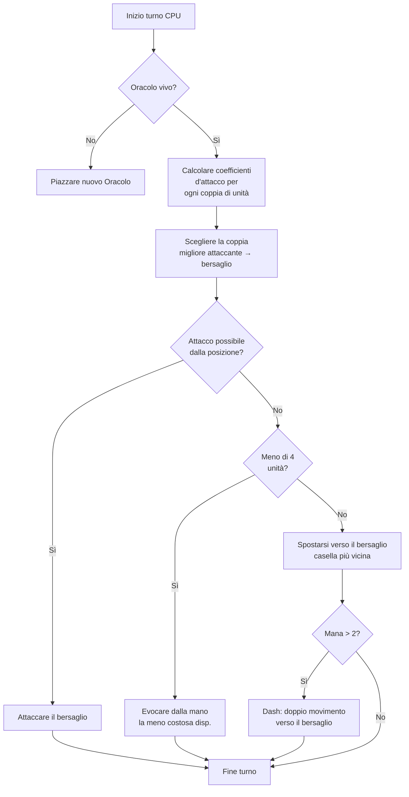

## La mia IA sballata per Nausicaa

Ci sono progetti che iniziano con "e se facessi un gioco di scacchi con mitologie?" e finiscono con un coso dotato di IA che si cambia gli iper-parametri da sola ogni 5 turni.

Nausicaa è questo. Un gioco da tavolo a turni dove costruisci il tuo mazzo di creature mitologiche, gestisci la mana, schieri unità su una plancia 10x8. E c'è un'IA con crisi di personalità.

Ci ho speso un sacco di tempo su sta IA, e il risultato è abbastanza ingovernabile xD

## Il gioco per davvero

Prima di parlare del cervello, devi capire il corpo:

- Plancia 10x8, zona di schieramento di 2 file per giocatore
- Mana parte da 1, +1 per turno, max 6. La spendi per evocare, attaccare, usare abilità
- Obiettivo: fottere l'Oracle avversario

12 unità, costi e pattern di movimento diversi:

| Unit | Costo | Movimento | PV |
| --- | --- | --- | --- |
| Oracle | 0 | Re (8 direzioni) | 1 |
| Goblin | 1 | Avanti 3 caselle | 1 |
| Arpia | 1 | Re (8 direzioni) | 1 |
| Naïade | 1 | Diagonale | 1 |
| Grifone | 2 | Salta 2 caselle | 2 |
| Sirena | 2 | Laterale | 1 |
| Centauro | 2 | Cavallo (a L) | 2 |
| Arciere | 3 | Laterale | 1 |
| Fenice | 3 | Diagonale (caselle scure) | 1 |
| Mutforma | 4 | Scambio di posto | 1 |
| Veggente | 4 | Nessuno (genera mana) | 1 |
| Titano | 6 | Limitato (attacco ad area) | 3 |

Ogni unità ha il suo pattern d'attacco. La Sirena colpisce in 4 diagonali, l'Arciere a distanza su 3 caselle, il Titano distrugge tutto intorno all'evocazione. Insomma, scacchi con mitologia e deckbuilding xD

## Come ho fatto a pensare al CPU

L'idea di base è stupidamente semplice: **ogni unità nemica ha un coefficiente di attrattività**. Più è pericolosa, più l'IA vuole occuparsene.

```javascript
const UNITS_ATTRACTIVENESS = {
    "oracle": 100,
    "titan": 95,
    "shapeshifter": 90,
    "phoenix": 80,
    "siren": 70,
    "archer": 70,
    "seer": 70,
    "griffin": 60,
    "centaur": 60,
    "harpy": 50,
    "naiad": 30,
    "gobelin": 20
};
```

Oracle a 100 -- logico, è la win condition. Titano a 95 perché OS tutto a lato all'evocazione. Goblin a 20, è un soldato semplice, chissene.

Poi per ogni coppia di unità (una alleata, una nemica), calcolo:

```
interesse = attrattività × coeff_attr / (distanza × coeff_dist)
```

In pratica: più sei pericoloso e vicino, più l'IA ti vuole spaccare.

```javascript
calculateAttackCoefficient(x1, y1, x2, y2) {
    const distance = this.calculateEuclideanDistance(x1, y1, x2, y2);
    if (distance === 0) return Infinity;
    return (UNITS_ATTRACTIVENESS[unit.type] * COEFFICIENTS_IMPORTANCE["attractiveness"]) / distance;
}
```

### Il colpo dei coefficienti che cambiano

Il bello è che i coefficienti d'importanza **cambiano a caso ogni 5 turni**.

```javascript
if (this.turnCount % 5 === 0) {
    const distanceCoefficient = parseInt(Math.random() * 100);
    const attractivenessCoefficient = parseInt(Math.random() * 100);
    this.regulateImportanceCoefficients({
        distance: distanceCoefficient,
        attractiveness: attractivenessCoefficient
    });
}
```

Un colpo l'IA è iper aggressiva (attr a 95, distanza a 5), attraversa tutto per fottere il tuo Oracle. Il colpo dopo prioritizza la distanza e si riposiziona.

Sta roba è rubata ai fantasmi di Pac-Man -- Blinky insegue, Pinky tende agguati. Qui l'IA cambia "personalità" ogni fase.

**Risultato: impossibile prevedere l'IA in un'intera partita.** Il CPU non fa mai due volte la stessa partita.

### L'Oracle è un piagnona

L'Oracle nemico scappa. Letteralmente.

```javascript
const awayFromTarget = {
    row: Math.max(0, Math.min(7, botUnitElement.row + (botUnitElement.row - targetUnitElement.row))),
    col: Math.max(0, Math.min(9, botUnitElement.col + (botUnitElement.col - targetUnitElement.col)))
};
```

Calcola la direzione opposta alla minaccia e se ne va. Se c'è un muro, cerca la casella libera più vicina in quella direzione.

Passi 3 turni ad avvicinarti all'Oracle, e paf se n'è scappato come una donzella xD

### Il loop decisionale

Ecco come decide l'IA:

1. Se non ho più Oracle (morto), piazzarne uno nuovo
2. Calcolare il coefficiente per ogni coppia unità alleata → unità nemica
3. Scegliere la coppia migliore
4. Se l'unità può attaccare il bersaglio dalla sua posizione → attacca
5. Se ho meno di 4 unità → evocare la meno costosa disponibile dalla mano
6. Altrimenti, muoversi verso il bersaglio (casella di movimento più vicina al nemico)
7. Se abbastanza mana (> 2), dash (doppio movimento) per avvicinarsi ancora
8. Se l'unità è l'Oracle → scappa



```javascript
async makeAction(dash=false) {
    // tutto in sequenza
    // il CPU dash se ha abbastanza mana
    if(botPlayer.mana > 2) {
        this.makeAction(true);
    }
}
```

### Perché la distanza euclidea

Uso la distanza euclidea:

```javascript
calculateEuclideanDistance(x1, y1, x2, y2) {
    const deltaX = Math.pow(x1 - x2, 2);
    const deltaY = Math.pow(y1 - y2, 2);
    return Math.sqrt(deltaX + deltaY) * COEFFICIENTS_IMPORTANCE["distance"];
}
```

Perché non Manhattan? Perché le unità hanno pattern di movimento vari (a L come il cavallo, diagonale, ecc.). La distanza in linea d'aria è un'approssimazione migliore del pericolo.

## Perché non minimax

Avrei potuto fare un minimax classico. Ma con 12 tipi di unità, pattern di movimento diversi, abilità speciali... l'albero di gioco esplode così in fretta che diventa ingiocabile. L'approccio euristico fa scelte intelligenti senza esplorare 10 milioni di stati.

## Cosa è figo

Il sistema di attrattività crea dilemmi divertenti:

- Il Veggente (70) genera mana. Se lo lasci vivere, l'avversario ha più risorse. Ma il Titano (95) è ancora più pericoloso.
- Il Mutforma (90) può scambiarsi di posto con qualsiasi unità. Può rubarti l'Oracle.
- L'Arpia (50) ha un attacco esplosivo che uccide anche lei. Non prioritaria... finché non è a fianco di 3 delle tue unità.

L'IA valuta il pericolo globale in base alle posizioni, non solo le stats grezze.

C'è anche una funzione `activateSimulation()` per testare scenari senza rifare una partita:

```javascript
activateSimulation() {
    // Piazza unità specifiche sulla plancia
    // Utile per debuggare l'IA
    this.game.board = simulation.board;
    this.game.players = simulation.players;
}
```

## Cosa manca

Se avessi avuto più tempo:

- L'IA reagisce allo stato attuale, non prevede cosa farà il giocatore
- Non pianifica la mano su più turni
- Il Mutforma e il Centauro hanno abilità che sottoutilizza
- Apprendimento per rinforzo: farla giocare contro sé stessa per aggiustare i coefficienti

Ma per un gioco da browser funziona. Dei miei amici riescono a perderci contro, quindi siamo a posto xD

## Prova

Disponibile su [nausicaa-game.github.io](https://nausicaa-game.github.io/). Clicchi "GIOCA", CPU mode ON, e guardi l'IA fare.

Consiglio: lascia l'IA giocare contro sé stessa. Vedrai fasi aggressive, poi pfft indietreggia tutto.

Il codice è su [GitHub](https://github.com/nausicaa-game/nausicaa-game.github.io) in `js/cpu.js`.

**3 cose:**

1. **Coefficienti euristici** -- niente minimax, ogni unità ha un'attrattività
2. **Coefficienti che cambiano ogni 5 turni** -- l'IA alterna aggressività e controllo, stile Pac-Man
3. **L'Oracle scappa** -- calcola la direzione opposta alla minaccia e se la squaglia

Se hai idee per rendere l'IA ancora più bastarda, apri una issue. Ho dei piani per una versione che impara dalle sconfitte, ma sarà per il prossimo articolo xD
