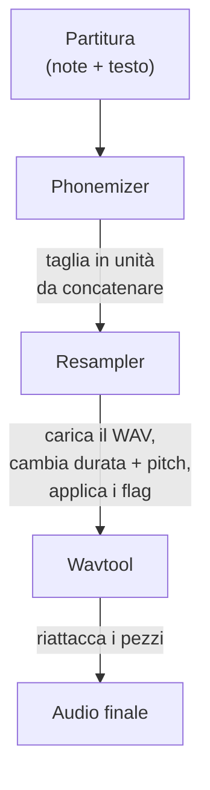

## UTAU : come un software in Visual Basic 6 ha democratizzato la voce sintetica

Ne avevo accennato nella mia pagina principale: adoro UTAU. Ecco perché.

Nel 2008, se volevi far cantare una voce sintetica, avevi una opzione: VOCALOID. Il software di Yamaha. Costoso, proprietario, con voci ufficiali che non potevi crearti da solo.

E poi c'è un tizio giapponese, Ameya/Ayame, che ha tirato fuori un coso nel suo cantuccio. Un software codificato in **Visual Basic 6**. Gratuito. Che ti lasciava creare la tua voce con... file WAV che registravi da solo.

Questo coso si chiama **UTAU** (歌う, "cantare" in giapponese). E per l'epoca, era magia.

L'ho sempre trovato affascinante questo software. Non perché fosse pulito tecnicamente (spoiler: in realtà sì, dovevi proprio pensarci a creare questo coso... è un bel bordello, piango su questo pollo), ma perché ha fatto una cosa che nessun altro faceva: ha dato la sintesi vocale al grande pubblico. Tipo te, io, chiunque con un microfono.

Lascia che ti spieghi perché era fichissimo.

---

## Prima di tutto, perché la sintesi del canto è una rottura

Una voce cantata non sono note. Hai la consonante che attacca, la vocale che tiene, il respiro, le transizioni tra l'una e l'altra. Il "sa" di "salve" è una "s" che sibila e scivola verso una "a" aperta, ed è questo scivolamento che suona umano o no.

Oggi sistemi tutto col deep learning: addestri un modello su ore di canto e genera la voce (Synthesizer V, DiffSinger). Ma quello è 2020+. Nel 2008, niente di niente.

UTAU usa il metodo di prima, più vecchio e più furbo: la **sintesi concatenativa**.

---

## La sintesi concatenativa: copia-incolla di pezzetti di voce

L'idea è semplice come una patata: registri piccoli pezzi di voce e li incolli insieme per formare parole. "salve" = campione "sa" + "l" + "ve", concatenati. Un puzzle sonoro guidato da uno spartito.

È il principio delle YouTube Poop dove tagli le parole di un personaggio per fargli dire qualsiasi cosa -- solo che qui è ordinato e automatizzato.

E UTAU viene letteralmente da lì. Prima di lui esisteva il **"Jinriki Vocaloid"** (人力ボーカロイド, "Vocaloid manuale"): la gente tagliava a mano tracce vocali, estraeva i fonemi, ripitchava, e riassemblava tutto in un editor audio per imitare una voce VOCALOID. A mano. Immagina la fatica.

Ameya ha visto 'sta rottura e ha codificato lo strumento per automatizzarla. All'inizio UTAU era solo questo: un assistente per Vocaloid manuale.

---

## Perché era rivoluzionario: TU crei la voce

Ecco il punto che cambia tutto.

VOCALOID: compravi una voce. Miku, Luka, ecc. Create da professionisti, vendute da Yamaha. Nessun modo di crearne una da te. UTAU, **chiunque registra la sua voce e ne fa uno strumento cantante**.

La modalità CV (la più semplice) è: registri le ~100 sillabe di base del giapponese ("a", "ka", "sa", "ta"...), configuri i punti di taglio, e voilà la tua voicebank. Qualche ora di lavoro.

Risultato: l'ecosistema è esploso. Migliaia di voicebank create dalla comunità -- voci di fan, di amici, di personaggi inventati. Un intero universo di cantanti virtuali, gratuito. E il software includeva **Defoko** (Utane Uta), una voce predefinita generata tramite il motore TTS AquesTalk, quindi potevi iniziare anche senza microfono.

---

## Il oto.ini: il cuore del sistema

Come fa UTAU a sapere dove tagliare e incollare i suoni? Tramite un file di configurazione per voicebank: il **`oto.ini`**. Per ogni WAV, definisce i punti di taglio (in millisecondi):

- **Offset** → silenzio da rimuovere all'inizio
- **Preutterance** → il punto in cui la consonante passa alla vocale (il confine "s"→"a" in "sa")
- **Overlap** → quanto la nota precedente deborda su quella successiva
- **Fixed region** → la parte che NON deve essere allungata su una nota lunga (tipicamente la consonante)
- **Cutoff** → dove tagliare la fine

La **preutterance** è il parametro più furbo. Una sillaba ha sempre un pezzetto di consonante prima della vocale. Per far sì che la nota cada a tempo, è la *vocale* che deve cadere precisa, non la consonante. Quindi UTAU sposta indietro il campione: la "a" di "sa" atterra sul tempo, la "s" deborda appena prima. Come un batterista che anticipa il colpo per far sì che il suono cada a tempo -- solo che qui è in un `.ini`.

Visivamente, su un campione "ka", le zone del `oto.ini` si tagliano così:

```mermaid
flowchart LR
    A["🔇 silenzio<br/>(offset)"] --> B["🅺 consonante<br/>(fixed region,<br/>non allungata)"]
    B --> C["🅰 vocale<br/>(zona allungabile)"]
    C --> D["🔇 fine tagliata<br/>(cutoff)"]
    style B fill:#3b4a6b
    style C fill:#5b3b6b
```



Il confine tra consonante e vocale è la preutterance. La vocale è la zona che si allunga per le note lunghe; la consonante resta intatta, altrimenti la tua "k" durerebbe due secondi e suonerebbe orribile.

```ini
# oto.ini (semplificato)
# file=alias,offset,consonant,cutoff,preutterance,overlap
_ka.wav=ka,120,80,-200,90,40
```

Cinque valori per suono, su tutti i tuoi campioni, e UTAU assembla qualsiasi parola in modo pulito.

---

## CV, VCV, CVVC: la corsa al realismo

La modalità base, **CV** (Consonante-Vocale), è un suono per sillaba. Semplice ma un po' robotico: le giunture tra le sillabe sono brute.

Nel 2010 la comunità inventa il **VCV** (Vocale-Consonante-Vocale). Invece di registrare "ka" da solo, registri "a ka" -- con la coda della vocale precedente. La transizione diventa naturale perché è *dentro* la registrazione, non calcolata dopo.

Il dettaglio che scotta: **VOCALOID non ha avuto il VCV prima di VOCALOID3, nel 2011.** Il freeware in VB6 codificato da un tizio da solo ha superato Yamaha di un anno sul realismo delle transizioni. Una comunità di fan più veloce della multinazionale.

Poi sono arrivati il **CVVC**, l'**ARPAsing** (inglese), il **VCCV**... ogni metodo spingendo il realismo più avanti, tutti inventati e documentati dalla comunità.

---

## Il pipeline completo: come una parola diventa suono

Quando metti una nota e scrivi un testo, ecco cosa succede dietro le quinte:



Il **resampler** è il pezzo forte: prende il tuo campione "ka" registrato a una certa altezza e lo riallunga/ripitcha per matchare la nota voluta -- allungando solo la zona allungabile e tenendo intatta la consonante (da qui il `oto.ini`).

Ed è **modulare**. UTAU includeva un resampler di base, ma la comunità ne ha sfornati altri (moresampler, TIPS...), ognuno con la sua grana sonora. Cambiavi motore di sintesi come un plugin. Nel 2008. Su un freeware.

---

## Il bordello sotto il cofano (e perché è comunque figo)

Bisogna essere onesti sullo stato tecnico del coso:

- **Codificato in Visual Basic 6.** Un linguaggio già morto nel 2008. Serve il runtime VB6 per farlo funzionare.
- **Windows only all'inizio** (il porting Mac, UTAU-Synth, è arrivato nel 2011).
- **Codifica Shift-JIS obbligatoria.** Se i tuoi file non sono codificati in Shift-JIS giapponese, UTAU non capisce niente. Ancora oggi devi spesso mettere il PC in locale giapponese o usare AppLocale per avviarlo.
- **Interfaccia austera**, documentazione quasi 100% in giapponese all'epoca.

Eppure. Eppure questo coso ha creato un movimento mondiale. Decine di migliaia di voicebank. Canzoni ascoltate milioni di volte.

Il miglior esempio: **Kasane Teto**. Un personaggio creato nel 2008 e lanciato come un pesce d'aprile, spacciandosi per una VOCALOID. Era uno scherzo. Solo che la gente ha adorato il personaggio, una vera voicebank UTAU è stata creata dopo, e Teto è diventata una delle cantanti virtuali più famose al mondo. Nel 2023 ha addirittura avuto una voce Synthesizer V ufficiale. Un personaggio nato da un pesce d'aprile su un software gratuito.

---

## Perché conta ancora

UTAU è l'esempio perfetto di una tecnologia "povera" che vince grazie all'apertura.

VOCALOID era tecnicamente superiore, meglio finanziato, più professionale. Ma chiuso. UTAU era raffazzonato, brutto, in VB6 -- ma lasciava partecipare tutti. Creare voci, creare resampler, creare plugin, creare metodi di registrazione. La comunità ha fatto il resto.

E il concetto sopravvive completamente oggi. **OpenUtau**, un successore open-source moderno, riprende l'idea e la spolvera (multi-piattaforma, UTF-8, supporto dei resampler moderni E dell'IA). La sintesi concatenativa tiene ancora botta accanto ai modelli deep learning, perché ha una cosa che loro non hanno: capisci esattamente cosa succede, e controlli ogni millisecondo.

È questo che mi è sempre piaciuto di UTAU. Vedi esattamente cosa succede. Non è un'IA che ti sputa fuori un coso magico che non capisci: hai i tuoi WAV, i tuoi punti di taglio, e sei tu che decidi tutto. Quando suona male, sai perché e puoi correggere. Adoro questo tipo di controllo.

---

**Le 3 cose da ricordare:**

1. **Sintesi concatenativa = puzzle di voci** -- UTAU incolla piccoli campioni WAV insieme per formare parole. Il `oto.ini` definisce dove tagliare e incollare ogni suono. Controlli tutto, al millisecondo, senza scatola nera.

2. **L'apertura batte la tecnica** -- VOCALOID era migliore ma chiuso. UTAU era raffazzonato ma lasciava tutti creare le proprie voci. La comunità ha fatto esplodere l'ecosistema, e ha persino superato Yamaha sul VCV.

3. **Una buona idea sopravvive al suo codice** -- VB6, Shift-JIS, Windows only... eppure il concetto gira ancora tramite OpenUtau. Una tecnologia geniale può essere codificata coi piedi.

Onestamente, solo per Kasane Teto nata da un pesce d'aprile, questo software merita rispetto xD
