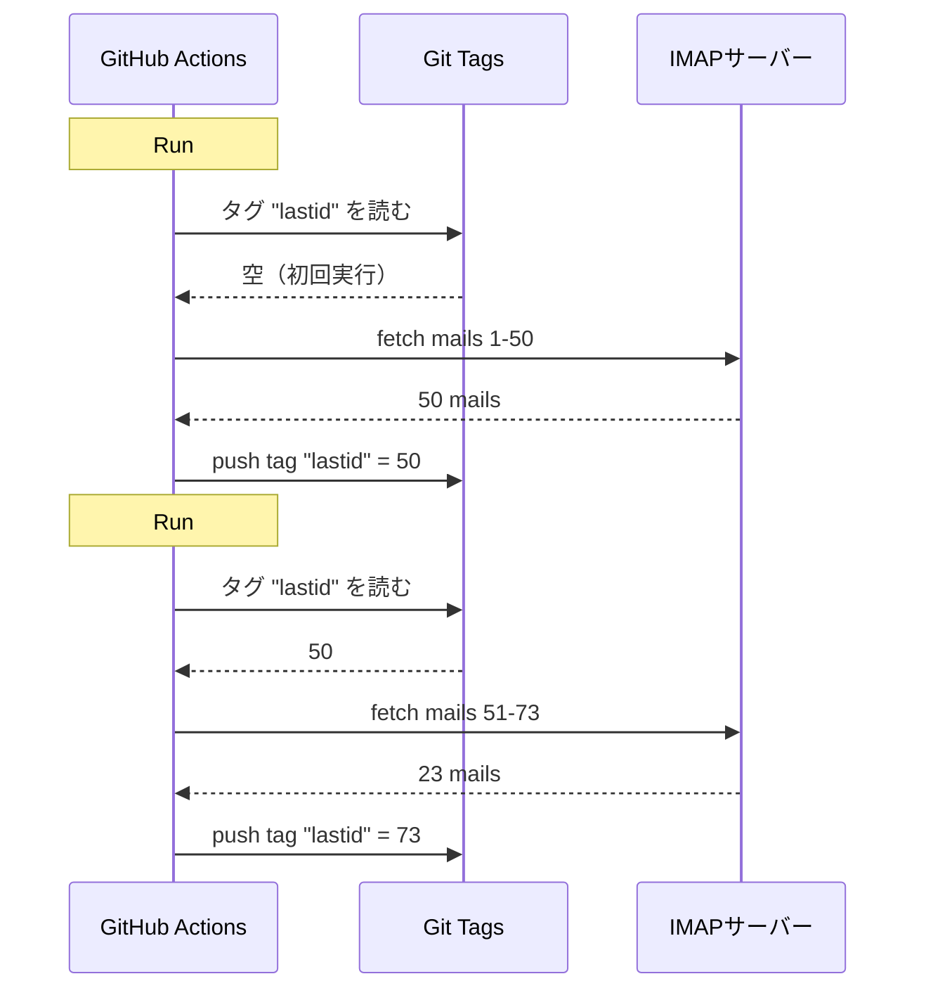

# GitHub Actionsでgitをデータベース代わりに使って無料botを動かした話

24時間365日動いてる自動メール返信botがあるんだ。

メールを読んで、内容を理解して、AIで自動返信してくれる。前の会話も覚えてる。ニュースレターや`noreply@`は無視する。ヤバそうなやつは人間に転送する。

月額料金：**0€**。

サーバーもなし。VPSもなし。データベースもなし。ただのGitHub Actionsとクソやべーハックだけ：**gitをデータベースとして使う**。

わかる？わかんないでしょ？よし、覚悟しろよ。バカすぎて逆に天才ってやつだから。

---

## 問題：GitHub Actionsはステートレス

GitHub Actionsは無料だ。5分おきにcronを仕掛けて、コードを動かせる。ただで。

でも問題があって：**ステートレス**なんだ。

実行のたびにまっさらなマシンで起動する。実行間で何も保存されない。前回の実行？忘れ去られる。消される。まるで最初からなかったかのように。

メール返信botにとっては超大問題。こんな感じ：

> 「最後に処理したメールってどれ？」

もしbotが毎回それを忘れたら、同じメールに無限ループで返信し続けるか（大惨事）、処理し損ねるかのどっちかだ。

永続的な状態が必要だ。普通、永続状態 = データベース。でもデータベースにはサーバーが必要で、サーバーはもう無料じゃない。

ここから面白くなる。

---

## 解決策：gitタグをデータベース代わりに

GitHubリポジトリはもう永続ストレージだ。無料で。バージョン管理されてて。いつでもある。

なら状態をそこに保存しちゃえば？

アイデア：実行ごとに、botが**gitタグ**から最後に処理したメールのUIDを読む。新しいメールを処理する。それから新しいUIDでタグを再pushする。



gitタグがデータベースなんだ。たった一つの値だけど、それだけで十分。

### 状態を読む

ジョブの最初に、タグから値を取得する：

```bash
git fetch origin --tags lastid || true
git show refs/tags/lastid:data/lastId > data/lastId || true
```

`git show refs/tags/lastid:data/lastId` の意味は：'タグ`lastid`に入ってる`data/lastId`ファイルの中身をくれ'ってことだ。

ドーン。データベースなしで値が取れた。

### 状態を書く

最後に、新しい値でタグを再作成する：

```bash
git switch --orphan lastid-tmp   # 履歴なしのまっさらブランチ
git rm -rf .                      # 全部消す
mkdir -p data
printf "%s\n" "${LAST_ID_CONTENT}" > data/lastId

git add data/lastId
git commit -m "lastId snapshot"
git tag -f lastid                 # タグをこのコミットに強制
git push --force ...origin lastid # タグをpush
```

**オーファン**ブランチ（履歴なし）を作って、`lastId`ファイルだけ置いて、コミットして、タグって、フォースプッシュ。

なんでオーファン？リポジトリの履歴にstateのコミットが10,000個も溜まらないようにするためだ。更新のたびに前のを上書きする。タグは常にたった一つの値を持つたった一つのコミットを指してる。

クリーンだろ。無料だろ。完全にぶっ壊れてる xD

---

## 二つ目のハック：ランタイムスナップショット

GitHub Actionsにはもう一つ問題がある：`npm install`。

毎回の実行（5分おき）で`npm install` + `npm run build`をやってたら、都度60〜90秒無駄にする。頻繁なcronだと、何分もの計算時間が無駄になる。

解決策：コードを一度だけプレコンパイルして、やっぱりgitタグに保存する。

ビルドワークフロー（`master`にpushしたときに動く）はこう：

```bash
# コードをコンパイル
bun install
bun run build

# dist/ + node_modules/ を "runtime" タグに保存
git checkout --orphan temp-runtime
git rm -rf .
cp -r "$TMPDIR"/* .
git add dist node_modules package.json bun.lock data
git commit -m "runtime build"
git tag -f runtime
git push --force ...origin runtime
```

`runtime`タグにはコンパイル済みコードと`node_modules`が入ってる。すぐ動ける状態で。

そしてcronの方は直接このタグをチェックアウト：

```yaml
- name: Checkout runtime snapshot
  uses: actions/checkout@v4
  with:
    ref: refs/tags/runtime    # ソースじゃなくてプリビルドコード
    fetch-depth: 1

# npm installもbuildもなし！
- name: Process emails
  run: node dist/index.js --action
```

インストールもなし。ビルドもなし。cronが即座に起動して、`node dist/index.js`を実行するだけ。

つまり、二つのタグが二つの役割をやってる：
- `runtime` = すぐ動けるコード（コードをpushしたときに更新）
- `lastid` = 永続状態（実行ごとに更新）

めっちゃエレガントだろ。

---

## bot本体：AI自動返信

さて、gitハックはクールだけど、botは正確に何をするの？

IMAPでメールを読んで、AI（Groq + Llama 3.3 70B）で内容を理解して、自動で返信する。

依存性注入（InversifyJS）を使ったクリーンなサービスアーキテクチャ：

```
App
├── ImapService      → メールを読む（IMAP）
├── SmtpService      → 返信を送る（SMTP）
├── ParserService    → メール内容をパース
├── ReplyService     → AI返信を生成
├── SummaryService   → 会話の記憶
├── AccountsService  → 複数メールアカウント管理
└── ConfigService    → 設定 / 環境変数
```

### 二つの動作モード

botは二通りの動き方ができる：

**リスナーモード**（リアルタイム）：指数バックオフ付きの常時IMAP接続。VPS用。

```typescript
this.imapService.on("exists", async (data) => {
  console.log(`[MAIL] 新しいメール！ 合計: ${data.count}`);
  // 新しいメールを即座に処理
});
```

**アクションモード**（バッチ）：`lastId`から新しいメールを処理して、終了する。GitHub Actionsのcron用。

```bash
node dist/index.js --action
```

`--action`モードがgitハックを使うやつだ。`lastId`を読み、新しいのを処理し、新しい`lastId`を書き、終わり。

### ロボットに返信するな

もしbotが全部のメールに返信したら、ニュースレターや通知や`noreply@`にも返信しちゃう。大惨事。もっと悪いケース：二つのbotが互いに返信し合ったら無限ループだ。悪夢。

だから攻撃的なフィルタリング：

```typescript
export function isAutomatedSender(address) {
  const automatedPatterns = [
    "noreply", "no-reply", "donotreply",
    "mailer-daemon", "postmaster", "bounce",
    "newsletter", "notification", "marketing",
    "billing", "receipt", "promo", ...
  ];
  const local = address.split("@")[0].toLowerCase();
  return automatedPatterns.some(p => local.includes(p));
}
```

そしてメールヘッダーでも検出：

```typescript
export function isAutomatedByHeaders(headers) {
  return (
    ["bulk", "list", "junk"].includes(headers.precedence) ||
    headers["auto-submitted"] !== "no" ||
    headers["list-unsubscribe"] !== "" ||   // ニュースレターはこれがある
    /mailchimp|sendgrid|mailgun|brevo/i.test(headers["x-mailer"])
  );
}
```

ヘッダーに`List-Unsubscribe`？ニュースレターだ。`Precedence: bulk`？大量送信だ。`X-Mailer: Mailchimp`？察しろって話だ。無視。

まるでクラブの警備員だな：ロボットは通さない xD

### 魔法のトリガー

AIは返信しないことを決めたり、人間にパスしたりできる。どうやって？返信の中の特別なトリガーで。

システムプロンプトはこう言ってる：

> 自動メール/ニュースレターの場合 → `<no_reply>`って返せ
> 重要すぎる/センシティブすぎる場合（法律、金銭...）→ `<manual_reply_required>`って返せ
> それ以外 → ちゃんとした返信を書け

そしてコードがそれを読む：

```typescript
const aiReply = completion.choices[0].message.content.trim();
const manualTrigger = aiReply.includes(MANUAL_REPLY_TRIGGER);
const noReply = aiReply.includes(NO_REPLY_TRIGGER);

if (noReply) {
  console.log("[MAIL] AIが無視することにした。スキップ。");
  return;
}

if (manualTrigger) {
  console.log("[MAIL] ヤバい、人間に転送する。");
  await this.smtpService.sendManualForward(...);
  return;
}

// それ以外はAI返信を送る
await this.smtpService.sendReply(...);
```

つまりAIには「いや、これは触らん、人間呼べ」って言う権利がある。賢い。

---

## 会話の記憶

全てを変える細かい点：botは会話を**覚えてる**。

誰かに返信したとき、やり取りの要約を保存する。次にその人がメールを書いたとき、要約がプロンプトに再注入される。

保存方法：連絡先ごとにJSONファイル。

```
data/customers/
├── moi%40gmail.com/
│   ├── alice%40example.com.json
│   └── bob%40client.fr.json
```

そして要約自体もAIが生成していて、古い要約と新しいメッセージをマージする：

```typescript
const completion = await groq.chat.completions.create({
  model: "llama-3.3-70b-versatile",
  messages: [
    { role: "system", content: "君は記憶アシスタントだ。情報を失わずに古い要約と新しいメッセージをマージしてくれ。" },
    { role: "user", content: `既存の要約:\n${existing}\n\n新しいメッセージ:\n${incomingContent}` }
  ],
  temperature: 0.0,  // 決定論的、創造性ゼロ
  max_tokens: 800,
});
```

つまりbotは時間とともに圧縮された記憶を構築していく。全部のメールを保存する必要はなくて、賢く成長していく要約だけでいい。

で、このJSONファイル？えっと...これもgitに保存されてるんだ、ランタイムタグの中に。どこもかしこもgit xD

---

## プロンプト長さの賢い工夫

思わずニヤけた細かいテクニック。

モデルにはトークン制限がある。メール + 要約 + ペルソナプロンプトが超えると、APIがエラーを返す。

コードは**段階的トランケーション** + リトライで処理してる：

```typescript
try {
  // 通常の制限で最初の試行
  completion = await groq.chat.completions.create({...});
} catch (error) {
  if (!this.isLengthError(error)) throw error;

  // 長さエラーだった：より厳しい制限で再試行
  ({ systemContent, userContent } = this.buildPromptPayload({
    ...,
    limits: {
      systemPromptChars: 2200,  // 3000の代わり
      summaryChars: 1800,       // 4000の代わり
      personaChars: 900,        // 1500の代わり
      userContentChars: 2200,   // 8000の代わり
    },
  }));
  completion = await groq.chat.completions.create({...});  // リトライ
}
```

それでもダメなら、もっと短く切って再試行。シンプル、効率的、クラッシュなし。

---

## で、具体的にどう動くの？

cron実行の完全なフロー：

```
1. GitHub Actionsが起動（5分おきのcron）
2. "runtime"タグをチェックアウト（プリビルドコード）
3. git show refs/tags/lastid → 最後に処理したUIDを取得
4. node dist/index.js --action
   ├── IMAP接続
   ├── lastId+1以降のメールをfetch
   ├── 各メールに対して：
   │   ├── 内容をパース
   │   ├── ロボットをフィルター（自動化ならスキップ）
   │   ├── 受信者アカウントをマッチ
   │   ├── 会話の記憶を取得
   │   ├── AI返信を生成（Groq）
   │   ├── <no_reply>？スキップ
   │   ├── <manual_reply_required>？人間に転送
   │   ├── それ以外：返信を送信（SMTP）
   │   └── 会話の記憶を更新
   └── 新しいlastIdを書き込み
5. git push --force タグ "lastid" に新しい値
```

そして5分後にまた繰り返す。永遠に。無料で。

---

**覚えるべき3つのこと：**

1. **Git = 無料データベース** -- オーファンタグがステートレスな実行間の永続状態を保存できる。読み取りは`git show refs/tags/X:ファイル`、書き込みはforce-push。DB不要。

2. **ランタイムタグにプリコンパイル** -- cronの実行ごとに`npm install`する代わりに、コンパイル済みコード + node_modulesをgitタグに保存。cronが即座に起動する。

3. **AI botは黙ることを覚えなきゃ** -- `<no_reply>`と`<manual_reply_required>`トリガーでAIが返信しないかパスするかを決められる。それにアンチロボットフィルタリング。さもないと無限メールループが発生する。

サーバーレスクロンに永続状態、AI、記憶、全部まとめて月額0€。完全にぶっ壊れてて大好き xD
