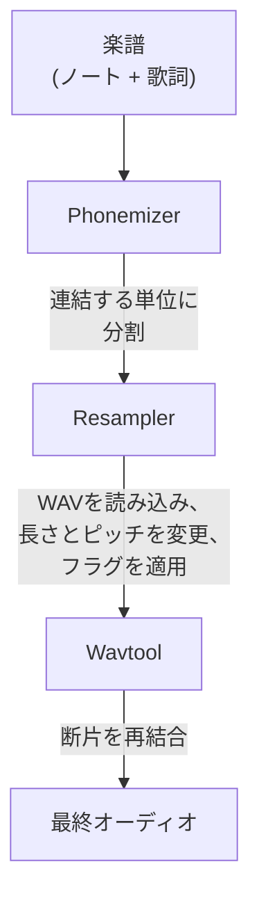

## UTAU : Visual Basic 6で作られたソフトがどうやって合成音声を民主化したか

メインページでもちょっと触れたんだけどさ：UTAUが好きなんだよね。その理由を話すよ。

2008年、もし合成音声に歌わせたかったら、選択肢は一つしかなかった：**VOCALOID**。Yamahaのソフト。高価で、プロプライエタリで、自分では作れない公式ボイスしかなかった。

そこに現れた日本人、Ameya/Ayameが趣味で作ったツール。**Visual Basic 6**で書かれたソフト。無料。自分で録音した**WAVファイル**でオリジナルの声を作れたんだ。

そのツールの名は**UTAU**（歌う）。当時としては、まさに魔法だった。

ずっとこのソフトに魅了されてきた。技術的に綺麗だからじゃない（いや実際、こんなものをVB6で作ろうって考えたやつの頭は...めちゃくちゃだよ、泣けるわ）。でもそれ以上に、他に誰もやってなかったことをやったから：音声合成を一般に開放したんだ。そう、君も、私も、マイクを持ってる人なら誰でも。

なんでそれがすごかったか、説明するよ。

---

## まず、なぜ歌唱合成が難しいのか

歌う声って、ただの音符じゃないんだ。子音の立ち上がり、母音の持続、息遣い、その間の遷移。例えば「さ」の「s」は息が漏れて「a」に滑っていく、その滑らかさが人間らしく聞こえるかどうかを決める。

今ならディープラーニングで解決する：何時間もの歌唱データでモデルを学習させて声を生成する（Synthesizer V、DiffSinger）。でもそれは2020年代以降の話。2008年にはそんなものはなかった。

UTAUはもっと古くて賢い方法を使ってる：**連結合成**だ。

---

## 連結合成：声の断片をコピペする

アイデアは超シンプル：声の小片を録音して、それをつなげて単語にする。「さとう」＝「さ」＋「と」＋「う」のサンプルを連結する。楽譜で制御される音声パズル。

YouTube Poopでキャラの言葉を切り貼りして好き勝手言わせるのと同じ原理――ただこっちはちゃんと体系化されてて自動化されてる。

そしてUTAUはまさにそこから生まれた。その前には**人力ボーカロイド**があった：人が手動で音声トラックを切り分け、音素を抽出し、ピッチを変え、オーディオエディタで再構築してVOCALOIDっぽい声を作ってた。手作業で。想像してみてよ、その労力を。

Ameyaはその面倒くささを見て、自動化するツールを作った。元々UTAUはただの人力ボーカロイド支援ツールだったんだ。

---

## なぜ革命的だったか：**君が**声を作れる

ここが一番のポイント。

VOCALOIDでは声を買ってた。ミクとかルカとか。プロが作ってYamahaが売ってた。自分で作るなんてできなかった。UTAUなら、**誰でも自分の声を録音して歌う楽器にできる**。

一番シンプルなCVモードなら：日本語の基本音節〜100個（「あ」「か」「さ」「た」…）を録音して、カットポイントを設定すれば、はい完成、自分のvoicebank。数時間の作業で。

結果：エコシステムが爆発的に広がった。コミュニティによって何千ものvoicebankが作られた――ファンの声、友達の声、創作キャラの声。無料の仮想歌手の宇宙が広がった。しかもソフトには**Defoko**（Utane Uta）っていうデフォルト音声が付属してて、AquesTalk TTSエンジンで生成されてたから、マイクがなくてもすぐ始められた。

---

## oto.ini：システムの心臓部

UTAUはどうやって音の切り貼り位置を知るのか？ voicebankごとの設定ファイル、**`oto.ini`**がその答えだ。WAVごとにカットポイント（ミリ秒単位）が定義されてる：

- **Offset** → 最初の無音部分を除去
- **Preutterance** → 子音から母音に変わるポイント（「か」の「k」→「a」の境界）
- **Overlap** → 前のノートがどれだけ次のノートに被さるか
- **Fixed region** → 長い音符でも伸ばしてはいけない部分（典型的には子音）
- **Cutoff** → 終わりのカット位置

**Preutterance**が一番賢いパラメータ。音節には常に母音の前に子音の一部が入る。音符を正確なタイミングで鳴らすには、*母音*が拍に合わないといけない。だからUTAUはサンプルを前にずらす：「か」の「a」が拍に乗り、「k」はその直前にはみ出す。ドラマーがスティックを振り下ろすタイミングを計算して正確な拍に音を合わせるのと同じ――ただそれが`.ini`ファイルの中で行われてる。

視覚的に「か」のサンプルで見ると、`oto.ini`の各ゾーンはこんな感じ：

```mermaid
flowchart LR
    A["🔇 無音<br/>(offset)"] --> B["🅺 子音<br/>(fixed region、<br/>伸ばさない)"]
    B --> C["🅰 母音<br/>(伸ばせる領域)"]
    C --> D["🔇 カット<br/>(cutoff)"]
    style B fill:#3b4a6b
    style C fill:#5b3b6b
```



子音と母音の境界がpreutterance。母音は長い音符で伸ばす領域。子音はそのまま――「k」が2秒も続いたら気持ち悪いからね。

```ini
# oto.ini (簡略化)
# ファイル=エイリアス,offset,consonant,cutoff,preutterance,overlap
_ka.wav=ka,120,80,-200,90,40
```

音ごとに5つの値、全サンプルに設定すれば、UTAUがどんな単語でもちゃんと組み立ててくれる。

---

## CV、VCV、CVVC：リアリズムへの道

基本モードの**CV**（子音-母音）は、音節ごとに一つの音。シンプルだけどちょっとロボットっぽい：音節同士の継ぎ目が粗い。

2010年、コミュニティが**VCV**（母音-子音-母音）を発明した。「か」だけ録音するんじゃなくて「あか」って録音する――前の母音の余韻も含めて。遷移が自然になるのは、それが録音*内に*含まれていて、後から計算されたものじゃないから。

ここがすごい：**VOCALOIDはVOCALOID3が出る2011年までVCVに対応してなかった。** 一人のやつがVB6で書いたフリーウェアが、トランジションのリアリズムでYamahaを1年も先越したんだ。多国籍企業より速かったファンコミュニティ。

その後も**CVVC**、**ARPAsing**（英語）、**VCCV**…と次々に方式が生まれ、どんどんリアルになっていった。全部コミュニティが発明して文書化した。

---

## 完全な処理パイプライン：単語がどうやって音声になるか

ノートを置いて歌詞を打ち込んだ時、裏側ではこうなってる：



**Resampler**が要だ：録音された「か」のサンプルを、目的のノートに合わせて引き伸ばし／ピッチ変更する――伸ばせる領域だけ伸ばして、子音はそのままにする（ここで`oto.ini`が活きる）。

しかも**モジュール式**。UTAUには基本のresamplerが付属してたけど、コミュニティが独自のもの（moresampler、TIPS…）を次々に作って、それぞれ違う音質だった。合成エンジンをプラグインみたいに差し替えられたんだ。2008年に。フリーウェアで。

---

## ボロボロな内部構造（でもそれが愛おしい）

正直に言おう、このソフトの技術的状態は：

- **Visual Basic 6で書かれてる。** 2008年時点ですでに死んでた言語。動かすのにVB6ランタイムが必要。
- **元々Windows only**（Mac移植のUTAU-Synthは2011年）。
- **Shift-JISエンコーディング必須。** ファイルがShift-JISじゃないとUTAUは読めない。今でもよくPCのロケールを日本にするかAppLocaleを使わないと起動しない。
- **地味なインターフェース**、当時はドキュメントがほぼ全部日本語。

それでも。それでもこのソフトは世界的なムーブメントを生んだ。何万ものvoicebank。何百万回も聴かれた曲。

最高の例：**重音テト**。2008年にエイプリルフールのネタとして作られたキャラで、VOCALOIDの偽物として発表された。冗談だった。ところがみんながキャラを気に入って、ちゃんとしたUTAU voicebankが作られ、テトは世界で一番有名な仮想歌手の一人になった。2023年には公式のSynthesizer V音声まで出た。フリーウェアのエイプリルフールネタから生まれたキャラが。

---

## なんで今でも重要なのか

UTAUは「貧弱」なテクノロジーがオープンさで勝つ完璧な例だ。

VOCALOIDは技術的に優れてて、資金もあって、プロフェッショナルだった。でも閉じてた。UTAUは即席で、ダサくて、VB6だった――でも誰でも参加できた。声を作れた。resamplerを作れた。プラグインを作れた。録音方法を開発できた。コミュニティが残りをやった。

そしてそのコンセプトは今でも完全に生きてる。**OpenUtau**っていうモダンなオープンソースの後継がアイデアを引き継いで、現代風に刷新してる（クロスプラットフォーム、UTF-8、モダンなresamplerとAIの両対応）。連結合成はディープラーニングモデルの隣でもまだ戦えてる。なぜなら、AIにはないものがあるから：何が起きてるか正確に理解できて、ミリ秒単位でコントロールできる。

それがUTAUのいつも好きなところ。何が起きてるか全部見える。わけわかんないAIが魔法みたいに出力するんじゃなくて：自分のWAVがあって、カットポイントがあって、全部自分で決める。音が変だったら理由がわかるし、直せる。そういうコントロールが好きなんだ。

---

**覚えておくべき3つのこと：**

1. **連結合成 = 声のパズル** -- UTAUは小さなWAVサンプルを貼り合わせて単語を作る。`oto.ini`が各音のカット＆ペースト位置を定義する。全部ミリ秒単位でコントロールできて、ブラックボックスなし。
2. **オープンさが技術に勝つ** -- VOCALOIDは優れてたけど閉じてた。UTAUは即席だったけど誰でも自分の声を作れた。コミュニティがエコシステムを爆発的に広げ、VCVではYamahaを先取りした。
3. **いいアイデアはコードの質を超えて生き残る** -- VB6、Shift-JIS、Windows only…それでもコンセプトはOpenUtauで今も動いてる。素晴らしい技術は、クソコードでも作れるんだよ。

正直、エイプリルフールから生まれた重音テトがいるだけで、このソフトは尊敬に値するんだよね xD
