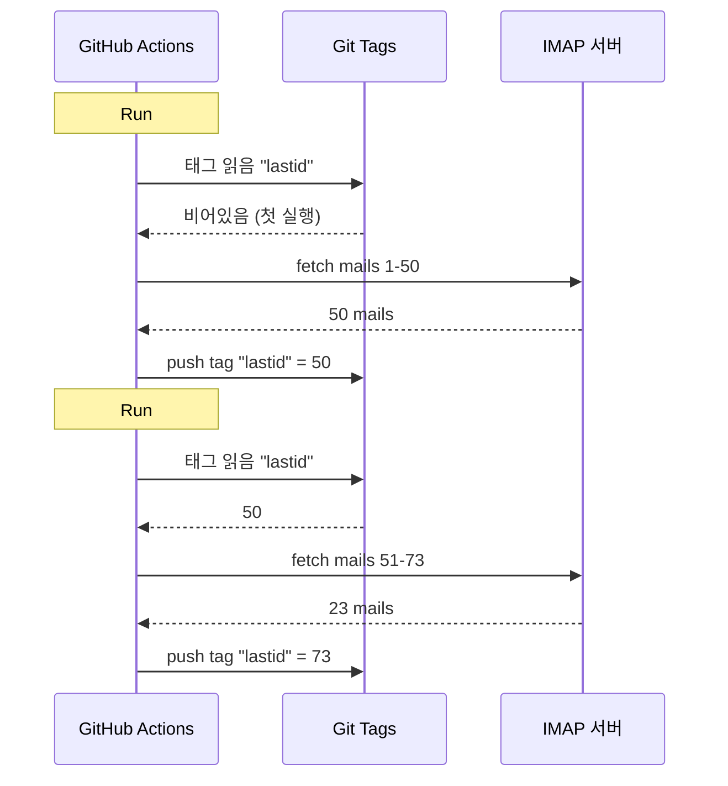

# GitHub Actions에서 깃을 데이터베이스로 써서 봇을 공짜로 돌린 썰

24/7 돌아가는 자동 이메일 답장기를 만들었어.

내 메일 읽고, 내용 이해하고, AI가 알아서 답장해줘. 이전 대화 내용도 기억해. 뉴스레터랑 `noreply@`는 씹고, 너무 중요한 건 사람한테 포워딩해.

월 비용: **0€**.

서버 없음. VPS 없음. 데이터베이스 없음. 그냥 GitHub Actions랑 미친 해킹 하나: **깃을 데이터베이스로 쓰기**.

감 잡았어? 아니지? 좋아, 잡아타, 병신 같으면서도 동시에 쩌는 거야 xD

---

## 문제: GitHub Actions는 Stateless야

GitHub Actions는 공짜야. 5분마다 cron 돌려서 코드 실행시켜도 공짜.

근데 문제가 있어: **stateless**야.

매 실행마다 깨끗한 머신에서 시작해. 두 실행 사이에 아무것도 저장 안 돼. 이전 실행? 까먹음. 지워짐. 아예 없었던 것처럼.

이메일 답장기한테 이건 엄청난 문제야. 예를 들어:

> "내가 이미 처리한 마지막 메일이 뭐였더라?"

봇이 매 실행마다 그걸 까먹으면, 같은 메일한테 계속 답장을 보내거나 (재앙) 아니면 메일을 놓치게 돼.

영속적인 상태가 필요해. 근데 보통 영속 상태 = 데이터베이스야. 근데 데이터베이스는 서버가 필요하고, 서버는 더 이상 공짜가 아니지.

여기서부터 재미있어지는 거야.

---

## 해결책: git 태그를 데이터베이스로 쓰기

니 GitHub 레포는 이미 영속적인 저장소야. 공짜. 버전 관리됨. 항상 거기 있어.

그럼 거기 상태를 저장하면 안 될 이유가 뭐야?

아이디어: 매 실행마다 봇이 **git tag**에서 마지막으로 처리한 이메일 UID를 읽어. 새 메일을 처리하고. 그리고 새 UID로 태그를 다시 푸시해.



git 태그가 곧 데이터베이스야. 하나의 값만 저장하지만, 그게 전부야.

### 상태 읽기

작업 시작할 때, 태그에서 값을 가져와:

```bash
git fetch origin --tags lastid || true
git show refs/tags/lastid:data/lastId > data/lastId || true
```

`git show refs/tags/lastid:data/lastId` 이건 이런 뜻이야: "태그 `lastid`에 있는 `data/lastId` 파일 내용을 보여줘".

빵. 데이터베이스 없이 값을 가져왔어.

### 상태 쓰기

끝나면, 새 값으로 태그를 다시 만들어:

```bash
git switch --orphan lastid-tmp   # 브랜치 orpheline (히스토리 없음)
git rm -rf .                      # 다 비움
mkdir -p data
printf "%s\n" "${LAST_ID_CONTENT}" > data/lastId

git add data/lastId
git commit -m "lastId snapshot"
git tag -f lastid                 # 이 커밋에 태그 강제 설정
git push --force ...origin lastid # 태그 푸시
```

**Orpheline** 브랜치 (히스토리 없음)를 만들고, `lastId` 파일만 넣고, 커밋하고, 태그 달고, force push 해.

왜 orpheline이냐고? 레포 히스토리에 상태 커밋 10,000개 쌓이는 걸 방지하려고. 매 업데이트가 이전 걸 덮어써. 태그는 항상 하나의 값만 가진 하나의 커밋만 가리켜.

깔끔해. 공짜야. 완전 개쩔어 xD

---

## 두 번째 해킹: 런타임 스냅샷

GitHub Actions에 또 다른 문제가 있어: `npm install`.

매 실행마다 (5분마다) `npm install` + `npm run build`를 하면, 매번 60-90초를 낭비하게 돼. 빈번한 cron에서는 몇 분의 컴퓨팅 시간이 그냥 낭비되는 거야.

해결책: 코드를 한 번만 미리 컴파일하고, 그걸 git 태그에 저장하는 거야.

빌드 워크플로우 (`master`에 push 할 때 실행됨)는 이렇게 해:

```bash
# 코드 컴파일
bun install
bun run build

# dist/ + node_modules/를 "runtime" 태그에 저장
git checkout --orphan temp-runtime
git rm -rf .
cp -r "$TMPDIR"/* .
git add dist node_modules package.json bun.lock data
git commit -m "runtime build"
git tag -f runtime
git push --force ...origin runtime
```

`runtime` 태그는 컴파일된 코드와 `node_modules`를 둘 다 담고 있어. 바로 실행 가능한 상태.

그리고 cron은 이 태그를 바로 체크아웃해:

```yaml
- name: Checkout runtime snapshot
  uses: actions/checkout@v4
  with:
    ref: refs/tags/runtime    # 미리 빌드된 코드, 소스 아님
    fetch-depth: 1

# npm install, build 없음!
- name: Process emails
  run: node dist/index.js --action
```

install 없음. build 없음. cron이 즉시 시작해서 바로 `node dist/index.js`만 실행해.

쉽게 말해, 두 개의 태그가 각자 역할을 하는 거야:
- `runtime` = 실행 준비된 코드 (코드 push 할 때 업데이트)
- `lastid` = 영속 상태 (매 실행마다 업데이트)

존나 우아하지 xD

---

## 봇 자체: AI 자동 응답기

자, git 해킹은 쩌는데, 봇이 정확히 뭘 할까?

IMAP으로 메일을 읽고, AI(Groq + Llama 3.3 70B)로 내용을 이해하고, 자동으로 답장해.

의존성 주입(InversifyJS)으로 깔끔하게 서비스 아키텍처 구성:

```
App
├── ImapService      → 메일 읽기 (IMAP)
├── SmtpService      → 답장 보내기 (SMTP)
├── ParserService    → 메일 내용 파싱
├── ReplyService     → AI 답장 생성
├── SummaryService   → 대화 메모리
├── AccountsService  → 여러 이메일 계정 관리
└── ConfigService    → 설정 / 환경 변수
```

### 두 가지 동작 모드

봇은 두 가지 방식으로 돌아갈 수 있어:

**Listener 모드** (실시간) : 지수 백오프 재연결이 있는 영구 IMAP 연결. VPS용.

```typescript
this.imapService.on("exists", async (data) => {
  console.log(`[MAIL] Nouveau mail ! Total: ${data.count}`);
  // 새 메일 즉시 처리
});
```

**Action 모드** (배치) : `lastId`부터 새 메일을 처리하고 종료해. GitHub Actions cron용.

```bash
node dist/index.js --action
```

`--action` 모드가 git 해킹을 사용하는 거야. `lastId`를 읽고, 새 메일을 처리하고, 새 `lastId`를 쓰고, 끝.

### 로봇한테 답장하지 않기

봇이 모든 메일에 답장하면, 뉴스레터, 알림, `noreply@`한테도 답장하게 돼. 재앙이야. 더 심한 건: 두 봇이 서로 답장하다가 무한 메일 루프에 빠지는 거야. 악몽.

그러니까 공격적으로 필터링:

```typescript
export function isAutomatedSender(address) {
  const automatedPatterns = [
    "noreply", "no-reply", "donotreply",
    "mailer-daemon", "postmaster", "bounce",
    "newsletter", "notification", "marketing",
    "billing", "receipt", "promo", ...
  ];
  const local = address.split("@")[0].toLowerCase();
  return automatedPatterns.some(p => local.includes(p));
}
```

그리고 이메일 헤더로도 감지:

```typescript
export function isAutomatedByHeaders(headers) {
  return (
    ["bulk", "list", "junk"].includes(headers.precedence) ||
    headers["auto-submitted"] !== "no" ||
    headers["list-unsubscribe"] !== "" ||   // 뉴스레터는 이게 있음
    /mailchimp|sendgrid|mailgun|brevo/i.test(headers["x-mailer"])
  );
}
```

헤더에 `List-Unsubscribe` 있어? 뉴스레터야. `Precedence: bulk`? 대량 메일링이지. `X-Mailer: Mailchimp`? 감 잡았지. 무시해.

마치 클럽 경비원 같아: 로봇은 못 들어와 xD

### 매직 트리거

AI가 아예 답장을 안 하거나, 사람한테 넘길 수도 있어. 어떻게? 응답에 특별한 트리거를 넣는 거야.

시스템 프롬프트가 이렇게 말해:

> 자동 메일/뉴스레터면 → `<no_reply>`라고 답해
> 너무 중요/민감하면 (법률, 금융...) → `<manual_reply_required>`라고 답해
> 그 외에는 → 진짜 답장을 써

그리고 코드가 이걸 읽어:

```typescript
const aiReply = completion.choices[0].message.content.trim();
const manualTrigger = aiReply.includes(MANUAL_REPLY_TRIGGER);
const noReply = aiReply.includes(NO_REPLY_TRIGGER);

if (noReply) {
  console.log("[MAIL] L'IA a décidé d'ignorer. Skip.");
  return;
}

if (manualTrigger) {
  console.log("[MAIL] Trop chaud, je forward à un humain.");
  await this.smtpService.sendManualForward(...);
  return;
}

// 아니면 AI 답장 전송
await this.smtpService.sendReply(...);
```

AI가 "아니, 이건 내가 못 건드리겠어, 진짜 사람 불러"라고 말할 권리가 있는 거야. 지혜롭네.

---

## 대화 기억

모든 걸 바꾸는 디테일: 봇이 대화를 **기억해**.

누군가한테 답장할 때, 그 교환 내용의 요약을 저장해. 다음에 그 사람이 메일을 보내면, 그 요약이 프롬프트에 다시 주입돼.

저장: 연락처당 JSON 파일 하나.

```
data/customers/
├── moi%40gmail.com/
│   ├── alice%40example.com.json
│   └── bob%40client.fr.json
```

요약 자체도 AI가 생성해, 이전 요약과 새 메시지를 병합하는 방식으로:

```typescript
const completion = await groq.chat.completions.create({
  model: "llama-3.3-70b-versatile",
  messages: [
    { role: "system", content: "Tu es un assistant de mémoire. Merge l'ancien résumé avec le nouveau message sans perdre d'info." },
    { role: "user", content: `Résumé existant:\n${existing}\n\nNouveau message:\n${incomingContent}` }
  ],
  temperature: 0.0,  // 결정적, 창의성 없음
  max_tokens: 800,
});
```

그래서 봇은 시간이 지나면서 압축된 기억을 만들어가. 모든 메일을 저장할 필요 없이, 똑똑하게 커지는 요약 하나면 돼.

그리고 이 JSON 파일들은? 음... 이것도 git에 저장돼, runtime 태그 안에. git이 전부야 xD

---

## 프롬프트 길이에 대한 똑똑한 처리

피식 웃게 만든 작은 기술적 디테일.

모델에는 토큰 제한이 있어. 메일 + 요약 + 페르소나 프롬프트가 초과하면 API가 에러를 반환해.

코드는 **캐스케이드 자르기** + 재시도로 처리해:

```typescript
try {
  // 첫 번째 시도: 기본 제한으로
  completion = await groq.chat.completions.create({...});
} catch (error) {
  if (!this.isLengthError(error)) throw error;

  // 길이 에러였음: 더 빡빡한 제한으로 재시도
  ({ systemContent, userContent } = this.buildPromptPayload({
    ...,
    limits: {
      systemPromptChars: 2200,  // 3000 대신
      summaryChars: 1800,       // 4000 대신
      personaChars: 900,        // 1500 대신
      userContentChars: 2200,   // 8000 대신
    },
  }));
  completion = await groq.chat.completions.create({...});  // 재시도
}
```

안 되면 더 짧게 자르고 다시 시도해. 간단하고, 효과적이고, crash 없음.

---

## 자, 그럼 실제로 어떻게 돌아가는 거야?

cron 실행의 전체 플로우:

```
1. GitHub Actions 실행 (5분마다 cron)
2. "runtime" 태그 체크아웃 (미리 빌드된 코드)
3. git show refs/tags/lastid → 마지막으로 처리한 UID 가져오기
4. node dist/index.js --action
   ├── IMAP 연결
   ├── lastId+1부터 새 메일 가져오기
   ├── 각 메일마다:
   │   ├── 내용 파싱
   │   ├── 로봇 필터링 (자동 발송이면 스킵)
   │   ├── 수신 계정 매칭
   │   ├── 대화 메모리 불러오기
   │   ├── AI 답장 생성 (Groq)
   │   ├── <no_reply> ? 스킵
   │   ├── <manual_reply_required> ? 사람 포워딩
   │   ├── 아니면 : 답장 전송 (SMTP)
   │   └── 대화 메모리 업데이트
   └── 새 lastId 쓰기
5. git push --force tag "lastid" (새 값으로)
```

그리고 5분 후에 다시 시작해. 영원히. 공짜로.

---

**기억할 3가지:**

1. **Git = 공짜 데이터베이스** -- Orpheline 태그 하나로 stateless 실행 사이에 영속 상태를 저장할 수 있어. `git show refs/tags/X:fichier`로 읽고, force-push로 써. DB 따위 필요 없어.

2. **runtime 태그에 미리 컴파일** -- cron 실행마다 `npm install` 하는 대신, 컴파일된 코드 + node_modules를 git 태그에 저장해. cron이 즉시 시작돼.

3. **AI 봇은 침묵할 줄 알아야 해** -- `<no_reply>`와 `<manual_reply_required>` 트리거로 AI가 답장하지 않거나 패스할지 결정하게 해. 거기에 봇 필터링까지. 안 그러면 무한 메일 루프가 생겨.

서버리스 cron + 영속 상태 + AI + 메모리, 모두 0€/월. 완전 개쩌고 사랑해 xD
