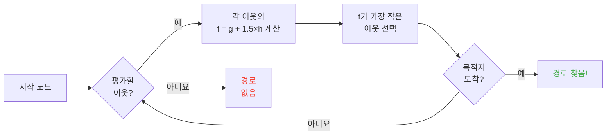

## 소개

양들이 벽에 머리 박는 거 몇 시간째 보고 있었음.

내 인생 최고의 투자 xD

몹들이 움직이는 거 계속 보다 보면 알게 됨 -- 이새끼들 랜덤이 아님. 한 땀 한 땀 코드로 짜여 있고, 예측 가능하고, 결정적으로 **부술 수 있음**. 결국 마인크래프트 소스코드를 까보게 됐는데, 알고 보니 몹들을 정신지배 할 수 있었음. 말 그대로 네가 원하는 곳으로 가게 조종 가능. 랜덤이 아니라.

이 가이드는 내가 뒤지면서 찾은 모든 내용임. AI 시스템, A* 알고리즘, 숨은 악의값(?), 서바이벌에서 써먹을 수 있는 익스플로잇까지. 곡괭이 챙겨라.

---

## 몹 AI 작동 원리 (스포: 좀 멍청함)

### 목표

모든 몹은 *목표* 리스트를 가지고 있음. 할 수 있는 일, 그리고 얼마나 하고 싶은지. 숫자가 낮을수록 우선순위 높음. 지옥에서 온 투두리스트 같음.

```java
protected void registerGoals() {
   this.goalSelector.addGoal(4, new Zombie.ZombieAttackTurtleEggGoal(this, 1.0, 3));
   this.goalSelector.addGoal(8, new LookAtPlayerGoal(this, Player.class, 8.0F));
   this.goalSelector.addGoal(8, new RandomLookAroundGoal(this));
   this.addBehaviourGoals();
}
```

좀비가 거북이 알 씹고 너한테 달려드는 거 본 적 있음? 그게 이유임. `ZombieAttackTurtleEggGoal`은 4순위인데 `ZombieAttackGoal` (면상 뜯기)는 2순위임. 좀비는 맥박 뛰는 간식을 더 좋아함.

우리가 진짜 관심있는 건 `WaterAvoidingRandomStrollGoal`, 7순위임. "딱히 할 거 없어서 그냥 돌아다닐래" 목표. 여기가 재미 시작되는 곳임.

### 이동 (또는 "랜덤 워크가 틱당 1/60 확률인 이유")

매 틱(0.05초)마다 게임이 `canUse()`를 호출해서 몹이 움직일 의향이 있는지 체크함. 확률 1/60. 끔찍하게 비효율적인 설계, 근데 사랑스러움.

```java
public boolean canUse() {
   if (this.mob.hasControllingPassenger()) {
      return false;
   } else {
      if (!this.forceTrigger) {
         if (this.checkNoActionTime && this.mob.getNoActionTime() >= 100) {
            return false;
         }
         if (this.mob.getRandom().nextInt(reducedTickDelay(this.interval)) != 0) {
            return false;
         }
      }
      Vec3 $$0 = this.getPosition();
      if ($$0 == null) {
         return false;
      } else {
         this.wantedX = $$0.x;
         this.wantedY = $$0.y;
         this.wantedZ = $$0.z;
         this.forceTrigger = false;
         return true;
      }
   }
}
```

요약: 몹 타고 있음 -> 안 됨, 5초 동안 아무것도 안 함 -> 안 됨, RNG가 싫음 -> 안 됨. 게임이 몹한테 **진짜** 움직이기 싫어함.

근데 움직이기로 했을 때, `getPosition()`이 작동함:

```java
protected Vec3 getPosition() {
   if (this.mob.isInWater()) {
      Vec3 $$0 = LandRandomPos.getPos(this.mob, 15, 7);
      return $$0 == null ? super.getPosition() : $$0;
   } else {
      return this.mob.getRandom().nextFloat() >= this.probability
         ? LandRandomPos.getPos(this.mob, 10, 7)
         : super.getPosition();
   }
}
```

끝에 두 숫자? XZ 반경과 Y 반경임. 물에선 몹이 더 멀리 찾음(15 vs 10). 땅을 못 찾으면 물도 허용하는 `super.getPosition()`으로 폴백함. **결과: 몹들은 물 밖으로 나가고 싶어함.** 그래서 동물들이 미친 듯이 해안가로 헤엄쳐 가는 거임.

재밌는 디테일: 몹이 `LandRandomPos` 대신 `super.getPosition()`을 선택할 확률이 말 그대로 0.1%임. 천분의 일. 모장 뭐함 xD

### LandRandomPos: 모든 걸 망가뜨리는 최적화

이게 내가 제일 좋아하는 단계임. 가장 아름다운 기술적 쓰레기. 길찾기를 익스플로잇 가능하게 만듦.

```java
public static Vec3 getPos(PathfinderMob $$0, int $$1, int $$2, ToDoubleFunction<BlockPos> $$3) {
   boolean $$4 = GoalUtils.mobRestricted($$0, $$1);
   return RandomPos.generateRandomPos(() -> {
      BlockPos $$4xx = RandomPos.generateRandomDirection($$0.getRandom(), $$1, $$2);
      BlockPos $$5 = generateRandomPosTowardDirection($$0, $$1, $$4, $$4xx);
      return $$5 == null ? null : movePosUpOutOfSolid($$0, $$5);
   }, $$3);
}
```

`movePosUpOutOfSolid`. 이름이 다 말해줌. 고른 위치가 고체 블록 안에 있으면, 게임이 위로 밀어 올림.

최적화임: 지하 위치 스킵하는 데 시간 낭비하지 말고 그냥 표면으로 올리자. 똑똑함? ㅇㅇ. 근데 이게 엄청난 편향을 만듦: **몹들은 높은 지형을 선호함**.

생각해봐. 지하에 블록이 많음, 게임이 10개 랜덤 위치 생성함. 블록 안에 있는 것들은 위로 밀려남. 밀집된 지역(언덕 아래)이 빈 공간보다 더 많은 유효 위치를 만듦. 결과: 몹이 통계적으로 언덕 쪽으로 더 자감.

믿어, 이거 곧 마개조할 거임.

### 선택: 최고 블록이 승리

10개 위치, 하나의 승자, 점수 대결:

```java
public static Vec3 generateRandomPos(Supplier<BlockPos> $$0, ToDoubleFunction<BlockPos> $$1) {
   double $$2 = Double.NEGATIVE_INFINITY;
   BlockPos $$3 = null;
   for(int $$4 = 0; $$4 < 10; ++$$4) {
      BlockPos $$5 = (BlockPos)$$0.get();
      if ($$5 != null) {
         double $$6 = $$1.applyAsDouble($$5);
         if ($$6 > $$2) {
            $$2 = $$6;
            $$3 = $$5;
         }
      }
   }
   return $$3 != null ? Vec3.atBottomCenterOf($$3) : null;
}
```

가장 높은 점수 받은 위치가 승리함. 그리고 점수 기준을 알면 네가 원하는 위치를 이기게 만들 수 있음. 선거 조작하는 느낌임.

---

## 몹 취향 (또는 "네 소가 길을 건넌 이유")

모든 몹은 취향이 다름. 그리고 이게 모든 걸 바꿈.

| 몹 | 좋아하는 거 |
| --- | --- |
| **동물** (소, 양, 돼지) | 잔디 블록, 빛 |
| **몬스터** (좀비, 스켈레톤) | 어둠 (히스터임) |
| **거북이** | 물 > 모래 > 빛 |
| **호글린** | `crimson_nylium`; `warped_fungus` 싫어함 |
| **스트라이더** | 용암, 그것만 |
| **은어** | 감염 가능 블록 |
| **가디언** | 물 + 빛 (스놉) |
| **무시룸** | 균사체 + 빛 |
| **벌** | 공기. ㅇㅇ, 공기를 선호함. |

```java
// 동물: 아래 보기, 잔디면 최대 점수
public float getWalkTargetValue(BlockPos $$0, LevelReader $$1) {
   return $$1.getBlockState($$0.below()).is(Blocks.GRASS_BLOCK) ? 10.0F : $$1.getPathfindingCostFromLightLevels($$0);
}

// 몬스터: 말 그대로 반대
public float getWalkTargetValue(BlockPos $$0, LevelReader $$1) {
   return -$$1.getPathfindingCostFromLightLevels($$0);
}
```

몬스터는 "밝으면 점수 마이너스, 나갈게"임. 불들어오면 발작함 xD

그래서 잔디랑 빛으로 동물을 유도할 수 있고, 어둠으로 몬스터를 유도할 수 있음. 멍청하면서도 천재적임.

---

## 마인크래프트의 A* (비밀 공식)

마인크래프트는 길찾기에 A*(A-star)를 사용함. 근데 모장이 자기들만의 트위스트를 추가함:

```
f(n) = g(n) + 1.5 × h(n)
```

- **g(n)** = 이미 이동한 거리 (블록당 1, 대각선은 ~1.41)
- **h(n)** = 목표까지 직선 거리
- **1.5** = 모장이 약간 고장난 걸 좋아해서

일반 A*는 `f(n) = g(n) + h(n)`임. **모장이 1.5 배수를 추가함**. 왜? 알고리즘이 목적지에 더 빨리 도달하게 하고 검색 가지를 덜 자르려고. 결과: 경로가 "충분히 좋음" 항상 최적은 아님. 취한 A*임.



핵심 제한: **몹은 최대 16블록까지만 길찾기 가능함** (추종 범위). 목적지가 너무 멀면, 도달 가능한 가장 가까운 블록을 선택함. 이 말은 범위 밖에 기념비를 세우면 몹이 더 가까워지는 가장 가까운 블록으로 이동하게 만들 수 있음 -- 완전 예측 가능해짐.

### 게임을 부수는 두 가지 익스플로잇

#### 1. 블록 업데이트가 재계산을 강제함

```java
public boolean shouldRecomputePath(BlockPos $$0) {
   if (this.hasDelayedRecomputation) return false;
   if (this.path != null && !this.path.isDone() && this.path.getNodeCount() != 0) {
      Node $$1 = this.path.getEndNode();
      Vec3 $$2 = new Vec3(
         ((double)$$1.x + this.mob.getX()) / 2.0,
         ((double)$$1.y + this.mob.getY()) / 2.0,
         ((double)$$1.z + this.mob.getZ()) / 2.0
      );
      return $$0.closerToCenterThan($$2, (double)(this.path.getNodeCount() - this.path.getNextNodeIndex()));
   }
   return false;
}
```

몹 경로 근처의 모든 블록 업데이트가 1초 쿨다운으로 A* 재계산을 강제함. 몹 옆에 1초 클락을 두면 **계속** 재계산함. 1초마다 리셋되는 GPS 같음.

그리고 이걸 50마리 몹으로 하면? 렉 도시. RIP TPS.

#### 2. 길찾기 Malice (블록 비용 패널티)

어떤 블록은 몹을 무서워하게 만듦. 말 그대로. 모든 블록은 열거형으로 정의된 연관 비용이 있음:

| 블록 / 조건 | Malice |
| --- | --- |
| **꿀 블록** | 통과 +8 |
| **가루 눈** | 통과 불가 |
| **닫힌 문** | 통과 불가 |
| **불** | 통과 +16, 인접 +8 |
| **동물 & 주민** | 불 = -1 (HARD NO) |
| **선인장 / 달콤한 열매** | 통과 불가; 인접 +8 |
| **물** | 통과 또는 인접 +8 |
| **마그마** | 인접 +8 |

동물은 더 나아감:

```java
protected Animal(EntityType<? extends Animal> $$0, Level $$1) {
   super($$0, $$1);
   this.setPathfindingMalus(PathType.DANGER_FIRE, 16.0F);
   this.setPathfindingMalus(PathType.DAMAGE_FIRE, -1.0F);
}
```

DAMAGE_FIRE가 -1.0F라는 건 말 그대로 "금지"라는 뜻임. 동물은 불 속을 걷느니 차라리 공허로 뛰어들겠음.

### 연습문제: 위대한 경로 대회

여러 경로 사이에서 선택하는 주민:

- **경로 A**: 15블록, 근데 물 6개 인접 (+8씩)
- **경로 B**: 18블록, 물 2개 통과 (+8) + 물 1개 인접 (+8)
- **경로 C**: 14블록 직진... 근데 불 -> 주민 통과 불가
- **경로 D**: 16블록, 마그마 1개 인접 (+8) + 꿀 1개 인접 (+8)
- **경로 E**: 25블록, 선인장 도배 (+8 everywhere) -> 총 90.82 ㅋㅋㅋ

승자는 보통 **경로 B**임: 우회하는 게 이득인 이유는 물이 비싸서임.

주민은 다리 달린 계산기임 xD

### 몹마다 다른 경로를 선택함

주민: "불? 난 뒤질래 ㅂ2"
좀비: "불? ㅇㅋ 불타면서 걸음"

주민이 타고 좀비는 안 타는 길을 말 그대로 만들 수 있음 -- 또는 그 반대로.

---

## 주민: 궁극의 개판

주민은 마인크래프트에서 가장 오해받는 존재임. 근데 코드를 읽고 나면 그냥 업무 시간이 있는 예측 가능한 기계라는 걸 알게 됨.

### 센서와 기억

9개의 센서가 20틱(1초)마다 실행됨. 각각 주변 반경을 스캔해서 결과를 기억에 저장함. 주민은 모든 걸 보고, 모든 걸 기억하고, 그에 따라 행동함.

### 활동 패키지

주민의 뇌는 시간에 따라 활성화되는 활동 패키지로 나뉘어 있음:

| 패키지 | 시간 | 주민이 하는 일 |
| --- | --- | --- |
| **코어** | 24/7 | 문 열기, 수영 (80% 확률), POI 획득 |
| **일** | 오전 8시-오후 3시 | "일해야지" -- 작업대로 걸어감 |
| **회의** | 오후 3시-오후 5시 | "해피아워!" -- 종으로 감, 사교 활동 |
| **휴식** | 오후 6시-오전 6시 | "잘 시간" -- 침대로 감 |
| **한가함** | 오전 6시-8시, 오후 5시-6시 | "심심함" -- 배회, 번식, 침대에서 폴짝 |
| **공황** | 피해 / 적 발견 | "도망쳐" -- 도주 |

**공황**만이 다른 모든 패키지를 중단시킬 수 있음. 주민이 자거나 일하는 중이어도 좀비가 있으면 공황 모드임.

### POI 획득: 무선 레드스톤을 가능하게 하는 매커니즘

```java
Set<Pair<Holder<PoiType>, BlockPos>> $$12 = (Set)$$10xx.findAllClosestFirstWithType(
   $$0, $$11, $$8x.blockPosition(), 48, PoiManager.Occupancy.HAS_SPACE
)
```

`Acquire POI`는 48블록 반경 내 모든 유효 관심 지점을 스캔함. 가장 가까운 5개를 유지하고, 경로가 있는지 확인해서 도달 가능한 가장 가까운 지점을 획득함. 각 POI에는 제한된 슬롯이 있음:
- **작업대**: 1 슬롯
- **침대**: 1 슬롯
- **종**: 32 슬롯

**미친 건**: **슬롯이 도착할 때가 아니라 획득할 때 예약됨**. 주민이 지도 반대편에 있는 퇴비통을 잠글 수 있음, 도달하지도 않고.

어디로 흘러가는지 보임?

### 무선 레드스톤. ㅇㅇ, **무선**.

1. 주민을 퇴비통 경로가 있는 마인카트에 태움
2. 퇴비통 획득 (슬롯 차지, 아무도 못 씀)
3. 주민이 너무 멀어서 클릭 못 함 -- 뼛가루 그대로
4. 이 주민을 세계 **어디로든** 이동시켜도 슬롯 유지됨
5. 작동시키고 싶을 때 주민 **죽임**
6. 슬롯 해제, 다른 주민이 퇴비통 획득, 뼛가루 제거
7. 블록 업데이트 -> 모든 레드스톤 회로 작동

전 세계에서 전송 가능한 무선 레드스톤을 만든 거임, 경로에 청크 로딩도 필요 없음. 이걸 엔더 진자 스테이시스 체임버에 연결하면 주민 하나 죽여서 어디서든 텔레포트 가능.

내가 제일 좋아하는 용도? 현상금 사냥꾼 미니게임: 여러 주민이 각자 퇴비통을 가지고 있고, 플레이어가 **올바른** 주민을 죽여서 출구를 활성화해야 함. 완전 xD 매커니즘임.

### 길찾기 데드락 (또는 "영원히 멈추는 주민")

`Acquire POI`(경로를 봄)와 실제 내비게이션(따라가길 거부함) 사이에 버그가 있음. 작업대 위 블록이 걸을 수 없을 때 발생함. 결과:

- 코어 패키지: "POI를 획득하고 싶어"
- 내비게이션: "거기 못 걸어가"
- 결과: 주민이 영원히 얼어붙음, 자기 자신과 싸우면서.

말 그대로 얼어붙은 주민, 장식이나 소품으로 사용 가능. 갑옷 거치대 탱크? ㅇㅇ. 움직이지 않는 경비병? ㅇㅇ. 막장? 아마도. 효과적? 완전 xD

---

## 결론

마인크래프트 몹 길찾기는 랜덤이 아님. 결정론적이고 점수 기반 시스템이며, 예측 가능하고 **부술 수 있음**.

**세 가지 기억할 점:**

1. **아래 고체 블록 = 높이 편향** -- 바닥을 채우거나 비워서 몹 유도
2. **Malice는 몹마다 다름** -- 어떤 몹은 타고 어떤 몹은 안 타는 경로 생성
3. **POI 슬롯은 원거리에서 예약됨** -- 공짜 무선 레드스톤, 텔레포테이션, 다 됨

마인크래프트의 소스코드는 덜 발굴된 매커니즘의 금광임. 디컴파일된 자바를 몇 시간 읽었는데 솔직히? 모든 줄이 기능성 이스터에그임. 근데 이건 서바이벌에서 주민으로 무선 레드스톤이 된다는 게 다름. 갓겜 맞음 xD
