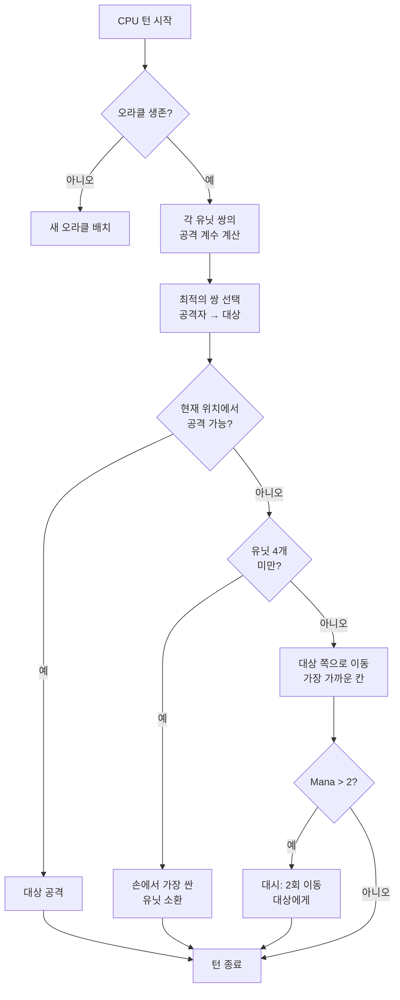

## 내 막장 AI for Nausicaa

"에에... 신화 테마로 체스 게임 한 번 만들어볼까?" 에서 시작한 프로젝트가 5턴마다 자기 파라미터를 바꾸는 AI를 달고 끝났다 xD

Nausicaa는 그런 게임. 턴제 보드게임 + 신화 생물 덱 빌딩 + 마나 관리, 10x8 보드 위에서 유닛을 배치하는 방식이야.

그리고 AI가 정체성 위기를 겪음 ㅋㅋ

AI 만드는데 꽤 공 들였는데, 결과물은 꽤 답이 없다 xD

## 게임은 뭐하는 거냐면

뇌 얘기하기 전에 몸통부터 설명해야지:

- 10x8 보드, 각 플레이어당 2줄 배치 구역
- 마나는 1에서 시작, 턴마다 +1, 최대 6. 소환/공격/스킬에 사용
- 목표: 상대 Oracle을 개발살내기

12종 유닛, 각자 코스트와 이동 패턴이 다름:

| Unit | 코스트 | 이동 | HP |
| --- | --- | --- | --- |
| Oracle | 0 | 킹 (8방향) | 1 |
| Gobelin | 1 | 앞으로 3칸 | 1 |
| Harpie | 1 | 킹 (8방향) | 1 |
| Naïade | 1 | 대각선 | 1 |
| Griffin | 2 | 2칸 점프 | 2 |
| Sirène | 2 | 좌우 | 1 |
| Centaure | 2 | 나이트 (L자) | 2 |
| Archer | 3 | 좌우 | 1 |
| Phénix | 3 | 대각선 (어두운 칸만) | 1 |
| Métamorphe | 4 | 자리 바꾸기 | 1 |
| Voyant | 4 | 없음 (마나 생성) | 1 |
| Titan | 6 | 제한됨 (범위 공격) | 3 |

각 유닛은 자기만의 공격 패턴이 있음. Sirène은 대각선 4방향, Archer는 3칸 원거리, Titan은 소환되자마자 주변 다 쓸어버림. ㅇㅇ 신화+덱빌딩 체스라고 보면 됨 xD

## CPU를 어떻게 생각하게 만들었나

기본 아이디어는 존나 단순함: **적 유닛마다 어그로 계수가 있음**. 위험할수록 AI가 더 집중함.

```javascript
const UNITS_ATTRACTIVENESS = {
    "oracle": 100,
    "titan": 95,
    "shapeshifter": 90,
    "phoenix": 80,
    "siren": 70,
    "archer": 70,
    "seer": 70,
    "griffin": 60,
    "centaur": 60,
    "harpy": 50,
    "naiad": 30,
    "gobelin": 20
};
```

Oracle 100 -- 당연하지, 이걸 따야 승리임. Titan 95 -- 소환되면 옆에 있는 놈들 다 원킬 내니까. Gobelin 20은 그냥 잡몹, 신경 쓸 가치 없음.

그 다음 모든 유닛 쌍 (아군 1, 적군 1) 마다 계산:

```
interest = attractiveness × coeff_attract / (distance × coeff_dist)
```

쉽게 말하면: 위험할수록 + 가까울수록 AI가 더 패고 싶어함.

```javascript
calculateAttackCoefficient(x1, y1, x2, y2) {
    const distance = this.calculateEuclideanDistance(x1, y1, x2, y2);
    if (distance === 0) return Infinity;
    return (UNITS_ATTRACTIVENESS[unit.type] * COEFFICIENTS_IMPORTANCE["attractiveness"]) / distance;
}
```

### 계수가 바뀌는 미친 짓

웃긴 점은 **중요도 계수가 5턴마다 랜덤으로 바뀜**.

```javascript
if (this.turnCount % 5 === 0) {
    const distanceCoefficient = parseInt(Math.random() * 100);
    const attractivenessCoefficient = parseInt(Math.random() * 100);
    this.regulateImportanceCoefficients({
        distance: distanceCoefficient,
        attractiveness: attractivenessCoefficient
    });
}
```

한 번은 AI가 개돌 모드 (어그로 95, 거리 5) 로 닥돌해서 Oracle 따버리고, 다음 번엔 거리 위주로 다시 포지셔닝함.

팩맨 유령들한테 아이디어를 땀 -- Blinky는 추적, Pinky는 매복. 여기서 AI도 페이즈마다 "성격"이 바뀌는 셈.

**결과: 게임 내내 AI를 예측하는 게 불가능함.** 똑같은 경기를 두 번 하는 법이 없음.

### Oracle은 겁쟁이임

적 Oracle은 도망감. 말 그대로.

```javascript
const awayFromTarget = {
    row: Math.max(0, Math.min(7, botUnitElement.row + (botUnitElement.row - targetUnitElement.row))),
    col: Math.max(0, Math.min(9, botUnitElement.col + (botUnitElement.col - targetUnitElement.col)))
};
```

위협의 반대 방향을 계산해서 튐. 벽이 있으면 그 방향에서 가장 가까운 빈 칸을 찾음.

3턴 동안 Oracle에 접근했는데, ㅅㅂ 도망가버림 ㅋㅋ xD

### 결정 루프

AI가 결정하는 방식:

1. Oracle이 죽었으면 새로 배치
2. 모든 아군→적군 유닛 쌍에 대해 계수 계산
3. 최적의 쌍 선택
4. 지금 위치에서 공격 가능하면 → 공격
5. 유닛 4개 미만이면 → 손에서 가장 싼 유닛 소환
6. 아니면 적에게 이동 (적과 가장 가까운 이동 가능 칸으로)
7. 마나가 충분하면 (> 2) → 대시 (2연속 이동) 로 더 접근
8. 유닛이 Oracle이면 → 도망



```javascript
async makeAction(dash=false) {
    // 전부 순차적으로
    // 마나 충분하면 CPU가 대시함
    if(botPlayer.mana > 2) {
        this.makeAction(true);
    }
}
```

### 왜 유클리드 거리냐면

유클리드 거리를 씀:

```javascript
calculateEuclideanDistance(x1, y1, x2, y2) {
    const deltaX = Math.pow(x1 - x2, 2);
    const deltaY = Math.pow(y1 - y2, 2);
    return Math.sqrt(deltaX + deltaY) * COEFFICIENTS_IMPORTANCE["distance"];
}
```

맨해튼 거리는 왜 안 씀? 유닛들 이동 패턴이 다양해서 (L자, 대각선 등등). 직선 거리가 위험도를 더 잘 나타냄.

## 미니맥스는 왜 안 함

미니맥스로 짤 수도 있었음. 근데 유닛 12종, 이동 패턴 다 다르고, 특수 능력까지... 게임 트리가 미친 듯이 불어나서 플레이가 불가능해짐. 휴리스틱 접근법이 1천만 상태를 탐색하지 않고도 똑똑한 선택을 할 수 있게 해줌.

## 쩌는 점

어그로 시스템이 꽤 재밌는 딜레마를 만듦:

- Voyant (70)는 마나를 생성함. 냅두면 적이 자원 더 먹음. 근데 Titan (95)이 더 위험함.
- Métamorphe (90)는 아무 유닛이랑 자리 바꾸기 가능. Oracle을 스틸할 수 있음.
- Harpie (50)는 자폭 공격이라 자기 자신도 뒤짐. 우선순위 낮음... 근데 내 유닛 3개 옆에 붙으면 얘기가 다름.

AI는 순수 능력치뿐만 아니라 포지션 기반으로 전체 위험도를 평가함.

시나리오 테스트용 `activateSimulation()` 함수도 있음:

```javascript
activateSimulation() {
    // 보드에 특정 유닛 배치
    // AI 디버깅용
    this.game.board = simulation.board;
    this.game.players = simulation.players;
}
```

## 아쉬운 점

시간 더 있었으면:

- AI는 현재 상태에만 반응함, 플레이어의 다음 행동은 예측 못 함
- 여러 턴에 걸친 핸드 플랜이 없음
- Métamorphe랑 Centaure 능력을 덜 활용함
- 강화학습: 자기랑 붙여서 계수 튜닝

근데 브라우저 게임치고는 충분함. 주변 친구들도 지기도 함 ㅋㅋ xD

## 플레이해보셈

[nausicaa-game.github.io](https://nausicaa-game.github.io/) 에서 가능. "JOUER" 누르고 CPU 모드 켜면 AI가 뭐 하는지 볼 수 있음.

팁: AI끼리 붙여봐. 공격적으로 가다가 갑자기 쭉 빠지는 꼴을 볼 수 있음.

코드는 [GitHub](https://github.com/nausicaa-game/nausicaa-game.github.io) `js/cpu.js` 에 있음.

**3줄 요약:**

1. **휴리스틱 계수** -- 미니맥스 없음, 유닛마다 어그로 수치
2. **5턴마다 계수 변경** -- AI가 팩맨처럼 공격/컨트롤 전환
3. **Oracle은 튐** -- 위협 반대 방향 계산해서 도주

AI를 더 빡치게 만드는 아이디어 있으면 이슈 남겨줘. 패배에서 배우는 버전도 구상 중이긴 한데, 그건 다음 글에서 ㅋㅋ xD
