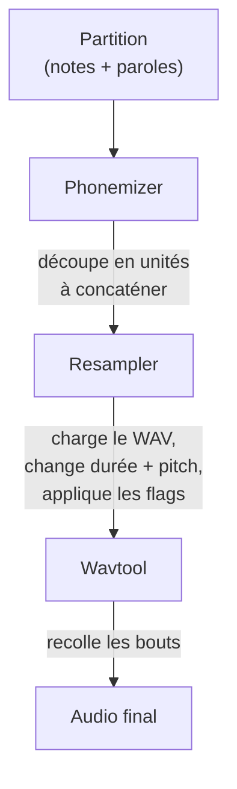

## UTAU : Visual Basic 6으로 만든 프로그램이 어떻게 합성음을 대중화했는가

내 메인 페이지에서 한마디 했었는데: 나는 UTAU를 좋아해. 이유를 설명해줄게.

2008년에 합성 목소리로 노래를 시키고 싶었다면 선택지는 하나였어: VOCALOID. 야마하의 소프트웨어. 비싸고, 폐쇄적이고, 직접 만들 수 없는 공식 음성들만 있었지.

그런데 일본인 아메야/아야메라는 사람이 자기 혼자서 뭔가를 만들어냈어. **Visual Basic 6**으로 코딩된 프로그램. 공짜. 직접 녹음한 WAV 파일로... 자신만의 목소리를 만들 수 있게 해주는 프로그램.

이 프로그램 이름은 **UTAU**(일본어로 '노래하다'). 그리고 그 시대 기준으로는, 마법이나 다름없었어.

난 항상 이 프로그램이 매력적이라고 생각했어. 기술적으로 깔끔해서가 아니라(스포일러: 사실 아니야, 이걸 만들었다니 진짜 대단한 놈이야... 개판 그 자체야, 이 닭새끼야 ㅠㅠ), 다른 누구도 하지 않은 일을 했기 때문이야: 음성 합성을 일반 대중에게 넘겨줬어. 너, 나, 마이크 하나만 있는 사람이라면 누구나.

왜 대단했는지 설명해줄게.

---

## 먼저, 왜 노래 합성이 어려운가

노래하는 목소리는 그냥 음표가 아니야. 자음이 터지고, 모음이 유지되고, 숨소리, 그 사이의 전환들이 있지. 'salut'의 'sa'는 치찰음 's'가 열린 'a'로 미끄러지는 거고, 이 미끄러짐이 인간적으로 들리느냐 마느냐를 결정해.

요즘은 딥러닝으로 해결하지: 수시간의 노래 데이터로 모델을 학습시키면 목소리를 생성해줘(Synthesizer V, DiffSinger). 하지만 그건 2020년 이후의 이야기. 2008년에는, 그런 거 없었어.

UTAU는 예전 방식, 더 오래되고 더 영리한 방법을 사용해: **연쇄 합성(concaténative synthesis)**.

---

## 연쇄 합성: 목소리 조각들을 복붙하기

아이디어는 겁나 단순해: 작은 목소리 조각들을 녹음해서 붙이면 단어가 되는 거야. 'salut' = 'sa' 샘플 + 'lu' + 'to'를 연결. 악보로 조종하는 소리 퍼즐.

유튜브 풉(YouTube Poop)에서 캐릭터 말을 잘라서 이상한 소리를 하게 만드는 원리랑 같아 -- 여기서는 체계적이고 자동화되어 있다는 차이만 있지.

그리고 UTAU는 말 그대로 여기서 나왔어. 그 전에는 **'진리키 보카로이드'(Jinriki Vocaloid, 人力ボーカロイド)**가 있었지: 사람들이 수작업으로 음성 트랙을 잘라내고, 음소를 추출하고, 피치를 바꾸고, 오디오 에디터에서 다시 조립해서 VOCALOID 목소리를 흉내냈어. 수작업으로. 얼마나 노가다인지 상상이 가?

아메야는 이 노가다를 보고 자동화하는 도구를 만들었어. 기본적으로 UTAU는 그냥 그거였어: 수동 보카로이드를 위한 도우미.

---

## 왜 혁명적이었는가: 네가 목소리를 만든다

이게 모든 걸 바꾸는 포인트야.

VOCALOID는 목소리를 샀어. 미쿠, 루카 등등. 프로들이 만들고 야마하가 팔았지. 직접 만들 방법은 없었어. UTAU는 **누구나 자기 목소리를 녹음해서 노래하는 악기로 만들 수 있어**.

CV 모드(가장 쉬운 방식)는 이래: 일본어 기본 음절 ~100개("a", "ka", "sa", "ta"...)를 녹음하고, 잘라낼 지점을 설정하면, 네 voicebank 완성. 몇 시간 작업이면 돼.

결과: 생태계가 폭발했어. 커뮤니티가 수천 개의 voicebank를 만들었지 -- 팬들의 목소리, 친구들 목소리, 가상 캐릭터 목소리. 완전한 가상 가수 우주가 공짜로. 게다가 프로그램에는 **Defoko**(Utane Uta)라는 기본 음성이 AquesTalk TTS 엔진으로 생성되어 포함되어 있어서, 마이크 없이도 시작할 수 있었어.

---

## oto.ini: 시스템의 핵심

UTAU는 어떻게 소리를 어디서 자르고 붙일지 알까? voicebank마다 있는 설정 파일, **`oto.ini`** 덕분이야. 각 WAV 파일마다 다음 기준으로 잘라낼 지점(밀리초)을 정의해:

- **Offset** → 시작 부분의 묵음 제거
- **Preutterance** → 자음에서 모음으로 전환되는 지점("sa"에서 "s"→"a" 경계)
- **Overlap** → 앞 음표가 현재 음표에 얼마나 겹칠지
- **Fixed region** → 긴 음표에서 늘리면 안 되는 부분(보통 자음)
- **Cutoff** → 끝을 자를 위치

**Preutterance**가 가장 영리한 파라미터야. 음절은 항상 모음 앞에 자음 조각이 있어. 음표를 박자에 맞추려면 자음이 아니라 *모음*이 정확히 떨어져야 해. 그래서 UTAU는 샘플을 뒤로 밀어: 'sa'의 'a'가 박자에 맞춰 떨어지고, 's'는 그 직전에 살짝 나와. 드러머가 소리가 정확히 맞도록 스트로크를 예측하는 것처럼 -- 근데 이건 `.ini` 파일에서 한다는 차이만 있지.

시각적으로 "ka" 샘플에서 `oto.ini` 영역은 이렇게 나뉘어:

```mermaid
flowchart LR
    A["🔇 silence<br/>(offset)"] --> B["🅺 consonne<br/>(fixed region,<br/>pas étirée)"]
    B --> C["🅰 voyelle<br/>(zone étirable)"]
    C --> D["🔇 fin coupée<br/>(cutoff)"]
    style B fill:#3b4a6b
    style C fill:#5b3b6b
```



자음과 모음 사이의 경계가 preutterance야. 모음은 긴 음표에서 늘리는 영역이고; 자음은 그대로 유지되지, 안 그러면 'k'가 2초 동안 지속되는 끔찍한 소리가 나겠지.

```ini
# oto.ini (simplifié)
# fichier=alias,offset,consonant,cutoff,preutterance,overlap
_ka.wav=ka,120,80,-200,90,40
```

모든 샘플에 대해 소리당 다섯 개의 값만 있으면, UTAU가 어떤 단어든 깔끔하게 조립해.

---

## CV, VCV, CVVC: 사실감을 향한 경쟁

기본 모드인 **CV**(자음-모음)는 음절당 하나의 소리야. 간단하지만 약간 로봇틱해: 음절 사이의 연결이 투박하지.

2010년에 커뮤니티가 **VCV**(모음-자음-모음)를 발명해. 'ka'만 녹음하는 대신 'a ka'를 녹음하는 거야 -- 앞 모음의 꼬리까지 포함해서. 전환이 자연스러워지는 이유는 그게 *녹음 안에* 담겨 있기 때문이지, 나중에 계산하는 게 아니야.

더 빡치는 점: **VOCALOID는 2011년 VOCALOID3가 나오기 전까지 VCV가 없었어.** 혼자서 VB6으로 짠 프리웨어가 전환음의 사실감에서 야마하를 1년이나 앞질렀다고. 팬 커뮤니티가 다국적 기업보다 더 빨랐던 거지.

그 다음엔 **CVVC**, **ARPAsing**(영어), **VCCV**가 나왔어... 각 방식은 사실감을 더 끌어올렸고, 모두 커뮤니티가 발명하고 문서화했지.

---

## 전체 파이프라인: 단어가 어떻게 소리가 되는가

음표를 찍고 가사를 입력하면, 뒤에서 이런 일이 일어나:



**Resampler**가 핵심이야: 특정 높이로 녹음된 'ka' 샘플을 가져와서 원하는 음표에 맞게 늘이고 피치를 조정하지 -- 늘릴 수 있는 영역만 늘리고 자음은 그대로 유지하면서(`oto.ini`가 필요한 이유).

게다가 **모듈식**이야. UTAU는 기본 resampler를 포함하고 있었지만, 커뮤니티가 다른 것들(moresampler, TIPS...)을 만들어냈어, 각자 자신만의 음색을 가지고. 합성 엔진을 플러그인처럼 갈아끼울 수 있었어. 2008년에. 프리웨어에서.

---

## 후드 속은 개판 (그런데도 왜 사랑스러운지)

이 물건의 기술적 상태에 대해 솔직해지자:

- **Visual Basic 6으로 코딩됨.** 2008년에도 이미 죽은 언어였어. 실행하려면 VB6 런타임이 필요해.
- **기본적으로 Windows 전용**(Mac 포팅인 UTAU-Synth는 2011년에 나옴).
- **Shift-JIS 인코딩 강제.** 파일이 일본어 Shift-JIS로 인코딩되어 있지 않으면 UTAU가 이해를 못 해. 지금도 종종 PC 로케일을 일본어로 바꾸거나 AppLocale을 써서 실행해야 해.
- **투박한 인터페이스**, 당시 문서는 거의 100% 일본어.

그런데도. 그래도 이 물건은 전 세계적인 운동을 만들어냈어. 수만 개의 voicebank. 수백만 번 재생된 노래들.

최고의 예시: **카사네 테토(Kasane Teto)**. 2008년에 만우절 장난으로 만들어진 캐릭터로, VOCALOID인 척했어. 그냥 농담이었어. 그런데 사람들이 캐릭터를 엄청 좋아했고, 진짜 UTAU voicebank가 만들어졌으며, 테토는 가장 유명한 가상 가수 중 하나가 되었어. 2023년에는 공식 Synthesizer V 음성까지 받았지. 공짜 프로그램 위에서 만우절에서 태어난 캐릭터.

---

## 아직도 의미가 있는 이유

UTAU는 '가난한' 기술이 개방성으로 승리한 완벽한 예시야.

VOCALOID는 기술적으로 우월했고, 자금도 더 많았고, 더 프로였다. 하지만 폐쇄적이었어. UTAU는 땜빵투성이에, 못생겼고, VB6였지만 -- 모두가 참여할 수 있게 했어. 목소리를 만들고, resampler를 만들고, 플러그인을 만들고, 녹음 방식을 만들고. 나머지는 커뮤니티가 해냈어.

그리고 이 개념은 오늘날에도 완전히 살아있어. **OpenUtau**, 현대적인 오픈소스 후계자가 그 아이디어를 이어받아 새롭게 단장했어(멀티플랫폼, UTF-8, 최신 resampler 및 AI 지원). 연쇄 합성은 딥러닝 모델 옆에서도 여전히 건재해, 왜냐하면 딥러닝에 없는 게 있거든: 무슨 일이 일어나는지 정확히 이해할 수 있고, 모든 밀리초를 제어할 수 있어.

이게 내가 UTAU에서 항상 좋아했던 점이야. 무슨 일이 일어나는지 정확히 볼 수 있어. 이해할 수 없는 마법 같은 걸 AI가 뱉어내는 게 아니야: 네 WAV 파일, 네 잘라낼 지점, 그리고 모든 걸 네가 결정해. 소리가 안 좋으면 이유를 알고 고칠 수 있어. 나는 이런 통제권을 좋아해.

---

**기억할 3가지:**

1. **연쇄 합성 = 목소리 퍼즐** -- UTAU는 작은 WAV 샘플들을 붙여서 단어를 만들어. `oto.ini`가 각 소리를 어디서 자르고 붙일지 정의해. 블랙박스 없이 모든 걸 밀리초 단위로 제어할 수 있어.

2. **개방성이 기술을 이긴다** -- VOCALOID는 더 좋았지만 폐쇄적이었어. UTAU는 땜빵이었지만 모두가 자신의 목소리를 만들 수 있게 했지. 커뮤니티가 생태계를 폭발시켰고, VCV에서 야마하를 앞지르기도 했어.

3. **좋은 아이디어는 코드보다 오래간다** -- VB6, Shift-JIS, Windows 전용... 그래도 개념은 OpenUtau를 통해 여전히 돌아가고 있어. 대단한 기술은 발로 코딩될 수도 있어.

솔직히, 만우절에서 태어난 카사네 테토 하나만으로도 이 프로그램은 존경받을 자격이 있어 xD
