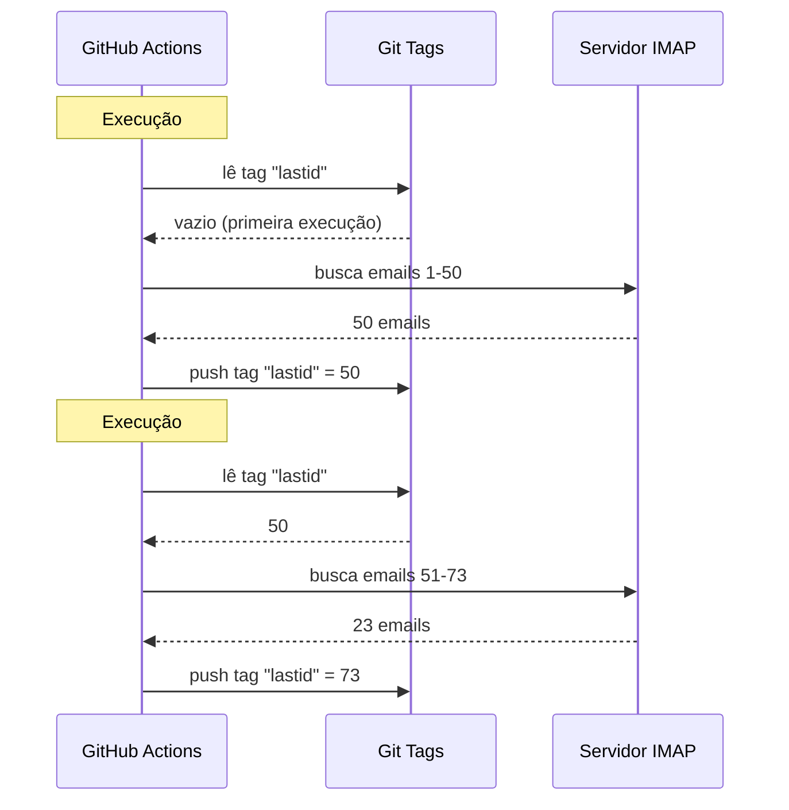

# Usei git como banco de dados pra rodar um bot de graça no GitHub Actions

Eu tenho um respondedor automático de email que roda 24/7.

Ele lê meus emails, entende do que se trata, e responde sozinho com uma IA. Ele se lembra de conversas anteriores. Ele ignora newsletters e `noreply@`. Ele encaminha pra um humano quando é complicado demais.

Custo mensal: **0€**.

Sem servidor. Sem VPS. Sem banco de dados. Só GitHub Actions e um hack doido: **usar git como banco de dados**.

Tá ligado? Não? Então segura essa, é idiota e genial ao mesmo tempo.

---

## O problema: GitHub Actions é stateless

GitHub Actions é grátis. Você pode rodar um cron a cada 5 minutos, executar seu código, de graça.

Mas tem um problema: é **stateless**.

Cada execução começa numa máquina limpa. Nada é salvo entre uma execução e outra. A execução anterior? Esquecida. Apagada. Como se nunca tivesse existido.

Pra um respondedor de email, isso é um problema enorme. Tipo:

> "Qual foi o último email que já processei?"

Se o bot esquecer disso a cada execução, ele vai ou responder aos mesmos emails em loop (catástrofe), ou perder emails.

É preciso um estado persistente. E normalmente, estado persistente = banco de dados. Mas um banco de dados é um servidor, e um servidor já não é grátis.

É aqui que a coisa fica interessante.

---

## A solução: git tags como banco de dados

Seu repositório GitHub já é armazenamento persistente. Grátis. Versionado. Sempre lá.

Então por que não armazenar o estado nele?

A ideia: a cada execução, o bot lê o último UID de email processado a partir de uma **git tag**. Ele processa os novos emails. Depois ele faz push da tag com o novo UID.



A tag git É o banco de dados. Um único valor, mas é tudo que precisamos.

### Ler o estado

No início do job, recuperamos o valor da tag:

```bash
git fetch origin --tags lastid || true
git show refs/tags/lastid:data/lastId > data/lastId || true
```

`git show refs/tags/lastid:data/lastId` significa: "me dá o conteúdo do arquivo `data/lastId` como estava na tag `lastid`".

Boom. Você tem seu valor, sem banco de dados.

### Escrever o estado

No final, recriamos a tag com o novo valor:

```bash
git switch --orphan lastid-tmp   # branch limpa sem histórico
git rm -rf .                      # limpa tudo
mkdir -p data
printf "%s\n" "${LAST_ID_CONTENT}" > data/lastId

git add data/lastId
git commit -m "lastId snapshot"
git tag -f lastid                 # força a tag neste commit
git push --force ...origin lastid # push da tag
```

Criamos uma branch **órfã** (sem histórico), colocamos só o arquivo `lastId`, commitamos, tagueamos, fazemos force push.

Por que órfã? Pra não acumular 10.000 commits de estado no histórico do repositório. Cada atualização sobrescreve a anterior. A tag sempre aponta pra UM único commit que contém UM único valor.

É limpo. É grátis. É completamente louco xD

---

## O segundo hack: o runtime snapshot

Tem outro problema com GitHub Actions: o `npm install`.

Se a cada execução (a cada 5 minutos) você fizer `npm install` + `npm run build`, você desperdiça 60-90 segundos toda vez. Num cron frequente, são minutos de computação jogados fora.

Solução: pré-compilar o código UMA vez, e armazenar numa tag git também.

O workflow de build (que roda quando você faz push na `master`) faz isso:

```bash
# compila o código
bun install
bun run build

# armazena dist/ + node_modules/ numa tag "runtime"
git checkout --orphan temp-runtime
git rm -rf .
cp -r "$TMPDIR"/* .
git add dist node_modules package.json bun.lock data
git commit -m "runtime build"
git tag -f runtime
git push --force ...origin runtime
```

A tag `runtime` contém o código compilado E os `node_modules`. Tudo pronto pra rodar.

E o cron faz checkout direto dessa tag:

```yaml
- name: Checkout runtime snapshot
  uses: actions/checkout@v4
  with:
    ref: refs/tags/runtime    # o código pré-compilado, não o fonte
    fetch-depth: 1

# sem npm install, sem build!
- name: Process emails
  run: node dist/index.js --action
```

Sem install. Sem build. O cron inicia instantaneamente e executa só `node dist/index.js`.

Tipo, você tem duas tags que fazem dois trabalhos:
- `runtime` = o código pronto pra rodar (atualizado quando você faz push)
- `lastid` = o estado persistente (atualizado a cada execução)

É elegante pra caramba.

---

## O bot em si: auto-respondedor IA

Beleza, o hack git é legal, mas o que o bot faz exatamente?

Ele lê seus emails via IMAP, entende eles com uma IA (Groq + Llama 3.3 70B), e responde automaticamente.

Arquitetura em serviços limpos com injeção de dependência (InversifyJS):

```
App
├── ImapService      → lê os emails (IMAP)
├── SmtpService      → envia as respostas (SMTP)
├── ParserService    → parseia o conteúdo dos emails
├── ReplyService     → gera a resposta IA
├── SummaryService   → memória de conversa
├── AccountsService  → gerencia múltiplas contas de email
└── ConfigService    → config / env vars
```

### Dois modos de funcionamento

O bot pode rodar de duas formas:

**Modo listener** (tempo real): conexão IMAP permanente com reconexão exponencial. Pra um VPS.

```typescript
this.imapService.on("exists", async (data) => {
  console.log(`[MAIL] Novo email! Total: ${data.count}`);
  // processa o novo email imediatamente
});
```

**Modo action** (batch): processa os novos emails a partir do `lastId`, depois encerra. Pro cron do GitHub Actions.

```bash
node dist/index.js --action
```

O modo `--action` é o que usa o hack git. Ele lê `lastId`, processa o que é novo, escreve o novo `lastId`, fim.

### NÃO responder pra robôs

Se seu bot responder a TODOS os emails, ele vai responder newsletters, notificações, `noreply@`. Catástrofe. Pior: se dois bots responderem um ao outro, você tem um loop infinito de emails. O pesadelo.

Então filtragem agressiva:

```typescript
export function isAutomatedSender(address) {
  const automatedPatterns = [
    "noreply", "no-reply", "donotreply",
    "mailer-daemon", "postmaster", "bounce",
    "newsletter", "notification", "marketing",
    "billing", "receipt", "promo", ...
  ];
  const local = address.split("@")[0].toLowerCase();
  return automatedPatterns.some(p => local.includes(p));
}
```

E também detecção pelos headers do email:

```typescript
export function isAutomatedByHeaders(headers) {
  return (
    ["bulk", "list", "junk"].includes(headers.precedence) ||
    headers["auto-submitted"] !== "no" ||
    headers["list-unsubscribe"] !== "" ||   // newsletters têm isso
    /mailchimp|sendgrid|mailgun|brevo/i.test(headers["x-mailer"])
  );
}
```

`List-Unsubscribe` nos headers? É newsletter. `Precedence: bulk`? É mass-mailing. `X-Mailer: Mailchimp`? Sacou. A gente ignora.

É como um segurança de balada: robôs não passam xD

### Os triggers mágicos

A IA pode decidir não responder, ou passar a bola pra um humano. Como? Com triggers especiais na resposta dela.

O prompt do sistema diz:

> Se for um email automático/newsletter → responde `<no_reply>`
> Se for muito importante/sensível (jurídico, financeiro...) → responde `<manual_reply_required>`
> Senão → escreve uma resposta de verdade

E o código lê isso:

```typescript
const aiReply = completion.choices[0].message.content.trim();
const manualTrigger = aiReply.includes(MANUAL_REPLY_TRIGGER);
const noReply = aiReply.includes(NO_REPLY_TRIGGER);

if (noReply) {
  console.log("[MAIL] A IA decidiu ignorar. Skip.");
  return;
}

if (manualTrigger) {
  console.log("[MAIL] Complicado demais, vou encaminhar pra um humano.");
  await this.smtpService.sendManualForward(...);
  return;
}

// senão envia a resposta da IA
await this.smtpService.sendReply(...);
```

Tipo, a IA tem o direito de dizer "não, nisso eu não vou mexer, chama um humano de verdade". É sabedoria.

---

## A memória de conversa

Um detalhe que faz toda diferença: o bot **se lembra** das conversas.

Quando ele responde alguém, ele salva um resumo da troca. Da próxima vez que essa pessoa escrever, o resumo é reinserido no prompt.

Armazenamento: um arquivo JSON por contato.

```
data/customers/
├── moi%40gmail.com/
│   ├── alice%40example.com.json
│   └── bob%40client.fr.json
```

E o resumo é ele mesmo gerado pela IA, que mescla o resumo antigo com a nova mensagem:

```typescript
const completion = await groq.chat.completions.create({
  model: "llama-3.3-70b-versatile",
  messages: [
    { role: "system", content: "Você é um assistente de memória. Mescle o resumo antigo com a nova mensagem sem perder informação." },
    { role: "user", content: `Resumo existente:\n${existing}\n\nNova mensagem:\n${incomingContent}` }
  ],
  temperature: 0.0,  // determinístico, sem criatividade
  max_tokens: 800,
});
```

Então o bot constrói uma memória comprimida ao longo do tempo. Sem precisar armazenar todos os emails, só um resumo que cresce inteligentemente.

E esses arquivos JSON? Bem... eles também são armazenados no git, na tag runtime. Git em todo lugar xD

---

## O truque esperto com o tamanho do prompt

Pequeno detalhe técnico que me fez sorrir.

Os modelos têm um limite de tokens. Se seu email + o resumo + o prompt de persona ultrapassarem, a API retorna um erro.

O código lida com isso com uma **truncagem em cascata** + retry:

```typescript
try {
  // primeira tentativa com limites normais
  completion = await groq.chat.completions.create({...});
} catch (error) {
  if (!this.isLengthError(error)) throw error;

  // foi um erro de tamanho: tenta de novo com limites mais apertados
  ({ systemContent, userContent } = this.buildPromptPayload({
    ...,
    limits: {
      systemPromptChars: 2200,  // em vez de 3000
      summaryChars: 1800,       // em vez de 4000
      personaChars: 900,        // em vez de 1500
      userContentChars: 2200,   // em vez de 8000
    },
  }));
  completion = await groq.chat.completions.create({...});  // retry
}
```

Se não passar, corta mais curto e tenta de novo. Simples, eficaz, sem crash.

---

## Beleza, e na prática, como funciona?

O fluxo completo de uma execução do cron:

```
1. GitHub Actions é disparado (cron a cada 5 min)
2. Checkout da tag "runtime" (código pré-compilado)
3. git show refs/tags/lastid → recupera o último UID processado
4. node dist/index.js --action
   ├── conexão IMAP
   ├── busca dos emails a partir de lastId+1
   ├── pra cada email :
   │   ├── parseia o conteúdo
   │   ├── filtra robôs (pula se for automated)
   │   ├── identifica a conta de destino
   │   ├── recupera a memória de conversa
   │   ├── gera a resposta IA (Groq)
   │   ├── <no_reply> ? pula
   │   ├── <manual_reply_required> ? encaminha pra humano
   │   ├── senão : envia a resposta (SMTP)
   │   └── atualiza a memória de conversa
   └── escreve o novo lastId
5. git push --force tag "lastid" com o novo valor
```

E recomeça em 5 minutos. Pra sempre. De graça.

---

**Os 3 takeaways:**

1. **Git = banco de dados grátis** -- Uma tag órfã pode armazenar seu estado persistente entre duas execuções stateless. `git show refs/tags/X:arquivo` pra ler, force-push pra escrever. Sem precisar de DB.

2. **Pré-compilação numa tag runtime** -- Em vez de `npm install` a cada execução do cron, armazena o código compilado + node_modules numa tag git. O cron inicia instantaneamente.

3. **Um bot IA precisa saber calar a boca** -- Os triggers `<no_reply>` e `<manual_reply_required>` deixam a IA decidir não responder ou passar a bola. Mais o filtro anti-robô. Senão você cria um loop infinito de emails.

Serverless cron com estado persistente, IA, memória, tudo por 0€/mês. É completamente louco e eu adoro xD
