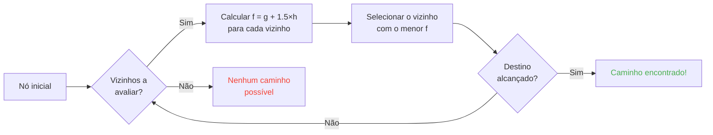

## Introdução

Passei horas assistindo ovelhas batendo em paredes.

E sinceramente? Melhor investimento da minha vida xD

Porque quanto mais você observa esses mobs, mais percebe que não há nada de aleatório. Cada movimento é codificado, previsível e, acima de tudo -- completamente quebrável. Acabei mergulhando no código fonte do Minecraft para entender exatamente como o pathfinding funciona, e o que descobri é que você pode literalmente fazer mind-control nos mobs. Tipo, forçá-los a ir para onde VOCÊ quer, não para onde o acaso decide.

Este guia é tudo que aprendi fuçando. A IA, o algoritmo A*, as penalidades ocultas, os exploits que você pode usar no survival. Prepara sua picareta.

---

## Como funciona a IA dos mobs (spoiler: é bizarra)

### Os Goals

Cada mob tem *goals*. É uma lista de coisas que ele PODE fazer e o quanto ele QUER fazê-las. Quanto menor o número, mais prioritário -- como uma lista de tarefas versão caos.

```java
protected void registerGoals() {
   this.goalSelector.addGoal(4, new Zombie.ZombieAttackTurtleEggGoal(this, 1.0, 3));
   this.goalSelector.addGoal(8, new LookAtPlayerGoal(this, Player.class, 8.0F));
   this.goalSelector.addGoal(8, new RandomLookAroundGoal(this));
   this.addBehaviourGoals();
}
```

Já viu um zumbi ignorar um ovo de tartaruga para correr atrás de você? É por isso: `ZombieAttackTurtleEggGoal` tem prioridade 4, enquanto `ZombieAttackGoal` (a parada que manda ele te morder a cara) está na prioridade 2.

Sim, um zumbi prefere te comer a quebrar um ovo. Que amor xD

O goal que realmente nos interessa é o `WaterAvoidingRandomStrollGoal`, prioridade 7. O goal "não tenho nada pra fazer então vou andar aleatoriamente". É aí que a bagunça começa.

### O movimento (ou "como um random walk tem 1 chance em 60 de acontecer")

A cada tick (a cada 0.05 segundos), o jogo chama `canUse()` pra ver se o mob digna-se a se mover. 1 chance em 60 a cada tick. Um design completamente doido, e eu adoro isso.

```java
public boolean canUse() {
   if (this.mob.hasControllingPassenger()) {
      return false;
   } else {
      if (!this.forceTrigger) {
         if (this.checkNoActionTime && this.mob.getNoActionTime() >= 100) {
            return false;
         }
         if (this.mob.getRandom().nextInt(reducedTickDelay(this.interval)) != 0) {
            return false;
         }
      }
      Vec3 $$0 = this.getPosition();
      if ($$0 == null) {
         return false;
      } else {
         this.wantedX = $$0.x;
         this.wantedY = $$0.y;
         this.wantedZ = $$0.z;
         this.forceTrigger = false;
         return true;
      }
   }
}
```

Resumindo: se você está montado no mob -> não, se o mob não fez nada por 5 segundos -> não, se o random disse não -> não. O jogo REALMENTE não quer que o mob se mexa.

Mas quando ele se mexe, `getPosition()` entra em ação:

```java
protected Vec3 getPosition() {
   if (this.mob.isInWater()) {
      Vec3 $$0 = LandRandomPos.getPos(this.mob, 15, 7);
      return $$0 == null ? super.getPosition() : $$0;
   } else {
      return this.mob.getRandom().nextFloat() >= this.probability
         ? LandRandomPos.getPos(this.mob, 10, 7)
         : super.getPosition();
   }
}
```

Repara nesses dois números no final: é o raio XZ e o raio Y. Na água, o mob procura mais longe (15 em vez de 10). Se não encontrar terra, ele recorre ao `super.getPosition()` que aceita água. **Resultado: os mobs QUEREM sair da água.** É por isso que seus animais nadam feito loucos em direção à borda.

Detalhe suculento: tem literalmente 0.1% de chance do mob pegar `super.getPosition()` em vez de `LandRandomPos`. Um em mil. Mojang né xD

### LandRandomPos: a otimização porcaria que muda tudo

Essa é a MINHA etapa favorita. A maior cagada técnica que torna o pathfinding explorável.

```java
public static Vec3 getPos(PathfinderMob $$0, int $$1, int $$2, ToDoubleFunction<BlockPos> $$3) {
   boolean $$4 = GoalUtils.mobRestricted($$0, $$1);
   return RandomPos.generateRandomPos(() -> {
      BlockPos $$4xx = RandomPos.generateRandomDirection($$0.getRandom(), $$1, $$2);
      BlockPos $$5 = generateRandomPosTowardDirection($$0, $$1, $$4, $$4xx);
      return $$5 == null ? null : movePosUpOutOfSolid($$0, $$5);
   }, $$3);
}
```

`movePosUpOutOfSolid`. O nome diz tudo. Se a posição escolhida está dentro de um bloco sólido, o jogo empurra ela pra cima até que esteja no ar.

É uma otimização: em vez de perder tempo ignorando posições subterrâneas, o jogo as leva de volta à superfície. Esperto? Sim. Mas cria um viés absurdo: **os mobs preferem altitudes mais altas**.

Imagina. Você tem vários blocos abaixo da superfície, o jogo gera 10 posições aleatórias. As que estão em blocos são empurradas pra cima. Áreas densas (debaixo de um morro) produzem mais posições válidas que áreas vazias. Resultado: o mob vai estatisticamente mais vezes em direção ao morro.

Confia em mim, vamos quebrar isso em 2 minutos.

### A seleção: o concurso do melhor bloco

10 posições, um só vencedor, um concurso de pontuação:

```java
public static Vec3 generateRandomPos(Supplier<BlockPos> $$0, ToDoubleFunction<BlockPos> $$1) {
   double $$2 = Double.NEGATIVE_INFINITY;
   BlockPos $$3 = null;
   for(int $$4 = 0; $$4 < 10; ++$$4) {
      BlockPos $$5 = (BlockPos)$$0.get();
      if ($$5 != null) {
         double $$6 = $$1.applyAsDouble($$5);
         if ($$6 > $$2) {
            $$2 = $$6;
            $$3 = $$5;
         }
      }
   }
   return $$3 != null ? Vec3.atBottomCenterOf($$3) : null;
}
```

A posição com a melhor pontuação GANHA. E se conhecemos os critérios de pontuação, podemos fazer a posição que queremos ganhar. É como fraudar uma eleição.

---

## As preferências dos mobs (ou "por que sua vaca atravessa a rua")

Cada mob tem gostos diferentes. E isso muda tudo.

| Mob | Curti isso |
| --- | --- |
| **Animais** (vacas, ovelhas, porcos) | Grama e luz (hipsters) |
| **Monstros** (zumbis, esqueletos) | Escuridão (edgelords) |
| **Tartarugas** | Água, senão areia, senão luz |
| **Hoglins** | `crimson_nylium`; odeiam `warped_fungus` |
| **Striders** | Só lava. NADA mais. |
| **Silverfish** | Blocos infestáveis (lógico) |
| **Guardians** | Água + luz (os snobs) |
| **Mooshrooms** | Micélio + luz (cogumelos) |
| **Abelhas** | Ar. Sim, elas preferem o AR. |

```java
// Animal: olha pra baixo, se for grama, pontuação máxima
public float getWalkTargetValue(BlockPos $$0, LevelReader $$1) {
   return $$1.getBlockState($$0.below()).is(Blocks.GRASS_BLOCK) ? 10.0F : $$1.getPathfindingCostFromLightLevels($$0);
}

// Monstro: exatamente o oposto
public float getWalkTargetValue(BlockPos $$0, LevelReader $$1) {
   return -$$1.getPathfindingCostFromLightLevels($$0);
}
```

Tipo, os monstros é literalmente "se tá iluminado, pontuação negativa, vou pra outro lugar". Eles FAZEM CARA FEIA pra luz xD

Então você pode -- literalmente -- guiar seus animais com grama e luz, e seus monstros com escuridão. É bizarro e genial ao mesmo tempo.

---

## O algoritmo A* no Minecraft (a fórmula secreta)

Minecraft usa o algoritmo A* (A-star) para pathfinding. Mas a Mojang colocou seu toque:

```
f(n) = g(n) + 1.5 × h(n)
```

- **g(n)** = o caminho já percorrido (1 por bloco, ~1.41 na diagonal)
- **h(n)** = a distância em linha reta
- **1.5** = porque a Mojang gosta de coisas meio quebradas

Normalmente A* usa `f(n) = g(n) + h(n)`. A MOJANG ADICIONOU UM FATOR 1.5. Por quê? Pra fazer o algoritmo ir mais rápido ao destino e cortar menos ramos de busca. Resultado: o caminho encontrado é "bom" mas nem sempre o melhor. É um A* meio bêbado.



Detalhe importante: **um mob só pode pathfindar até 16 blocos** (sua *follow range*). Se o destino está muito longe, ele escolhe o bloco mais próximo que CONSEGUE alcançar. Isso significa que você pode criar um monólito fora de alcance, e o mob vai pathfindar até o bloco mais próximo que o aproxime desse monólito -- tornando seus movimentos completamente previsíveis.

### Os dois exploits que quebram o jogo

#### 1. Block updates = recálculo forçado

```java
public boolean shouldRecomputePath(BlockPos $$0) {
   if (this.hasDelayedRecomputation) return false;
   if (this.path != null && !this.path.isDone() && this.path.getNodeCount() != 0) {
      Node $$1 = this.path.getEndNode();
      Vec3 $$2 = new Vec3(
         ((double)$$1.x + this.mob.getX()) / 2.0,
         ((double)$$1.y + this.mob.getY()) / 2.0,
         ((double)$$1.z + this.mob.getZ()) / 2.0
      );
      return $$0.closerToCenterThan($$2, (double)(this.path.getNodeCount() - this.path.getNextNodeIndex()));
   }
   return false;
}
```

Cada atualização de bloco perto do caminho do mob força um recálculo do A* com um cooldown de 1 segundo. Você coloca um clock de 1 segundo perto de um mob, e ele recalcula o caminho CONSTANTEMENTE. É o equivalente a colocar um GPS que reseta a cada segundo.

E se você fizer isso com 50 mobs ao mesmo tempo? Lag city. RIP TPS.

#### 2. As penalidades de blocos (Pathfinding Malus)

Certos blocos assustam os mobs. Literalmente. Cada bloco tem um custo associado, definido por uma enumeração:

| Bloco / Condição | Penalidade |
| --- | --- |
| **Bloco de mel** | +8 para atravessar |
| **Neve fofa** | Intransponível |
| **Portas fechadas** | Intransponível |
| **Fogo** | +16 para atravessar, +8 para margear |
| **Animais & Aldeões** | Fogo = -1 (NOPE) |
| **Cactos / Sweet berry** | Intransponível; adjacente = +8 |
| **Água** | +8 para atravessar ou margear |
| **Magma** | +8 para margear (dói) |

Os animais são ainda mais extremos:

```java
protected Animal(EntityType<? extends Animal> $$0, Level $$1) {
   super($$0, $$1);
   this.setPathfindingMalus(PathType.DANGER_FIRE, 16.0F);
   this.setPathfindingMalus(PathType.DAMAGE_FIRE, -1.0F);
}
```

DAMAGE_FIRE em -1.0F é literalmente "proibido". Um animal prefere se jogar no vazio a atravessar fogo. Ufa.

### Exercício: o grande concurso de caminhos

Imagina um aldeão que precisa escolher entre vários caminhos.

- **Caminho A**: 15 blocos mas 6 blocos margeiam água (+8 cada)
- **Caminho B**: 18 blocos com 2 blocos de água (+8) e 1 bloco adjacente de água (+8)
- **Caminho C**: 14 blocos em linha reta... mas com fogo -> INTRANSPONÍVEL para um aldeão
- **Caminho D**: 16 blocos com 1 bloco adjacente de magma (+8) + 1 bloco adjacente de mel (+8)
- **Caminho E**: 25 blocos mas com cactos em tudo (+8 em tudo) -> 90.82 de custo total LOL

Cálculo mental:

- Caminho A: 15 blocos + 6×8 pela água = 15 + 48 = **63** ... mas tem o 1.5×distância para somar. Vamos fazer os cálculos de verdade.
- Caminho B: mais longo mas menos penalidades. O custo total = distância acumulada + penalidades.
- Caminho D: magma e mel acumulam suas penalidades.

O vencedor geralmente é o **Caminho B**: o desvio vale a pena porque a água é CARA.

Um aldeão é essencialmente uma calculadora de custos com pernas xD

### Cada mob tem seus gostos

Um aldeão: "fogo? NÃO OBRIGADO TCHAU"
Um zumbi: "fogo? OK boomer *atravessa em chamas*"

Você tem literalmente rotas que alguns mobs pegam e outros não. Dá pra fazer autoestradas de aldeões onde zumbis se queimam.

---

## Os aldeões: a bagunça suprema

Ok, os aldeões. É A parada menos compreendida de todo Minecraft. Mas quando você pega o código, percebe que são máquinas previsíveis com horário comercial.

### Sensores e memórias

9 sensores, que rodam a cada 20 ticks (1 segundo). Cada um escaneia um raio em volta do aldeão e armazena o resultado na memória. O aldeão vê tudo, lembra de tudo, e age de acordo.

Tipo: "tem um inimigo? um item no chão? um jogador com quem falar?" -- ele checa TUDO.

### Os packages (suas fases do dia)

O cérebro de um aldeão são packages de atividade que ativam conforme a hora:

| Package | Horário | O aldeão... |
| --- | --- | --- |
| **Core** | 24h | Abre portas, nada (80% do tempo), e ADQUIRE POI |
| **Work** | 8h-15h | "Vou trabalhar" -- anda até seu posto |
| **Meet** | 15h-17h | "Happy hour!" -- vai ao sino, papeia |
| **Rest** | 18h-6h | "Preciso dormir" -- vai pra cama |
| **Idle** | 6h-8h, 17h-18h | "Vagabundear" -- passeia, faz bebês, pula nas camas |
| **Panic** | Ferimento/hostil | "SOCORRO" -- FUGE |

O package **Panic** é o único que pode interromper TODOS os outros. Mesmo se o aldeão estiver dormindo ou trabalhando, se tem um zumbi, PÂNICO GERAL.

### Acquire POI: a parada que permite redstone sem fio

```java
Set<Pair<Holder<PoiType>, BlockPos>> $$12 = (Set)$$10xx.findAllClosestFirstWithType(
   $$0, $$11, $$8x.blockPosition(), 48, PoiManager.Occupancy.HAS_SPACE
)
```

`Acquire POI` escaneia num raio de 48 blocos todos os POI (pontos de interesse). Ele guarda os 5 mais próximos, verifica se existe um caminho, e adquire o primeiro acessível.

Cada POI tem um número limitado de vagas:
- **Postos de trabalho**: 1 vaga
- **Camas**: 1 vaga
- **Sinos**: 32 vagas

A parada LOUCA: **a vaga é reservada no momento da aquisição, NÃO na chegada**. Um aldeão pode travar um composter do outro lado do mapa, sem nunca alcançá-lo.

Saca o potencial?

### Redstone sem fio. Sim, SEM FIO.

1. Você coloca um aldeão num minecart com um caminho até um composter
2. Ele adquire o composter (vaga ocupada, ninguém mais pode usar)
3. O aldeão está longe demais para clicar nele -- a bone meal fica
4. Você LEVA esse aldeão pra qualquer lugar do mundo, ele mantém a vaga
5. Quando você quer ativar seu negócio, você M A T A o aldeão
6. A vaga é liberada, outro aldeão adquire o composter, retira a bone meal
7. BLOCK UPDATE -> qualquer circuito de redstone ativado

Você literalmente criou um sinal de redstone sem fio, transmissível em todo o mundo, com zero chunk load necessário no caminho. Dá pra conectar isso numa ender pearl stasis chamber, se teletransportar de qualquer lugar matando um aldeão.

Minha utilização favorita? Um minigame "bounty hunter": você coloca vários aldeões com composters, o jogador precisa matar O ALDEÃO CERTO para ativar a saída. É uma mecânica completamente wtf xD

### O Pathfinding Deadlock (ou "o aldeão que congela pra sempre")

Tem um bug BOA demais entre o `Acquire POI` (que vê um caminho) e a navegação real (que se recusa a usá-lo). Acontece quando o bloco acima do posto de trabalho não é caminhável. Resultado:

- Core package: "quero adquirir o POI"
- Navegação: "não consigo andar aí"
- Resultado: o aldeão fica CONGELADO, pra sempre, lutando consigo mesmo.

Literalmente aldeões frozen no lugar, utilizáveis como decoração ou como "props" em builds. Um tank de armadura parado? Sim. Um guarda que não se mexe? Sim. Macabro? Talvez. Mas eficaz xD

---

## Conclusão

O pathfinding dos mobs do Minecraft não é aleatório. É um sistema determinístico, baseado em pontuações, previsível E quebrável.

**As três coisas pra guardar:**

1. **Blocos sob os pés = viés de altura** -- preencha ou esvazie o subsolo para guiar os mobs
2. **As penalidades são diferentes para cada mob** -- crie rotas que alguns pegam e outros não
3. **As vagas de POI são reservadas à distância** -- redstone sem fio gratuita, teleporte, tudo isso

O código fonte do Minecraft é uma mina de ouro de mecânicas sub-exploradas. Passei horas lendo Java descompilado e sinceramente? Cada linha é um Easter Egg funcional. Só que esses, você usa no survival pra fazer redstone sem fio com aldeões. Melhor jogo confirmado.

xD
