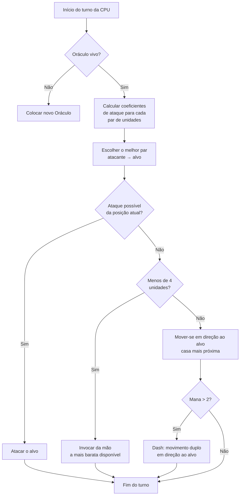

## Minha IA idiota para Nausicaa

Tem projetos que começam com "e se eu fizesse um jogo de xadrez com mitologias?" e terminam com uma IA que decide seus próprios hiperparâmetros a cada 5 turnos.

Nausicaa é isso. Um jogo de tabuleiro em turnos onde você constrói seu deck de criaturas mitológicas, gerencia seu mana, implanta unidades em um tabuleiro 10x8. E tem uma IA que tem crises de personalidade.

Passei um bom tempo nessa IA, e o resultado é bem ingerenciável xD

## O jogo de verdade

Antes de falar do cérebro, precisa entender o corpo:

- Tabuleiro 10x8, zona de implantação de 2 fileiras por jogador
- Mana começa em 1, +1 por turno, máx 6. Você gasta para invocar, atacar, usar habilidades
- Objetivo: matar o Oráculo adversário

12 unidades, custos e padrões de movimento diferentes:

| Unit | Custo | Movimento | PV |
| --- | --- | --- | --- |
| Oráculo | 0 | Rei (8 direções) | 1 |
| Goblin | 1 | Frente 3 casas | 1 |
| Harpia | 1 | Rei (8 direções) | 1 |
| Náiade | 1 | Diagonal | 1 |
| Grifo | 2 | Pular 2 casas | 2 |
| Sereia | 2 | Lateral | 1 |
| Centauro | 2 | Cavalo (em L) | 2 |
| Arqueiro | 3 | Lateral | 1 |
| Fênix | 3 | Diagonal (casas escuras) | 1 |
| Metamorfo | 4 | Troca de lugar | 1 |
| Vidente | 4 | Nenhum (gera mana) | 1 |
| Titã | 6 | Limitado (ataque em área) | 3 |

Cada unidade tem seu próprio padrão de ataque. A Sereia ataca nas 4 diagonais, o Arqueiro à distância em 3 casas, o Titã destrói tudo ao redor na invocação. Enfim, um jogo de xadrez com mitologias e deckbuilding xD

## Como fiz a CPU pensar

A ideia básica é idiotamente simples: **cada unidade inimiga tem um coeficiente de atratividade**. Quanto mais perigosa, mais a IA quer cuidar dela.

```javascript
const UNITS_ATTRACTIVENESS = {
    "oracle": 100,
    "titan": 95,
    "shapeshifter": 90,
    "phoenix": 80,
    "siren": 70,
    "archer": 70,
    "seer": 70,
    "griffin": 60,
    "centaur": 60,
    "harpy": 50,
    "naiad": 30,
    "gobelin": 20
};
```

Oráculo em 100 -- lógico, é a condição de vitória. Titã em 95 porque ele dá OS em tudo ao lado na invocação. Goblin em 20, é um soldado raso, tanto faz.

Em seguida, para cada par de unidades (uma aliada, uma inimiga), calculo:

```
interesse = atratividade × coeff_atrat / (distância × coeff_dist)
```

Resumindo: quanto mais perigoso e próximo, mais a IA quer te destruir.

```javascript
calculateAttackCoefficient(x1, y1, x2, y2) {
    const distance = this.calculateEuclideanDistance(x1, y1, x2, y2);
    if (distance === 0) return Infinity;
    return (UNITS_ATTRACTIVENESS[unit.type] * COEFFICIENTS_IMPORTANCE["attractiveness"]) / distance;
}
```

### A jogada dos coeficientes que mudam

O engraçado é que os coeficientes de importância **mudam aleatoriamente a cada 5 turnos**.

```javascript
if (this.turnCount % 5 === 0) {
    const distanceCoefficient = parseInt(Math.random() * 100);
    const attractivenessCoefficient = parseInt(Math.random() * 100);
    this.regulateImportanceCoefficients({
        distance: distanceCoefficient,
        attractiveness: attractivenessCoefficient
    });
}
```

Uma hora a IA vai hiper agressiva (atratividade em 95, distância em 5), ela atravessa tudo para matar seu Oráculo. Na próxima ela prioriza a distância e se reposiciona.

É tirado dos fantasmas do Pac-Man -- Blinky persegue, Pinky embosca. Aqui a IA muda de "personalidade" a cada fase.

**Resultado: impossível prever a IA durante uma partida inteira. A CPU nunca faz duas vezes a mesma partida.**

### O Oráculo é um covarde

O Oráculo inimigo foge. Literalmente.

```javascript
const awayFromTarget = {
    row: Math.max(0, Math.min(7, botUnitElement.row + (botUnitElement.row - targetUnitElement.row))),
    col: Math.max(0, Math.min(9, botUnitElement.col + (botUnitElement.col - targetUnitElement.col)))
};
```

Ele calcula a direção oposta à ameaça e vaza. Se tem uma parede, ele procura a casa livre mais próxima nessa direção.

Você passa 3 turnos se aproximando do Oráculo, e puf ele fugiu que nem um covarde xD

### O loop de decisão

Eis como a IA decide:

1. Se não tenho mais Oráculo (morto), colocar um novo
2. Calcular o coeficiente para cada par unidade aliada → unidade inimiga
3. Escolher o melhor par
4. Se a unidade pode atacar o alvo da sua posição → ataque
5. Se tenho menos de 4 unidades → invocar a mais barata disponível da mão
6. Senão, mover-se em direção ao alvo (casa de movimento mais próxima do inimigo)
7. Se mana suficiente (> 2), dash (movimento duplo) para se aproximar ainda mais
8. Se a unidade é o Oráculo → fugir



```javascript
async makeAction(dash=false) {
    // tudo isso em sequência
    // a CPU dá dash se tiver mana suficiente
    if(botPlayer.mana > 2) {
        this.makeAction(true);
    }
}
```

### Por que distância euclidiana

Uso distância euclidiana:

```javascript
calculateEuclideanDistance(x1, y1, x2, y2) {
    const deltaX = Math.pow(x1 - x2, 2);
    const deltaY = Math.pow(y1 - y2, 2);
    return Math.sqrt(deltaX + deltaY) * COEFFICIENTS_IMPORTANCE["distance"];
}
```

Por que não Manhattan? Porque as unidades têm padrões de movimento variados (L como o cavalo, diagonal, etc). A distância em linha reta é uma melhor aproximação do perigo.

## Por que não minimax

Eu poderia ter codificado um minimax clássico. Mas com 12 tipos de unidades, padrões de movimento diferentes, habilidades especiais... a árvore de jogo explode tão rápido que fica injogável. A abordagem heurística faz escolhas inteligentes sem explorar 10 milhões de estados.

## O que é legal

O sistema de atratividade cria dilemas engraçados:

- O Vidente (70) gera mana. Se você deixá-lo vivo, o adversário tem mais recursos. Mas o Titã (95) é ainda mais perigoso.
- O Metamorfo (90) pode trocar de lugar com qualquer unidade. Ele pode roubar seu Oráculo.
- A Harpia (50) tem um ataque explosivo que também a mata. Não prioritária... até que ela esteja ao lado de 3 das suas unidades.

A IA avalia o perigo global de acordo com as posições, não apenas as estatísticas brutas.

Tem também uma função `activateSimulation()` para testar cenários sem refazer uma partida:

```javascript
activateSimulation() {
    // Coloca unidades específicas no tabuleiro
    // Útil para debuggar a IA
    this.game.board = simulation.board;
    this.game.players = simulation.players;
}
```

## O que falta

Se tivesse mais tempo:

- A IA reage ao estado atual, não prevê o que o jogador vai fazer
- Ela não planeja a mão em vários turnos
- O Metamorfo e o Centauro têm habilidades que ela subutiliza
- Aprendizado por reforço: fazê-la jogar contra si mesma para ajustar os coeficientes

Mas para um jogo de navegador cumpre o papel. Uns amigos conseguem perder pra ela, então tá bom xD

## Teste

Disponível em [nausicaa-game.github.io](https://nausicaa-game.github.io/). Você clica em "JOGAR", CPU mode ON, e assiste a IA agir.

Dica: deixe a IA jogar contra si mesma. Você vai ver fases agressivas, e puf ela recua tudo.

O código está no [GitHub](https://github.com/nausicaa-game/nausicaa-game.github.io) em `js/cpu.js`.

**3 coisas:**

1. **Coeficientes heurísticos** -- sem minimax, cada unidade tem uma atratividade
2. **Coeficientes que mudam a cada 5 turnos** -- a IA alterna agressividade e controle, estilo Pac-Man
3. **O Oráculo foge** -- ele calcula a direção oposta à ameaça e vaza

Se você tem ideias para deixar a IA ainda mais perversa, abra uma issue. Tenho planos para uma versão que aprende com suas derrotas, mas isso fica para um próximo artigo xD
