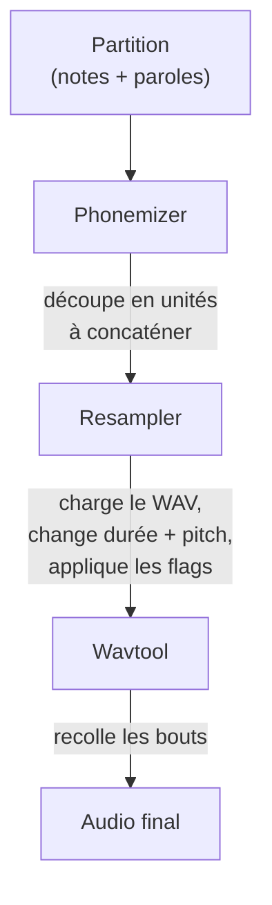

## UTAU : como um software em Visual Basic 6 democratizou a voz sintética

Eu já mencionei isso na minha página principal: eu amo UTAU. Aqui está o porquê.

Em 2008, se você queria fazer uma voz sintética cantar, tinha uma opção: VOCALOID. O software da Yamaha. Caro, proprietário, com vozes oficiais que você não podia criar sozinho.

E então um cara japonês, Ameya/Ayame, lançou uma coisa do nada. Um software codificado em **Visual Basic 6**. Gratuito. Que deixava você criar sua própria voz com... arquivos WAV que você mesmo gravava.

Essa coisa se chama **UTAU** (歌う, "cantar" em japonês). E para sua época, era mágica.

Eu sempre achei esse software fascinante. Não porque era tecnicamente limpo (spoiler: na verdade, tinha que pensar muito pra criar essa bagunça... é uma bela zona), mas porque ele fez uma coisa que ninguém mais fazia: ele deu a síntese vocal para o grande público. Tipo você, eu, qualquer um com um microfone.

Deixe-me explicar por que isso era genial.

---

## Primeiro, por que a síntese de canto é complicada

Uma voz cantada não são notas. Tem a consoante que ataca, a vogal que sustenta, a respiração, as transições entre as duas. O "sa" de "salut" é um "s" que sibila e desliza para um "a" aberto, e é esse deslize que soa humano ou não.

Hoje resolvemos isso com deep learning: você treina um modelo em horas de canto e ele gera a voz (Synthesizer V, DiffSinger). Mas isso é 2020+. Em 2008, nada.

UTAU usa o método anterior, mais antigo e mais esperto: a **síntese concatenativa**.

---

## Síntese concatenativa: copiar-colar de pedaços de voz

A ideia é simples: você grava pequenos pedaços de voz e os cola para formar palavras. "salut" = amostra "sa" + "lu" + "to", encadeados. Um quebra-cabeça sonoro guiado por uma partitura.

É o princípio dos YouTube Poop onde recortam as palavras de um personagem para fazê-lo dizer qualquer coisa -- só que aqui é organizado e automatizado.

E UTAU vem literalmente daí. Antes dele existia o **"Jinriki Vocaloid"** (人力ボーカロイド, "Vocaloid manual"): pessoas cortavam manualmente faixas vocais, extraíam os fonemas, repitchavam, e remontavam tudo em um editor de áudio para imitar uma voz VOCALOID. Manualmente. Imagina o trabalho.

Ameya viu essa dificuldade e codificou a ferramenta para automatizar. No início, UTAU era só isso: um assistente para Vocaloid manual.

---

## Por que era revolucionário: VOCÊ cria a voz

Eis o que muda tudo.

VOCALOID, você comprava uma voz. Miku, Luka, etc. Criadas por profissionais, vendidas pela Yamaha. Sem chance de fazer uma você mesmo. UTAU, **qualquer um grava sua própria voz e a transforma em um instrumento cantante**.

O modo CV (o mais simples) é: você grava as ~100 sílabas básicas do japonês ("a", "ka", "sa", "ta"...), configura os pontos de corte, e pronto, sua voicebank. Algumas horas de trabalho.

Resultado: o ecossistema explodiu. Milhares de voicebanks criadas pela comunidade -- vozes de fãs, de amigos, de personagens inventados. Um universo inteiro de cantores virtuais, gratuito. E o software vinha com **Defoko** (Utane Uta), uma voz padrão gerada pelo motor TTS AquesTalk, então você podia começar mesmo sem microfone.

---

## O oto.ini: o coração do sistema

Como o UTAU sabe onde cortar e colar os sons? Através de um arquivo de configuração por voicebank: o **`oto.ini`**. Para cada WAV, ele define os pontos de corte (em milissegundos):

- **Offset** → silêncio para remover no início
- **Preutterance** → o ponto onde a consoante passa para a vogal (a fronteira "s"→"a" em "sa")
- **Overlap** → quanto a nota anterior se sobrepõe a esta
- **Fixed region** → a parte que NÃO deve ser esticada em uma nota longa (tipicamente a consoante)
- **Cutoff** → onde cortar o final

A **preutterance** é o parâmetro mais esperto. Uma sílaba sempre tem um pedaço de consoante antes da vogal. Para que sua nota caia no tempo, é a *vogal* que deve cair exata, não a consoante. Então o UTAU desloca a amostra para trás: o "a" de "sa" cai no tempo, o "s" transborda um pouco antes. Como um baterista que antecipa a batida para que o som caia no lugar certo -- só que aqui está em um `.ini`.

Visualmente, em uma amostra "ka", as zonas do `oto.ini` se dividem assim:

```mermaid
flowchart LR
    A["🔇 silence<br/>(offset)"] --> B["🅺 consonne<br/>(fixed region,<br/>pas étirée)"]
    B --> C["🅰 voyelle<br/>(zone étirable)"]
    C --> D["🔇 fin coupée<br/>(cutoff)"]
    style B fill:#3b4a6b
    style C fill:#5b3b6b
```



A fronteira entre a consoante e a vogal é a preutterance. A vogal é a zona que se estica para notas longas; a consoante permanece intacta, senão seu "k" duraria dois segundos e soaria horrível.

```ini
# oto.ini (simplifié)
# fichier=alias,offset,consonant,cutoff,preutterance,overlap
_ka.wav=ka,120,80,-200,90,40
```

Cinco valores por som, em todas as suas amostras, e o UTAU monta qualquer palavra corretamente.

---

## CV, VCV, CVVC: a corrida pelo realismo

O modo básico, **CV** (Consoante-Vogal), é um som por sílaba. Simples mas um pouco robótico: as junções entre sílabas são brutas.

Em 2010 a comunidade inventa o **VCV** (Vogal-Consoante-Vogal). Em vez de gravar "ka" sozinho, você grava "a ka" -- com o final da vogal anterior. A transição se torna natural porque está *dentro* da gravação, não calculada depois.

O detalhe que dói: **VOCALOID não teve VCV antes do VOCALOID3, em 2011.** O freeware em VB6 codificado por um cara sozinho superou a Yamaha em um ano no realismo das transições. Uma comunidade de fãs mais rápida que a multinacional.

Depois vieram o **CVVC**, o **ARPAsing** (inglês), o **VCCV**... cada método empurrando o realismo mais longe, todos inventados e documentados pela comunidade.

---

## O pipeline completo: como uma palavra se torna som

Quando você coloca uma nota e digita uma letra, eis o que acontece nos bastidores:



O **resampler** é a peça central: ele pega sua amostra "ka" gravada em uma determinada altura e a redimensiona/repitcha para corresponder à nota desejada -- esticando apenas a zona esticável e mantendo a consoante intacta (daí o `oto.ini`).

E ele é **modular**. UTAU vinha com um resampler básico, mas a comunidade criou outros (moresampler, TIPS...), cada um com seu timbre sonoro. Você trocava o motor de síntese como um plugin. Em 2008. Em um freeware.

---

## A bagunça por baixo do capô (e por que é cativante)

É preciso ser honesto sobre o estado técnico da coisa:

- **Codificado em Visual Basic 6.** Uma linguagem já morta em 2008. Precisa do runtime VB6 para rodar.
- **Windows only originalmente** (a versão Mac, UTAU-Synth, veio em 2011).
- **Codificação Shift-JIS obrigatória.** Se seus arquivos não estiverem codificados em Shift-JIS japonês, UTAU não entende nada. Ainda hoje é preciso frequentemente colocar o PC em localidade japonesa ou usar AppLocale para executá-lo.
- **Interface austera**, documentação quase 100% em japonês na época.

E no entanto. No entanto, essa coisa criou um movimento mundial. Dezenas de milhares de voicebanks. Músicas ouvidas milhões de vezes.

O melhor exemplo: **Kasane Teto**. Um personagem criado em 2008 e lançado como uma pegadinha de 1º de abril, se passando por uma VOCALOID. Era uma piada. Só que as pessoas amaram o personagem, uma verdadeira voicebank UTAU foi criada depois, e Teto se tornou uma das cantoras virtuais mais famosas do mundo. Em 2023 ela ganhou até uma voz Synthesizer V oficial. Um personagem nascido de uma piada de 1º de abril em um software gratuito.

---

## Por que ainda importa

UTAU é o exemplo perfeito de uma tecnologia "pobre" que vence pela abertura.

VOCALOID era tecnicamente superior, melhor financiado, mais profissional. Mas fechado. UTAU era improvisado, feio, em VB6 -- mas deixava todo mundo participar. Criar vozes, criar resamplers, criar plugins, criar métodos de gravação. A comunidade fez o resto.

E o conceito sobrevive completamente hoje. **OpenUtau**, um sucessor open-source moderno, retoma a ideia e a moderniza (multi-plataforma, UTF-8, suporte a resamplers modernos E IA). A síntese concatenativa ainda se mantém ao lado dos modelos de deep learning, porque tem uma coisa que eles não têm: você entende exatamente o que está acontecendo e controla cada milissegundo.

É isso que sempre gostei no UTAU. Você vê exatamente o que está acontecendo. Não é uma IA que cospe algo mágico que você não entende: você tem seus WAVs, seus pontos de corte, e é você quem decide tudo. Quando soa mal, você sabe por quê e pode corrigir. Eu gosto desse tipo de controle.

---

**As 3 coisas para lembrar:**

1. **Síntese concatenativa = quebra-cabeça de voz** -- UTAU cola pequenas amostras WAV para formar palavras. O `oto.ini` define onde cortar e colar cada som. Você controla tudo, ao milissegundo, sem caixa-preta.

2. **A abertura vence a técnica** -- VOCALOID era melhor mas fechado. UTAU era improvisado mas deixava todo mundo criar suas vozes. A comunidade fez o ecossistema explodir, e até superou a Yamaha no VCV.

3. **Uma boa ideia sobrevive ao seu código** -- VB6, Shift-JIS, Windows only... e no entanto o conceito ainda roda via OpenUtau. Uma tecnologia genial pode ser codificada com os pés.

Honestamente, só por Kasane Teto ter nascido de uma piada de 1º de abril, esse software merece respeito xD
