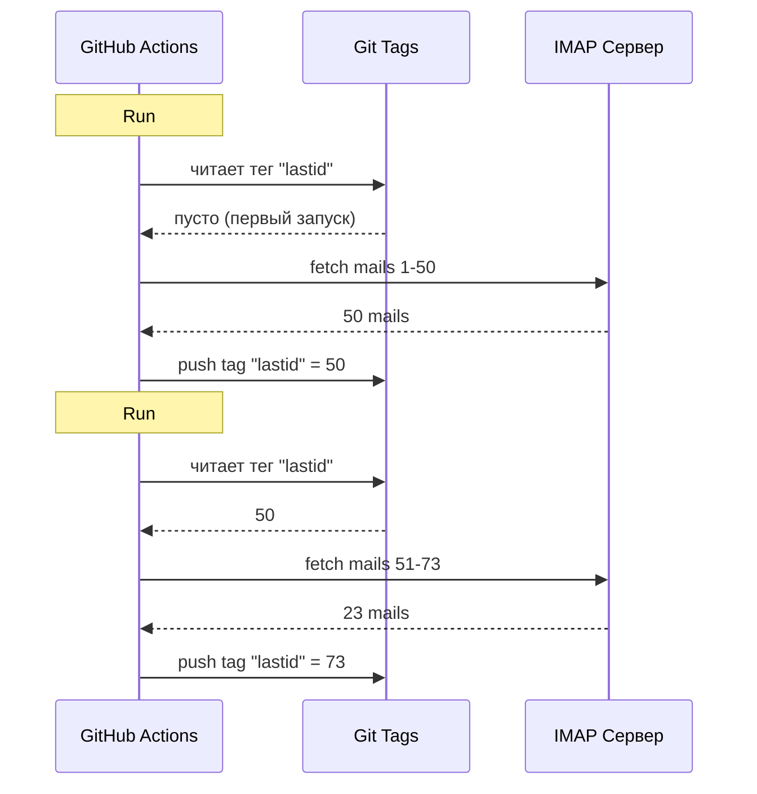

# Я использую git как базу данных, чтобы крутить бота на GitHub Actions бесплатно

У меня есть автоответчик на email, который работает 24/7.

Он читает мои письма, понимает о чём речь, и отвечает сам с помощью ИИ. Он помнит предыдущие разговоры. Игнорит рассылки и `noreply@`. Пересылает человеку, если тема слишком серьёзная.

Месячная стоимость: **0€**.

Никакого сервера. Никакого VPS. Никакой базы данных. Просто GitHub Actions и безумный хак: **использовать git как базу данных**.

Чуешь, к чему дело идёт? Нет? Ну, держись, это тупо и гениально одновременно.

---

## Проблема: GitHub Actions -- stateless

GitHub Actions -- это бесплатно. Можно запускать cron каждые 5 минут, гонять свой код, бесплатно.

Но есть проблема: он **stateless**.

Каждый запуск стартует с чистой машины. Ничего не сохраняется между выполнениями. Прошлый запуск? Забыт. Стёрт. Как будто его никогда не было.

Для автоответчика это огромная проблема. Типа:

> "Какое последнее письмо я уже обработал?"

Если бот будет забывать это при каждом запуске, он либо начнёт снова отвечать на те же письма (катастрофа), либо пропустит письма.

Нужно постоянное состояние. А обычно постоянное состояние = база данных. Но база данных -- это сервер, а сервер -- это уже не бесплатно.

Вот тут становится интересно.

---

## Решение: git-теги как база данных

Твой репозиторий на GitHub -- это уже постоянное хранилище. Бесплатное. Версионированное. Всегда на месте.

Так почему бы не хранить там состояние?

Идея: при каждом запуске бот читает последний обработанный UID письма из **git-тега**. Обрабатывает новые письма. А затем пушит тег с новым UID.



Git-тег И ЕСТЬ база данных. Одно значение, но этого достаточно.

### Чтение состояния

В начале джобы забираем значение из тега:

```bash
git fetch origin --tags lastid || true
git show refs/tags/lastid:data/lastId > data/lastId || true
```

`git show refs/tags/lastid:data/lastId` означает: "дай мне содержимое файла `data/lastId` таким, каким оно было в теге `lastid`".

Бум. У тебя есть значение, без базы данных.

### Запись состояния

В конце пересоздаём тег с новым значением:

```bash
git switch --orphan lastid-tmp   # чистая ветка без истории
git rm -rf .                      # всё очищаем
mkdir -p data
printf "%s\n" "${LAST_ID_CONTENT}" > data/lastId

git add data/lastId
git commit -m "lastId snapshot"
git tag -f lastid                 # форсим тег на этот коммит
git push --force ...origin lastid # пушим тег
```

Создаём **сиротскую** ветку (без истории), кладём туда только файл `lastId`, коммитим, тегаем, форс-пушим.

Почему сиротскую? Чтобы не накапливать 10 000 коммитов состояния в истории репозитория. Каждое обновление затирает предыдущее. Тег всегда указывает на ОДИН коммит, содержащий ОДНО значение.

Это чисто. Это бесплатно. Это полный разнос xD

---

## Второй хак: снапшот рантайма

Есть ещё одна проблема с GitHub Actions: `npm install`.

Если при каждом запуске (каждые 5 минут) делать `npm install` + `npm run build`, ты тратишь 60-90 секунд каждый раз. На частом кроне это минуты вычислительного времени впустую.

Решение: скомпилировать код ОДИН раз и сохранить его в git-теге.

Воркфлоу сборки (запускается при пуше в `master`) делает это:

```bash
# компилит код
bun install
bun run build

# сохраняет dist/ + node_modules/ в тег "runtime"
git checkout --orphan temp-runtime
git rm -rf .
cp -r "$TMPDIR"/* .
git add dist node_modules package.json bun.lock data
git commit -m "runtime build"
git tag -f runtime
git push --force ...origin runtime
```

Тег `runtime` содержит скомпилированный код И `node_modules`. Всё готово к запуску.

А cron, в свою очередь, чекаутит напрямую этот тег:

```yaml
- name: Checkout runtime snapshot
  uses: actions/checkout@v4
  with:
    ref: refs/tags/runtime    # пред-собранный код, не исходники
    fetch-depth: 1

# никакого npm install, никакого build!
- name: Process emails
  run: node dist/index.js --action
```

Никакой установки. Никакой сборки. Крон стартует мгновенно и просто выполняет `node dist/index.js`.

Типа, у тебя два тега для двух задач:
- `runtime` = код, готовый к запуску (обновляется при пуше кода)
- `lastid` = постоянное состояние (обновляется при каждом запуске)

Это элегантно до безобразия.

---

## Сам бот: ИИ-автоответчик

Ладно, хак с git -- это круто, но что конкретно делает бот?

Он читает твои письма через IMAP, понимает их с помощью ИИ (Groq + Llama 3.3 70B) и отвечает автоматически.

Архитектура с чистыми сервисами и внедрением зависимостей (InversifyJS):

```
App
├── ImapService      → читает письма (IMAP)
├── SmtpService      → отправляет ответы (SMTP)
├── ParserService    → парсит содержимое писем
├── ReplyService     → генерирует ответ ИИ
├── SummaryService   → память разговоров
├── AccountsService  → управляет несколькими email-аккаунтами
└── ConfigService    → конфиг / переменные окружения
```

### Два режима работы

Бот может работать двумя способами:

**Режим listener** (реальное время): постоянное IMAP-соединение с экспоненциальным реконнектом. Для VPS.

```typescript
this.imapService.on("exists", async (data) => {
  console.log(`[MAIL] Новое письмо! Всего: ${data.count}`);
  // обрабатывает новое письмо немедленно
});
```

**Режим action** (батч): обрабатывает новые письма начиная с `lastId`, затем завершается. Для крона GitHub Actions.

```bash
node dist/index.js --action
```

Режим `--action` -- это тот, который использует хак с git. Он читает `lastId`, обрабатывает новое, записывает новый `lastId`, конец.

### НЕ отвечать роботам

Если твой бот будет отвечать на ВСЕ письма, он начнёт отвечать на рассылки, уведомления, `noreply@`. Катастрофа. Хуже того: если два бота начнут переписываться друг с другом, получится бесконечный цикл писем. Кошмар.

Поэтому агрессивная фильтрация:

```typescript
export function isAutomatedSender(address) {
  const automatedPatterns = [
    "noreply", "no-reply", "donotreply",
    "mailer-daemon", "postmaster", "bounce",
    "newsletter", "notification", "marketing",
    "billing", "receipt", "promo", ...
  ];
  const local = address.split("@")[0].toLowerCase();
  return automatedPatterns.some(p => local.includes(p));
}
```

А также детекция через заголовки email:

```typescript
export function isAutomatedByHeaders(headers) {
  return (
    ["bulk", "list", "junk"].includes(headers.precedence) ||
    headers["auto-submitted"] !== "no" ||
    headers["list-unsubscribe"] !== "" ||   // у рассылок есть это
    /mailchimp|sendgrid|mailgun|brevo/i.test(headers["x-mailer"])
  );
}
```

`List-Unsubscribe` в заголовках? Это рассылка. `Precedence: bulk`? Массовая рассылка. `X-Mailer: Mailchimp`? Ну ты понял. Игнорим.

Это как вышибала в ночном клубе: роботы не проходят xD

### Магические триггеры

ИИ может решить вообще не отвечать или передать дело человеку. Как? С помощью специальных триггеров в своём ответе.

Системный промпт говорит ему:

> Если это автоматическое письмо/рассылка → отвечай `<no_reply>`
> Если это слишком важно/чувствительно (юридическое, финансовое...) → отвечай `<manual_reply_required>`
> Иначе → напиши настоящий ответ

И код читает это:

```typescript
const aiReply = completion.choices[0].message.content.trim();
const manualTrigger = aiReply.includes(MANUAL_REPLY_TRIGGER);
const noReply = aiReply.includes(NO_REPLY_TRIGGER);

if (noReply) {
  console.log("[MAIL] ИИ решил проигнорировать. Skip.");
  return;
}

if (manualTrigger) {
  console.log("[MAIL] Слишком горячо, пересылаю человеку.");
  await this.smtpService.sendManualForward(...);
  return;
}

// иначе отправляем ответ ИИ
await this.smtpService.sendReply(...);
```

Типа, ИИ имеет право сказать "нет, я в это не лезу, зови настоящего человека". Это мудрость.

---

## Память разговоров

Деталь, которая всё меняет: бот **помнит** разговоры.

Когда он отвечает кому-то, он сохраняет саммари переписки. В следующий раз, когда этот человек напишет, саммари снова подставляется в промпт.

Хранение: один JSON-файл на контакт.

```
data/customers/
├── moi%40gmail.com/
│   ├── alice%40example.com.json
│   └── bob%40client.fr.json
```

А саммари тоже генерируется ИИ, который мержит старое саммари с новым сообщением:

```typescript
const completion = await groq.chat.completions.create({
  model: "llama-3.3-70b-versatile",
  messages: [
    { role: "system", content: "Ты ассистент памяти. Склей старое саммари с новым сообщением без потери информации." },
    { role: "user", content: `Существующее саммари:\n${existing}\n\nНовое сообщение:\n${incomingContent}` }
  ],
  temperature: 0.0,  // детерминированно, без креатива
  max_tokens: 800,
});
```

Так что бот постепенно строит сжатую память. Не нужно хранить все письма, просто саммари, которое умно растёт.

И эти JSON-файлы? Ну... они тоже хранятся в git, в теге runtime. Git везде xD

---

## Хитрость с длиной промпта

Маленькая техническая деталь, которая меня позабавила.

У моделей есть лимит токенов. Если твоё письмо + саммари + промпт персонажа превышают его, API возвращает ошибку.

Код обрабатывает это **каскадным урезанием** + повтор:

```typescript
try {
  // первая попытка с обычными лимитами
  completion = await groq.chat.completions.create({...});
} catch (error) {
  if (!this.isLengthError(error)) throw error;

  // это была ошибка длины: пробуем снова с более жёсткими лимитами
  ({ systemContent, userContent } = this.buildPromptPayload({
    ...,
    limits: {
      systemPromptChars: 2200,  // вместо 3000
      summaryChars: 1800,       // вместо 4000
      personaChars: 900,        // вместо 1500
      userContentChars: 2200,   // вместо 8000
    },
  }));
  completion = await groq.chat.completions.create({...});  // повтор
}
```

Если не проходит -- режем ещё короче и пробуем снова. Просто, эффективно, без падений.

---

## Ну и конкретно, как это работает?

Полный поток одного запуска крона:

```
1. GitHub Actions срабатывает (cron каждые 5 мин)
2. Чекаут тега "runtime" (пред-собранный код)
3. git show refs/tags/lastid → получает последний обработанный UID
4. node dist/index.js --action
   ├── подключение IMAP
   ├── загрузка писем с lastId+1
   ├── для каждого письма:
   │   ├── парсинг содержимого
   │   ├── фильтр роботов (skip если автоматическое)
   │   ├── определение аккаунта получателя
   │   ├── получение памяти разговора
   │   ├── генерация ответа ИИ (Groq)
   │   ├── <no_reply> ? skip
   │   ├── <manual_reply_required> ? пересылка человеку
   │   ├── иначе: отправка ответа (SMTP)
   │   └── обновление памяти разговора
   └── запись нового lastId
5. git push --force тега "lastid" с новым значением
```

И всё повторяется через 5 минут. Навсегда. Бесплатно.

---

**3 вещи, которые нужно запомнить:**

1. **Git = бесплатная база данных** -- Сиротский тег может хранить твоё постоянное состояние между stateless-запусками. `git show refs/tags/X:файл` для чтения, force-push для записи. Никакой БД не нужно.

2. **Пре-компиляция в тег runtime** -- Вместо `npm install` при каждом запуске крона, храни скомпилированный код + node_modules в git-теге. Крон стартует мгновенно.

3. **ИИ-бот должен уметь молчать** -- Триггеры `<no_reply>` и `<manual_reply_required>` позволяют ИИ решить не отвечать или передать дело человеку. Плюс анти-робот фильтрация. Иначе создашь бесконечный цикл писем.

Serverless cron с постоянным состоянием, ИИ, памятью -- всё за 0€/мес. Это полный разнос, и я обожаю это xD
