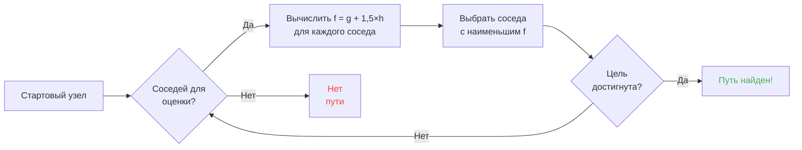

## Вступление

Я потратил часы, наблюдая за тем, как овцы врезаются в стены.

Лучшая инвестиция в моей жизни xD

Чем больше ты смотришь на этих мобов, тем больше понимаешь -- в их движении нет ничего случайного. Каждый шаг запрограммирован, предсказуем и, самое главное -- взламываем. Я залез в исходники Minecraft чтобы понять, как работает pathfinding, и обнаружил, что можно буквально контролировать разум мобов. Серьёзно, заставлять их идти туда, куда ТЫ хочешь, а не куда рандом решит.

Этот гайд -- всё, что я нашёл, пока копался. Система AI, алгоритм A*, скрытые значения "злобы", эксплойты для выживания. Хватай кирку.

---

## Как работает Mob AI (спойлер: она туповата)

### Цели

У каждого моба есть список *целей*. Что он МОЖЕТ делать и как сильно он этого ХОЧЕТ. Меньше число = выше приоритет. Как список задач из ада.

```java
protected void registerGoals() {
   this.goalSelector.addGoal(4, new Zombie.ZombieAttackTurtleEggGoal(this, 1.0, 3));
   this.goalSelector.addGoal(8, new LookAtPlayerGoal(this, Player.class, 8.0F));
   this.goalSelector.addGoal(8, new RandomLookAroundGoal(this));
   this.addBehaviourGoals();
}
```

Видел, как зомби игнорирует черепашьи яйца, чтобы погнаться за тобой? Вот почему: `ZombieAttackTurtleEggGoal` имеет приоритет 4, а `ZombieAttackGoal` (цель "сожри твоё лицо") -- приоритет 2. Зомби предпочитают закуски с пульсом.

Цель, которая нас реально интересует -- `WaterAvoidingRandomStrollGoal`, приоритет 7. Цель "мне больше нечем заняться, так что пойду поброжу". Вот где начинается веселье.

### Движение (или "как случайный шаг имеет шанс 1 к 60 за тик")

Каждый тик (каждые 0.05 секунд) игра вызывает `canUse()` чтобы проверить, хочет ли моб вообще напрягаться. Шанс 1 к 60 за тик. Ужасно неэффективный дизайн, и я его обожаю.

```java
public boolean canUse() {
   if (this.mob.hasControllingPassenger()) {
      return false;
   } else {
      if (!this.forceTrigger) {
         if (this.checkNoActionTime && this.mob.getNoActionTime() >= 100) {
            return false;
         }
         if (this.mob.getRandom().nextInt(reducedTickDelay(this.interval)) != 0) {
            return false;
         }
      }
      Vec3 $$0 = this.getPosition();
      if ($$0 == null) {
         return false;
      } else {
         this.wantedX = $$0.x;
         this.wantedY = $$0.y;
         this.wantedZ = $$0.z;
         this.forceTrigger = false;
         return true;
      }
   }
}
```

Короче: если ты сидишь на мобе -- нет, если моб ничего не делал 5 секунд -- нет, если RNG сказал нет -- нет. Игре РЕАЛЬНО не хочется, чтобы мобы двигались.

Но когда он всё-таки двигается, в дело вступает `getPosition()`:

```java
protected Vec3 getPosition() {
   if (this.mob.isInWater()) {
      Vec3 $$0 = LandRandomPos.getPos(this.mob, 15, 7);
      return $$0 == null ? super.getPosition() : $$0;
   } else {
      return this.mob.getRandom().nextFloat() >= this.probability
         ? LandRandomPos.getPos(this.mob, 10, 7)
         : super.getPosition();
   }
}
```

Видишь те два числа в конце? Радиус XZ и радиус Y. В воде моб ищет шире (15 против 10). Если не может найти землю -- падает на `super.getPosition()`, который принимает воду. **Результат: мобы ХОТЯТ выбраться из воды.** Вот почему твои животные плавают как бешеные к берегу.

Забавный факт: есть буквально 0.1% шанс, что моб выберет `super.getPosition()` вместо `LandRandomPos`. Один на тысячу. Моянг, я полагаю xD

### LandRandomPos: оптимизация, которая всё ломает

Это мой ЛЮБИМЫЙ шаг. Самый красивый технический бардак, который делает pathfinding эксплуатируемым.

```java
public static Vec3 getPos(PathfinderMob $$0, int $$1, int $$2, ToDoubleFunction<BlockPos> $$3) {
   boolean $$4 = GoalUtils.mobRestricted($$0, $$1);
   return RandomPos.generateRandomPos(() -> {
      BlockPos $$4xx = RandomPos.generateRandomDirection($$0.getRandom(), $$1, $$2);
      BlockPos $$5 = generateRandomPosTowardDirection($$0, $$1, $$4, $$4xx);
      return $$5 == null ? null : movePosUpOutOfSolid($$0, $$5);
   }, $$3);
}
```

`movePosUpOutOfSolid`. Название говорит само за себя. Если выбранная позиция внутри твёрдого блока, игра выталкивает её наверх, пока она не окажется в воздухе.

Это оптимизация: вместо того чтобы тратить время на пропуск подземных позиций, игра просто вышвыривает их на поверхность. Умно? Да. Но это создаёт ОГРОМНОЕ смещение: **мобы предпочитают высоту**.

Подумай об этом. Много блоков под землёй, игра генерирует 10 случайных позиций. Те, что внутри блоков, выталкиваются наверх. Плотные зоны (под холмом) дают больше валидных позиций, чем пустые. Результат: моб статистически чаще идёт к холму.

Поверь, мы скоро разнесём это в щепки.

### Выбор: лучший блок побеждает

10 позиций, один победитель, соревнование по очкам:

```java
public static Vec3 generateRandomPos(Supplier<BlockPos> $$0, ToDoubleFunction<BlockPos> $$1) {
   double $$2 = Double.NEGATIVE_INFINITY;
   BlockPos $$3 = null;
   for(int $$4 = 0; $$4 < 10; ++$$4) {
      BlockPos $$5 = (BlockPos)$$0.get();
      if ($$5 != null) {
         double $$6 = $$1.applyAsDouble($$5);
         if ($$6 > $$2) {
            $$2 = $$6;
            $$3 = $$5;
         }
      }
   }
   return $$3 != null ? Vec3.atBottomCenterOf($$3) : null;
}
```

Позиция с наибольшим количеством очков ПОБЕЖДАЕТ. И если ты знаешь критерии оценки, ты можешь сделать так, чтобы ТВОЯ позиция победила. Это как подстроить выборы.

---

## Предпочтения мобов (или "почему твоя корова перешла дорогу")

У каждого моба разные вкусы. И это меняет всё.

| Моб | Любит |
| --- | --- |
| **Животные** (коровы, овцы, свиньи) | Траву, свет |
| **Монстры** (зомби, скелеты) | Тьму (хипстеры) |
| **Черепахи** | Вода > песок > свет |
| **Хоглины** | `crimson_nylium`; ненавидят `warped_fungus` |
| **Страйдеры** | Лаву и БОЛЬШЕ НИЧЕГО |
| **Чешуйницы** | Заражаемые блоки |
| **Стражи** | Вода + свет (снобы) |
| **Муушрумы** | Мицелий + свет |
| **Пчёлы** | Воздух. Да, они предпочитают ВОЗДУХ. |

```java
// Animal: look down, if grass -> max score
public float getWalkTargetValue(BlockPos $$0, LevelReader $$1) {
   return $$1.getBlockState($$0.below()).is(Blocks.GRASS_BLOCK) ? 10.0F : $$1.getPathfindingCostFromLightLevels($$0);
}

// Monster: literally the opposite
public float getWalkTargetValue(BlockPos $$0, LevelReader $$1) {
   return -$$1.getPathfindingCostFromLightLevels($$0);
}
```

Монстры -- это буквально "если светло -- минусовой скор, я сваливаю". Они УСТРАИВАЮТ ИСТЕРИКУ от света xD

Так что ты можешь -- буквально -- вести животных травой и светом, а монстров -- тьмой. Это тупо и гениально одновременно.

---

## A* в Minecraft (секретная формула)

Minecraft использует A* (A-star) для pathfinding. Но Mojang добавили свой твист:

```
f(n) = g(n) + 1.5 × h(n)
```

- **g(n)** = уже пройденное расстояние (1 за блок, ~1.41 по диагонали)
- **h(n)** = расстояние по прямой до цели
- **1.5** = потому что Mojang любят, когда всё слегка сломано

Обычный A* использует `f(n) = g(n) + h(n)`. MOJANG ДОБАВИЛИ МНОЖИТЕЛЬ 1.5. Зачем? Чтобы алгоритм быстрее сходился к цели и обрезал меньше веток поиска. Результат: путь "достаточно хорош", но не всегда оптимален. Это пьяный A*.



Ключевое ограничение: **моб может прокладывать путь только на 16 блоков** (его *follow range*). Если цель слишком далеко, он выбирает ближайший достижимый блок. Это значит, что ты можешь построить монолит вне диапазона, и моб будет идти к ближайшему блоку, который приблизит его к цели -- делая его движение полностью предсказуемым.

### Два эксплойта, которые ломают игру

#### 1. Обновления блоков форсируют пересчёт

```java
public boolean shouldRecomputePath(BlockPos $$0) {
   if (this.hasDelayedRecomputation) return false;
   if (this.path != null && !this.path.isDone() && this.path.getNodeCount() != 0) {
      Node $$1 = this.path.getEndNode();
      Vec3 $$2 = new Vec3(
         ((double)$$1.x + this.mob.getX()) / 2.0,
         ((double)$$1.y + this.mob.getY()) / 2.0,
         ((double)$$1.z + this.mob.getZ()) / 2.0
      );
      return $$0.closerToCenterThan($$2, (double)(this.path.getNodeCount() - this.path.getNextNodeIndex()));
   }
   return false;
}
```

Каждое обновление блока рядом с путём моба заставляет A* пересчитываться с кулдауном в 1 секунду. Поставь часовой механизм с периодом 1 секунда рядом с мобом -- и он будет пересчитывать ПОСТОЯННО. Это как GPS, который сбрасывается каждую секунду.

А если сделать это с 50 мобами? Лаговое гетто. RIP TPS.

#### 2. Pathfinding Malice (штрафы за блоки)

Некоторые блоки пугают мобов. Буквально. У каждого блока есть ассоциированная стоимость, определённая enum'ом:

| Блок / Состояние | Злоба |
| --- | --- |
| **Медовый блок** | +8 пройти сквозь |
| **Рыхлый снег** | Непроходимо |
| **Закрытые двери** | Непроходимо |
| **Огонь** | +16 сквозь, +8 рядом |
| **Животные и жители** | Огонь = -1 (ЖЁСТКИЙ НЕТ) |
| **Кактус / Сладкие ягоды** | Непроходимо; рядом = +8 |
| **Вода** | +8 сквозь или рядом |
| **Магма** | +8 рядом |

Животные заходят ещё дальше:

```java
protected Animal(EntityType<? extends Animal> $$0, Level $$1) {
   super($$0, $$1);
   this.setPathfindingMalus(PathType.DANGER_FIRE, 16.0F);
   this.setPathfindingMalus(PathType.DAMAGE_FIRE, -1.0F);
}
```

DAMAGE_FIRE на -1.0F -- это буквально "запрещено". Животное скорее прыгнет в пустоту, чем пройдёт сквозь огонь.

### Упражнение: великий конкурс путей

Житель выбирает между несколькими путями:

- **Путь A**: 15 блоков, но 6 граничат с водой (+8 каждый)
- **Путь B**: 18 блоков с 2 блоками воды (+8) + 1 блок рядом с водой (+8)
- **Путь C**: 14 блоков напрямую... но огонь -> НЕПРОХОДИМО для жителей
- **Путь D**: 16 блоков с 1 блоком рядом с магмой (+8) + 1 рядом с медом (+8)
- **Путь E**: 25 блоков с кактусами везде (+8 везде) -> 90.82 всего LOL

Победитель -- обычно **Путь B**: обход окупается, потому что вода ДОРОГАЯ.

Житель -- это калькулятор стоимости на ножках xD

### Каждый моб выбирает разные пути

Житель: "огонь? НЕТ ПОКА"
Зомби: "огонь? Ок, бумер *проходит сквозь огонь горящим*"

Ты можешь буквально строить магистрали, по которым ходят жители, а зомби -- нет. И наоборот.

---

## Жители: ultimate бардак

Жители -- самая недопонятая вещь в Minecraft. Но когда ты прочитал код, ты понимаешь, что это просто предсказуемые машины с рабочим графиком.

### Сенсоры и память

9 сенсоров, работающих каждые 20 тиков (1 секунда). Каждый сканирует радиус вокруг жителя и сохраняет результат в память. Житель видит всё, помнит всё и действует соответственно.

### Пакеты активности

Мозг жителя разделён на пакеты активности, которые активируются в зависимости от времени:

| Пакет | Время | Житель... |
| --- | --- | --- |
| **Core** | 24/7 | Открывает двери, плавает (80% времени), ПОЛУЧАЕТ POI |
| **Work** | 8:00-15:00 | "Надо работать" -- идёт к рабочему месту |
| **Meet** | 15:00-17:00 | "Счастливый час!" -- идёт к колоколу, тусит |
| **Rest** | 18:00-6:00 | "Спать пора" -- идёт в кровать |
| **Idle** | 6:00-8:00, 17:00-18:00 | "Скучно" -- бродит, размножается, прыгает по кроватям |
| **Panic** | Урон / враждебность | "БЕЖАТЬ" -- УБЕГАЕТ |

**Panic** -- единственный пакет, который может прервать ВСЕ остальные. Даже если житель спит или работает, если есть зомби -- ПАНИКА.

### Acquire POI: механика, которая дает беспроводной редстоун

```java
Set<Pair<Holder<PoiType>, BlockPos>> $$12 = (Set)$$10xx.findAllClosestFirstWithType(
   $$0, $$11, $$8x.blockPosition(), 48, PoiManager.Occupancy.HAS_SPACE
)
```

`Acquire POI` сканирует радиус 48 блоков в поисках всех валидных точек интереса. Он хранит 5 ближайших, проверяет, существует ли путь, и получает ближайшую достижимую. У каждой POI есть ограниченное количество слотов:
- **Рабочие станции**: 1 слот
- **Кровати**: 1 слот
- **Колокола**: 32 слота

БЕЗУМНАЯ вещь: **слот резервируется в момент ПОЛУЧЕНИЯ, а не прибытия**. Житель может заблокировать компостер с другого конца карты, даже не дойдя до него.

Понимаешь, к чему это?

### Беспроводной редстоун. Да, БЕСПРОВОДНОЙ.

1. Посади жителя в вагонетку с путём к компостеру
2. Он получает компостер (слот занят, никто другой не может им пользоваться)
3. Житель слишком далеко, чтобы кликнуть -- костная мука остаётся
4. ПЕРЕМЕСТИ этого жителя КУДА УГОДНО в мире, он сохраняет слот
5. Когда хочешь активировать свою штуку -- УБЕЙ жителя
6. Слот освобождается, другой житель получает компостер, забирает костную муку
7. ОБНОВЛЕНИЕ БЛОКА -> любая редстоун-схема активируется

Ты создал беспроводной редстоун, передаваемый через весь мир, без единой загруженной чанковой дороги. Подключи это к камере с эндер-жемчугом и телепортируйся откуда угодно, убив жителя.

Моё любимое применение? Мини-игра "охотник за головами": несколько жителей с компостерами, игрок должен убить ПРАВИЛЬНОГО жителя, чтобы активировать выход. Полная wtf механика xD

### Взаимоблокировка pathfinding (или "житель, который застывает навсегда")

Есть баг между `Acquire POI` (который видит путь) и фактической навигацией (которая отказывается по нему идти). Происходит, когда блок над рабочей станцией непроходим. Результат:

- Core-пакет: "Я хочу получить POI"
- Навигация: "Я не могу туда пройти"
- Результат: житель стоит ЗАМЕРШИЙ, навсегда, борясь сам с собой.

Буквально замороженные жители, используемые как декор или реквизит. Танк из бронестоек? Да. Охранник, который не двигается? Да. Жутковато? Возможно. Эффективно? Полностью xD

---

## Заключение

Pathfinding мобов в Minecraft -- не случайность. Это детерминированная система на основе очков, предсказуемая И взламываемая.

**Три вещи, которые нужно запомнить:**

1. **Твёрдые блоки под ногами = смещение в высоту** -- заполни или опустоши подпол, чтобы направлять мобов
2. **Злоба разная для каждого моба** -- создавай маршруты, которые одни проходят, а другие нет
3. **Слоты POI резервируются на расстоянии** -- бесплатный беспроводной редстоун, телепортация, всё это

Исходный код Minecraft -- золотая жила недоиспользованных механик. Я потратил часы на чтение декомпилированной Java и, честно? Каждая строка -- это функциональное пасхальное яйцо. Кроме того, эти работают в выживании для беспроводного редстоуна с жителями. Лучшая игра, подтверждено xD
