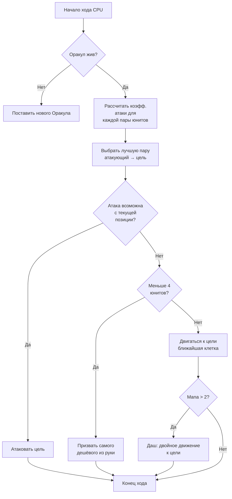

## Моя долбанутая ИИ для Nausicaa

Бывают проекты, которые начинаются с "а что если сделать шахматы с мифологией?", а заканчиваются какой-то ИИ, которая меняет свои гиперпараметры каждые 5 ходов.

Nausicaa -- это оно. Пошаговая настолка, где ты собираешь колоду мифических существ, управляешь маной, выставляешь юнитов на поле 10x8. А ещё там ИИ с раздвоением личности.

Я потратил дофига времени на эту ИИ, и результат просто неуправляемый xD

## Что за игра

Прежде чем говорить про мозги, надо понять тело:

- Поле 10x8, зона размещения по 2 ряда на игрока
- Мана стартует с 1, +1 за ход, макс 6. Тратишь на призыв, атаку, способности
- Цель: завалить вражеского Оракула

12 юнитов, разные стоимости и паттерны движения:

| Unit | Цена | Движение | HP |
| --- | --- | --- | --- |
| Oracle | 0 | Король (8 направлений) | 1 |
| Gobelin | 1 | Вперёд 3 клетки | 1 |
| Harpie | 1 | Король (8 направлений) | 1 |
| Naïade | 1 | Диагональ | 1 |
| Griffin | 2 | Прыжок на 2 клетки | 2 |
| Sirène | 2 | Боком | 1 |
| Centaure | 2 | Конём (буквой Г) | 2 |
| Archer | 3 | Боком | 1 |
| Phénix | 3 | Диагональ (тёмные клетки) | 1 |
| Métamorphe | 4 | Обмен местами | 1 |
| Voyant | 4 | Никуда (генерит ману) | 1 |
| Titan | 6 | Ограниченно (атака по зоне) | 3 |

У каждого юнита свой паттерн атаки. Сирена бьёт по 4 диагоналям, Арчер -- с дистанции на 3 клетки, Титан уничтожает всё вокруг при призыве. Короче, шахматы с мифологией и декбилдингом xD

## Как я заставил CPU думать

Идея до примитивности проста: **у каждого вражеского юнита есть коэффициент привлекательности**. Чем он опаснее, тем больше ИИ хочет им заняться.

```javascript
const UNITS_ATTRACTIVENESS = {
    "oracle": 100,
    "titan": 95,
    "shapeshifter": 90,
    "phoenix": 80,
    "siren": 70,
    "archer": 70,
    "seer": 70,
    "griffin": 60,
    "centaur": 60,
    "harpy": 50,
    "naiad": 30,
    "gobelin": 20
};
```

Оракул на 100 -- логично, это вин-кондишн. Титан на 95, потому что он ваншотит всё вокруг при призыве. Гоблин на 20 -- пешка, пофиг на него.

Дальше для каждой пары юнитов (свой + вражеский) я считаю:

```
интерес = привлекательность × коэфф_привл / (расстояние × коэфф_дист)
```

Короче: чем ты опаснее и ближе, тем больше ИИ хочет тебя размазать.

```javascript
calculateAttackCoefficient(x1, y1, x2, y2) {
    const distance = this.calculateEuclideanDistance(x1, y1, x2, y2);
    if (distance === 0) return Infinity;
    return (UNITS_ATTRACTIVENESS[unit.type] * COEFFICIENTS_IMPORTANCE["attractiveness"]) / distance;
}
```

### Фишка с меняющимися коэффициентами

Прикол в том, что коэффициенты важности **рандомно меняются каждые 5 ходов**.

```javascript
if (this.turnCount % 5 === 0) {
    const distanceCoefficient = parseInt(Math.random() * 100);
    const attractivenessCoefficient = parseInt(Math.random() * 100);
    this.regulateImportanceCoefficients({
        distance: distanceCoefficient,
        attractiveness: attractivenessCoefficient
    });
}
```

В одном ходу ИИ сверхагрессивна (аттрактивность 95, дистанция 5) -- прёт через всё, чтоб завалить твоего Оракула. В следующем приоритет -- дистанция, и она перестраивается.

Это украдено у призраков из Pac-Man -- Blinky преследует, Pinky ставит засады. Тут ИИ меняет "личность" каждую фазу.

**Результат: невозможно предсказать ИИ на всю партию.** CPU ни разу не проводит два одинаковых матча.

### Оракул -- ссыкло

Вражеский Оракул драпает. Буквально.

```javascript
const awayFromTarget = {
    row: Math.max(0, Math.min(7, botUnitElement.row + (botUnitElement.row - targetUnitElement.row))),
    col: Math.max(0, Math.min(9, botUnitElement.col + (botUnitElement.col - targetUnitElement.col)))
};
```

Он вычисляет направление от угрозы и сваливает. Если упёрся в стену -- ищет ближайшую свободную клетку в ту же сторону.

Ты 3 хода подбираешься к Оракулу, а он сваливает как трусишка xD

### Цикл принятия решений

Вот как ИИ решает:

1. Если Оракула больше нет (убили) -- поставить нового
2. Посчитать коэффициент для каждой пары свой юнит → вражеский юнит
3. Выбрать лучшую пару
4. Если юнит может атаковать цель с текущей позиции -- атакует
5. Если меньше 4 юнитов -- призвать самого дешёвого из руки
6. Иначе -- двигаться к цели (клетка движения ближе всего к врагу)
7. Если маны дохера (> 2) -- даш (двойное движение) чтоб подобраться ещё ближе
8. Если юнит -- Оракул -- бежать



```javascript
async makeAction(dash=false) {
    // всё это по очереди
    // CPU делает даш если маны дохера
    if(botPlayer.mana > 2) {
        this.makeAction(true);
    }
}
```

### Почему евклидово расстояние

Я использую евклидово расстояние:

```javascript
calculateEuclideanDistance(x1, y1, x2, y2) {
    const deltaX = Math.pow(x1 - x2, 2);
    const deltaY = Math.pow(y1 - y2, 2);
    return Math.sqrt(deltaX + deltaY) * COEFFICIENTS_IMPORTANCE["distance"];
}
```

Почему не Манхэттен? Потому что юниты двигаются по-разному (буквой Г как конь, по диагонали и т.д.). Расстояние по прямой лучше оценивает угрозу.

## Почему не минимакс

Я мог бы закодить классический минимакс. Но с 12 типами юнитов, разными паттернами движения, особыми способностями... дерево игры взрывается так быстро, что становится неиграбельно. Эвристический подход принимает умные решения без перебора 10 миллионов состояний.

## Что крутого

Система привлекательности создаёт забавные дилеммы:

- Voyant (70) генерит ману. Оставишь его жить -- у противника больше ресурсов. Но Titan (95) ещё опаснее.
- Métamorphe (90) может меняться местами с любым юнитом. Способен украсть твоего Оракула.
- Harpie (50) имеет взрывную атаку, которая убивает и её саму. Не приоритет... пока она не оказалась рядом с тремя твоими юнитами.

ИИ оценивает общую опасность по позициям, а не просто по голым статам.

Ещё есть функция `activateSimulation()` для теста сценариев без новой партии:

```javascript
activateSimulation() {
    // Ставит конкретных юнитов на поле
    // Удобно для отладки ИИ
    this.game.board = simulation.board;
    this.game.players = simulation.players;
}
```

## Чего не хватает

Было бы больше времени:

- ИИ реагирует на текущее состояние, а не предсказывает действия игрока
- Не планирует руку на несколько ходов вперёд
- Métamorphe и Centaure имеют способности, которые она недоиспользует
- Обучение с подкреплением: пусть играет сама с собой, чтоб настроить коэффициенты

Но для браузерной игры норм. Друзья умудряются проигрывать ей, так что всё ок xD

## Попробуй

Доступно на [nausicaa-game.github.io](https://nausicaa-game.github.io/). Тыкаешь "JOUER", CPU mode ON, и смотришь как ИИ делает дела.

Совет: дай ИИ поиграть сама с собой. Увидишь агрессивные фазы, а потом -- бац, она вся отступает.

Код на [GitHub](https://github.com/nausicaa-game/nausicaa-game.github.io) в `js/cpu.js`.

**3 штуки:**

1. **Эвристические коэффициенты** -- без минимакса, у каждого юнита своя привлекательность
2. **Коэффициенты меняются каждые 5 ходов** -- ИИ чередует агрессию и контроль, как в Pac-Man
3. **Оракул драпает** -- вычисляет направление от угрозы и валит

Если есть идеи, как сделать ИИ ещё подлее -- открывай issue. У меня планы на версию, которая учится на своих поражениях, но это уже в следующей статье xD
