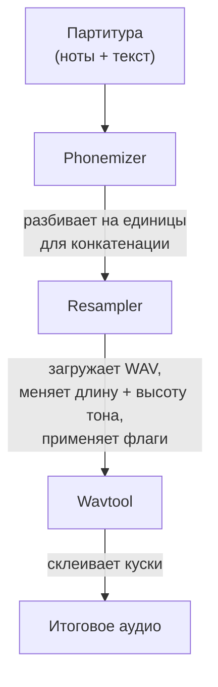

## UTAU : как программа на Visual Basic 6 демократизировала синтетический голос

Я уже упоминал об этом на своей главной странице : я люблю UTAU. Вот почему.

В 2008 году, если ты хотел заставить синтетический голос петь, у тебя был один вариант : VOCALOID. Программа от Yamaha. Дорогая, проприетарная, с официальными голосами, которые ты не мог создать сам.

А потом появился один японский чувак, Ameya/Ayame, который выпустил свою штуковину. Программа, написанная на **Visual Basic 6**. Бесплатная. Которая позволяла тебе создать свой собственный голос с помощью... WAV-файлов, которые ты сам записывал.

Эта штука называется **UTAU** (歌う, "петь" по-японски). И для своего времени это была магия.

Меня всегда эта программа завораживала. Не потому что она была технически чистой (спойлер : вообще-то нет, надо было реально врубиться, чтобы создать эту херню... это полный трэш, я плачу над этим цыплёнком), а потому что она сделала то, чего никто другой не делал : она дала синтез речи широкой публике. Типа тебе, мне, любому с микрофоном.

Дай объясню, почему это было круто.

---

## Для начала, почему синтез пения -- это боль

Певческий голос -- это не ноты. Тут есть атака согласной, протяжная гласная, дыхание, переходы между ними. "Са" в "салют" -- это шипящая "с", которая перетекает в открытую "а", и именно этот переход звучит по-человечески или нет.

Сегодня это решают через deep learning : ты обучаешь модель на часах пения, и она генерирует голос (Synthesizer V, DiffSinger). Но это 2020+. В 2008 -- нифига.

UTAU использует более старый и более хитрый метод : **конкатенативный синтез**.

---

## Конкатенативный синтез : копи-паст кусочков голоса

Идея проще пареной репы : ты записываешь маленькие кусочки голоса и склеиваешь их вместе, чтобы образовать слова. "салют" = сэмпл "са" + "лю" + "т", соединённые вместе. Звуковой пазл под управлением партитуры.

Это принцип YouTube Poop, где перерезают слова персонажа, чтобы заставить его говорить что попало -- только здесь всё чётко и автоматизировано.

И UTAU буквально отсюда и пошёл. До него существовал **"Jinriki Vocaloid"** (人力ボーカロイド, "ручной Vocaloid") : люди вручную нарезали вокальные дорожки, извлекали фонемы, меняли высоту тона и собирали всё обратно в аудиоредакторе, чтобы имитировать голос VOCALOID. Вручную. Представляешь объём работы.

Ameya посмотрел на эту жесть и написал инструмент для автоматизации. Изначально UTAU был просто этим : помощником для ручного Vocaloid.

---

## Почему это было революционно : ТЫ создаёшь голос

Вот что всё меняет.

VOCALOID -- ты покупал голос. Мику, Луку и т.д. Созданные профиками, проданные Yamaha. Никак не сделать свой самому. UTAU -- **любой может записать свой голос и сделать из него поющий инструмент**.

Режим CV (самый простой) : ты записываешь ~100 базовых слогов японского ("а", "ка", "са", "та"...), настраиваешь точки обрезки, и вуаля -- твоя voicebank. Несколько часов работы.

Результат : экосистема взорвалась. Тысячи voicebank'ов, созданных сообществом -- голоса фанатов, друзей, выдуманных персонажей. Целая вселенная виртуальных певцов, бесплатно. И программа шла с **Defoko** (Utane Uta), голосом по умолчанию, сгенерированным через TTS-движок AquesTalk, так что ты мог начать даже без микрофона.

---

## oto.ini : сердце системы

Откуда UTAU знает, где резать и склеивать звуки? Через конфигурационный файл для каждой voicebank : **`oto.ini`**. Для каждого WAV он определяет точки обрезки (в миллисекундах) :

- **Offset** → тишина, которую надо выкинуть в начале
- **Preutterance** → точка, где согласная переходит в гласную (граница "с"→"а" в "са")
- **Overlap** → насколько предыдущая нота перекрывает эту
- **Fixed region** → часть, которую НЕЛЬЗЯ растягивать на длинной ноте (обычно согласная)
- **Cutoff** → где обрезать конец

**Preutterance** -- самый хитрый параметр. В слоге всегда есть кусок согласной перед гласной. Чтобы нота попала в такт, *гласная* должна попасть точно, а не согласная. Поэтому UTAU сдвигает сэмпл назад : "а" из "са" попадает в такт, а "с" чуть набегает перед ней. Как барабанщик, который предвосхищает удар, чтобы звук пришёлся точно -- только вот это в `.ini`.

Визуально, на сэмпле "ка", зоны из `oto.ini` выглядят так :

```mermaid
flowchart LR
    A["🔇 тишина<br/>(offset)"] --> B["🅺 согласная<br/>(fixed region,<br/>не растягивается)"]
    B --> C["🅰 гласная<br/>(растягиваемая зона)"]
    C --> D["🔇 обрезанный конец<br/>(cutoff)"]
    style B fill:#3b4a6b
    style C fill:#5b3b6b
```



Граница между согласной и гласной -- это preutterance. Гласная -- зона, которую растягивают для длинных нот ; согласная остаётся нетронутой, иначе твоя "к" длилась бы две секунды и звучала ужасно.

```ini
# oto.ini (упрощённо)
# файл=alias,offset,consonant,cutoff,preutterance,overlap
_ka.wav=ka,120,80,-200,90,40
```

Пять значений на звук, для всех твоих сэмплов -- и UTAU собирает любое слово нормально.

---

## CV, VCV, CVVC : гонка за реализмом

Базовый режим, **CV** (Согласная-Гласная) -- это один звук на слог. Просто, но слегка роботизированно : стыки между слогами грубые.

В 2010 сообщество изобретает **VCV** (Гласная-Согласная-Гласная). Вместо того чтобы записывать "ка" отдельно, ты записываешь "а ка" -- с хвостом предыдущей гласной. Переход становится естественным, потому что он *внутри* записи, а не вычисляется постфактум.

Пикантная деталь : **у VOCALOID не было VCV до VOCALOID3, в 2011 году.** Бесплатная программа на VB6, написанная чуваком в одиночку, обогнала Yamaha на год в реалистичности переходов. Фан-сообщество быстрее транснациональной корпорации.

Потом появились **CVVC**, **ARPAsing** (английский), **VCCV**... каждый метод продвигал реализм всё дальше, и все они были изобретены и задокументированы сообществом.

---

## Полный пайплайн : как слово становится звуком

Когда ты ставишь ноту и вбиваешь текст, вот что происходит под капотом :



**Resampler** -- ключевой компонент : он берёт твой сэмпл "ка", записанный на определённой высоте, и перерастягивает/меняет его высоту, чтобы соответствовать нужной ноте -- растягивая только растяжимую зону и оставляя согласную нетронутой (для этого и нужен `oto.ini`).

И он **модульный**. UTAU шёл с базовым ресемплером, но сообщество наклепало других (moresampler, TIPS...), каждый со своим звучанием. Ты менял движок синтеза как плагин. В 2008. На бесплатной проге.

---

## Трэш под капотом (и почему это мило)

Нужно быть честным о техническом состоянии этой штуки :

- **Написано на Visual Basic 6.** Язык, который уже был мёртв в 2008. Нужен VB6-рантайм, чтобы это работало.
- **Изначально только под Windows** (порт на Mac, UTAU-Synth, появился в 2011).
- **Обязательная кодировка Shift-JIS.** Если твои файлы не в японской Shift-JIS, UTAU ничего не понимает. До сих пор часто приходится ставить системную локаль на японскую или использовать AppLocale для запуска.
- **Суровый интерфейс**, документация почти 100% на японском в то время.

И всё же. И всё же эта штука создала мировое движение. Десятки тысяч voicebank'ов. Песни, собравшие миллионы прослушиваний.

Лучший пример : **Kasane Teto**. Персонаж, созданный в 2008 и выпущенный как первоапрельский розыгрыш, выдаваемый за VOCALOID. Это была шутка. Но люди обожали персонажа, настоящая voicebank UTAU была создана позже, и Тето стала одной из самых известных виртуальных певиц в мире. В 2023 она даже получила официальный голос Synthesizer V. Персонаж, рождённый из первоапрельской шутки на бесплатной программе.

---

## Почему это всё ещё важно

UTAU -- идеальный пример "бедной" технологии, которая побеждает благодаря открытости.

VOCALOID был технически превосходящим, лучше финансируемым, более профессиональным. Но закрытым. UTAU был собран на коленке, уродливый, на VB6 -- но он позволял всем участвовать. Создавать голоса, создавать ресемплеры, создавать плагины, создавать методы записи. Сообщество сделало остальное.

И эта концепция полностью жива сегодня. **OpenUtau**, современный open-source преемник, переосмысливает идею и смахивает с неё пыль (кроссплатформенность, UTF-8, поддержка современных ресемплеров И ИИ). Конкатенативный синтез всё ещё держится рядом с deep learning моделями, потому что у него есть то, чего нет у них : ты понимаешь, что именно происходит, и контролируешь каждую миллисекунду.

Вот что мне всегда нравилось в UTAU. Ты видишь, что именно происходит. Это не ИИ, который выдаёт тебе магическую херню, которую ты не понимаешь : у тебя есть твои WAV, твои точки обрезки, и ты сам решаешь всё. Когда звучит херово, ты знаешь почему и можешь исправить. Я люблю такой контроль.

---

**3 штуки, которые надо запомнить :**

1. **Конкатенативный синтез = пазл из голоса** -- UTAU склеивает маленькие WAV-сэмплы вместе, чтобы образовать слова. `oto.ini` определяет, где резать и склеивать каждый звук. Ты контролируешь всё, с точностью до миллисекунды, без чёрного ящика.

2. **Открытость бьёт технику** -- VOCALOID был лучше, но закрыт. UTAU был собран на коленке, но позволял всем создавать свои голоса. Сообщество взорвало экосистему и даже обогнало Yamaha в VCV.

3. **Хорошая идея переживает свой код** -- VB6, Shift-JIS, только Windows... и всё же концепция живёт через OpenUtau. Гениальная технология может быть написана через жопу.

Честно, уже только за Kasane Teto, рождённую из первоапрельской шутки, эта программа заслуживает уважения xD
