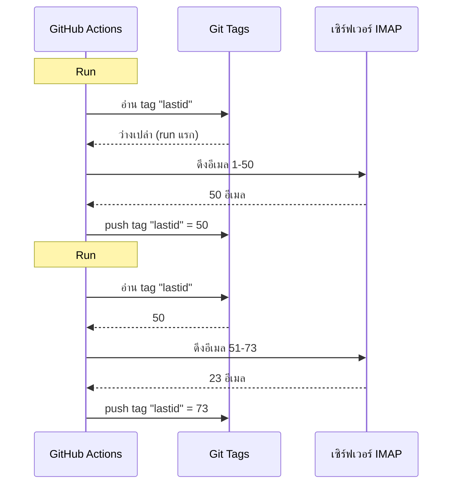

# ผมใช้ git เป็นฐานข้อมูลเพื่อรันบอทฟรีบน GitHub Actions

ผมมีระบบตอบอีเมลอัตโนมัติที่ทำงาน 24/7

มันอ่านอีเมลของผม ทำความเข้าใจว่าพูดถึงเรื่องอะไร และตอบกลับเองด้วย AI มันจำบทสนทนาก่อนหน้านี้ได้ มันข้าม newsletters และ `noreply@` มันส่งต่อไปยังมนุษย์เมื่อเรื่องร้อนเกินไป

ค่าใช้จ่ายต่อเดือน: **0€**.

ไม่มีเซิร์ฟเวอร์ ไม่มี VPS ไม่มีฐานข้อมูล แค่ GitHub Actions และ hack สุดบ้า: **ใช้ git เป็นฐานข้อมูล**

เห็นภาพกันหรือยัง? ไม่? เอาล่ะ เกาะให้แน่นนะ นี่มันทั้งบ้าและเจ๋งในเวลาเดียวกัน

---

## ปัญหา: GitHub Actions เป็น stateless

GitHub Actions ฟรี คุณสามารถรัน cron ทุก 5 นาที รันโค้ดของคุณได้ฟรี

แต่มีปัญหา: มันเป็น **stateless**

แต่ละ run เริ่มต้นบนเครื่องที่สะอาด ไม่มีอะไรถูกเก็บไว้ระหว่างการทำงานสองครั้ง รอบที่แล้ว? ถูกลืม ถูกลบ เหมือนไม่เคยมีมาก่อน

สำหรับระบบตอบอีเมล นี่เป็นปัญหาใหญ่ แบบ:

> "อีเมลล่าสุดที่ฉันจัดการไปคืออันไหน?"

ถ้าบอทลืมข้อมูลนี้ทุกครั้งที่รัน มันจะตอบกลับอีเมลเดิมซ้ำแล้วซ้ำเล่า (หายนะ) หรือไม่ก็พลาดอีเมลบางฉบับ

จำเป็นต้องมีสถานะที่คงอยู่ และโดยปกติแล้ว สถานะที่คงอยู่ = ฐานข้อมูล แต่ฐานข้อมูลต้องใช้เซิร์ฟเวอร์ และเซิร์ฟเวอร์ก็ไม่ฟรีอีกต่อไป

นี่คือจุดที่เริ่มน่าสนใจ

---

## ทางออก: git tags เป็นฐานข้อมูล

Repo GitHub ของคุณคือพื้นที่เก็บข้อมูลแบบถาวรอยู่แล้ว ฟรี มี version ตลอดไป

แล้วทำไมไม่เก็บสถานะไว้ที่นั่นล่ะ?

แนวคิด: ในแต่ละ run บอทจะอ่าน UID อีเมลล่าสุดที่ประมวลผลแล้วจาก **git tag** จากนั้นประมวลผลอีเมลใหม่ แล้ว push tag กลับด้วย UID ใหม่



git tag คือฐานข้อมูล แค่ค่าเดียว แต่เท่านี้ก็เพียงพอแล้ว

### การอ่านสถานะ

ตอนเริ่ม job เราดึงค่าจาก tag:

```bash
git fetch origin --tags lastid || true
git show refs/tags/lastid:data/lastId > data/lastId || true
```

`git show refs/tags/lastid:data/lastId` แปลว่า "เอาคอนเทนต์ของไฟล์ `data/lastId` ตอนที่อยู่ใน tag `lastid` มาให้ฉัน"

บู้ม. คุณได้ค่าแล้ว โดยไม่ต้องมีฐานข้อมูล

### การเขียนสถานะ

ตอนจบ เราสร้าง tag ใหม่ด้วยค่าใหม่:

```bash
git switch --orphan lastid-tmp   # สาขาเปล่าไร้ประวัติ
git rm -rf .                      # ล้างทุกอย่าง
mkdir -p data
printf "%s\n" "${LAST_ID_CONTENT}" > data/lastId

git add data/lastId
git commit -m "lastId snapshot"
git tag -f lastid                 # บังคับ tag บน commit นี้
git push --force ...origin lastid # push tag
```

เราสร้างสาขา **orphan** (ไร้ประวัติ) วางแค่ไฟล์ `lastId` commit tag force push

ทำไมต้อง orphan? เพื่อไม่ให้สะสม commits สถานะ 10,000 รายการในประวัติ repo การอัปเดตแต่ละครั้งจะเขียนทับอันก่อนหน้า Tag จะชี้ไปที่ commit เดียวที่มีค่าเดียวเท่านั้น

สะอาด ฟรี และบ้าระห่ำ xD

---

## Hack ที่สอง: runtime snapshot

มีอีกปัญหากับ GitHub Actions: `npm install`

ถ้าทุก run (ทุก 5 นาที) คุณต้อง `npm install` + `npm run build` คุณจะเสียเวลา 60-90 วินาทีในแต่ละครั้ง บน cron ที่ถี่บ่อย นี่คือนาทีของการประมวลผลที่สูญเปล่า

ทางออก: pre-compile โค้ดเพียงครั้งเดียว และเก็บไว้ใน git tag เช่นกัน

workflow ของ build (ที่รันเมื่อคุณ push ไปที่ `master`) ทำแบบนี้:

```bash
# compile โค้ด
bun install
bun run build

# เก็บ dist/ + node_modules/ ไว้ใน tag "runtime"
git checkout --orphan temp-runtime
git rm -rf .
cp -r "$TMPDIR"/* .
git add dist node_modules package.json bun.lock data
git commit -m "runtime build"
git tag -f runtime
git push --force ...origin runtime
```

Tag `runtime` ประกอบด้วยโค้ดที่ compile แล้วและ `node_modules` พร้อมทำงานทันที

และ cron จะ checkout tag นี้โดยตรง:

```yaml
- name: Checkout runtime snapshot
  uses: actions/checkout@v4
  with:
    ref: refs/tags/runtime    # โค้ดที่ build แล้ว ไม่ใช่ source
    fetch-depth: 1

# ไม่มี npm install, ไม่มี build!
- name: Process emails
  run: node dist/index.js --action
```

ไม่ต้องติดตั้ง ไม่ต้อง build Cron เริ่มต้นทันทีและรันแค่ `node dist/index.js`

แบบว่า คุณมีสอง tags ที่ทำสองหน้าที่:
- `runtime` = โค้ดพร้อมทำงาน (อัปเดตเมื่อคุณ push โค้ด)
- `lastid` = สถานะถาวร (อัปเดตทุกครั้งที่รัน)

มันโคตรจะหรูหรา

---

## ตัวบอท: AI auto-reply

เอาล่ะ hack git มันเจ๋ง แต่บอททำอะไรได้บ้าง?

มันอ่านอีเมลของคุณผ่าน IMAP ทำความเข้าใจด้วย AI (Groq + Llama 3.3 70B) และตอบกลับโดยอัตโนมัติ

สถาปัตยกรรมแบบ services พร้อม dependency injection (InversifyJS):

```
App
├── ImapService      → อ่านอีเมล (IMAP)
├── SmtpService      → ส่งคำตอบ (SMTP)
├── ParserService    → แยกวิเคราะห์เนื้อหาอีเมล
├── ReplyService     → สร้างคำตอบด้วย AI
├── SummaryService   → หน่วยความจำการสนทนา
├── AccountsService  → จัดการหลายบัญชีอีเมล
└── ConfigService    → ตั้งค่า / env vars
```

### สองโหมดการทำงาน

บอทสามารถทำงานได้สองวิธี:

**โหมด listener (เรียลไทม์)**: การเชื่อมต่อ IMAP แบบถาวรพร้อม reconnect แบบ exponential สำหรับ VPS

```typescript
this.imapService.on("exists", async (data) => {
  console.log(`[MAIL] อีเมลใหม่! ทั้งหมด: ${data.count}`);
  // ประมวลผลอีเมลใหม่ทันที
});
```

**โหมด action (batch)**: ประมวลผลอีเมลใหม่ตั้งแต่ `lastId` แล้วปิดตัวลง สำหรับ cron GitHub Actions

```bash
node dist/index.js --action
```

โหมด `--action` คือโหมดที่ใช้ hack git มันอ่าน `lastId` ประมวลผลของใหม่ เขียน `lastId` ใหม่ จบ

### อย่าตอบกลับหุ่นยนต์

ถ้าบอทของคุณตอบกลับทุกอีเมล มันจะตอบ newsletters, notifications, `noreply@` หายนะ ยิ่งกว่านั้น: ถ้าบอทสองตัวตอบกลับกันเอง คุณจะได้ loop อีเมลไม่มีที่สิ้นสุด ฝันร้าย

ดังนั้นกรองอย่างเข้มข้น:

```typescript
export function isAutomatedSender(address) {
  const automatedPatterns = [
    "noreply", "no-reply", "donotreply",
    "mailer-daemon", "postmaster", "bounce",
    "newsletter", "notification", "marketing",
    "billing", "receipt", "promo", ...
  ];
  const local = address.split("@")[0].toLowerCase();
  return automatedPatterns.some(p => local.includes(p));
}
```

และตรวจจับผ่าน headers อีเมลด้วย:

```typescript
export function isAutomatedByHeaders(headers) {
  return (
    ["bulk", "list", "junk"].includes(headers.precedence) ||
    headers["auto-submitted"] !== "no" ||
    headers["list-unsubscribe"] !== "" ||   // newsletters มีอันนี้
    /mailchimp|sendgrid|mailgun|brevo/i.test(headers["x-mailer"])
  );
}
```

`List-Unsubscribe` ใน headers? นั่นคือ newsletter `Precedence: bulk`? mass-mailing `X-Mailer: Mailchimp`? เข้าใจใช่ไหม เราข้ามไป

เหมือนบouncer หน้าไนท์คลับ: หุ่นยนต์เข้าข้างในไม่ได้ xD

### ทริกเกอร์มหัศจรรย์

AI สามารถตัดสินใจไม่ตอบเลย หรือส่งต่อให้มนุษย์ ทำยังไง? ด้วยทริกเกอร์พิเศษในคำตอบ

system prompt บอกว่า:

> ถ้าเป็นอีเมลอัตโนมัติ/newsletter → ตอบ `<no_reply>`
> ถ้าสำคัญ/อ่อนไหวเกินไป (กฎหมาย, การเงิน...) → ตอบ `<manual_reply_required>`
> ที่เหลือ → เขียนคำตอบจริง

และโค้ดอ่านค่าตรงนี้:

```typescript
const aiReply = completion.choices[0].message.content.trim();
const manualTrigger = aiReply.includes(MANUAL_REPLY_TRIGGER);
const noReply = aiReply.includes(NO_REPLY_TRIGGER);

if (noReply) {
  console.log("[MAIL] AI ตัดสินใจข้ามไป Skip.");
  return;
}

if (manualTrigger) {
  console.log("[MAIL] ร้อนเกินไป ส่งต่อไปให้มนุษย์");
  await this.smtpService.sendManualForward(...);
  return;
}

// ถ้าไม่ใช่ก็ส่งคำตอบ AI
await this.smtpService.sendReply(...);
```

แบบว่า AI มีสิทธิ์พูดว่า "ไม่เอาดีกว่า เรียกมนุษย์จริงเถอะ" นี่คือปัญญา

---

## หน่วยความจำการสนทนา

รายละเอียดที่เปลี่ยนทุกอย่าง: บอท **จำ** การสนทนาได้

เมื่อมันตอบกลับใครสักคน มันจะบันทึกสรุปของการแลกเปลี่ยน คราวหน้าที่คนนั้นเขียนมา สรุปจะถูกใส่กลับเข้าไปใน prompt

การจัดเก็บ: ไฟล์ JSON หนึ่งไฟล์ต่อผู้ติดต่อหนึ่งคน

```
data/customers/
├── moi%40gmail.com/
│   ├── alice%40example.com.json
│   └── bob%40client.fr.json
```

และสรุปนี้ถูกสร้างโดย AI เช่นกัน ซึ่งรวมสรุปเก่ากับข้อความใหม่:

```typescript
const completion = await groq.chat.completions.create({
  model: "llama-3.3-70b-versatile",
  messages: [
    { role: "system", content: "คุณคือผู้ช่วยด้านความจำ รวมสรุปเดิมกับข้อความใหม่โดยไม่สูญเสียข้อมูล" },
    { role: "user", content: `สรุปที่มีอยู่:\n${existing}\n\nข้อความใหม่:\n${incomingContent}` }
  ],
  temperature: 0.0,  // deterministic, ไม่ต้องสร้างสรรค์
  max_tokens: 800,
});
```

ดังนั้นบอทจะสร้างหน่วยความจำที่ถูกบีบอัดเมื่อเวลาผ่านไป ไม่ต้องเก็บอีเมลทั้งหมด แค่สรุปที่ขยายตัวอย่างชาญฉลาด

และไฟล์ JSON พวกนี้? ก็... ถูกเก็บใน git ด้วย อยู่ใน runtime tag Git ทุกที่ xD

---

## เทคนิคเจ๋งกับความยาว prompt

รายละเอียดทางเทคนิคเล็กน้อยที่ทำให้ผมหัวเราะ

โมเดลมีขีดจำกัด tokens ถ้าอีเมลของคุณ + สรุป + persona prompt เกิน API จะคืน error

โค้ดจัดการด้วย **การตัดทอนแบบ cascade** + retry:

```typescript
try {
  // ลองครั้งแรกด้วยขีดจำกัดปกติ
  completion = await groq.chat.completions.create({...});
} catch (error) {
  if (!this.isLengthError(error)) throw error;

  // เป็น error เรื่องความยาว: ลองใหม่ด้วยขีดจำกัดที่แคบลง
  ({ systemContent, userContent } = this.buildPromptPayload({
    ...,
    limits: {
      systemPromptChars: 2200,  // จาก 3000
      summaryChars: 1800,       // จาก 4000
      personaChars: 900,        // จาก 1500
      userContentChars: 2200,   // จาก 8000
    },
  }));
  completion = await groq.chat.completions.create({...});  // retry
}
```

ถ้าไม่ผ่านก็ตัดให้สั้นลงแล้วลองใหม่ ง่าย มีประสิทธิภาพ ไม่แครช

---

## แล้วในทางปฏิบัติมันทำงานยังไง?

flow เต็มของ cron run:

```
1. GitHub Actions ถูกกระตุ้น (cron ทุก 5 นาที)
2. Checkout tag "runtime" (โค้ดที่ build แล้ว)
3. git show refs/tags/lastid → ดึง UID ล่าสุดที่ประมวลผลแล้ว
4. node dist/index.js --action
   ├── เชื่อมต่อ IMAP
   ├── ดึงอีเมลตั้งแต่ lastId+1
   ├── สำหรับแต่ละอีเมล:
   │   ├── แยกวิเคราะห์เนื้อหา
   │   ├── กรองหุ่นยนต์ (ข้ามถ้า automated)
   │   ├── จับคู่บัญชีผู้รับ
   │   ├── ดึงหน่วยความจำการสนทนา
   │   ├── สร้างคำตอบ AI (Groq)
   │   ├── <no_reply>? ข้าม
   │   ├── <manual_reply_required>? ส่งต่อไปมนุษย์
   │   ├── ไม่ใช่: ส่งคำตอบ (SMTP)
   │   └── อัปเดตหน่วยความจำการสนทนา
   └── เขียน lastId ใหม่
5. git push --force tag "lastid" ด้วยค่าใหม่
```

และมันเริ่มใหม่ใน 5 นาที ตลอดไป ฟรี

---

**3 ข้อที่ต้องจำ:**

1. **Git = ฐานข้อมูลฟรี** -- orphan tag สามารถเก็บสถานะถาวรระหว่างสอง runs ที่เป็น stateless ได้ `git show refs/tags/X:fichier` สำหรับอ่าน, force-push สำหรับเขียน ไม่ต้องใช้ DB

2. **Pre-compile ใน runtime tag** -- แทนที่จะ `npm install` ทุกครั้งที่ cron รัน ให้เก็บโค้ดที่ compile แล้ว + node_modules ไว้ใน git tag Cron เริ่มต้นทันที

3. **AI บอทต้องรู้จักเงียบ** -- ทริกเกอร์ `<no_reply>` และ `<manual_reply_required>` ให้ AI ตัดสินใจไม่ตอบหรือส่งต่อได้ บวกกับการกรอง anti-robot ไม่งั้นคุณจะสร้าง loop อีเมลไม่มีที่สิ้นสุด

Serverless cron พร้อมสถานะถาวร, AI, หน่วยความจำ ทั้งหมดที่ 0€/เดือน มันบ้าระห่ำและผมชอบมัน xD
