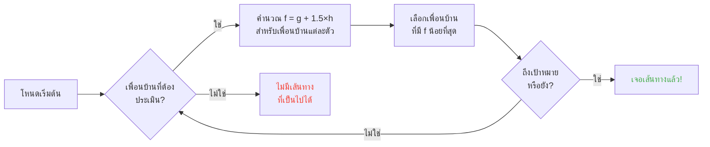

## บทนำ

ผมใช้เวลาหลายชั่วโมงดูแกะเดินชนกำแพง

และพูดตรงๆเหรอ? การลงทุนที่ดีที่สุดในชีวิตเลย xD

เพราะยิ่งคุณดูม็อบพวกนี้มากเท่าไหร่ คุณก็ยิ่งรู้ว่าพวกมันไม่ได้สุ่มเลย ทุกการเคลื่อนไหวถูกเขียนโค้ดไว้ คาดเดาได้ และที่สำคัญ -- แก้ทางได้หมด ผมเลยดำดิ่งเข้าไปในซอร์สโค้ดของ Minecraft เพื่อทำความเข้าใจว่าการหาเส้นทางทำงานยังไง และสิ่งที่ค้นพบคือคุณสามารถควบคุมจิตใจม็อบได้จริงๆ แบบ บังคับให้มันไปที่ที่คุณอยากให้ไป ไม่ใช่ที่ที่ความสุ่มเลือก

ไกด์นี้คือทุกสิ่งที่ผมเรียนรู้จากการขุดคุ้ย ระบบ AI, อัลกอริทึม A*, ค่าปรับที่ซ่อนอยู่, เอ็กซ์พลอยต์ที่คุณใช้ในเซิร์ฟวิฟอลได้ เตรียมเสียมให้พร้อม

---

## ระบบ AI ของม็อบทำงานยังไง (สปอยเลอร์: มันโคตรกาก)

### Goals (เป้าหมาย)

ม็อบทุกตัวมี *goals* มันคือลิสต์สิ่งที่มันสามารถทำได้และอยากจะทำมากแค่ไหน ยิ่งเลขน้อยยิ่งสำคัญ -- เหมือนทูดู list เวอร์ชันโกลาหล

```java
protected void registerGoals() {
   this.goalSelector.addGoal(4, new Zombie.ZombieAttackTurtleEggGoal(this, 1.0, 3));
   this.goalSelector.addGoal(8, new LookAtPlayerGoal(this, Player.class, 8.0F));
   this.goalSelector.addGoal(8, new RandomLookAroundGoal(this));
   this.addBehaviourGoals();
}
```

เคยเห็นซอมบี้ไม่สนไข่เต่าเพื่อวิ่งไล่คุณไหม? นี่คือสาเหตุ: `ZombieAttackTurtleEggGoal` มีลำดับความสำคัญ 4, ขณะที่ `ZombieAttackGoal` (สิ่งที่บอกให้มันกัดหัวคุณ) มีลำดับความสำคัญ 2

ใช่, ซอมบี้ชอบกินคุณมากกว่าไข่เต่า น่ารักชะมัด xD

Goal ที่เราสนใจจริงๆ คือ `WaterAvoidingRandomStrollGoal`, ลำดับความสำคัญ 7 goal "ฉันไม่มีอะไรทำเลยเดินสุ่มๆ" นี่คือจุดเริ่มต้นของความวุ่นวาย

### การเคลื่อนที่ (หรือ "random walk มีโอกาส 1 ใน 60 ที่จะเกิดขึ้น")

ทุก ๆ ticks (ทุก 0.05 วินาที), เกมจะเรียก `canUse()` เพื่อดูว่าม็อบยอมขยับไหม โอกาส 1 ใน 60 ในแต่ละ tick ออกแบบมาได้กากมาก และผมชอบนะ

```java
public boolean canUse() {
   if (this.mob.hasControllingPassenger()) {
      return false;
   } else {
      if (!this.forceTrigger) {
         if (this.checkNoActionTime && this.mob.getNoActionTime() >= 100) {
            return false;
         }
         if (this.mob.getRandom().nextInt(reducedTickDelay(this.interval)) != 0) {
            return false;
         }
      }
      Vec3 $$0 = this.getPosition();
      if ($$0 == null) {
         return false;
      } else {
         this.wantedX = $$0.x;
         this.wantedY = $$0.y;
         this.wantedZ = $$0.z;
         this.forceTrigger = false;
         return true;
      }
   }
}
```

สรุปคือ: ถ้าคุณขี่ม็อบอยู่ -> ไม่, ถ้าม็อบไม่ได้ทำอะไรเกิน 5 วินาที -> ไม่, ถ้าสุ่มได้ไม่ -> ไม่ เกมไม่อยากให้ม็อบขยับจริงๆ

แต่เมื่อมันขยับ `getPosition()` จะทำงานต่อ:

```java
protected Vec3 getPosition() {
   if (this.mob.isInWater()) {
      Vec3 $$0 = LandRandomPos.getPos(this.mob, 15, 7);
      return $$0 == null ? super.getPosition() : $$0;
   } else {
      return this.mob.getRandom().nextFloat() >= this.probability
         ? LandRandomPos.getPos(this.mob, 10, 7)
         : super.getPosition();
   }
}
```

ดูตัวเลขสองตัวท้ายสิ: มันคือรัศมี XZ และรัศมี Y ในน้ำ ม็อบจะมองหาไกลขึ้น (15 แทน 10) ถ้าหาที่ดินไม่เจอมันจะใช้ `super.getPosition()` ที่ยอมให้น้ำได้ **ผลลัพธ์: ม็อบอยากขึ้นจากน้ำ** นี่คือสาเหตุที่สัตว์เลี้ยงของคุณว่ายน้ำอย่างบ้าคลั่งเข้าหาฝั่ง

รายละเอียดเล็กๆ น้อยๆ: มีโอกาสแค่ 0.1% ที่ม็อบจะใช้ `super.getPosition()` แทน `LandRandomPos` หนึ่งในพัน โมแจงอะไรอย่างงี้ xD

### LandRandomPos: optimization ห่วยๆ ที่เปลี่ยนทุกอย่าง

นี่คือขั้นตอนที่ผมชอบที่สุด โค้ดกากๆ ที่ทำให้ pathfinding ใช้ประโยชน์ได้

```java
public static Vec3 getPos(PathfinderMob $$0, int $$1, int $$2, ToDoubleFunction<BlockPos> $$3) {
   boolean $$4 = GoalUtils.mobRestricted($$0, $$1);
   return RandomPos.generateRandomPos(() -> {
      BlockPos $$4xx = RandomPos.generateRandomDirection($$0.getRandom(), $$1, $$2);
      BlockPos $$5 = generateRandomPosTowardDirection($$0, $$1, $$4, $$4xx);
      return $$5 == null ? null : movePosUpOutOfSolid($$0, $$5);
   }, $$3);
}
```

`movePosUpOutOfSolid`. ชื่อบอกอยู่แล้ว ถ้าตำแหน่งที่เลือกอยู่ในบล็อกทึบ เกมจะดันมันขึ้นไปจนกว่าจะอยู่ในอากาศ

มันคือ optimization: แทนที่จะเสียเวลาข้ามตำแหน่งที่อยู่ใต้ดิน เกมจะดันมันขึ้นมาผิวดิน ฉลาดไหม? ใช่ แต่มันสร้างความลำเอียงอย่างมหาศาล: **ม็อบชอบที่สูง**

ลองนึกดู คุณมีบล็อกมากมายใต้ผิวดิน เกมสุ่ม 10 ตำแหน่ง ตำแหน่งที่อยู่ในบล็อกจะถูกดันขึ้น พื้นที่หนาแน่น (ใต้เนินเขา) ให้ตำแหน่งที่ใช้ได้มากกว่าพื้นที่โปร่ง ผลลัพธ์: ม็อบจะไปทางเนินเขามากกว่าในเชิงสถิติ

เชื่อผมสิ เราจะใช้ประโยชน์จากสิ่งนี้ใน 2 นาที

### การคัดเลือก: การประกวดบล็อกที่ดีที่สุด

10 ตำแหน่ง, ผู้ชนะคนเดียว, การประกวดคะแนน:

```java
public static Vec3 generateRandomPos(Supplier<BlockPos> $$0, ToDoubleFunction<BlockPos> $$1) {
   double $$2 = Double.NEGATIVE_INFINITY;
   BlockPos $$3 = null;
   for(int $$4 = 0; $$4 < 10; ++$$4) {
      BlockPos $$5 = (BlockPos)$$0.get();
      if ($$5 != null) {
         double $$6 = $$1.applyAsDouble($$5);
         if ($$6 > $$2) {
            $$2 = $$6;
            $$3 = $$5;
         }
      }
   }
   return $$3 != null ? Vec3.atBottomCenterOf($$3) : null;
}
```

ตำแหน่งที่มีคะแนนดีที่สุด **ชนะ** และถ้าเรารู้เกณฑ์การให้คะแนน เราก็สามารถทำให้ตำแหน่งที่เราอยากให้ชนะชนะได้ มันเหมือนโกงการเลือกตั้ง

---

## ความชอบของม็อบ (หรือ "ทำไมวัวของคุณถึงข้ามถนน")

ม็อบแต่ละตัวมีความชอบต่างกัน และนั่นเปลี่ยนทุกอย่าง

| ม็อบ | ชอบอันนี้ |
| --- | --- |
| **สัตว์** (วัว, แกะ, หมู) | หญ้าและแสง (hipsters) |
| **มอนสเตอร์** (ซอมบี้, โครงกระดูก) | ความมืด (edgelords) |
| **เต่า** | น้ำ, ถ้าไม่ได้ก็ทราย, ถ้าไม่ได้ก็แสง |
| **Hoglins** | `crimson_nylium`; เกลียด `warped_fungus` |
| **Striders** | เฉพาะลาวาเท่านั้น ไม่มีอะไรอื่น |
| **Silverfish** | บล็อกที่ infestable (ตามเหตุผล) |
| **Guardians** | น้ำ + แสง (พวกขี้งก) |
| **Mooshrooms** | Mycelium + แสง (เห็ด) |
| **ผึ้ง** | อากาศ ใช่ พวกมันชอบอากาศ |

```java
// สัตว์: มองลงไป ถ้าเป็นหญ้า ได้คะแนนเต็ม
public float getWalkTargetValue(BlockPos $$0, LevelReader $$1) {
   return $$1.getBlockState($$0.below()).is(Blocks.GRASS_BLOCK) ? 10.0F : $$1.getPathfindingCostFromLightLevels($$0);
}

// มอนสเตอร์: ตรงกันข้ามเป๊ะ
public float getWalkTargetValue(BlockPos $$0, LevelReader $$1) {
   return -$$1.getPathfindingCostFromLightLevels($$0);
}
```

มอนสเตอร์คือแบบ "ถ้ามีแสง คะแนนติดลบ ฉันไปที่อื่น" พวกมันไม่เอาแสงเลย xD

ดังนั้นคุณสามารถ -- ตามตัวอักษร -- นำทางสัตว์ด้วยหญ้าและแสง และนำทางมอนสเตอร์ด้วยความมืด มันทั้งกากและเจ๋งในเวลาเดียวกัน

---

## อัลกอริทึม A* ใน Minecraft (สูตรลับ)

Minecraft ใช้อัลกอริทึม A* (A-star) สำหรับการหาเส้นทาง แต่โมแจงเติมลูกเล่นของตัวเอง:

```
f(n) = g(n) + 1.5 × h(n)
```

- **g(n)** = เส้นทางที่เดินมาแล้ว (1 ต่อบล็อก, ~1.41 ในแนวทแยง)
- **h(n)** = ระยะทางเป็นเส้นตรง
- **1.5** = เพราะโมแจงชอบของที่กากๆ

ปกติ A* ใช้ `f(n) = g(n) + h(n)` โมแจงเติมตัวคูณ 1.5 ทำไม? เพื่อให้อัลกอริทึมไปถึงเป้าหมายเร็วขึ้นและตัดกิ่งการค้นหาน้อยลง ผลลัพธ์: เส้นทางที่ได้คือ "ดี" แต่ไม่ใช่ดีที่สุดเสมอไป มันคือ A* ที่เมาๆ



รายละเอียดสำคัญ: **ม็อบสามารถหาเส้นทางได้แค่ 16 บล็อก** (ค่าช่วงติดตามหรือ *follow range*) ถ้าเป้าหมายไกลเกินไป มันจะเลือกบล็อกที่ใกล้ที่สุดที่มันเข้าถึงได้ นั่นหมายความว่าคุณสามารถสร้างเสาหินที่ไกลเกินเอื้อม และม็อบจะหาเส้นทางไปยังบล็อกที่ใกล้ที่สุดที่ทำให้มันเข้าใกล้เสาหินนั้น -- ทำให้การเคลื่อนที่ของมันคาดเดาได้อย่างสมบูรณ์

### สองเอ็กซ์พลอยต์ที่พังเกม

#### 1. การอัปเดตบล็อก = บังคับคำนวณใหม่

```java
public boolean shouldRecomputePath(BlockPos $$0) {
   if (this.hasDelayedRecomputation) return false;
   if (this.path != null && !this.path.isDone() && this.path.getNodeCount() != 0) {
      Node $$1 = this.path.getEndNode();
      Vec3 $$2 = new Vec3(
         ((double)$$1.x + this.mob.getX()) / 2.0,
         ((double)$$1.y + this.mob.getY()) / 2.0,
         ((double)$$1.z + this.mob.getZ()) / 2.0
      );
      return $$0.closerToCenterThan($$2, (double)(this.path.getNodeCount() - this.path.getNextNodeIndex()));
   }
   return false;
}
```

ทุกครั้งที่มีการอัปเดตบล็อกใกล้เส้นทางของม็อบ จะบังคับให้คำนวณ A* ใหม่ โดยมีคูลดาวน์ 1 วินาที ถ้าคุณวางนาฬิกา 1 วินาทีไว้ใกล้ม็อบ มันจะคำนวณเส้นทางใหม่ตลอดเวลา เทียบได้กับการรีเซ็ต GPS ทุกวินาที

และถ้าคุณทำแบบนี้กับ 50 ม็อบพร้อมกัน? Lag city. RIP TPS

#### 2. ค่าปรับของบล็อก (Pathfinding Malice)

บางบล็อกทำให้ม็อบกลัว ตามตัวอักษร แต่ละบล็อกมีค่าใช้จ่ายที่กำหนดโดย enum:

| บล็อก / เงื่อนไข | ค่าปรับ |
| --- | --- |
| **บล็อกน้ำผึ้ง** | +8 ในการเดินผ่าน |
| **ผงหิมะ** | เดินผ่านไม่ได้ |
| **ประตูปิด** | เดินผ่านไม่ได้ |
| **ไฟ** | +16 ในการเดินผ่าน, +8 ในการเดินเลียบ |
| **สัตว์ & ชาวบ้าน** | ไฟ = -1 (NOPE) |
| **กระบองเพชร / Sweet berry** | เดินผ่านไม่ได้; ติดกัน = +8 |
| **น้ำ** | +8 ในการเดินผ่านหรือเลียบ |
| **แมกมา** | +8 ในการเดินเลียบ (เจ็บ) |

สัตว์ยิ่งสุดขั้วไปอีก:

```java
protected Animal(EntityType<? extends Animal> $$0, Level $$1) {
   super($$0, $$1);
   this.setPathfindingMalus(PathType.DANGER_FIRE, 16.0F);
   this.setPathfindingMalus(PathType.DAMAGE_FIRE, -1.0F);
}
```

DAMAGE_FIRE ที่ -1.0F, มันคือ "ห้ามเด็ดขาด" สัตว์ยอมกระโดดลงเหวดีกว่าผ่านไฟ ว้าว

### แบบฝึกหัด: การประกวดเส้นทาง

ลองนึกภาพชาวบ้านที่ต้องเลือกระหว่างหลายเส้นทาง

- **เส้นทาง A**: 15 บล็อก แต่ 6 บล็อกเลียบน้ำ (+8 แต่ละอัน)
- **เส้นทาง B**: 18 บล็อก มีน้ำ 2 บล็อก (+8) และติดน้ำ 1 บล็อก (+8)
- **เส้นทาง C**: 14 บล็อกตรง... แต่มีไฟ -> ผ่านไม่ได้สำหรับชาวบ้าน
- **เส้นทาง D**: 16 บล็อก ติดแมกมา 1 บล็อก (+8) + ติดน้ำผึ้ง 1 บล็อก (+8)
- **เส้นทาง E**: 25 บล็อก แต่กระบองเพชรเต็มไปหมด (+8 ทุกอัน) -> 90.82 ต้นทุนรวม LOL

คิดเลขในใจ:

- เส้นทาง A: 15 บล็อก + 6×8 ค่าน้ำ = 15 + 48 = **63** ... แต่ต้องบวก 1.5×ระยะทางด้วย มาคำนวณจริงกัน
- เส้นทาง B: ยาวกว่าแต่ค่าปรับน้อยกว่า ต้นทุนรวม = ระยะทางสะสม + ค่าปรับ
- เส้นทาง D: แมกมาและน้ำผึ้งรวมค่าปรับกัน

ผู้ชนะส่วนใหญ่คือ **เส้นทาง B**: การอ้อมคุ้มค่าเพราะน้ำแพง

ชาวบ้านก็คือเครื่องคำนวณต้นทุนที่มีขา xD

### ม็อบแต่ละตัวมีความชอบของตัวเอง

ชาวบ้าน: "ไฟเหรอ? ไม่เอา THANK YOU BYE"
ซอมบี้: "ไฟเหรอ? OK boomer *เดินลุยไฟทั้งตัว*"

คุณมีถนนที่ม็อบบางตัวเดินได้และบางตัวเดินไม่ได้ คุณสามารถสร้างทางด่วนสำหรับชาวบ้านที่ซอมบี้จะไหม้ตาย

---

## ชาวบ้าน: ความยุ่งเหยิงสูงสุด

โอเค ชาวบ้าน นี่คือสิ่งที่คนส่วนใหญ่เข้าใจผิดมากที่สุดใน Minecraft แต่เมื่อคุณเข้าใจโค้ดแล้ว คุณจะรู้ว่าพวกมันคือเครื่องจักรที่คาดเดาได้พร้อมตารางงานออฟฟิศ

### เซ็นเซอร์และความจำ

9 เซ็นเซอร์, ทำงานทุก 20 ticks (1 วินาที) แต่ละตัวสแกนรัศมีรอบชาวบ้านและเก็บผลลัพธ์ในความจำ ชาวบ้านเห็นทุกอย่าง จำทุกอย่าง และทำตามนั้น

แบบ: "มีศัตรูไหม? ของตกพื้นไหม? ผู้เล่นที่จะคุยด้วยไหม?" -- มันเช็คทุกอย่าง

### Packages (ช่วงเวลาของวัน)

สมองของชาวบ้านคือ packages ของกิจกรรมที่เปิดใช้งานตามเวลา:

| Package | เวลา | ชาวบ้าน... |
| --- | --- | --- |
| **Core** | ตลอด 24 ชม. | เปิดประตู, ว่ายน้ำ (80% ของเวลา), และหา POI |
| **Work** | 8 โมง - บ่าย 3 | "ฉันจะไปทำงาน" -- เดินไปที่ทำงาน |
| **Meet** | บ่าย 3 - บ่าย 5 | "แฮปปี้เอาเวอร์!" -- ไปที่ระฆัง, คุยเล่น |
| **Rest** | 6 โมงเย็น - ตี 6 | "ต้องนอน" -- ไปที่นอน |
| **Idle** | ตี 6 - 8 โมง, บ่าย 5 - 6 โมงเย็น | "ฉันขี้เกียจ" -- เดินเล่น, ทำเด็ก, กระโดดบนเตียง |
| **Panic** | บาดเจ็บ/มีศัตรู | "ช่วยด้วย" -- หนี |

Package **Panic** เป็นตัวเดียวที่สามารถขัดจังหวะทุกตัวอื่น แม้ชาวบ้านกำลังนอนหรือทำงาน ถ้ามีซอมบี้ ตื่นตระหนกถ้วนหน้า

### Acquire POI: สิ่งที่ทำให้มีเรดสโตนไร้สาย

```java
Set<Pair<Holder<PoiType>, BlockPos>> $$12 = (Set)$$10xx.findAllClosestFirstWithType(
   $$0, $$11, $$8x.blockPosition(), 48, PoiManager.Occupancy.HAS_SPACE
)
```

`Acquire POI` สแกนรัศมี 48 บล็อกเพื่อหา POI (จุดสนใจ) ทั้งหมด มันเก็บ 5 อันที่ใกล้ที่สุด ตรวจสอบว่ามีเส้นทางไปถึง และจับจองอันแรกที่เข้าถึงได้

POI แต่ละอันมีจำนวนสล็อตจำกัด:
- **ที่ทำงาน**: 1 สล็อต
- **เตียง**: 1 สล็อต
- **ระฆัง**: 32 สล็อต

สิ่งที่บ้ามาก: **สล็อตถูกจองตอนที่จับจอง ไม่ใช่ตอนที่ไปถึง** ชาวบ้านสามารถล็อก composter จากอีกฟากของแผนที่ โดยไม่ต้องเดินไปถึง

คุณเห็นพลังแล้วใช่ไหม?

### เรดสโตนไร้สาย ใช่ ไร้สาย

1. วางชาวบ้านใน minecart พร้อมเส้นทางไปยัง composter
2. มันจับจอง composter (สล็อตถูกใช้, คนอื่นใช้ไม่ได้)
3. ชาวบ้านอยู่ไกลเกินกว่าจะคลิก -- bone meal ยังอยู่
4. คุณพาชาวบ้านคนนี้ไปไหนก็ได้ในโลก มันยังถือสล็อตอยู่
5. เมื่อคุณอยากเปิดเครื่องของคุณ คุณ **ฆ่า** ชาวบ้าน
6. สล็อตถูกปล่อย, ชาวบ้านอีกคนจับจอง composter, นำ bone meal ออก
7. BLOCK UPDATE -> วงจรเรดสโตนใดๆ ถูกกระตุ้น

คุณสร้างสัญญาณเรดสโตนไร้สาย, ส่งได้ทั่วโลก, โดยไม่ต้องโหลด chunk ระหว่างทางเลย คุณสามารถต่อมันกับ ender pearl stasis chamber, เทเลพอร์ตมาจากไหนก็ได้โดยการฆ่าชาวบ้าน

ที่ผมชอบใช้? มินิเกม "bounty hunter": วางชาวบ้านหลายตัวพร้อม composters, ผู้เล่นต้องฆ่าชาวบ้านที่ถูกต้องเพื่อเปิดทางออก มันบ้ามาก xD

### Pathfinding Deadlock (หรือ "ชาวบ้านที่ค้างตลอดกาล")

มีบั๊กที่โคตรดีระหว่าง `Acquire POI` (ที่เห็นเส้นทาง) กับการนำทางจริง (ที่ไม่ยอมใช้) มันเกิดขึ้นเมื่อบล็อกเหนือที่ทำงานไม่สามารถเดินได้ ผลลัพธ์:

- Core package: "ฉันอยากจับจอง POI"
- การนำทาง: "ฉันเดินไปตรงนั้นไม่ได้"
- ผลลัพธ์: ชาวบ้านค้างอยู่กับที่ ตลอดกาล สู้กับตัวเอง

ชาวบ้านแช่แข็งอยู่กับที่ ใช้เป็นของตกแต่งหรือ "อุปกรณ์ประกอบฉาก" ในบิ้วด์ ถังใส่ชุดเกราะ? ได้ ยามที่ไม่ขยับ? ได้ โหดร้ายไหม? อาจจะ แต่เวิร์คนะ xD

---

## บทสรุป

การหาเส้นทางของม็อบใน Minecraft ไม่ใช่เรื่องสุ่ม มันคือระบบที่กำหนดได้, ใช้คะแนน, คาดเดาได้ และพังได้

**สามสิ่งที่ต้องจำ:**

1. **บล็อกใต้เท้า = ความลำเอียงด้านความสูง** -- เติมหรือทำให้ชั้นใต้ดินว่างเพื่อนำทางม็อบ
2. **ค่าปรับแตกต่างกันในแต่ละม็อบ** -- สร้างถนนที่บางตัวใช้และบางตัวใช้ไม่ได้
3. **สล็อต POI ถูกจองจากระยะไกล** -- เรดสโตนไร้สายฟรี, เทเลพอร์ต, และอื่นๆ

ซอร์สโค้ดของ Minecraft เป็นเหมืองทองของกลไกที่ถูกใช้น้อยเกินไป ผมใช้เวลาหลายชั่วโมงอ่าน Java ที่ดีคอมไพล์แล้ว และพูดตรงๆเหรอ? ทุกบรรทัดคือ Easter Egg ที่ใช้งานได้ เว้นแต่อันนี้ คุณใช้มันในเซิร์ฟวิฟอลเพื่อทำเรดสโตนไร้สายกับชาวบ้าน เยี่ยมที่สุดยืนยัน

xD
