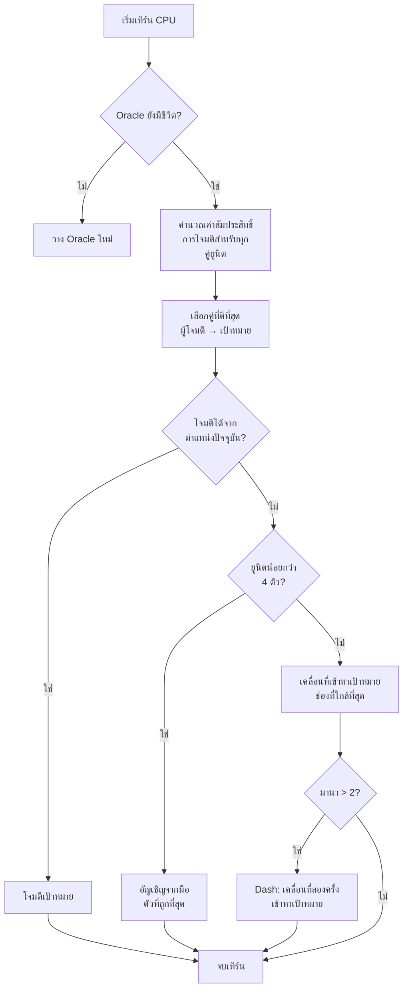

## AI ขี้โกงของฉันสำหรับ Nausicaa

มีโปรเจกต์ที่เริ่มจาก "เฮ้ ถ้าฉันทำเกมหมากรุกกับเทพปกรณัมล่ะ" แล้วจบลงด้วย AI ที่ตัดสินใจไฮเปอร์พารามิเตอร์ของตัวเองทุก 5 เทิร์น

Nausicaa ก็เป็นแบบนั้น เกมกระดานผลัดกันเดินที่คุณสร้างเด็คสัตว์ในตำนาน จัดการมานา วางยูนิตบนกระดาน 10x8 และมี AI ที่มี多重บุคลิกภาพ

ฉันใช้เวลากับ AI นี้พอสมควร และผลลัพธ์ก็ค่อนข้างจะจัดการยาก xD

## เกมจริง ๆ

ก่อนจะพูดถึงสมอง ต้องเข้าใจร่างกายก่อน:

- กระดาน 10x8 พื้นที่วางกำลัง 2 แถวต่อผู้เล่น
- มานาเริ่มที่ 1 +1 ต่อเทิร์น สูงสุด 6 ใช้จ่ายเพื่ออัญเชิญ โจมตี ใช้ความสามารถ
- เป้าหมาย: ฆ่า Oracle ของฝ่ายตรงข้าม

12 ยูนิต แต่ละตัวมีต้นทุนและรูปแบบการเดินต่างกัน:

| Unit | ต้นทุน | การเคลื่อนที่ | HP |
| --- | --- | --- | --- |
| Oracle | 0 | King (8 ทิศทาง) | 1 |
| Gobelin | 1 | ไปข้างหน้า 3 ช่อง | 1 |
| Harpie | 1 | King (8 ทิศทาง) | 1 |
| Naïade | 1 | แนวทแยง | 1 |
| Griffin | 2 | กระโดด 2 ช่อง | 2 |
| Sirène | 2 | แนวข้าง | 1 |
| Centaure | 2 | อัศวิน (รูปตัว L) | 2 |
| Archer | 3 | แนวข้าง | 1 |
| Phénix | 3 | แนวทแยง (ช่องสีเข้ม) | 1 |
| Métamorphe | 4 | สลับตำแหน่ง | 1 |
| Voyant | 4 | ไม่เคลื่อนที่ (สร้างมานา) | 1 |
| Titan | 6 | จำกัด (โจมตีเป็นพื้นที่) | 3 |

แต่ละยูนิตมีรูปแบบการโจมตีของตัวเอง Sirène โจมตี 4 แนวทแยง Archer ยิงระยะ 3 ช่อง Titan ทำลายทุกอย่างรอบตัวเมื่ออัญเชิญ สั้น ๆ คือหมากรุกผสมเทพปกรณัมและเด็คบิวดิ้ง xD

## ฉันทำให้ CPU คิดได้ยังไง

แนวคิดพื้นฐานง่ายมาก: **ยูนิตศัตรูแต่ละตัวมีค่าสัมประสิทธิ์ความน่าสนใจ** ยิ่งอันตรายมากเท่าไหร่ AI ยิ่งอยากจัดการ

```javascript
const UNITS_ATTRACTIVENESS = {
    "oracle": 100,
    "titan": 95,
    "shapeshifter": 90,
    "phoenix": 80,
    "siren": 70,
    "archer": 70,
    "seer": 70,
    "griffin": 60,
    "centaur": 60,
    "harpy": 50,
    "naiad": 30,
    "gobelin": 20
};
```

Oracle 100 -- ก็เหตุผลนะ มันคือเงื่อนไขชนะ Titan 95 เพราะมัน one-shot ทุกอย่างรอบข้างตอนอัญเชิญ Gobelin 20 เป็นแค่ทหารเดินดิน ไม่สน

จากนั้นสำหรับคู่ยูนิตแต่ละคู่ (ฝ่ายเราหนึ่ง ฝ่ายศัตรูหนึ่ง) ผมคำนวณ:

```
ความสนใจ = ความน่าสนใจ × สัมประสิทธิ์_ความน่าสนใจ / (ระยะทาง × สัมประสิทธิ์_ระยะทาง)
```

พูดง่าย ๆ คือ ยิ่งอันตรายและใกล้มากเท่าไหร่ AI ยิ่งอยากจัดการ

```javascript
calculateAttackCoefficient(x1, y1, x2, y2) {
    const distance = this.calculateEuclideanDistance(x1, y1, x2, y2);
    if (distance === 0) return Infinity;
    return (UNITS_ATTRACTIVENESS[unit.type] * COEFFICIENTS_IMPORTANCE["attractiveness"]) / distance;
}
```

### ทริคค่าสัมประสิทธิ์ที่เปลี่ยนไป

ที่สนุกคือค่าสัมประสิทธิ์ความสำคัญ **เปลี่ยนแบบสุ่มทุก 5 เทิร์น**

```javascript
if (this.turnCount % 5 === 0) {
    const distanceCoefficient = parseInt(Math.random() * 100);
    const attractivenessCoefficient = parseInt(Math.random() * 100);
    this.regulateImportanceCoefficients({
        distance: distanceCoefficient,
        attractiveness: attractivenessCoefficient
    });
}
```

รอบนึง AI จะ aggressive สุด (attract 95, distance 5) วิ่งฝ่าทุกอย่างเพื่อฆ่า Oracle รอบถัดไปมันกลับให้ความสำคัญกับระยะทางและ reposition

แนวคิดนี้เอามาจากผีใน Pac-Man -- Blinky ไล่ล่า, Pinky ดักซุ่ม ที่นี่ AI เปลี่ยน "บุคลิกภาพ" ทุกเฟส

**ผลลัพธ์: ไม่มีทางคาดเดา AI ได้ตลอดทั้งเกม** CPU ไม่เคยเล่นสองครั้งเหมือนกัน

### Oracle ขี้ขลาด

Oracle ของศัตรูหนี ตามตัวอักษร

```javascript
const awayFromTarget = {
    row: Math.max(0, Math.min(7, botUnitElement.row + (botUnitElement.row - targetUnitElement.row))),
    col: Math.max(0, Math.min(9, botUnitElement.col + (botUnitElement.col - targetUnitElement.col)))
};
```

มันคำนวณทิศทางตรงข้ามกับภัยคุกคามและวิ่งหนี ถ้าเจอกำแพงก็หาช่องว่างที่ใกล้ที่สุดในทิศทางนั้น

ใช้ 3 เทิร์นเดินเข้าไปหา Oracle แล้วปุ๊บมันก็หนีไปแล้ว xD

### ลูปการตัดสินใจ

นี่คือวิธีที่ AI ตัดสินใจ:

1. ถ้าไม่มี Oracle (ตาย) ให้วาง Oracle ใหม่
2. คำนวณค่าสัมประสิทธิ์สำหรับทุกคู่ยูนิตฝ่ายเรา → ยูนิตศัตรู
3. เลือกคู่ที่ดีที่สุด
4. ถ้ายูนิตสามารถโจมตีเป้าหมายจากตำแหน่งปัจจุบันได้ → โจมตี
5. ถ้ามียูนิตน้อยกว่า 4 ตัว → อัญเชิญยูนิตที่ถูกที่สุดที่มีในมือ
6. ถ้าไม่ → เคลื่อนที่เข้าหาเป้าหมาย (ช่องเคลื่อนที่ที่ใกล้ศัตรูที่สุด)
7. ถ้ามีมานาเพียงพอ (> 2) → dash (เคลื่อนที่สองครั้ง) เพื่อเข้าใกล้ยิ่งขึ้น
8. ถ้ายูนิตคือ Oracle → หนี



```javascript
async makeAction(dash=false) {
    // ทุกอย่างเป็นลำดับ
    // CPU dash ถ้ามีมานาพอ
    if(botPlayer.mana > 2) {
        this.makeAction(true);
    }
}
```

### ทำไมใช้ระยะทางแบบยุคลิด

ผมใช้ระยะทางแบบยุคลิด:

```javascript
calculateEuclideanDistance(x1, y1, x2, y2) {
    const deltaX = Math.pow(x1 - x2, 2);
    const deltaY = Math.pow(y1 - y2, 2);
    return Math.sqrt(deltaX + deltaY) * COEFFICIENTS_IMPORTANCE["distance"];
}
```

ทำไมไม่ใช้ Manhattan? เพราะยูนิตมีรูปแบบการเคลื่อนที่หลากหลาย (L แบบอัศวิน, แนวทแยง ฯลฯ) ระยะทางเป็นเส้นตรงประมาณอันตรายได้ดีกว่า

## ทำไมไม่ใช้ minimax

ฉันอาจจะเขียน minimax ทั่วไปก็ได้ แต่ด้วยยูนิต 12 แบบ รูปแบบการเคลื่อนที่ต่างกัน ความสามารถพิเศษ... ต้นไม้เกมแตกกิ่งเร็วมากจนเล่นไม่ได้ วิธีฮิวริสติกเลือกอย่างฉลาดโดยไม่ต้องสำรวจหลายสิบล้านสถานะ

## สิ่งที่เจ๋ง

ระบบความน่าสนใจสร้างสถานการณ์กลilemmas ที่สนุก:

- Voyant (70) สร้างมานา ถ้าปล่อยไว้ ฝ่ายตรงข้ามมีทรัพยากรมากขึ้น แต่ Titan (95) ก็อันตรายกว่า
- Métamorphe (90) สามารถสลับตำแหน่งกับยูนิตใดก็ได้ มันสามารถขโมย Oracle ของคุณได้
- Harpie (50) มีการโจมตีแบบระเบิดที่ฆ่าตัวเองด้วย ไม่ใช่เป้าหมาย priority... จนกว่ามันจะอยู่ติดกับ 3 ยูนิตของคุณ

AI ประเมินอันตรายโดยรวมตามตำแหน่ง ไม่ใช่แค่สถิติดิบ

นอกจากนี้ยังมีฟังก์ชัน `activateSimulation()` สำหรับทดสอบสถานการณ์โดยไม่ต้องเล่นใหม่:

```javascript
activateSimulation() {
    // วางยูนิตเฉพาะบนกระดาน
    // มีประโยชน์สำหรับ debug AI
    this.game.board = simulation.board;
    this.game.players = simulation.players;
}
```

## สิ่งที่ขาดไป

ถ้ามีเวลาเพิ่ม:

- AI ตอบสนองต่อสถานะปัจจุบัน ไม่ได้ทำนายสิ่งที่ผู้เล่นจะทำ
- ไม่ได้วางแผนการใช้มือข้ามหลายเทิร์น
- Métamorphe และ Centaure มีความสามารถที่ AI ใช้ได้ไม่เต็มที่
- Reinforcement learning: ให้มันเล่นกับตัวเองเพื่อปรับค่าสัมประสิทธิ์

แต่สำหรับเกมบนเบราว์เซอร์ก็ใช้ได้ เพื่อนบางคนยังแพ้มันอยู่ ก็ถือว่าใช้ได้ xD

## ทดลองเล่น

เล่นได้ที่ [nausicaa-game.github.io](https://nausicaa-game.github.io/) คลิก "JOUER" เปิด CPU mode แล้วดู AI เล่น

คำแนะนำ: ให้ AI เล่นกับตัวเอง คุณจะเห็นช่วงที่ aggressive แล้วจู่ ๆ ก็ถอยหมด

โค้ดอยู่บน [GitHub](https://github.com/nausicaa-game/nausicaa-game.github.io) ใน `js/cpu.js`

**3 สิ่งที่จำไว้:**

1. **ค่าสัมประสิทธิ์ฮิวริสติก** -- ไม่มี minimax แต่ละยูนิตมีความน่าสนใจ
2. **ค่าสัมประสิทธิ์เปลี่ยนทุก 5 เทิร์น** -- AI สลับระหว่าง aggressive และควบคุม แบบ Pac-Man
3. **Oracle หนี** -- มันคำนวณทิศทางตรงข้ามภัยคุกคามและวิ่ง

ถ้าคุณมีไอเดียทำให้ AI โหดยิ่งขึ้น เปิด issue ได้เลย ฉันมีแผนสำหรับเวอร์ชันที่เรียนรู้จากความพ่ายแพ้ แต่คงไว้บทความหน้า xD
