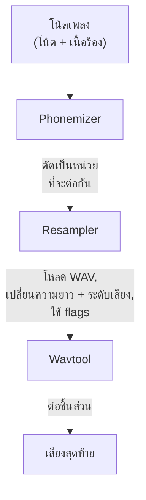

## UTAU: ซอฟต์แวร์ Visual Basic 6 ที่ทำให้เสียงสังเคราะห์เป็นของทุกคน

ผมเคยพูดถึงมันไปแล้วบนหน้าเว็บหลัก: ผมชอบ UTAU นี่คือเหตุผล

ปี 2008 ถ้าคุณอยากให้เสียงสังเคราะห์ร้องเพลง คุณมีทางเลือกเดียว: VOCALOID ซอฟต์แวร์ของ Yamaha แพง เป็นลิขสิทธิ์ มีแต่เสียงทางการที่คุณสร้างเองไม่ได้

แล้วก็มีคนญี่ปุ่นคนหนึ่ง ชื่อ Ameya/Ayame ที่ปล่อยอะไรบางอย่างออกมาจากมุมห้องของเขา ซอฟต์แวร์ที่เขียนด้วย **Visual Basic 6** ฟรี ให้คุณสร้างเสียงของคุณเองด้วย... ไฟล์ WAV ที่คุณอัดเอง

สิ่งนั้นชื่อ **UTAU** (歌う, "ร้องเพลง" ในภาษาญี่ปุ่น) และสำหรับยุคนั้น มันคือเวทมนตร์

ผมรู้สึกว่าซอฟต์แวร์นี้น่าทึ่งเสมอ ไม่ใช่เพราะมันสะอาดทางเทคนิค (สปอยล์: จริง ๆ แล้วต้องคิดหนักมากถึงจะสร้างสิ่งนี้ได้... มันเละเทะมาก ผมร้องไห้กับเจ้าไก่ตัวนี้) แต่เพราะมันทำสิ่งที่ไม่มีใครอื่นทำ: มันนำการสังเคราะห์เสียงมาสู่คนทั่วไป แบบคุณ ผม ใครก็ตามที่มีไมโครโฟน

ให้ผมอธิบายว่าทำไมมันถึงเจ๋ง

---

## ก่อนอื่น ทำไมการสังเคราะห์เสียงร้องถึงยาก

เสียงร้องเพลงไม่ใช่แค่โน้ตดนตรี คุณมีพยัญชนะที่เริ่มต้น สระที่ยืด ลมหายใจ การเปลี่ยนผ่านระหว่างทั้งสอง "sa" ใน "สวัสดี" คือ "ส" ที่เสียดแล้วไถลไปหา "อา" ที่เปิดกว้าง และการไถลนี้แหละที่ทำให้ฟังดูเป็นมนุษย์หรือไม่

วันนี้เราใช้ deep learning แก้ปัญหา: ฝึกโมเดลกับชั่วโมงเสียงร้อง แล้วมันจะสร้างเสียงออกมา (Synthesizer V, DiffSinger) แต่นั่นคือปี 2020+ ส่วนปี 2008 ไม่มีอะไรเลย

UTAU ใช้วิธีก่อนหน้า ที่เก่ากว่าและฉลาดกว่า: **การสังเคราะห์แบบต่อเนื่อง (concatenative synthesis)**

---

## การสังเคราะห์แบบต่อเนื่อง: การตัดต่อเสียงพูด

แนวคิดง่ายมาก: คุณอัดเสียงเล็ก ๆ แล้วนำมาต่อกันเป็นคำ "สวัสดี" = ตัวอย่าง "สวะ" + "สดี" ต่อกัน เป็นจิ๊กซอว์เสียงที่ควบคุมด้วยโน้ตเพลง

มันคือหลักการเดียวกับ YouTube Poop ที่ตัดคำตัวละครมาพูดอะไรก็ได้ -- แต่ที่นี่มันเป็นระบบและอัตโนมัติ

และ UTAU มาจากสิ่งนั้นโดยตรง ก่อนหน้ามันมี **"Jinriki Vocaloid"** (人力ボーカロイド, "Vocaloid แบบใช้มือ") : คนตัดเสียงร้องด้วยมือ แยกหน่วยเสียง ปรับระดับเสียง แล้วประกอบกลับในโปรแกรมตัดต่อเสียงเพื่อเลียนแบบเสียง VOCALOID ทำด้วยมือ คุณลองคิดดูว่ามันงานขนาดไหน

Ameya มองดูความยากลำบากนี้แล้วเขียนเครื่องมือเพื่อทำให้มันอัตโนมัติ โดยพื้นฐานแล้ว UTAU ตอนแรกเป็นแค่ตัวช่วยสำหรับ Vocaloid แบบใช้มือ

---

## ทำไมมันถึงปฏิวัติวงการ: คุณสร้างเสียงเอง

นี่คือสิ่งที่เปลี่ยนทุกอย่าง

VOCALOID คุณซื้อเสียง Miku, Luka ฯลฯ สร้างโดยมืออาชีพ ขายโดย Yamaha ไม่มีทางสร้างเองได้ UTAU **ใครก็ได้อัดเสียงตัวเองแล้วทำให้เป็นเครื่องดนตรีร้องเพลงได้**

โหมด CV (แบบง่ายที่สุด) คือ: คุณอัด ~100 พยางค์พื้นฐานของภาษาญี่ปุ่น ("a", "ka", "sa", "ta"...) ตั้งค่าจุดตัด เท่านี้ก็ได้ voicebank ของคุณแล้ว ใช้เวลาไม่กี่ชั่วโมง

ผลลัพธ์: ระบบนิเวศระเบิดขึ้น มี voicebanks นับพันที่สร้างโดยชุมชน -- เสียงแฟน เพื่อน ตัวละครที่สร้างขึ้น โลกทั้งใบของนักร้องเสมือน ฟรี และซอฟต์แวร์มาพร้อม **Defoko** (Utane Uta) เสียงเริ่มต้นที่สร้างผ่าน TTS AquesTalk ดังนั้นคุณเริ่มได้แม้ไม่มีไมโครโฟน

---

## oto.ini: หัวใจของระบบ

UTAU รู้ได้ยังไงว่าต้องตัดและต่อเสียงตรงไหน? ผ่านไฟล์คอนฟิกของแต่ละ voicebank: **`oto.ini`** สำหรับ WAV แต่ละไฟล์ มันกำหนดจุดตัด (ในหน่วยมิลลิวินาที):

- **Offset** → ตัดความเงาที่ต้นทิ้ง
- **Preutterance** → จุดที่พยัญชนะเปลี่ยนเป็นสระ (ขอบ "ส"→"อา" ใน "สา")
- **Overlap** → จำนวนที่โน้ตก่อนหน้าทับซ้อนกับโน้ตนี้
- **Fixed region** → ส่วนที่ห้ามยืดเมื่อเล่นโน้ตยาว (โดยปกติคือพยัญชนะ)
- **Cutoff** → จุดตัดท้าย

**Preutterance** เป็นพารามิเตอร์ที่ฉลาดที่สุด พยางค์มักมีส่วนพยัญชนะก่อนสระ เพื่อให้โน้ตตรงจังหวะ *สระ* ต้องตรงจังหวะ ไม่ใช่พยัญชนะ UTAU จึงเลื่อนตัวอย่างไปข้างหลัง: "อา" ของ "สา" ลงจังหวะพอดี "ส" เลยออกมาก่อนหน้านิดหน่อย เหมือนมือกลองที่ดีดก่อนเพื่อให้เสียงตรงจังหวะ -- ต่างกันตรงที่มันอยู่ใน `.ini`

ในเชิงภาพ สำหรับตัวอย่าง "ka" โซนต่าง ๆ ใน `oto.ini` ตัดแบ่งแบบนี้:

```mermaid
flowchart LR
    A["🔇 ความเงียบ<br/>(offset)"] --> B["🅺 พยัญชนะ<br/>(fixed region,<br/>ไม่ยืด)"]
    B --> C["🅰 สระ<br/>(โซนที่ยืดได้)"]
    C --> D["🔇 ตัดท้าย<br/>(cutoff)"]
    style B fill:#3b4a6b
    style C fill:#5b3b6b
```



เส้นแบ่งระหว่างพยัญชนะและสระคือ preutterance สระคือโซนที่ยืดสำหรับโน้ตยาว ส่วนพยัญชนะคงเดิม ไม่งั้น "ก" ของคุณจะยาวสองวินาทีแล้วฟังดูแย่

```ini
# oto.ini (แบบง่าย)
# ไฟล์=alias,offset,consonant,cutoff,preutterance,overlap
_ka.wav=ka,120,80,-200,90,40
```

ห้าค่าต่อเสียง สำหรับทุกตัวอย่างของคุณ แล้ว UTAU ก็ประกอบคำใดก็ได้อย่างถูกต้อง

---

## CV, VCV, CVVC: การไล่ตามความสมจริง

โหมดพื้นฐาน **CV** (Consonant-Vowel) คือหนึ่งเสียงต่อหนึ่งพยางค์ ง่ายแต่ค่อนข้างหุ่นยนต์: รอยต่อระหว่างพยางค์หยาบ

ปี 2010 ชุมชนคิดค้น **VCV** (Vowel-Consonant-Vowel) แทนที่จะอัด "ka" เฉย ๆ คุณอัด "a ka" -- มีหางของสระก่อนหน้าด้วย การเปลี่ยนผ่านเป็นธรรมชาติเพราะมัน *อยู่ใน* เสียงที่อัด ไม่ใช่คำนวณทีหลัง

จุดที่น่าสนใจ: **VOCALOID ไม่มี VCV จนกระทั่ง VOCALOID3 ในปี 2011** ซอฟต์แวร์ฟรีที่เขียน VB6 โดยคนคนเดียวเอาชนะ Yamaha ได้หนึ่งปีในเรื่องความสมจริงของการเปลี่ยนผ่าน ชุมชนแฟน ๆ เร็วกว่าบริษัทข้ามชาติ

ต่อมามี **CVVC**, **ARPAsing** (ภาษาอังกฤษ), **VCCV**... แต่ละวิธีผลักดันความสมจริงยิ่งขึ้นไปอีก ทั้งหมดถูกคิดค้นและบันทึกโดยชุมชน

---

## ขั้นตอนทั้งหมด: คำกลายเป็นเสียงได้อย่างไร

เมื่อคุณวางโน้ตและพิมพ์เนื้อเพลง นี่คือสิ่งที่เกิดขึ้นเบื้องหลัง:



**Resampler** คือชิ้นส่วนสำคัญ: มันนำตัวอย่าง "ka" ที่อัดที่ระดับเสียงหนึ่งมายืด/ปรับระดับเสียงให้ตรงกับโน้ตที่ต้องการ -- โดยยืดเฉพาะส่วนที่ยืดได้ และคงพยัญชนะไว้เหมือนเดิม (นี่คือที่มาของ `oto.ini`)

และมันเป็น **โมดูลาร์** UTAU มาพร้อม resampler พื้นฐาน แต่ชุมชนได้ทำเพิ่มเติม (moresampler, TIPS...) แต่ละตัวมีลายเซ็นเสียงของตัวเอง คุณเปลี่ยนเอนจินสังเคราะห์ได้เหมือนเปลี่ยนปลั๊กอิน ในปี 2008 บนซอฟต์แวร์ฟรี

---

## ความเละเทะใต้ฝาครอบ (และทำไมมันถึงน่ารัก)

ต้องพูดตรง ๆ เกี่ยวกับสภาพเทคนิคของเจ้านี่:

- **เขียนด้วย Visual Basic 6** ภาษาที่ตายแล้วในปี 2008 ต้องใช้ runtime VB6 ถึงจะรันได้
- **Windows only ตั้งแต่แรก** (พอร์ต Mac, UTAU-Synth, มาในปี 2011)
- **ต้องใช้การเข้ารหัส Shift-JIS** ถ้าไฟล์ของคุณไม่ได้เข้ารหัส Shift-JIS ญี่ปุ่น UTAU จะไม่เข้าใจอะไรเลย ถึงทุกวันนี้ก็ต้องตั้งค่า locale ของ PC เป็นญี่ปุ่นหรือใช้ AppLocale เพื่อเปิด
- **หน้าตาดูเรียบ** เอกสารเกือบ 100% เป็นภาษาญี่ปุ่นในยุคนั้น

และกระนั้น กระนั้นเจ้านี่ก็สร้างกระแสระดับโลก Voicebanks นับหมื่น เพลงที่ถูกฟังเป็นล้านครั้ง

ตัวอย่างที่ดีที่สุด: **Kasane Teto** ตัวละครที่สร้างในปี 2008 ปล่อยเป็นเรื่องหลอกวันเอพริลฟูล โดยแกล้งทำเป็น VOCALOID มันเป็นเรื่องตลก แต่คนชอบตัวละครนี้ มีการสร้าง voicebank UTAO จริงขึ้นมาภายหลัง และ Teto กลายเป็นหนึ่งในนักร้องเสมือนที่มีชื่อเสียงที่สุดในโลก ปี 2023 เธอได้มีเสียง Synthesizer V อย่างเป็นทางการด้วยซ้ำ ตัวละครที่เกิดจากเรื่องหลอกวันเอพริลฟูลบนซอฟต์แวร์ฟรี

---

## ทำไมมันยังสำคัญ

UTAU คือตัวอย่างสมบูรณ์แบบของเทคโนโลยี "จน" ที่ชนะเพราะความเปิดกว้าง

VOCALOID เหนือกว่าทางเทคนิค ได้ทุนมากกว่า มืออาชีพกว่า แต่ปิด UTAU เป๊นซ์ ขี้เหร่ เขียนด้วย VB6 -- แต่มันให้ทุกคนมีส่วนร่วม สร้างเสียง สร้าง resamplers สร้างปลั๊กอิน สร้างวิธีการอัดเสียง ชุมชนทำส่วนที่เหลือ

และแนวคิดนี้ยังมีชีวิตอยู่ถึงทุกวันนี้ **OpenUtau** ผู้สืบทอดโอเพนซอร์สยุคใหม่ นำไอเดียเดียวกันมาปัดฝุ่น (ข้ามแพลตฟอร์ม UTF-8 รองรับ resamplers สมัยใหม่และ AI) การสังเคราะห์แบบต่อเนื่องยังยืนหยัดอยู่เคียงข้างโมเดล deep learning เพราะมันมีสิ่งที่พวกมันไม่มี: คุณเข้าใจสิ่งที่เกิดขึ้น และคุณควบคุมทุกมิลลิวินาที

นั่นคือสิ่งที่ผมชอบเกี่ยวกับ UTAU เสมอมา คุณเห็นสิ่งที่เกิดขึ้นเป๊ะ ๆ มันไม่ใช่ AI ที่พ่นสิ่งมหัศจรรย์ที่คุณไม่เข้าใจ: คุณมี WAV ของคุณ จุดตัดของคุณ และคุณเป็นคนตัดสินใจทุกอย่าง เมื่อมันฟังดูไม่ดี คุณรู้ว่าทำไมและคุณแก้ไขได้ ผมชอบการควบคุมแบบนั้น

---

**3 เรื่องที่ควรจำ:**

1. **การสังเคราะห์แบบต่อเนื่อง = จิ๊กซอว์เสียง** -- UTAU ต่อตัวอย่าง WAV เล็ก ๆ เข้าด้วยกันเป็นคำ `oto.ini` กำหนดว่าจะตัดและต่อแต่ละเสียงตรงไหน คุณควบคุมทุกอย่าง จนถึงมิลลิวินาที ไม่มีกล่องดำ

2. **ความเปิดกว้างชนะเทคนิค** -- VOCALOID ดีกว่าแต่ปิด UTAU เป๊นซ์แต่ให้ทุกคนสร้างเสียงของตัวเอง ชุมชนทำให้ระบบนิเวศระเบิด และยังนำหน้า Yamaha ในเรื่อง VCV

3. **ไอเดียที่ดีอยู่เหนือโค้ดของมัน** -- VB6, Shift-JIS, Windows only... แต่แนวคิดยังทำงานผ่าน OpenUtau เทคโนโลยีที่เจ๋งมากสามารถเขียนด้วยภาษาที่ห่วยก็ได้

เอาจริง ๆ แค่เรื่อง Kasane Teto ที่เกิดจากเรื่องหลอกวันเอพริลฟูล ซอฟต์แวร์นี้ก็สมควรได้รับความเคารพแล้ว xD
