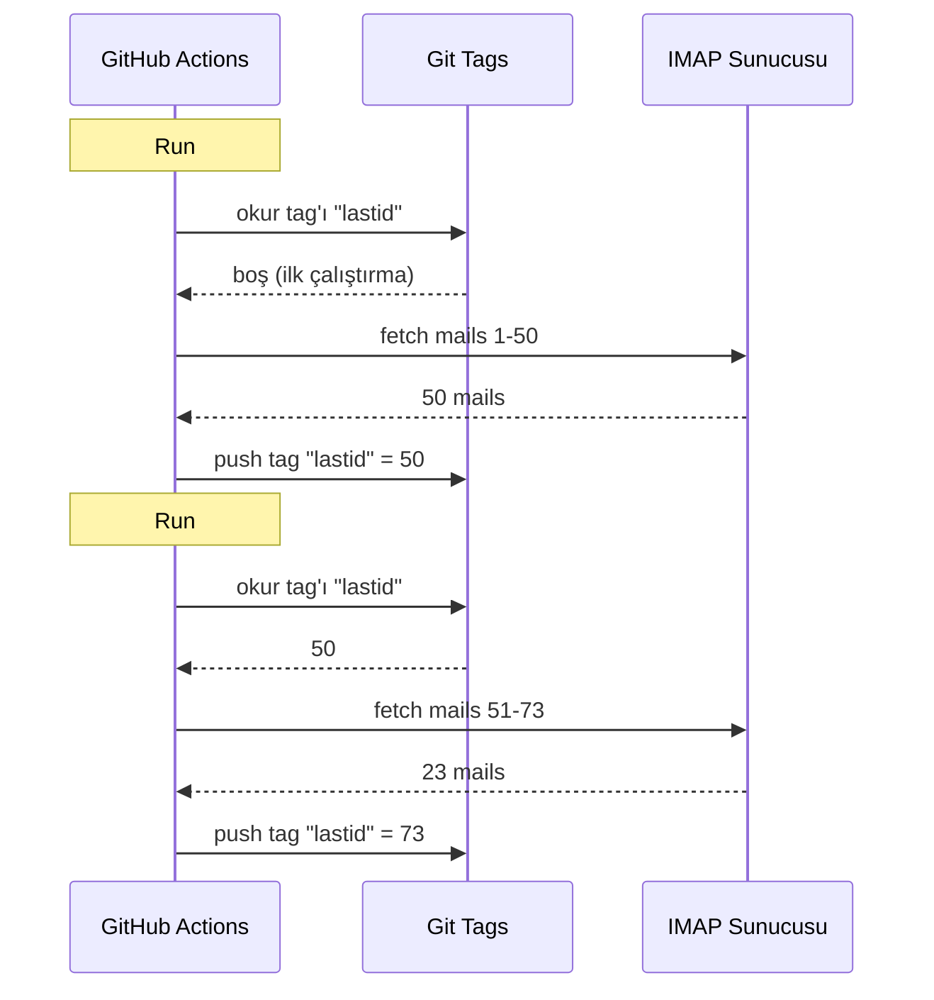

# Git'i veritabanı olarak kullandım ve GitHub Actions'da bedavaya bir bot çalıştırdım

7/24 çalışan otomatik bir email yanıtlayıcım var.

Maillerimi okuyor, ne hakkında olduğunu anlıyor ve bir AI ile kendi başına cevap veriyor. Önceki konuşmaları hatırlıyor. Newsletter'ları ve `noreply@`ları görmezden geliyor. İşler kızışınca bir insana yönlendiriyor.

Aylık maliyet: **0€**.

Sunucu yok. VPS yok. Veritabanı yok. Sadece GitHub Actions ve çılgın bir hack: **git'i veritabanı olarak kullanmak**.

Nereye geldiğimi görüyor musun? Hayır mı? Peki, hazır ol, bu hem aptalca hem de dâhiyane.

---

## Sorun: GitHub Actions Stateless

GitHub Actions bedava. Her 5 dakikada bir cron çalıştırabilirsin, kodunu çalıştırabilirsin, beleş.

Ama bir sorun var: **stateless**.

Her run bomboş bir makinede başlıyor. İki çalıştırma arasında hiçbir şey kaydedilmiyor. Önceki run mı? Unutuldu. Silindi. Hiç var olmamış gibi.

Bir email yanıtlayıcı için bu dev bir sorun. Mesela:

> "Son işlediğim email hangisiydi?"

Bot her seferinde bunu unutursa, ya aynı maillere tekrar tekrar cevap verir (felaket), ya da mailleri kaçırır.

Kalıcı bir durum lazım. Ve normalde kalıcı durum = veritabanı. Ama veritabanı bir sunucu demek ve sunucu artık bedava değil.

İşte burası işin ilginçleştiği yer.

---

## Çözüm: Git Tag'lerini Veritabanı Olarak Kullanmak

GitHub repo'n zaten kalıcı depolama. Bedava. Version'lanmış. Hep orada.

O zaman neden durumu orada saklamıyorsun?

Fikir: her run'da bot son işlenen email UID'sini bir **git tag**'inden okuyor. Yeni mailleri işliyor. Sonra tag'i yeni UID ile tekrar push'luyor.



Git tag'i veritabanının TA KENDİSİ. Tek bir değer, ama ihtiyacın olan tek şey bu.

### State'i Okumak

Job'un başında, değeri tag'den alıyoruz:

```bash
git fetch origin --tags lastid || true
git show refs/tags/lastid:data/lastId > data/lastId || true
```

`git show refs/tags/lastid:data/lastId` şu anlama geliyor: "bana `data/lastId` dosyasının `lastid` tag'indeki halinin içeriğini ver".

Boom. Değerin sende, veritabanı olmadan.

### State'i Yazmak

Sonunda, tag'i yeni değerle yeniden oluşturuyoruz:

```bash
git switch --orphan lastid-tmp   # branche vierge sans historique
git rm -rf .                      # on vide tout
mkdir -p data
printf "%s\n" "${LAST_ID_CONTENT}" > data/lastId

git add data/lastId
git commit -m "lastId snapshot"
git tag -f lastid                 # force le tag sur ce commit
git push --force ...origin lastid # push le tag
```

**Orphan** bir branch oluşturuyoruz (geçmişsiz), sadece `lastId` dosyasını koyuyoruz, commit, tag, force push.

Neden orphan? Çünkü repo geçmişinde 10.000 tane state commit'i biriktirmek istemeyiz. Her update bir öncekinin üzerine yazar. Tag her zaman TEK bir değer içeren TEK bir commit'i gösterir.

Tertemiz. Bedava. Tamamen kırık dökük xD

---

## İkinci Hack: Runtime Snapshot'ı

GitHub Actions'la ilgili başka bir sorun daha var: `npm install`.

Her run'da (her 5 dakikada bir) `npm install` + `npm run build` yaparsan, her seferinde 60-90 saniye boşa harcarsın. Sık bir cron'da bu, boşa harcanmış dakikalarca compute demek.

Çözüm: kodu BİR kere önceden derle ve onu da bir git tag'inde sakla.

Build workflow'u (`master`'a push yaptığında çalışan) şunu yapıyor:

```bash
# compile le code
bun install
bun run build

# stocke dist/ + node_modules/ dans un tag "runtime"
git checkout --orphan temp-runtime
git rm -rf .
cp -r "$TMPDIR"/* .
git add dist node_modules package.json bun.lock data
git commit -m "runtime build"
git tag -f runtime
git push --force ...origin runtime
```

`runtime` tag'i derlenmiş kodu VE `node_modules`'u içeriyor. Çalışmaya hazır.

Cron ise direkt bu tag'i checkout ediyor:

```yaml
- name: Checkout runtime snapshot
  uses: actions/checkout@v4
  with:
    ref: refs/tags/runtime    # le code pré-build, pas le source
    fetch-depth: 1

# pas de npm install, pas de build !
- name: Process emails
  run: node dist/index.js --action
```

Install yok. Build yok. Cron anında başlıyor ve sadece `node dist/index.js` çalıştırıyor.

Yani iki tag'in var, iki farklı iş yapıyorlar:
- `runtime` = çalışmaya hazır kod (kod push'ladığında güncellenir)
- `lastid` = kalıcı durum (her run'da güncellenir)

Bu nasıl bir eleganlık, hasta eder.

---

## Bot'un Kendisi: AI Otomatik Yanıtlayıcı

Tamam, git hack'i cool, ama bot tam olarak ne yapıyor?

IMAP üzerinden maillerini okuyor, bir AI ile anlıyor (Groq + Llama 3.3 70B) ve otomatik olarak cevaplıyor.

Dependency injection'lı temiz servis mimarisi (InversifyJS):

```
App
├── ImapService      → lit les mails (IMAP)
├── SmtpService      → envoie les réponses (SMTP)
├── ParserService    → parse le contenu des mails
├── ReplyService     → génère la réponse IA
├── SummaryService   → mémoire de conversation
├── AccountsService  → gère plusieurs comptes email
└── ConfigService    → config / env vars
```

### İki Çalışma Modu

Bot iki şekilde çalışabiliyor:

**Listener modu** (gerçek zamanlı): üstel yeniden bağlanma ile kalıcı IMAP bağlantısı. Bir VPS için.

```typescript
this.imapService.on("exists", async (data) => {
  console.log(`[MAIL] Nouveau mail ! Total: ${data.count}`);
  // traite le nouveau mail immédiatement
});
```

**Action modu** (batch): `lastId`'den itibaren yeni mailleri işler, sonra kapanır. GitHub Actions cron'u için.

```bash
node dist/index.js --action
```

`--action` modu git hack'ini kullanan mod. `lastId`'yi okur, yenileri işler, yeni `lastId`'yi yazar, biter.

### Robotlara CEVAP VERME

Bot'un TÜM maillere cevap verirse, newsletter'lara, bildirimlere, `noreply`lara cevap verir. Felaket. Daha kötüsü: iki bot birbirine cevap verirse, sonsuz bir email döngüsüne girersin. Kâbus.

Bu yüzden agresif filtreleme:

```typescript
export function isAutomatedSender(address) {
  const automatedPatterns = [
    "noreply", "no-reply", "donotreply",
    "mailer-daemon", "postmaster", "bounce",
    "newsletter", "notification", "marketing",
    "billing", "receipt", "promo", ...
  ];
  const local = address.split("@")[0].toLowerCase();
  return automatedPatterns.some(p => local.includes(p));
}
```

Ve ayrıca email header'ları ile tespit:

```typescript
export function isAutomatedByHeaders(headers) {
  return (
    ["bulk", "list", "junk"].includes(headers.precedence) ||
    headers["auto-submitted"] !== "no" ||
    headers["list-unsubscribe"] !== "" ||   // newsletters ont ça
    /mailchimp|sendgrid|mailgun|brevo/i.test(headers["x-mailer"])
  );
}
```

Header'larda `List-Unsubscribe` mı var? Bu bir newsletter. `Precedence: bulk` mı? Toplu mail. `X-Mailer: Mailchimp` mı? Anladın işte. Görmezden geliyoruz.

Gece kulübü fedaisi gibi: robotlar geçemez xD

### Sihirli Trigger'lar

AI hiç cevap vermemeye veya bir insana devretmeye karar verebilir. Nasıl mı? Cevabındaki özel trigger'larla.

Sistem prompt'u ona şunu söylüyor:

> Eğer otomatik bir mail/newsletter ise → `<no_reply>` cevabı ver
> Çok önemli/hassas bir şeyse (hukuki, finansal...) → `<manual_reply_required>` cevabı ver
> Yoksa → gerçek bir cevap yaz

Ve kod bunu okuyor:

```typescript
const aiReply = completion.choices[0].message.content.trim();
const manualTrigger = aiReply.includes(MANUAL_REPLY_TRIGGER);
const noReply = aiReply.includes(NO_REPLY_TRIGGER);

if (noReply) {
  console.log("[MAIL] L'IA a décidé d'ignorer. Skip.");
  return;
}

if (manualTrigger) {
  console.log("[MAIL] Trop chaud, je forward à un humain.");
  await this.smtpService.sendManualForward(...);
  return;
}

// sinon on envoie la réponse IA
await this.smtpService.sendReply(...);
```

Yani AI'nin "hayır ben bu işe bulaşmam, gerçek bir insan çağır" deme hakkı var. İşte bu bilgelik.

---

## Konuşma Hafızası

Her şeyi değiştiren bir detay: bot konuşmaları **hatırlıyor**.

Birine cevap verdiğinde, konuşmanın bir özetini kaydediyor. Bir dahaki sefere o kişi yazdığında, özet tekrar prompt'a enjekte ediliyor.

Depolama: her kişi için bir JSON dosyası.

```
data/customers/
├── moi%40gmail.com/
│   ├── alice%40example.com.json
│   └── bob%40client.fr.json
```

Ve özetin kendisi de AI tarafından oluşturuluyor, eski özeti yeni mesajla birleştiriyor:

```typescript
const completion = await groq.chat.completions.create({
  model: "llama-3.3-70b-versatile",
  messages: [
    { role: "system", content: "Tu es un assistant de mémoire. Merge l'ancien résumé avec le nouveau message sans perdre d'info." },
    { role: "user", content: `Résumé existant:\n${existing}\n\nNouveau message:\n${incomingContent}` }
  ],
  temperature: 0.0,  // déterministe, pas de créativité
  max_tokens: 800,
});
```

Yani bot zamanla sıkıştırılmış bir hafıza inşa ediyor. Tüm mailleri saklamaya gerek yok, sadece akıllıca büyüyen bir özet.

Peki bu JSON dosyaları? Şey... onlar da git'te saklanıyor, runtime tag'inin içinde. Her yerde git xD

---

## Prompt Uzunluğuyla İlgili Zekice Oyun

Beni gülümseten küçük bir teknik detay.

Modellerin bir token limiti var. Eğer mail'in + özet + persona prompt'u aşarsa, API hata döndürüyor.

Kod bunu **kademeli kırpma** + yeniden deneme ile yönetiyor:

```typescript
try {
  // premier essai avec les limites normales
  completion = await groq.chat.completions.create({...});
} catch (error) {
  if (!this.isLengthError(error)) throw error;

  // c'était une erreur de longueur : on re-tente avec des limites plus serrées
  ({ systemContent, userContent } = this.buildPromptPayload({
    ...,
    limits: {
      systemPromptChars: 2200,  // au lieu de 3000
      summaryChars: 1800,       // au lieu de 4000
      personaChars: 900,        // au lieu de 1500
      userContentChars: 2200,   // au lieu de 8000
    },
  }));
  completion = await groq.chat.completions.create({...});  // retry
}
```

Olmazsa, daha kısa kesip tekrar deniyoruz. Basit, etkili, crash yok.

---

## Peki, somut olarak nasıl çalışıyor?

Bir cron run'ının komple akışı:

```
1. GitHub Actions se déclenche (cron toutes les 5 min)
2. Checkout du tag "runtime" (code pré-build)
3. git show refs/tags/lastid → récupère le dernier UID traité
4. node dist/index.js --action
   ├── connexion IMAP
   ├── fetch des mails depuis lastId+1
   ├── pour chaque mail :
   │   ├── parse le contenu
   │   ├── filtre les robots (skip si automated)
   │   ├── match le compte destinataire
   │   ├── récupère la mémoire de conversation
   │   ├── génère la réponse IA (Groq)
   │   ├── <no_reply> ? skip
   │   ├── <manual_reply_required> ? forward humain
   │   ├── sinon : envoie la réponse (SMTP)
   │   └── update la mémoire de conversation
   └── écrit le nouveau lastId
5. git push --force tag "lastid" avec la nouvelle valeur
```

Ve 5 dakika sonra tekrar başlıyor. Sonsuza kadar. Beleş.

---

**Unutulmaması gereken 3 şey:**

1. **Git = bedava veritabanı** -- Orphan bir tag iki stateless run arasında kalıcı durumunu saklayabilir. Okumak için `git show refs/tags/X:dosya`, yazmak için force-push. DB'ye gerek yok.

2. **Runtime tag'inde ön-derle** -- Her cron run'ında `npm install` yapmak yerine, derlenmiş kodu + node_modules'u bir git tag'inde sakla. Cron anında başlıyor.

3. **Bir AI bot susmasını bilmeli** -- `<no_reply>` ve `<manual_reply_required>` trigger'ları AI'nin cevap vermemeye veya devretmeye karar vermesini sağlar. Bir de anti-robot filtreleme. Yoksa sonsuz bir email döngüsü yaratırsın.

Kalıcı durumlu, AI'lı, hafızalı serverless cron, hepsi ayda 0€. Tamamen kırık dökük ve buna bayılıyorum xD
