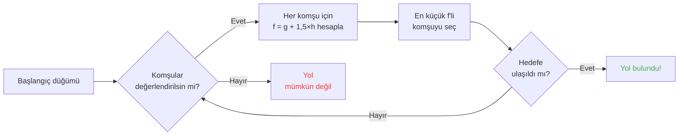

## Giriş

Koyunların duvarlara toslayışını izleyerek saatler harcadım.

Hayatımın en iyi yatırımı xD

Bu mobları ne kadar izlersen, hareketlerinde rastgele hiçbir şey olmadığını o kadar fark ediyorsun. Her adım kodlanmış, tahmin edilebilir ve en önemlisi -- kırılabilir. Sonunda Minecraft'ın kaynak kodunu didik didik ederek pathfinding'in tam olarak nasıl çalıştığını anladım ve bulduğum şey şu: mobları resmen zihin kontrolü yapabilirsin. Yani, onları RASGELENİN değil, SENİN istediğin yere gitmeye zorlayabilirsin.

Bu rehber, kazarken bulduğum her şey. AI sistemi, A* algoritması, gizli malice değerleri, survival'da kullanabileceğin exploit'ler. Kazmanı kap.

---

## Mob AI Nasıl Çalışır (spoiler: biraz gerizekalı)

### Hedefler (Goals)

Her mob'un bir *goal* listesi vardır. YAPABİLECEĞİ şeyler ve ne kadar çok İSTEDİĞİ. Düşük sayı = yüksek öncelik. Cehennemden bir yapılacaklar listesi gibi.

```java
protected void registerGoals() {
   this.goalSelector.addGoal(4, new Zombie.ZombieAttackTurtleEggGoal(this, 1.0, 3));
   this.goalSelector.addGoal(8, new LookAtPlayerGoal(this, Player.class, 8.0F));
   this.goalSelector.addGoal(8, new RandomLookAroundGoal(this));
   this.addBehaviourGoals();
}
```

Hiç bir zombie'nin kaplumbağa yumurtasını görmezden gelip seni kovaladığını gördün mü? İşte nedeni: `ZombieAttackTurtleEggGoal`'ın önceliği 4, `ZombieAttackGoal` (yani "suratını ye" hedefi) ise öncelik 2. Zombiler nabzı olan atıştırmalıkları tercih ediyor.

Asıl umursadığımız hedef `WaterAvoidingRandomStrollGoal`, öncelik 7. "Yapacak daha iyi bir şeyim yok o yüzden boş boş dolanayım" hedefi. İşte eğlence burada başlıyor.

### Hareket (ya da "rastgele yürüyüşün tick başına 60'ta 1 şansı olması")

Her tick'te (her 0.05 saniyede), oyun hareket edip edemeyeceğini kontrol etmek için `canUse()`'u çağırır. Tick başına 60'ta 1 şans. Dehşet verici derecede verimsiz bir tasarım ve buna bayılıyorum.

```java
public boolean canUse() {
   if (this.mob.hasControllingPassenger()) {
      return false;
   } else {
      if (!this.forceTrigger) {
         if (this.checkNoActionTime && this.mob.getNoActionTime() >= 100) {
            return false;
         }
         if (this.mob.getRandom().nextInt(reducedTickDelay(this.interval)) != 0) {
            return false;
         }
      }
      Vec3 $$0 = this.getPosition();
      if ($$0 == null) {
         return false;
      } else {
         this.wantedX = $$0.x;
         this.wantedY = $$0.y;
         this.wantedZ = $$0.z;
         this.forceTrigger = false;
         return true;
      }
   }
}
```

Özet geçmek gerekirse: mob'a biniyorsan -> hayır, mob 5 saniyedir hiçbir şey yapmadıysa -> hayır, RNG hayır derse -> hayır. Oyun GERÇEKTEN mobların hareket etmesini istemiyor.

Ama hareket ettiğinde, `getPosition()` devreye giriyor:

```java
protected Vec3 getPosition() {
   if (this.mob.isInWater()) {
      Vec3 $$0 = LandRandomPos.getPos(this.mob, 15, 7);
      return $$0 == null ? super.getPosition() : $$0;
   } else {
      return this.mob.getRandom().nextFloat() >= this.probability
         ? LandRandomPos.getPos(this.mob, 10, 7)
         : super.getPosition();
   }
}
```

Sondaki iki sayı? XZ yarıçapı ve Y yarıçapı. Suda mob daha geniş arar (15 vs 10). Kara bulamazsa suyu kabul eden `super.getPosition()`'a düşer. **Sonuç: moblar sudan ÇIKMAK ister.** İşte bu yüzden hayvanların kıyıya doğru manyak gibi yüzer.

Eğlenceli detay: mob'un `LandRandomPos` yerine `super.getPosition()`'ı seçme ihtimali %0.1. Binde bir. Mojang yani xD

### LandRandomPos: her şeyi kıran optimizasyon

Bu BENİM en sevdiğim adım. Pathfinding'i exploit edilebilir yapan en güzel teknik karmaşa.

```java
public static Vec3 getPos(PathfinderMob $$0, int $$1, int $$2, ToDoubleFunction<BlockPos> $$3) {
   boolean $$4 = GoalUtils.mobRestricted($$0, $$1);
   return RandomPos.generateRandomPos(() -> {
      BlockPos $$4xx = RandomPos.generateRandomDirection($$0.getRandom(), $$1, $$2);
      BlockPos $$5 = generateRandomPosTowardDirection($$0, $$1, $$4, $$4xx);
      return $$5 == null ? null : movePosUpOutOfSolid($$0, $$5);
   }, $$3);
}
```

`movePosUpOutOfSolid`. İsmi her şeyi anlatıyor. Seçilen pozisyon katı bir bloğun içindeyse, oyun onu havaya çıkana kadar yukarı iter.

Bu bir optimizasyon: yer altı pozisyonlarını atlamakla zaman harcamak yerine, oyun onları direkt yüzeye fırlatır. Akıllıca mı? Evet. Ama DEV bir önyargı yaratıyor: **moblar yüksek zemini tercih ediyor**.

Düşünsene. Yer altında bir sürü blok var, oyun 10 rastgele pozisyon üretiyor. Blok içindekiler yukarı itiliyor. Yoğun alanlar (bir tepenin altı) içi boş alanlardan daha fazla geçerli pozisyon üretiyor. Sonuç: mob istatistiksel olarak tepeye doğru daha sık gidiyor.

Güven bana, bunu kırmak üzereyiz.

### Seçim: en iyi blok kazanır

10 pozisyon, bir kazanan, bir puan yarışması:

```java
public static Vec3 generateRandomPos(Supplier<BlockPos> $$0, ToDoubleFunction<BlockPos> $$1) {
   double $$2 = Double.NEGATIVE_INFINITY;
   BlockPos $$3 = null;
   for(int $$4 = 0; $$4 < 10; ++$$4) {
      BlockPos $$5 = (BlockPos)$$0.get();
      if ($$5 != null) {
         double $$6 = $$1.applyAsDouble($$5);
         if ($$6 > $$2) {
            $$2 = $$6;
            $$3 = $$5;
         }
      }
   }
   return $$3 != null ? Vec3.atBottomCenterOf($$3) : null;
}
```

En yüksek puanı alan pozisyon KAZANIR. Ve puanlama kriterlerini biliyorsan, SENİN pozisyonunu kazandırabilirsin. Seçim hilesi yapmak gibi.

---

## Mob Tercihleri (ya da "ineğin neden karşıdan karşıya geçtiği")

Her mob'un farklı zevkleri var. Ve bu her şeyi değiştiriyor.

| Mob | Neyi sever |
| --- | --- |
| **Hayvanlar** (inek, koyun, domuz) | Çim blokları, ışık |
| **Canavarlar** (zombi, iskelet) | Karanlık (hipsterlar) |
| **Kaplumbağalar** | Su > kum > ışık |
| **Hoglinler** | `crimson_nylium`; `warped_fungus`'tan nefret eder |
| **Striderlar** | Lav ve BAŞKA HİÇBİR ŞEY |
| **Gümüş balıkları** | Infestable bloklar |
| **Guardian'lar** | Su + ışık (snoblar) |
| **Mooshroom'lar** | Miselyum + ışık |
| **Arılar** | Hava. Evet, HAVAYI tercih ediyorlar. |

```java
// Hayvan: aşağı bak, çim varsa -> max puan
public float getWalkTargetValue(BlockPos $$0, LevelReader $$1) {
   return $$1.getBlockState($$0.below()).is(Blocks.GRASS_BLOCK) ? 10.0F : $$1.getPathfindingCostFromLightLevels($$0);
}

// Canavar: kelimenin tam anlamıyla tersi
public float getWalkTargetValue(BlockPos $$0, LevelReader $$1) {
   return -$$1.getPathfindingCostFromLightLevels($$0);
}
```

Canavarlar temelde "ışıklıysa, negatif puan, ben kaçarım" gibi. Işık seviyesinde RESMEN sinir krizi geçiriyorlar xD

Yani hayvanları çim ve ışıkla, canavarları da karanlıkla -- kelimenin tam anlamıyla -- yönlendirebilirsin. Aynı anda hem aptalca hem de zekice.

---

## Minecraft'ta A* (gizli formül)

Minecraft pathfinding için A* (A-star) kullanıyor. Ama Mojang kendi dokunuşunu eklemiş:

```
f(n) = g(n) + 1.5 × h(n)
```

- **g(n)** = şimdiye kadar gidilen mesafe (blok başına 1, çaprazda ~1.41)
- **h(n)** = hedefe düz çizgi mesafesi
- **1.5** = çünkü Mojang işleri biraz bozuk seviyor

Normal A* `f(n) = g(n) + h(n)` kullanır. MOJANG 1.5 ÇARPANI EKLEMİŞ. Neden mi? Algoritma hedefe daha hızlı kilitlensin ve daha az dal araştırsın diye. Sonuç: yol "yeterince iyi" ama her zaman optimal değil. Sarhoş bir A* yani.



Ana sınırlama: **bir mob sadece 16 blok öteye pathfind yapabilir** (follow range'i). Hedef çok uzaktaysa, ulaşabileceği en yakın bloğu seçer. Bu, menzil dışında bir anıt inşa edebileceğin ve mob'un kendisine en yakın bloka doğru yol alacağı anlamına gelir -- hareketini tamamen tahmin edilebilir kılar.

### Oyunu kıran iki exploit

#### 1. Blok güncellemeleri yeniden hesaplamayı zorlar

```java
public boolean shouldRecomputePath(BlockPos $$0) {
   if (this.hasDelayedRecomputation) return false;
   if (this.path != null && !this.path.isDone() && this.path.getNodeCount() != 0) {
      Node $$1 = this.path.getEndNode();
      Vec3 $$2 = new Vec3(
         ((double)$$1.x + this.mob.getX()) / 2.0,
         ((double)$$1.y + this.mob.getY()) / 2.0,
         ((double)$$1.z + this.mob.getZ()) / 2.0
      );
      return $$0.closerToCenterThan($$2, (double)(this.path.getNodeCount() - this.path.getNextNodeIndex()));
   }
   return false;
}
```

Mob'un yoluna yakın her blok güncellemesi, 1 saniye bekleme süresiyle bir A* yeniden hesaplamasını zorlar. Bir mob'un yanına 1 saniyelik bir saat koy, SÜREKLİ yeniden hesaplasın. Her saniye sıfırlanan bir GPS gibi.

Ve bunu 50 mob'la yaparsan? Lag şehri. TPS'in canı cehenneme.

#### 2. Pathfinding Malice (blok maliyet cezaları)

Bazı bloklar mobları korkutuyor. Cidden. Her bloğun bir enum tarafından tanımlanmış ilişkili bir maliyeti vardır:

| Blok / Durum | Malice |
| --- | --- |
| **Bal bloğu** | İçinden geçmek +8 |
| **Toz kar** | Geçilemez |
| **Kapalı kapılar** | Geçilemez |
| **Ateş** | İçinden +16, yanından +8 |
| **Hayvanlar & Köylüler** | Ateş = -1 (KATI HAYIR) |
| **Kaktüs / Tatlı meyve** | Geçilemez; yanı = +8 |
| **Su** | İçinden veya yanından +8 |
| **Magma** | Yanından +8 |

Hayvanlar daha da ileri gidiyor:

```java
protected Animal(EntityType<? extends Animal> $$0, Level $$1) {
   super($$0, $$1);
   this.setPathfindingMalus(PathType.DANGER_FIRE, 16.0F);
   this.setPathfindingMalus(PathType.DAMAGE_FIRE, -1.0F);
}
```

DAMAGE_FIRE, -1.0F'de kelimenin tam anlamıyla "yasak". Bir hayvan ateşin içinden geçmektense boşluğa atlamayı tercih eder.

### Egzersiz: büyük yol yarışı

Birden fazla yol arasında seçim yapan bir köylü:

- **Yol A**: 15 blok ama 6 blok su kenarı (her biri +8)
- **Yol B**: 18 blok, 2 su bloğu (+8) + 1 su-kenarı (+8)
- **Yol C**: 14 blok düz... ama ateş -> köylüler için GEÇİLEMEZ
- **Yol D**: 16 blok, 1 magma-kenarı (+8) + 1 bal-kenarı (+8)
- **Yol E**: 25 blok, her yerde kaktüs (her yerde +8) -> 90.82 toplam LOL

Kazanan genelde **Yol B**: detay yolu işe yarar çünkü su PAHALI.

Bir köylü temelde bacakları olan bir maliyet hesaplayıcısıdır xD

### Her mob farklı yollar seçer

Bir köylü: "ateş mi? YOK HAYIR BEN KAÇTIM"
Bir zombi: "ateş mi? tamam boomer *yanarak içinden geçer*"

Köylülerin gidip zombilerin gitmediği -- ya da tam tersi -- yollar inşa edebilirsin.

---

## Köylüler: nihai karmaşa

Köylüler Minecraft'taki en yanlış anlaşılan şey. Ama kodu okuduğunda, sadece mesai saatleri olan tahmin edilebilir makineler olduklarını anlıyorsun.

### Sensörler ve hafıza

Her 20 tick'te (1 saniye) çalışan 9 sensör. Her biri köylünün etrafındaki bir yarıçapı tarar ve sonucu hafızada saklar. Köylü her şeyi görür, her şeyi hatırlar ve ona göre hareket eder.

### Aktivite paketleri

Köylünün beyni, saate göre etkinleşen aktivite paketlerine bölünmüştür:

| Paket | Zaman | Köylü... |
| --- | --- | --- |
| **Core** | 7/24 | Kapıları açar, yüzer (%80 ihtimalle), POI EDİNİR |
| **Work** | 08:00-15:00 | "Çalışmam gerek" -- iş istasyonuna yürür |
| **Meet** | 15:00-17:00 | "Mutlu saat!" -- zile gider, sosyalleşir |
| **Rest** | 18:00-06:00 | "Uyku vakti" -- yatağa gider |
| **Idle** | 06:00-08:00, 17:00-18:00 | "Sıkıldım" -- gezinir, ürer, yataklara zıplar |
| **Panic** | Hasar / düşman | "KAÇ" -- KAÇAR |

**Panic** diğer TÜM paketleri kesebilen tek pakettir. Köylü uyusa veya çalışıyor olsa bile, bir zombi varsa PANİK MODU.

### POI Edinme: kablosuz redstone'u mümkün kılan mekanik

```java
Set<Pair<Holder<PoiType>, BlockPos>> $$12 = (Set)$$10xx.findAllClosestFirstWithType(
   $$0, $$11, $$8x.blockPosition(), 48, PoiManager.Occupancy.HAS_SPACE
)
```

`Acquire POI`, 48 blok yarıçapındaki tüm geçerli ilgi noktalarını tarar. En yakın 5 tanesini tutar, bir yol olup olmadığını kontrol eder ve ulaşılabilir en yakın olanı edinir. Her POI'nin sınırlı slotu vardır:
- **İş istasyonları**: 1 slot
- **Yataklar**: 1 slot
- **Ziller**: 32 slot

ÇILGIN OLAN ŞEY: **slot, VARILMA anında değil, EDİNME anında ayrılır**. Bir köylü, haritanın öbür ucundan bir komposteri kilitleyebilir -- oraya asla ulaşmasa bile.

Nereye vardığını görüyor musun?

### Kablosuz redstone. Evet, KABLOSUZ.

1. Bir köylüyü bir kompostere giden yolu olan bir maden arabasına koy
2. Komposteri edinir (slot dolu, kimse kullanamaz)
3. Köylü tıklayamayacak kadar uzaktır -- gübre yerinde kalır
4. Bu köylüyü DÜNYADA HERHANGİ BİR YERE taşı, slotu tutmaya devam eder
5. Bir şeyi etkinleştirmek istediğinde, köylüyü ÖLDÜR
6. Slot boşalır, başka bir köylü komposteri edinir, gübreyi alır
7. BLOK GÜNCELLEMESİ -> herhangi bir redstone devresi etkinleşir

Tam dünya çapında iletilebilen, yol üzerinde sıfır chunk yüklemesi gerektiren kablosuz redstone yarattın. Bunu bir ender incisi stasis odasına bağla ve bir köylüyü öldürerek herhangi bir yerden ışınlan.

Benim favori kullanımım? Bir ödül avcısı minigame'i: her biri komposterli birden çok köylü, oyuncu çıkışı etkinleştirmek için DOĞRU köylüyü öldürmek zorunda. Tamamen wtf bir mekanik xD

### Pathfinding Deadlock (ya da "sonsuza kadar donan köylü")

`Acquire POI` (bir yol gören) ile gerçek navigasyon (onu takip etmeyi reddeden) arasında bir hata var. İş istasyonunun üstündeki blok yürünebilir değilse olur. Sonuç:

- Core paketi: "POI'yi edinmek istiyorum"
- Navigasyon: "Oraya yürüyemem"
- Sonuç: köylü DONAR, sonsuza kadar, kendi kendisiyle savaşır.

Cidden donmuş köylüler, dekorasyon veya aksesuar olarak kullanılabilir. Zırh standı tankı? Evet. Hareket etmeyen bir muhafız? Evet. Ürkütücü mü? Belki. Etkili mi? Kesinlikle xD

---

## Sonuç

Minecraft'ta mob pathfinding'i rastgele değil. Belirleyici, puana dayalı bir sistem, tahmin edilebilir VE kırılabilir.

**Unutulmaması gereken üç şey:**

1. **Altındaki katı bloklar = yükseklik önyargısı** -- mobları yönlendirmek için alt zemini doldur veya boşalt
2. **Malice mob'a göre değişir** -- bazılarının gidip diğerlerinin gitmediği yollar oluştur
3. **POI slotları uzaktan ayrılır** -- bedava kablosuz redstone, ışınlanma, hepsi

Minecraft'ın kaynak kodu, az kullanılmış mekaniklerle dolu bir altın madeni. Decompile edilmiş Java okumak için saatler harcadım ve dürüst olmak gerekirse? Her satır işlevsel bir Paskalya yumurtası. Ama bunlar survival'da köylülerle kablosuz redstone için çalışıyor. En iyi oyun onaylandı xD
