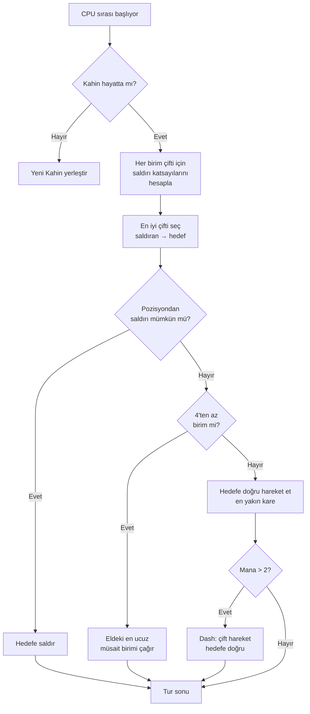

## Nausicaa için Salak Yapay Zekam

"Bi' satranç oyunu yapsam mitolojilerle falan?" diye başlayıp her 5 turda kendi hiper-parametrelerine karar veren bi' yapay zekayla biten projeler vardır ya.

İşte Nausicaa o. Sıra tabanlı bi' masa oyunu, mitolojik yaratıklardan desteni kuruyorsun, mana'yı yönetiyorsun, 10x8'lik bi' tahtada birimlerini konuşlandırıyorsun. Ve bi' tane de kişilik bozukluğu olan yapay zeka var xD

Bu yapay zekaya epey zaman harcadım ve sonuç tam bi' felaket xD

## Oyun aslında ne

Beyni anlatmadan önce gövdeyi anlamak lazım:

- 10x8 tahta, oyuncu başına 2 sıra konuşlandırma alanı
- Mana 1'den başlar, her tur +1, max 6. Çağırmak, saldırmak, yetenek kullanmak için harcarsın
- Amaç : rakibin Oracle'ını öldürmek

12 birim, farklı maliyetler ve hareket pattern'leri:

| Unit | Maliyet | Hareket | HP |
| --- | --- | --- | --- |
| Oracle | 0 | Kral (8 yön) | 1 |
| Goblin | 1 | 3 kare ileri | 1 |
| Harpy | 1 | Kral (8 yön) | 1 |
| Naiad | 1 | Çapraz | 1 |
| Griffin | 2 | 2 kare zıpla | 2 |
| Siren | 2 | Yanal | 1 |
| Centaur | 2 | At (L şeklinde) | 2 |
| Archer | 3 | Yanal | 1 |
| Phoenix | 3 | Çapraz (koyu kareler) | 1 |
| Metamorfoz | 4 | Yer değiştirme | 1 |
| Seer | 4 | Yok (mana üretir) | 1 |
| Titan | 6 | Sınırlı (alan saldırısı) | 3 |

Her birimin kendine özgü saldırı pattern'i var. Siren 4 çapraza vuruyor, Archer 3 kare mesafeden vuruyor, Titan çağrılınca etrafındaki her şeyi mahvediyor. Kısacası mitoloji ve deste kurmacalı bi' satranç xD

## CPU'yu nasıl düşündürdüm

Temel fikir salakça basit: **her düşman biriminin bi' çekicilik katsayısı var**. Ne kadar tehlikeliyse, yapay zeka onunla o kadar ilgilenmek istiyor.

```javascript
const UNITS_ATTRACTIVENESS = {
    "oracle": 100,
    "titan": 95,
    "shapeshifter": 90,
    "phoenix": 80,
    "siren": 70,
    "archer": 70,
    "seer": 70,
    "griffin": 60,
    "centaur": 60,
    "harpy": 50,
    "naiad": 30,
    "gobelin": 20
};
```

Oracle 100 -- mantıklı, win condition bu. Titan 95 çünkü çağrılınca yanındaki herkesi tek atıyor. Goblin 20, işte piyade, kim takar.

Sonra her birim çifti için (bir dost, bir düşman) şunu hesaplıyorum:

```
interet = attractivite × coeff_attract / (distance × coeff_dist)
```

Yani: ne kadar tehlikeli ve yakınsan, yapay zeka seni o kadar pataklamak istiyor.

```javascript
calculateAttackCoefficient(x1, y1, x2, y2) {
    const distance = this.calculateEuclideanDistance(x1, y1, x2, y2);
    if (distance === 0) return Infinity;
    return (UNITS_ATTRACTIVENESS[unit.type] * COEFFICIENTS_IMPORTANCE["attractiveness"]) / distance;
}
```

### Katsayıların değiştiği an

İşin komik tarafı, önem katsayıları **her 5 turda rastgele değişiyor**.

```javascript
if (this.turnCount % 5 === 0) {
    const distanceCoefficient = parseInt(Math.random() * 100);
    const attractivenessCoefficient = parseInt(Math.random() * 100);
    this.regulateImportanceCoefficients({
        distance: distanceCoefficient,
        attractiveness: attractivenessCoefficient
    });
}
```

Bi' anda yapay zeka aşırı agresif oluyor (çekicilik 95, mesafe 5), her şeyi geçip Oracle'ını öldürmeye geliyor. Sonraki elde mesafeyi önceliyor ve yeniden konuşlanıyor.

Bu Pac-Man hayaletlerinden çalıntı -- Blinky kovalar, Pinky pusu kurar. Burada yapay zeka her fazda "kişilik" değiştiriyor.

**Sonuç: bi' maç boyunca yapay zekayı tahmin etmek imkansız.** CPU asla aynı maçı iki kere oynamıyor.

### Oracle ezik bi' şey

Düşman Oracle'ı kaçıyor. Gerçekten.

```javascript
const awayFromTarget = {
    row: Math.max(0, Math.min(7, botUnitElement.row + (botUnitElement.row - targetUnitElement.row))),
    col: Math.max(0, Math.min(9, botUnitElement.col + (botUnitElement.col - targetUnitElement.col)))
};
```

Tehdidin ters yönünü hesaplayıp kaçıyor. Duvar varsa o yöndeki en yakın boş kareyi arıyor.

3 tur boyunca Oracle'a yaklaşıyorsun, sonra puuf kaçıyor korkak gibi xD

### Karar döngüsü

Yapay zeka şöyle karar veriyor:

1. Oracle'ım kalmadıysa (öldüyse) yenisini koy
2. Her dost → düşman birim çifti için katsayı hesapla
3. En iyi çifti seç
4. Birim bulunduğu yerden hedefe saldırabiliyorsa → saldır
5. 4'ten az birimim varsa → eldeki en ucuz müsait birimi çağır
6. Değilse, hedefe doğru hareket et (düşmana en yakın hareket karesi)
7. Mana yeterliyse (> 2), dash yap (çift hareket) iyice yaklaşmak için
8. Birim Oracle'sa → kaç



```javascript
async makeAction(dash=false) {
    // hepsi sırayla
    // mana yetiyosa CPU dash yapar
    if(botPlayer.mana > 2) {
        this.makeAction(true);
    }
}
```

### Neden öklid mesafesi

Öklid mesafesi kullanıyorum:

```javascript
calculateEuclideanDistance(x1, y1, x2, y2) {
    const deltaX = Math.pow(x1 - x2, 2);
    const deltaY = Math.pow(y1 - y2, 2);
    return Math.sqrt(deltaX + deltaY) * COEFFICIENTS_IMPORTANCE["distance"];
}
```

Neden Manhattan değil? Çünkü birimlerin hareket pattern'leri değişken (L şeklinde at gibi, çapraz, falan). Kuş uçuşu mesafe tehlikenin daha iyi bi' tahmini.

## Neden minimax değil

Klasik bi' minimax yapabilirdim. Ama 12 birim tipi, farklı hareket pattern'leri, özel yeteneklerle... oyun ağacı o kadar hızlı patlıyor ki oynanamaz hale geliyor. Sezgisel yaklaşım 10 milyon durumu keşfetmeden akıllı seçimler yapıyor.

## Havalı olan şeyler

Çekicilik sistemi komik ikilemler yaratıyor:

- Seer (70) mana üretiyor. Onu yaşatırsan rakibin kaynağı artar. Ama Titan (95) daha tehlikeli.
- Metamorfoz (90) herhangi bir birimle yer değiştirebiliyor. Oracle'ını çalabilir.
- Harpy (50) patlayıcı bi' saldırıya sahip, kendini de öldürüyor. Öncelikli değil... ta ki 3 biriminin yanına gelene kadar.

Yapay zeka genel tehlikeyi pozisyonlara göre değerlendiriyor, sadece ham istatistiklere bakmıyor.

Ayrıca bi' `activateSimulation()` fonksiyonu var, maç yapmadan senaryo test etmek için:

```javascript
activateSimulation() {
    // Tahtaya belirli birimleri yerleştirir
    // Yapay zeka debug'ı için kullanışlı
    this.game.board = simulation.board;
    this.game.players = simulation.players;
}
```

## Eksik olanlar

Daha fazla zamanım olsaydı:

- Yapay zeka anlık duruma tepki veriyor, oyuncunun ne yapacağını tahmin etmiyor
- Elini birkaç turluk planlamıyor
- Metamorfoz ve Centaur'un yeteneklerini tam kullanamıyor
- Pekiştirmeli öğrenme: kendi kendine oynayıp katsayıları ayarlaması

Ama browser oyunu için iş görüyor. Arkadaşlarım kaybedebiliyo, yani iyidir xD

## Dene

[nausicaa-game.github.io](https://nausicaa-game.github.io/)'da mevcut. "JOUER"a tıkla, CPU modu AÇIK, yapay zekanın yaptıklarını izle.

Tavsiye: yapay zekanın kendi kendine oynamasına izin ver. Agresif evreler göreceksin, sonra puf geri çekiliyor.

Kod [GitHub'da](https://github.com/nausicaa-game/nausicaa-game.github.io), `js/cpu.js` içinde.

**3 madde:**

1. **Sezgisel katsayılar** -- minimax yok, her birimin bi' çekiciliği var
2. **Her 5 turda değişen katsayılar** -- yapay zeka agresiflik ve kontrol arasında gidip geliyor, Pac-Man vari
3. **Oracle kaçar** -- tehdidin ters yönünü hesaplayıp sıvışır

Yapay zekayı daha da şerefsiz yapmak için fikirlerin varsa bi' issue aç. Kaybettiğinden ders alan bi' versiyon için planlarım var ama o başka bi' yazıya xD
