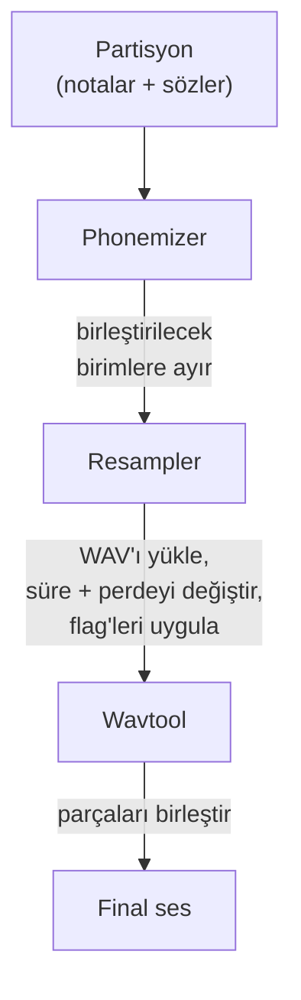

## UTAU : Visual Basic 6 ile yazılmış bir yazılım sentetik sesi nasıl demokratikleştirdi

Ana sayfamda biraz bahsetmiştim : UTAU'yu severim. İşte nedeni.

2008'de sentetik bir sesi şarkı söyletmek istiyosan tek seçeneğin vardı : VOCALOID. Yamaha'nın yazılımı. Pahalı, kapalı, kendi başına oluşturamayacağın resmi seslerle dolu.

Sonra Japon bir eleman, Ameya/Ayame, kendi köşesinde bi' şey çıkardı. **Visual Basic 6** ile kodlanmış bir yazılım. Bedava. Kendi sesini yaratmanı sağlıyordu... kendi kaydettiğin WAV dosyalarıyla.

Bu şeyin adı **UTAU** (歌う, Japonca "şarkı söylemek"). Ve zamanına göre resmen büyüydü.

Bu yazılımı hep büyüleyici bulmuşumdur. Teknik olarak temiz olduğu için değil (spoiler : aslında bu şeyi yaratmayı düşünmek bile ayrı bi' olay... tam bir karmaşa, bu tavuğa ağlıyorum), başka kimsenin yapmadığı bi' şey yaptığı için : ses sentezini herkese açtı. Yani sen, ben, mikrofonu olan herhangi biri.

Neden harika olduğunu anlatayım.

---

## Öncelikle, şarkı söyleme sentezi neden zordur

Şarkı söyleyen bir ses, notalardan ibaret değildir. İçinde ünsüzün saldırısı, ünlünün tutunması, nefes, ikisi arasındaki geçişler var. "Merhaba"daki "me" bir "m" sesinin "e" açıklığına kaymasıdır ve bu kayma sesi insani yapan ya da yapmayan şeydir.

Bugün bunu deep learning ile çözüyoruz : saatlerce şarkı üzerinde bir model eğitiyorsun ve sesi üretiyor (Synthesizer V, DiffSinger). Ama bu 2020+ işi. 2008'de, yoktu.

UTAU daha eski ve daha kurnaz bir yöntem kullanır : **birleştirmeli sentez** (concatenative synthesis).

---

## Birleştirmeli sentez : ses parçalarını kopyala-yapıştır

Fikir çok basit : küçük ses parçaları kaydediyorsun ve bunları birleştirip kelimeler oluşturuyorsun. "merhaba" = "me" örneği + "rha" + "ba", art arda dizilmiş. Bir notasyonla yönetilen ses yapbozu.

Bu, YouTube Poop'lardaki karakterin sözlerini kesip biçip saçma şeyler söyletme mantığıyla aynı -- sadece burada iş düzenli ve otomatik.

Ve UTAU tam da buradan geliyor. Öncesinde **"Jinriki Vocaloid"** (人力ボーカロイド, "Elle Vocaloid") vardı : insanlar elle ses parçalarını kesiyor, fonemleri çıkarıyor, perdeyi değiştiriyor ve bir ses düzenleyicide hepsini tekrar birleştirip VOCALOID sesini taklit ediyordu. Elle. Düşün işin zorluğunu.

Ameya bu çileyi gördü ve otomatize edecek aracı kodladı. Aslında UTAU başta sadece buydu : elle Vocaloid için bir yardımcı.

---

## Neden devrimseldi : SESİ SEN yaratıyorsun

İşte her şeyi değiştiren şey.

VOCALOID'de bir ses satın alıyordun. Miku, Luka, falan. Profesyonellerce yapılmış, Yamaha tarafından satılmış. Kendin yapman mümkün değildi. UTAU'da **herkes kendi sesini kaydedip onu şarkı söyleyen bir enstrümana dönüştürebilir**.

CV modu (en basiti) şu : Japoncadaki ~100 temel heceyi kaydediyorsun ("a", "ka", "sa", "ta"...), kesme noktalarını ayarlıyorsun ve işte voicebank'ın. Birkaç saatlik iş.

Sonuç : ekosistem patladı. Topluluk tarafından yaratılmış binlerce voicebank -- hayran sesleri, arkadaş sesleri, uydurma karakterler. Kocaman bir sanal şarkıcı evreni, bedava. Ve yazılım **Defoko** (Utane Uta) ile geliyordu, AquesTalk TTS motoruyla üretilen varsayılan bir ses, yani mikrofonsuz bile başlayabilirdin.

---

## oto.ini : sistemin kalbi

UTAU sesleri nerede keseceğini ve yapıştıracağını nasıl biliyor? Voicebank başına bir yapılandırma dosyasıyla : **`oto.ini`**. Her WAV için kesme noktalarını (milisaniye cinsinden) tanımlar :

- **Offset** → baştaki sessizliği atmak için
- **Preutterance** → ünsüzün ünlüye geçtiği nokta ("ka"daki "k"→"a" sınırı)
- **Overlap** → önceki notanın buna ne kadar taştığı
- **Fixed region** → uzun notalarda UZATILMAMASI gereken kısım (genelde ünsüz)
- **Cutoff** → sonun nerede kesileceği

**Preutterance** en akıllı parametre. Bir hecenin ünlüden önce her zaman bir parça ünsüzü vardır. Notanın zamanında çalması için, tam vuracak olan *ünlü* olmalı, ünsüz değil. Bu yüzden UTAU örneği geriye kaydırır : "ka"daki "a" tam zamanında düşer, "k" hemen öncesine taşar. Bir davulcunun vuruşunu öne çekmesi gibi -- sadece bu bir `.ini` dosyasında.

Görsel olarak, bir "ka" örneğinde `oto.ini` bölgeleri şöyle kesilir :

```mermaid
flowchart LR
    A["🔇 sessizlik<br/>(offset)"] --> B["🅺 ünsüz<br/>(fixed region,<br/>uzatılmaz)"]
    B --> C["🅰 ünlü<br/>(uzatılabilir bölge)"]
    C --> D["🔇 kesilmiş son<br/>(cutoff)"]
    style B fill:#3b4a6b
    style C fill:#5b3b6b
```



Ünsüz ve ünlü arasındaki sınır, preutterance'dır. Ünlü, uzun notalar için uzatılan bölgedir ; ünsüz bozulmadan kalır, yoksa "k" iki saniye sürer ve berbat duyulur.

```ini
# oto.ini (basitleştirilmiş)
# dosya=alias,offset,consonant,cutoff,preutterance,overlap
_ka.wav=ka,120,80,-200,90,40
```

Her ses için beş değer, tüm örneklerinde, ve UTAU herhangi bir kelimeyi düzgünce birleştirir.

---

## CV, VCV, CVVC : gerçekçilik yarışı

Temel mod, **CV** (Consonne-Voyelle / Ünsüz-Ünlü), hece başına bir sestir. Basit ama biraz robotik : hece birleşim yerleri kaba.

2010'da topluluk **VCV**'yi (Voyelle-Consonne-Voyelle / Ünlü-Ünsüz-Ünlü) icat etti. Sadece "ka" kaydetmek yerine "a ka" kaydediyorsun -- önceki ünlünün kuyruğuyla birlikte. Geçiş doğal olur çünkü kaydın *içinde*, sonradan hesaplanmaz.

Can alıcı detay : **VOCALOID, VCV'yi VOCALOID3'e kadar, yani 2011'e kadar alamadı.** Bir adamın tek başına kodladığı VB6 freeware, geçiş gerçekçiliğinde Yamaha'yı bir yıl tokatladı. Bir hayran topluluğu, çok uluslu şirketten hızlıydı.

Sonra **CVVC**, **ARPAsing** (İngilizce), **VCCV** geldi... her yöntem gerçekçiliği daha da ileri taşıdı, hepsi topluluk tarafından icat edildi ve belgelendi.

---

## Tam pipeline : bir kelime nasıl sese dönüşür

Bir nota koyup söz yazdığında, perde arkasında şunlar olur :



**Resampler** ana parçadır : kaydettiğin "ka" örneğini alır, istenen notaya uyacak şekilde yeniden uzatır/perdeler -- sadece uzatılabilir bölgeyi uzatır ve ünsüzü bozulmadan tutar (işte bu yüzden `oto.ini` var).

Ve **modülerdir**. UTAU varsayılan bir resampler ile geliyordu ama topluluk başkalarını da üretti (moresampler, TIPS...), her birinin kendi ses dokusu var. Sentez motorunu plugin gibi değiştiriyordun. 2008'de. Bir freeware'de.

---

## Kaputun altındaki karmaşa (ve neden sevimli)

Şu işin teknik durumu hakkında dürüst olalım :

- **Visual Basic 6 ile kodlanmış.** 2008'de zaten ölü bir dil. Çalıştırmak için VB6 runtime gerekli.
- **Başta sadece Windows** (Mac portu UTAU-Synth 2011'de geldi).
- **Shift-JIS kodlaması zorunlu.** Dosyaların Japonca Shift-JIS ile kodlanmamışsa UTAU bi' şey anlamaz. Hâlâ bugün bile bilgisayarını Japon locale'ine alman ya da AppLocale kullanman gerekebilir.
- **Sade arayüz**, zamanında neredeyse %100 Japonca dökümantasyon.

Ve yine de. Yine de bu şey küresel bir hareket yarattı. On binlerce voicebank. Milyonlarca kez dinlenmiş şarkılar.

En iyi örnek : **Kasane Teto**. 2008'de yaratılmış ve 1 Nisan şakası olarak piyasaya sürülmüş, VOCALOID'miş gibi davranan bir karakter. Bir şakaydı. Ama insanlar karakteri çok sevdi, arkasından gerçek bir UTAU voicebank'ı yapıldı ve Teto dünyanın en ünlü sanal şarkıcılarından biri oldu. 2023'te resmi bir Synthesizer V sesi bile aldı. Bedava bir yazılımdaki 1 Nisan şakasından doğan bir karakter.

---

## Neden hâlâ önemli

UTAU, açıklıkla kazanan "fakir" bir teknolojinin mükemmel örneği.

VOCALOID teknik olarak üstündü, daha iyi finanse edilmişti, daha profesyöneldi. Ama kapalıydı. UTAU hödüktü, çirkindi, VB6'ydı -- ama herkesin katılmasına izin veriyordu. Ses yaratmak, resampler yaratmak, plugin yaratmak, kayıt yöntemleri yaratmak. Gerisini topluluk yaptı.

Ve konsept bugün tamamen yaşıyor. **OpenUtau**, modern bir açık kaynak halef, aynı fikri alıp tozunu alıyor (çapraz platform, UTF-8, modern resampler VE yapay zeka desteği). Birleştirmeli sentez, deep learning modellerinin yanında hâlâ ayakta, çünkü onlarda olmayan bir şeye sahip : tam olarak ne olduğunu anlıyorsun ve her milisaniyeyi kontrol ediyorsun.

UTAU'da beni hep çeken şey bu. Tam olarak ne olduğunu görüyorsun. Sana anlamadığın sihirli bir şey tüküren bir yapay zeka değil : WAV'ların var, kesme noktaların var ve her şeye sen karar veriyorsun. Kötü duyulduğunda nedenini biliyorsun ve düzeltebiliyorsun. Bu tür bir kontrolü severim.

---

**3 Hatırlanması Gereken Şey :**

1. **Birleştirmeli sentez = ses yapbozu** -- UTAU küçük WAV örneklerini birleştirip kelimeler oluşturur. `oto.ini` her sesin nerede kesilip yapıştırılacağını tanımlar. Her şeyi milisaniyesine kadar kontrol edersin, kara kutu yok.

2. **Açıklık tekniği yener** -- VOCALOID daha iyiydi ama kapalıydı. UTAU hödüktü ama herkesin kendi sesini yaratmasına izin veriyordu. Topluluk ekosistemi patlattı ve hatta VCV'de Yamaha'yı geçti.

3. **İyi bir fikir kodundan daha uzun yaşar** -- VB6, Shift-JIS, sadece Windows... ve yine de konsept OpenUtau'da dönmeye devam ediyor. Harika bir teknoloji ayaklarla kodlanmış olabilir.

Dürüst olmak gerekirse, sırf 1 Nisan şakasından doğan Kasane Teto için bile bu yazılım saygıyı hak ediyor xD
