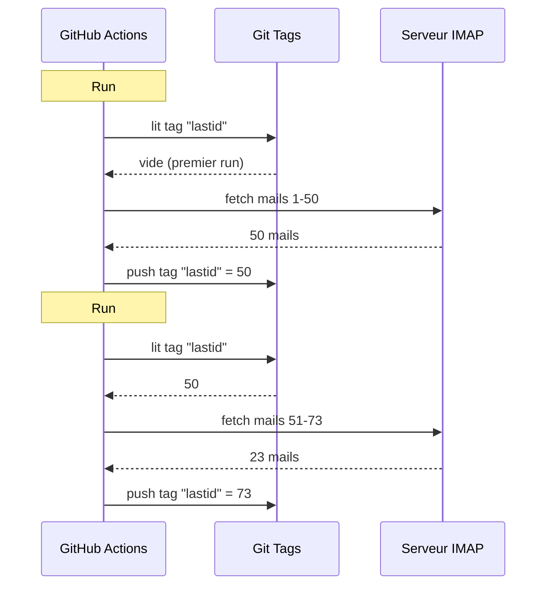

# Tôi đã dùng git làm cơ sở dữ liệu để chạy bot miễn phí trên GitHub Actions

Tôi có một trình trả lời email tự động chạy 24/7.

Nó đọc email của tôi, hiểu nội dung, và tự động trả lời bằng AI. Nó ghi nhớ các cuộc hội thoại trước đó. Nó bỏ qua newsletter và `noreply@`. Nó chuyển tiếp cho người thật khi vấn đề quá nóng.

Chi phí hàng tháng: **0€**.

Không server. Không VPS. Không cơ sở dữ liệu. Chỉ GitHub Actions và một hack điên rồ: **dùng git làm cơ sở dữ liệu**.

Bạn thấy ý tưởng chưa? Chưa? Được rồi, bám chắc vào nhé, vừa ngu vừa thiên tài cùng lúc.

---

## Vấn đề: GitHub Actions là stateless

GitHub Actions thì miễn phí. Bạn có thể chạy cron mỗi 5 phút, chạy code, miễn phí.

Nhưng có một vấn đề: nó **stateless**.

Mỗi lần chạy đều bắt đầu trên một máy ảo mới toanh. Không có gì được lưu lại giữa các lần chạy. Lần chạy trước? Bị quên. Bị xóa. Như chưa từng tồn tại.

Đối với một trình trả lời email, đây là vấn đề cực lớn. Kiểu:

> "Email cuối cùng tôi đã xử lý là email nào?"

Nếu bot quên điều này mỗi lần chạy, nó sẽ hoặc trả lời lại cùng một email (thảm họa), hoặc bỏ sót email.

Cần có trạng thái bền vững. Và thông thường, trạng thái bền vững = cơ sở dữ liệu. Nhưng cơ sở dữ liệu là server, và server thì không còn miễn phí.

Đây là lúc mọi chuyện trở nên thú vị.

---

## Giải pháp: git tags làm cơ sở dữ liệu

Repo GitHub của bạn đã là bộ nhớ bền vững rồi. Miễn phí. Có phiên bản. Luôn ở đó.

Vậy sao không lưu trạng thái vào đó?

Ý tưởng: mỗi lần chạy, bot đọc UID email cuối cùng đã xử lý từ một **git tag**. Nó xử lý email mới. Sau đó push lại tag với UID mới.



Git tag CHÍNH LÀ cơ sở dữ liệu. Một giá trị duy nhất, nhưng đó là tất cả những gì cần.

### Đọc trạng thái

Đầu job, lấy giá trị từ tag:

```bash
git fetch origin --tags lastid || true
git show refs/tags/lastid:data/lastId > data/lastId || true
```

`git show refs/tags/lastid:data/lastId` nghĩa là: "đưa tôi nội dung của file `data/lastId` như nó đã tồn tại trong tag `lastid`".

Bùm. Bạn có giá trị, không cần cơ sở dữ liệu.

### Ghi trạng thái

Cuối cùng, tạo lại tag với giá trị mới:

```bash
git switch --orphan lastid-tmp   # nhánh trắng không lịch sử
git rm -rf .                      # xóa sạch
mkdir -p data
printf "%s\n" "${LAST_ID_CONTENT}" > data/lastId

git add data/lastId
git commit -m "lastId snapshot"
git tag -f lastid                 # force tag lên commit này
git push --force ...origin lastid # push tag
```

Tạo một nhánh **orphan** (không lịch sử), chỉ đặt file `lastId`, commit, tag, force push.

Sao lại orphan? Để không tích lũy 10.000 commit trạng thái trong lịch sử repo. Mỗi lần cập nhật ghi đè lần trước. Tag luôn trỏ đến MỘT commit duy nhất chứa MỘT giá trị duy nhất.

Sạch sẽ. Miễn phí. Hoàn toàn điên rồ xD

---

## Hack thứ hai: runtime snapshot

Còn một vấn đề khác với GitHub Actions: `npm install`.

Nếu mỗi lần chạy (mỗi 5 phút) bạn chạy `npm install` + `npm run build`, bạn lãng phí 60-90 giây mỗi lần. Với cron tần suất cao, đó là hàng phút compute bị lãng phí vô ích.

Giải pháp: pre-compile code MỘT lần, và lưu nó trong một git tag luôn.

Workflow build (chạy khi bạn push lên `master`) làm thế này:

```bash
# compile code
bun install
bun run build

# lưu dist/ + node_modules/ vào tag "runtime"
git checkout --orphan temp-runtime
git rm -rf .
cp -r "$TMPDIR"/* .
git add dist node_modules package.json bun.lock data
git commit -m "runtime build"
git tag -f runtime
git push --force ...origin runtime
```

Tag `runtime` chứa code đã compile VÀ `node_modules`. Sẵn sàng chạy.

Và cron checkout trực tiếp tag này:

```yaml
- name: Checkout runtime snapshot
  uses: actions/checkout@v4
  with:
    ref: refs/tags/runtime    # code pre-build, không phải source
    fetch-depth: 1

# không npm install, không build!
- name: Process emails
  run: node dist/index.js --action
```

Không cài đặt. Không build. Cron khởi động tức thì và chạy `node dist/index.js`.

Kiểu, bạn có hai tag làm hai việc:
- `runtime` = code sẵn sàng chạy (cập nhật khi bạn push code)
- `lastid` = trạng thái bền vững (cập nhật mỗi lần chạy)

Thanh lịch một cách bẩn thỉu.

---

## Bot tự nó: auto-répondeur AI

Hack git thì hay đấy, nhưng bot thực sự làm gì?

Nó đọc email của bạn qua IMAP, hiểu chúng bằng AI (Groq + Llama 3.3 70B), và tự động trả lời.

Kiến trúc service sạch với dependency injection (InversifyJS):

```
App
├── ImapService      → đọc email (IMAP)
├── SmtpService      → gửi trả lời (SMTP)
├── ParserService    → phân tích nội dung email
├── ReplyService     → sinh câu trả lời AI
├── SummaryService   → bộ nhớ hội thoại
├── AccountsService  → quản lý nhiều tài khoản email
└── ConfigService    → cấu hình / biến môi trường
```

### Hai chế độ hoạt động

Bot có thể chạy hai cách:

**Chế độ listener (thời gian thực)**: kết nối IMAP vĩnh viễn với reconnect exponential. Dành cho VPS.

```typescript
this.imapService.on("exists", async (data) => {
  console.log(`[MAIL] Nouveau mail ! Total: ${data.count}`);
  // xử lý email mới ngay lập tức
});
```

**Chế độ action (batch)**: xử lý email mới từ `lastId`, sau đó đóng. Dành cho cron GitHub Actions.

```bash
node dist/index.js --action
```

Chế độ `--action` là chế độ dùng hack git. Nó đọc `lastId`, xử lý cái mới, ghi `lastId` mới, xong.

### KHÔNG trả lời robot

Nếu bot của bạn trả lời TẤT CẢ email, nó sẽ trả lời newsletter, thông báo, `noreply@`. Thảm họa. Tệ hơn: nếu hai bot trả lời lẫn nhau, bạn có vòng lặp email vô tận. Ác mộng.

Vậy nên lọc mạnh tay:

```typescript
export function isAutomatedSender(address) {
  const automatedPatterns = [
    "noreply", "no-reply", "donotreply",
    "mailer-daemon", "postmaster", "bounce",
    "newsletter", "notification", "marketing",
    "billing", "receipt", "promo", ...
  ];
  const local = address.split("@")[0].toLowerCase();
  return automatedPatterns.some(p => local.includes(p));
}
```

Và phát hiện qua header email:

```typescript
export function isAutomatedByHeaders(headers) {
  return (
    ["bulk", "list", "junk"].includes(headers.precedence) ||
    headers["auto-submitted"] !== "no" ||
    headers["list-unsubscribe"] !== "" ||   // newsletters có cái này
    /mailchimp|sendgrid|mailgun|brevo/i.test(headers["x-mailer"])
  );
}
```

`List-Unsubscribe` trong headers? Đó là newsletter. `Precedence: bulk`? Mass-mailing. `X-Mailer: Mailchimp`? Bạn hiểu rồi đấy. Bỏ qua.

Giống như bảo vệ club vậy: robot không qua được xD

### Trigger thần kỳ

AI có thể quyết định không trả lời, hoặc chuyển cho người thật. Bằng cách nào? Bằng các trigger đặc biệt trong câu trả lời.

System prompt bảo nó:

> Nếu là email tự động/newsletter → trả lời `<no_reply>`
> Nếu quá quan trọng/nhạy cảm (pháp lý, tài chính...) → trả lời `<manual_reply_required>`
> Nếu không → viết câu trả lời thật

Và code đọc kết quả:

```typescript
const aiReply = completion.choices[0].message.content.trim();
const manualTrigger = aiReply.includes(MANUAL_REPLY_TRIGGER);
const noReply = aiReply.includes(NO_REPLY_TRIGGER);

if (noReply) {
  console.log("[MAIL] L'IA a décidé d'ignorer. Skip.");
  return;
}

if (manualTrigger) {
  console.log("[MAIL] Trop chaud, je forward à un humain.");
  await this.smtpService.sendManualForward(...);
  return;
}

// nếu không thì gửi câu trả lời AI
await this.smtpService.sendReply(...);
```

Kiểu AI có quyền nói "không, cái này tôi không đụng vào, gọi người thật đi". Đó là sự khôn ngoan.

---

## Bộ nhớ hội thoại

Một chi tiết làm nên khác biệt: bot **ghi nhớ** các cuộc hội thoại.

Khi nó trả lời ai đó, nó lưu một bản tóm tắt cuộc trao đổi. Lần sau người đó viết thư, bản tóm tắt được đưa lại vào prompt.

Lưu trữ: một file JSON cho mỗi liên hệ.

```
data/customers/
├── moi%40gmail.com/
│   ├── alice%40example.com.json
│   └── bob%40client.fr.json
```

Và bản tóm tắt tự được AI sinh ra, hợp nhất bản tóm tắt cũ với tin nhắn mới:

```typescript
const completion = await groq.chat.completions.create({
  model: "llama-3.3-70b-versatile",
  messages: [
    { role: "system", content: "Tu es un assistant de mémoire. Merge l'ancien résumé avec le nouveau message sans perdre d'info." },
    { role: "user", content: `Résumé existant:\n${existing}\n\nNouveau message:\n${incomingContent}` }
  ],
  temperature: 0.0,  // xác định, không sáng tạo
  max_tokens: 800,
});
```

Vậy bot xây dựng bộ nhớ nén theo thời gian. Không cần lưu tất cả email, chỉ cần một bản tóm tắt thông minh phình to dần.

Và các file JSON này? Ờ... chúng cũng được lưu trong git, trong runtime tag. Git everywhere xD

---

## Mẹo thông minh với độ dài prompt

Một chi tiết kỹ thuật nhỏ khiến tôi mỉm cười.

Các model có giới hạn token. Nếu email + bản tóm tắt + persona prompt vượt quá, API trả về lỗi.

Code xử lý bằng **cascade truncation** + retry:

```typescript
try {
  // lần thử đầu với giới hạn bình thường
  completion = await groq.chat.completions.create({...});
} catch (error) {
  if (!this.isLengthError(error)) throw error;

  // lỗi độ dài: thử lại với giới hạn chặt hơn
  ({ systemContent, userContent } = this.buildPromptPayload({
    ...,
    limits: {
      systemPromptChars: 2200,  // thay vì 3000
      summaryChars: 1800,       // thay vì 4000
      personaChars: 900,        // thay vì 1500
      userContentChars: 2200,   // thay vì 8000
    },
  }));
  completion = await groq.chat.completions.create({...});  // retry
}
```

Nếu vẫn không được, cắt ngắn hơn và thử lại. Đơn giản, hiệu quả, không crash.

---

## Vậy cụ thể, nó chạy thế nào?

Luồng đầy đủ của một lần chạy cron:

```
1. GitHub Actions kích hoạt (cron mỗi 5 phút)
2. Checkout tag "runtime" (code pre-build)
3. git show refs/tags/lastid → lấy UID cuối đã xử lý
4. node dist/index.js --action
   ├── kết nối IMAP
   ├── fetch email từ lastId+1
   ├── với mỗi email:
   │   ├── phân tích nội dung
   │   ├── lọc robot (skip nếu automated)
   │   ├── tìm tài khoản nhận
   │   ├── lấy bộ nhớ hội thoại
   │   ├── sinh câu trả lời AI (Groq)
   │   ├── <no_reply> ? skip
   │   ├── <manual_reply_required> ? forward người thật
   │   ├── nếu không: gửi câu trả lời (SMTP)
   │   └── cập nhật bộ nhớ hội thoại
   └── ghi lastId mới
5. git push --force tag "lastid" với giá trị mới
```

Và nó lặp lại sau 5 phút. Mãi mãi. Miễn phí.

---

**3 điều cần nhớ:**

1. **Git = cơ sở dữ liệu miễn phí** -- Một tag orphan có thể lưu trạng thái bền vững giữa các lần chạy stateless. `git show refs/tags/X:fichier` để đọc, force-push để ghi. Không cần DB.

2. **Pre-compile trong tag runtime** -- Thay vì `npm install` mỗi lần chạy cron, lưu code compile + node_modules vào git tag. Cron khởi động tức thì.

3. **Bot AI phải biết im lặng** -- Trigger `<no_reply>` và `<manual_reply_required>` cho AI quyền không trả lời hoặc chuyển tiếp. Thêm bộ lọc anti-robot. Nếu không bạn tạo vòng lặp email vô tận.

Serverless cron với trạng thái bền vững, AI, bộ nhớ, tất cả với giá 0€/tháng. Hoàn toàn điên rồ và tôi yêu nó xD
