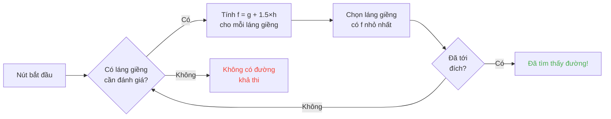

## Giới thiệu

Tôi đã dành hàng giờ để nhìn mấy con cừu đâm đầu vào tường.

Thành thật mà nói? Đầu tư xứng đáng nhất đời tôi xD

Bởi vì càng nhìn mấy con mob này, bạn càng nhận ra chúng chẳng có gì ngẫu nhiên. Mọi chuyển động đều được mã hóa, có thể dự đoán, và quan trọng nhất -- hoàn toàn có thể phá vỡ. Cuối cùng tôi đã đào sâu vào mã nguồn Minecraft để hiểu chính xác pathfinding hoạt động thế nào, và thứ tôi khám phá ra là bạn có thể điều khiển tâm trí mob theo đúng nghĩa đen. Kiểu, ép chúng đi chỗ BẠN muốn, chứ không phải nơi ngẫu nhiên quyết định.

Hướng dẫn này là tất cả những gì tôi học được khi mày mò. AI, thuật toán A*, điểm phạt ẩn, những exploit bạn có thể xài trong survival. Chuẩn bị cuốc của bạn đi.

---

## Cách AI của mob hoạt động (spoiler: nó khá ngu)

### Các Goal

Mỗi mob có các *goal*. Đó là danh sách những thứ nó CÓ THỂ làm và mức độ nó MUỐN làm. Số càng nhỏ thì càng ưu tiên -- như một todo list phiên bản hỗn loạn.

```java
protected void registerGoals() {
   this.goalSelector.addGoal(4, new Zombie.ZombieAttackTurtleEggGoal(this, 1.0, 3));
   this.goalSelector.addGoal(8, new LookAtPlayerGoal(this, Player.class, 8.0F));
   this.goalSelector.addGoal(8, new RandomLookAroundGoal(this));
   this.addBehaviourGoals();
}
```

Bạn đã bao giờ thấy zombie lơ một quả trứng rùa để rượt bạn chưa? Đây là lý do: `ZombieAttackTurtleEggGoal` có độ ưu tiên 4, trong khi `ZombieAttackGoal` (thứ bảo nó ăn mặt bạn) có độ ưu tiên 2.

Ừ, zombie thích ăn bạn hơn là đập trứng. Tình yêu đẹp đấy xD

Goal mà chúng ta thực sự quan tâm là `WaterAvoidingRandomStrollGoal`, độ ưu tiên 7. Cái goal "chả có gì để làm nên đi bộ lung tung". Đó là nơi mọi chuyện bắt đầu.

### Di chuyển (hay "cách một random walk có 1/60 cơ hội xảy ra")

Mỗi tick (mỗi 0.05 giây), game gọi `canUse()` để xem mob có thèm động đậy không. 1 trên 60 cơ hội mỗi tick. Thiết kế ngu vãi, và tôi yêu nó.

```java
public boolean canUse() {
   if (this.mob.hasControllingPassenger()) {
      return false;
   } else {
      if (!this.forceTrigger) {
         if (this.checkNoActionTime && this.mob.getNoActionTime() >= 100) {
            return false;
         }
         if (this.mob.getRandom().nextInt(reducedTickDelay(this.interval)) != 0) {
            return false;
         }
      }
      Vec3 $$0 = this.getPosition();
      if ($$0 == null) {
         return false;
      } else {
         this.wantedX = $$0.x;
         this.wantedY = $$0.y;
         this.wantedZ = $$0.z;
         this.forceTrigger = false;
         return true;
      }
   }
}
```

Tóm lại: nếu bạn đang cưỡi trên mob -> không, nếu mob chưa làm gì 5 giây -> không, nếu random bảo không -> không. Game thực sự KHÔNG muốn mob động đậy.

Nhưng khi nó động đậy, `getPosition()` tiếp quản:

```java
protected Vec3 getPosition() {
   if (this.mob.isInWater()) {
      Vec3 $$0 = LandRandomPos.getPos(this.mob, 15, 7);
      return $$0 == null ? super.getPosition() : $$0;
   } else {
      return this.mob.getRandom().nextFloat() >= this.probability
         ? LandRandomPos.getPos(this.mob, 10, 7)
         : super.getPosition();
   }
}
```

Nhìn hai con số ở cuối: đó là bán kính XZ và bán kính Y. Trong nước, mob tìm xa hơn (15 thay vì 10). Nếu không tìm thấy đất, nó rơi xuống `super.getPosition()` – cái chấp nhận nước. **Kết quả: mob MUỐN ra khỏi nước.** Đó là lý do động vật của bạn bơi như điên về phía bờ.

Chi tiết ngon: có đúng 0.1% cơ hội mob lấy `super.getPosition()` thay vì `LandRandomPos`. Một phần nghìn. Mojang đó xD

### LandRandomPos: cái tối ưu dở hơi làm thay đổi mọi thứ

Đây là bước TÔI yêu thích nhất. Thứ kỹ thuật ngu ngốc nhất khiến pathfinding có thể khai thác được.

```java
public static Vec3 getPos(PathfinderMob $$0, int $$1, int $$2, ToDoubleFunction<BlockPos> $$3) {
   boolean $$4 = GoalUtils.mobRestricted($$0, $$1);
   return RandomPos.generateRandomPos(() -> {
      BlockPos $$4xx = RandomPos.generateRandomDirection($$0.getRandom(), $$1, $$2);
      BlockPos $$5 = generateRandomPosTowardDirection($$0, $$1, $$4, $$4xx);
      return $$5 == null ? null : movePosUpOutOfSolid($$0, $$5);
   }, $$3);
}
```

`movePosUpOutOfSolid`. Cái tên nói lên tất cả. Nếu vị trí được chọn nằm trong khối rắn, game đẩy nó lên trên cho đến khi ở trong không khí.

Đây là một tối ưu hóa: thay vì mất thời gian bỏ qua các vị trí dưới lòng đất, game đưa chúng lên mặt đất. Thông minh? Ừ. Nhưng nó tạo ra một thiên vị điên rồ: **mob thích độ cao hơn**.

Hãy tưởng tượng. Bạn có đầy khối dưới mặt đất, game tạo ra 10 vị trí ngẫu nhiên. Những vị trí trong khối bị đẩy lên trên. Vùng đặc (dưới đồi) tạo ra nhiều vị trí hợp lệ hơn vùng rỗng. Kết quả: mob về mặt thống kê sẽ đi về phía đồi nhiều hơn.

Tin tôi đi, chúng ta sẽ phá vỡ điều này trong 2 phút.

### Chọn lọc: cuộc thi khối nào ngon nhất

10 vị trí, một người thắng, một cuộc thi điểm số:

```java
public static Vec3 generateRandomPos(Supplier<BlockPos> $$0, ToDoubleFunction<BlockPos> $$1) {
   double $$2 = Double.NEGATIVE_INFINITY;
   BlockPos $$3 = null;
   for(int $$4 = 0; $$4 < 10; ++$$4) {
      BlockPos $$5 = (BlockPos)$$0.get();
      if ($$5 != null) {
         double $$6 = $$1.applyAsDouble($$5);
         if ($$6 > $$2) {
            $$2 = $$6;
            $$3 = $$5;
         }
      }
   }
   return $$3 != null ? Vec3.atBottomCenterOf($$3) : null;
}
```

Vị trí có điểm cao nhất THẮNG. Và nếu ta biết tiêu chí chấm điểm, ta có thể làm cho vị trí mình muốn thắng. Như gian lận bầu cử vậy.

---

## Sở thích của mob (hay "tại sao bò của bạn băng qua đường")

Mỗi mob có gu khác nhau. Và điều đó thay đổi mọi thứ.

| Mob | Thích |
| --- | --- |
| **Động vật** (bò, cừu, heo) | Cỏ và ánh sáng (hipster) |
| **Quái vật** (zombie, skeleton) | Bóng tối (edgelord) |
| **Rùa** | Nước, nếu không thì cát, nếu không thì ánh sáng |
| **Hoglin** | `crimson_nylium`; ghét `warped_fungus` |
| **Strider** | Chỉ lava. KHÔNG gì khác. |
| **Silverfish** | Khối có thể infest (hợp lý) |
| **Guardian** | Nước + ánh sáng (kẻ hợm) |
| **Mooshroom** | Mycelium + ánh sáng (nấm) |
| **Ong** | Không khí. Ừ, chúng thích KHÔNG KHÍ. |

```java
// Animal: nhìn xuống, nếu là cỏ, điểm tối đa
public float getWalkTargetValue(BlockPos $$0, LevelReader $$1) {
   return $$1.getBlockState($$0.below()).is(Blocks.GRASS_BLOCK) ? 10.0F : $$1.getPathfindingCostFromLightLevels($$0);
}

// Monster: chính xác thì ngược lại
public float getWalkTargetValue(BlockPos $$0, LevelReader $$1) {
   return -$$1.getPathfindingCostFromLightLevels($$0);
}
```

Kiểu quái vật là "nếu chỗ sáng, điểm âm, tao đi chỗ khác". Chúng MẶT NẶC với ánh sáng xD

Vậy bạn có thể -- theo nghĩa đen -- dẫn động vật bằng cỏ và ánh sáng, và quái vật bằng bóng tối. Vừa ngu vừa tuyệt.

---

## Thuật toán A* trong Minecraft (công thức bí mật)

Minecraft sử dụng thuật toán A* (A-star) cho pathfinding. Nhưng Mojang đã thêm dấu ấn riêng:

```
f(n) = g(n) + 1.5 × h(n)
```

- **g(n)** = đường đã đi (1 mỗi khối, ~1.41 đường chéo)
- **h(n)** = khoảng cách đường chim bay
- **1.5** = vì Mojang thích mấy thứ hơi lỗi

Bình thường A* dùng `f(n) = g(n) + h(n)`. MOJANG ĐÃ THÊM HỆ SỐ 1.5. Tại sao? Để thuật toán đi nhanh hơn đến đích và cắt bớt nhánh tìm kiếm. Kết quả: đường tìm được là "tốt" nhưng không phải lúc nào cũng tốt nhất. Đây là A* hơi say.



Chi tiết quan trọng: **một mob chỉ có thể pathfinding trong 16 khối** (tầm *follow range* của nó). Nếu đích quá xa, nó chọn khối gần nhất mà nó CÓ THỂ tới. Điều này có nghĩa bạn có thể tạo một monolithe ngoài tầm với, và mob sẽ pathfinding đến khối gần nhất đưa nó đến gần monolithe đó -- khiến chuyển động của nó hoàn toàn có thể dự đoán.

### Hai exploit phá game

#### 1. Block updates = buộc tính toán lại

```java
public boolean shouldRecomputePath(BlockPos $$0) {
   if (this.hasDelayedRecomputation) return false;
   if (this.path != null && !this.path.isDone() && this.path.getNodeCount() != 0) {
      Node $$1 = this.path.getEndNode();
      Vec3 $$2 = new Vec3(
         ((double)$$1.x + this.mob.getX()) / 2.0,
         ((double)$$1.y + this.mob.getY()) / 2.0,
         ((double)$$1.z + this.mob.getZ()) / 2.0
      );
      return $$0.closerToCenterThan($$2, (double)(this.path.getNodeCount() - this.path.getNextNodeIndex()));
   }
   return false;
}
```

Mỗi lần cập nhật khối gần đường đi của mob buộc tính toán lại A* với cooldown 1 giây. Bạn đặt một đồng hồ 1 giây cạnh mob, và nó tính toán lại LIÊN TỤC. Như kiểu GPS bị reset mỗi giây.

Và nếu bạn làm vậy với 50 mob cùng lúc? Lag city. RIP TPS.

#### 2. Điểm phạt khối (Pathfinding Malice)

Một số khối làm mob sợ. Theo nghĩa đen. Mỗi khối có một chi phí kèm theo, được định nghĩa bằng enum:

| Khối / Điều kiện | Phạt |
| --- | --- |
| **Khối mật ong** | +8 khi đi qua |
| **Bột tuyết** | Không thể đi qua |
| **Cửa đóng** | Không thể đi qua |
| **Lửa** | +16 khi đi qua, +8 khi đi cạnh |
| **Động vật & Dân làng** | Lửa = -1 (NOPE) |
| **Cactus / Sweet berry** | Không thể đi qua; kế bên = +8 |
| **Nước** | +8 khi đi qua hoặc đi cạnh |
| **Magma** | +8 khi đi cạnh (đau) |

Động vật còn cực đoan hơn:

```java
protected Animal(EntityType<? extends Animal> $$0, Level $$1) {
   super($$0, $$1);
   this.setPathfindingMalus(PathType.DANGER_FIRE, 16.0F);
   this.setPathfindingMalus(PathType.DAMAGE_FIRE, -1.0F);
}
```

DAMAGE_FIRE ở -1.0F, có nghĩa là "cấm" theo nghĩa đen. Một con vật thà nhảy xuống vực còn hơn đi qua lửa. Phù.

### Bài tập: cuộc thi đường đi lớn

Hãy tưởng tượng một dân làng phải chọn giữa nhiều con đường.

- **Đường A**: 15 khối nhưng 6 khối đi cạnh nước (+8 mỗi cái)
- **Đường B**: 18 khối với 2 khối nước (+8) và 1 khối kế nước (+8)
- **Đường C**: 14 khối thẳng tắp... nhưng có lửa -> KHÔNG THỂ ĐI đối với dân làng
- **Đường D**: 16 khối với 1 khối kế magma (+8) + 1 khối kế mật ong (+8)
- **Đường E**: 25 khối nhưng toàn cactus (+8 khắp nơi) -> 90.82 tổng chi phí LOL

Tính nhẩm:

- Đường A: 15 khối + 6×8 cho nước = 15 + 48 = **63** ... nhưng còn thêm 1.5×khoảng cách. Tính thực tế nào.
- Đường B: dài hơn nhưng ít phạt hơn. Tổng cost = khoảng cách tích lũy + phạt.
- Đường D: magma và mật ong stack phạt.

Người thắng thường là **Đường B**: đường vòng có lợi vì nước ĐẮT.

Một dân làng thực chất là một máy tính chi phí có chân xD

### Mỗi mob có gu riêng

Một dân làng: "lửa ư? KHÔNG CẢM ƠN BAI"
Một zombie: "lửa ư? OK boomer *đi xuyên qua rực lửa*"

Bạn có đúng nghĩa đen những con đường mà mob này đi nhưng mob kia không. Bạn có thể làm đường cao tốc cho dân làng mà zombie bị cháy.

---

## Dân làng: cái đống hỗn độn tối thượng

Ok, dân làng. Đây là thứ ÍT được hiểu nhất trong toàn bộ Minecraft. Nhưng một khi đã nắm được code, bạn nhận ra chúng là những cỗ máy có thể dự đoán với lịch làm việc văn phòng.

### Cảm biến và bộ nhớ

9 cảm biến, chạy mỗi 20 tick (1 giây). Mỗi cái quét một bán kính quanh dân làng và lưu kết quả vào bộ nhớ. Dân làng thấy tất cả, nhớ tất cả, và hành động dựa trên đó.

Kiểu: "có kẻ thù không? có item trên đất không? có người chơi để nói chuyện không?" -- nó check MỌI THỨ.

### Các package (giai đoạn trong ngày)

Não dân làng là các gói hoạt động kích hoạt theo giờ:

| Package | Giờ | Dân làng... |
| --- | --- | --- |
| **Core** | 24/7 | Mở cửa, bơi (80% thời gian), và THU NHẬN POI |
| **Work** | 8h-15h | "Tôi đi làm" -- đi đến bàn làm việc |
| **Meet** | 15h-17h | "Giờ gặp mặt!" -- đi đến chuông, tán gẫu |
| **Rest** | 18h-6h | "Phải ngủ" -- đi lên giường |
| **Idle** | 6h-8h, 17h-18h | "Tôi lười" -- đi dạo, đẻ con, nhảy lên giường |
| **Panic** | Bị thương/thù địch | "CỨU" -- CHẠY TRỐN |

Package **Panic** là cái duy nhất có thể ngắt TẤT CẢ cái khác. Kể cả dân làng đang ngủ hay làm việc, nếu có zombie, HOẢNG LOẠN TOÀN DIỆN.

### Acquire POI: thứ cho phép redstone không dây

```java
Set<Pair<Holder<PoiType>, BlockPos>> $$12 = (Set)$$10xx.findAllClosestFirstWithType(
   $$0, $$11, $$8x.blockPosition(), 48, PoiManager.Occupancy.HAS_SPACE
)
```

`Acquire POI` quét trong bán kính 48 khối tất cả POI (điểm ưa thích). Nó giữ 5 cái gần nhất, kiểm tra đường có tồn tại không, và thu nhận cái đầu tiên có thể tới được.

Mỗi POI có số slot giới hạn:
- **Bàn làm việc**: 1 slot
- **Giường**: 1 slot
- **Chuông**: 32 slot

Điều ĐIÊN RỒ: **slot được giữ tại thời điểm thu nhận, KHÔNG PHẢI lúc tới nơi**. Một dân làng có thể khóa một composter từ đầu bên kia bản đồ, mà không bao giờ tới được nó.

Bạn thấy sức mạnh chưa?

### Redstone không dây. Đúng, KHÔNG DÂY.

1. Bạn đặt dân làng vào minecart với đường dẫn tới composter
2. Nó thu nhận composter (slot bị chiếm, không ai dùng được nữa)
3. Dân làng ở quá xa không thể click -- bone meal vẫn còn
4. Bạn DẮT dân làng này đi bất kỳ đâu trong thế giới, nó giữ slot
5. Khi bạn muốn kích hoạt thứ của mình, bạn G I Ế T dân làng
6. Slot được giải phóng, dân làng khác thu nhận composter, lấy bone meal
7. BLOCK UPDATE -> bất kỳ mạch redstone nào cũng được kích hoạt

Bạn vừa tạo ra tín hiệu redstone không dây, có thể truyền khắp thế giới, với zero chunk load cần thiết trên đường đi. Bạn có thể kết nối nó với ender pearl stasis chamber, tự dịch chuyển từ bất kỳ đâu bằng cách giết một dân làng.

Cách dùng yêu thích của tôi? Một mini-game "bounty hunter": bạn đặt nhiều dân làng với composter, người chơi phải giết ĐÚNG dân làng để kích hoạt lối ra. Cơ chế wtf hoàn toàn xD

### Pathfinding Deadlock (hay "dân làng đóng băng vĩnh viễn")

Có một bug QUÁ ngon giữa `Acquire POI` (thấy đường) và navigation thực tế (từ chối đi đường đó). Xảy ra khi khối phía trên bàn làm việc không thể đi được. Kết quả:

- Core package: "tao muốn thu nhận POI"
- Navigation: "tao không thể đi ở đó"
- Kết quả: dân làng ĐỨNG YÊN, mãi mãi, tự đấu tranh với chính mình.

Dân làng đóng băng tại chỗ, có thể dùng làm trang trí hoặc "đạo cụ" trong build. Một cái tủ đựng giáp? Ừ. Một lính canh không động đậy? Ừ. Rùng rợn? Có thể. Nhưng hiệu quả xD

---

## Kết luận

Pathfinding của mob Minecraft không phải ngẫu nhiên. Đó là một hệ thống tất định, dựa trên điểm số, có thể dự đoán VÀ phá vỡ được.

**Ba điều cần nhớ:**

1. **Khối dưới chân = thiên vị độ cao** -- lấp đầy hoặc làm rỗng tầng hầm để dẫn mob
2. **Điểm phạt khác nhau cho mỗi mob** -- tạo đường mà mob này đi nhưng mob kia không
3. **Slot POI được giữ từ xa** -- redstone không dây miễn phí, dịch chuyển, đủ thứ

Mã nguồn Minecraft là một mỏ vàng các cơ chế bị khai thác ít. Tôi đã dành hàng giờ đọc Java đã dịch ngược và thành thật? Mỗi dòng code là một Easter Egg có chức năng. Chỉ khác là mấy cái này, bạn xài được trong survival để làm redstone không dây với dân làng. Game hay nhất confirmed.

xD
