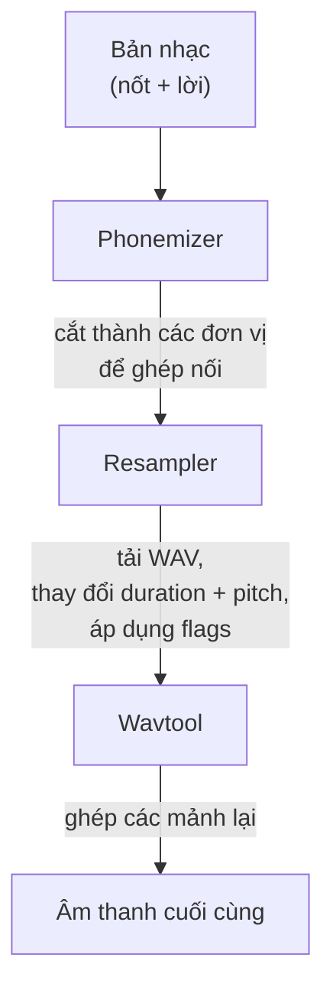

## UTAU : cách một phần mềm Visual Basic 6 đã dân chủ hóa giọng hát tổng hợp

Tôi đã đề cập trên trang chính của mình : tôi yêu UTAU. Đây là lý do.

Năm 2008, nếu bạn muốn tạo giọng hát tổng hợp, bạn chỉ có một lựa chọn : VOCALOID. Phần mềm của Yamaha. Đắt tiền, độc quyền, với những giọng hát chính thức mà bạn không thể tự tạo.

Rồi một người Nhật tên Ameya/Ayame đã phát hành một thứ gì đó tự làm. Một phần mềm được viết bằng **Visual Basic 6**. Miễn phí. Cho phép bạn tạo giọng hát của riêng mình với... những file WAV bạn tự thu âm.

Thứ đó có tên **UTAU** (歌う, "hát" trong tiếng Nhật). Và ở thời điểm đó, nó thực sự kỳ diệu.

Tôi luôn thấy phần mềm này hấp dẫn. Không phải vì nó sạch sẽ về mặt kỹ thuật (spoiler : thực ra thì, phải nghĩ ra được thứ này mới tài... nó là một mớ hỗn độn đẹp đẽ, tôi khóc cho con gà này), mà vì nó đã làm được điều không ai khác làm : nó mang tổng hợp giọng nói đến với đại chúng. Ý là bạn, tôi, bất kỳ ai có một cái micro.

Để tôi giải thích tại sao nó tuyệt vời.

---

## Trước hết, tại sao tổng hợp giọng hát lại khó

Giọng hát không chỉ là những nốt nhạc. Bạn có phụ âm tấn công, nguyên âm kéo dài, hơi thở, sự chuyển tiếp giữa chúng. Chữ "sa" trong "sao" là âm "s" xuýt xoa trượt dần sang âm "a" mở, và chính sự trượt đó làm nên âm thanh tự nhiên hay không.

Ngày nay ta giải quyết bằng deep learning : bạn huấn luyện một mô hình trên hàng giờ hát và nó sinh ra giọng hát (Synthesizer V, DiffSinger). Nhưng đó là 2020+. Năm 2008, không có gì cả.

UTAU sử dụng phương pháp cũ hơn, thông minh hơn : **tổng hợp ngưng kết** (concatenative synthesis).

---

## Tổng hợp ngưng kết : ghép nối các mảnh giọng nói

Ý tưởng đơn giản đến ngây ngô : bạn thu âm những mảnh giọng nhỏ và ghép chúng lại để tạo thành từ. "sao" = mẫu "sa" + "o" nối tiếp nhau. Một trò ghép hình âm thanh điều khiển bằng bản nhạc.

Đó cũng là nguyên lý của YouTube Poop, nơi người ta cắt ghép lời của một nhân vật để bắt họ nói đủ thứ -- chỉ có điều ở đây nó có tổ chức và tự động hóa.

Và UTAU thực sự ra đời từ đó. Trước nó đã tồn tại **"Jinriki Vocaloid"** (人力ボーカロイド, "Vocaloid thủ công") : người ta tự tay cắt các track giọng hát, trích xuất âm vị, chỉnh cao độ, và ráp lại trong một trình chỉnh sửa âm thanh để bắt chước giọng VOCALOID. Làm bằng tay. Bạn tưởng tượng khối lượng công việc đi.

Ameya đã nhìn thấy sự vất vả đó và viết công cụ để tự động hóa nó. Ban đầu UTAU chỉ đơn giản là vậy : một trợ lý cho Vocaloid thủ công.

---

## Tại sao nó mang tính cách mạng : BẠN tạo ra giọng hát

Đây là điểm làm nên khác biệt.

VOCALOID, bạn mua một giọng hát. Miku, Luka, v.v. Được tạo bởi chuyên gia, bán bởi Yamaha. Không cách nào tự tạo một giọng cho riêng mình. Với UTAU, **bất kỳ ai cũng có thể thu âm giọng mình và biến nó thành một nhạc cụ biết hát**.

Chế độ CV (đơn giản nhất) là : bạn thu âm ~100 âm tiết cơ bản của tiếng Nhật ("a", "ka", "sa", "ta"...), cấu hình các điểm cắt, và thế là bạn đã có voicebank của mình. Chỉ mất vài giờ.

Kết quả : hệ sinh thái bùng nổ. Hàng ngàn voicebank được tạo ra bởi cộng đồng -- giọng của fan, của bạn bè, của nhân vật tưởng tượng. Cả một vũ trụ ca sĩ ảo, miễn phí. Và phần mềm đi kèm với **Defoko** (Utane Uta), một giọng mặc định được tạo qua engine TTS AquesTalk, nên bạn có thể bắt đầu ngay cả khi không có micro.

---

## oto.ini : trái tim của hệ thống

Làm thế nào UTAU biết cắt và ghép âm thanh ở đâu? Thông qua một file cấu hình cho mỗi voicebank : **`oto.ini`**. Với mỗi file WAV, nó định nghĩa các điểm cắt (tính bằng mili giây) :

- **Offset** → khoảng lặng cần loại bỏ ở đầu
- **Preutterance** → điểm mà phụ âm chuyển sang nguyên âm (ranh giới "s"→"a" trong "sa")
- **Overlap** → mức độ nốt trước chồng lên nốt này
- **Fixed region** → phần KHÔNG được kéo dãn khi nốt kéo dài (thường là phụ âm)
- **Cutoff** → chỗ cắt ở cuối

**Preutterance** là tham số thông minh nhất. Một âm tiết luôn có một phần phụ âm trước nguyên âm. Để nốt nhạc rơi đúng nhịp, chính *nguyên âm* phải rơi đúng nhịp, không phải phụ âm. Vì vậy UTAU dịch chuyển mẫu âm thanh về phía trước : âm "a" trong "sa" rơi đúng nhịp, âm "s" chỉ chồm ra trước một chút. Giống như một tay trống đánh trước để âm thanh vang lên đúng lúc -- chỉ khác là điều này nằm trong một file `.ini`.

Về mặt hình ảnh, trên một mẫu "ka", các vùng trong `oto.ini` được cắt như sau :

```mermaid
flowchart LR
    A["🔇 silence<br/>(offset)"] --> B["🅺 consonne<br/>(fixed region,<br/>pas étirée)"]
    B --> C["🅰 voyelle<br/>(zone étirable)"]
    C --> D["🔇 fin coupée<br/>(cutoff)"]
    style B fill:#3b4a6b
    style C fill:#5b3b6b
```



Ranh giới giữa phụ âm và nguyên âm là preutterance. Nguyên âm là vùng được kéo dãn cho các nốt dài ; phụ âm giữ nguyên, nếu không âm "k" của bạn sẽ kéo dài hai giây và nghe rất khủng khiếp.

```ini
# oto.ini (simplifié)
# fichier=alias,offset,consonant,cutoff,preutterance,overlap
_ka.wav=ka,120,80,-200,90,40
```

Năm giá trị cho mỗi âm thanh, trên tất cả các mẫu của bạn, và UTAU ghép bất kỳ từ nào một cách chính xác.

---

## CV, VCV, CVVC : cuộc đua tìm tính chân thực

Chế độ cơ bản, **CV** (Consonne-Voyelle), là một âm thanh cho mỗi âm tiết. Đơn giản nhưng hơi robot : các điểm nối giữa các âm tiết khá thô.

Năm 2010, cộng đồng phát minh ra **VCV** (Voyelle-Consonne-Voyelle). Thay vì thu âm "ka" đơn lẻ, bạn thu âm "a ka" -- với phần đuôi của nguyên âm trước. Sự chuyển tiếp trở nên tự nhiên vì nó nằm *trong* bản ghi âm, không phải tính toán sau đó.

Chi tiết đau đớn : **VOCALOID đã không có VCV cho đến VOCALOID3, năm 2011.** Phần mềm freeware viết bằng VB6 do một người tự code đã vượt mặt Yamaha một năm về độ chân thực của chuyển tiếp. Một cộng đồng fan nhanh hơn cả tập đoàn đa quốc gia.

Tiếp theo là **CVVC**, **ARPAsing** (tiếng Anh), **VCCV**... mỗi phương pháp đẩy độ chân thực xa hơn, tất cả đều do cộng đồng phát minh và ghi chép lại.

---

## Quy trình hoàn chỉnh : một từ trở thành âm thanh như thế nào

Khi bạn đặt một nốt nhạc và gõ lời, đây là những gì xảy ra ở hậu trường :



**Resampler** là trung tâm : nó lấy mẫu "ka" của bạn được thu ở một cao độ nhất định và kéo dãn/chỉnh pitch để khớp với nốt mong muốn -- chỉ kéo dãn vùng có thể kéo dãn và giữ nguyên phụ âm (đó là lý do cho `oto.ini`).

Và nó **có tính mô-đun**. UTAU đi kèm với một resampler cơ bản, nhưng cộng đồng đã tạo ra nhiều resampler khác (moresampler, TIPS...), mỗi cái có chất âm riêng. Bạn đổi engine tổng hợp như đổi plugin. Vào năm 2008. Trên một phần mềm freeware.

---

## Mớ hỗn độn dưới nắp capo (và tại sao nó đáng yêu)

Phải thành thật về tình trạng kỹ thuật của nó :

- **Viết bằng Visual Basic 6.** Một ngôn ngữ đã chết từ năm 2008. Cần runtime VB6 để chạy.
- **Ban đầu chỉ dành cho Windows** (bản Mac, UTAU-Synth, ra mắt năm 2011).
- **Bắt buộc mã hóa Shift-JIS.** Nếu file của bạn không được mã hóa bằng Shift-JIS tiếng Nhật, UTAU không hiểu gì cả. Cho đến ngày nay, bạn thường phải đặt locale máy tính thành tiếng Nhật hoặc dùng AppLocale để chạy nó.
- **Giao diện khô khan**, tài liệu gần như 100% tiếng Nhật thời bấy giờ.

Thế mà. Thế mà thứ này đã tạo ra một phong trào toàn cầu. Hàng chục ngàn voicebank. Những bài hát được nghe hàng triệu lần.

Ví dụ điển hình nhất : **Kasane Teto**. Một nhân vật được tạo năm 2008 và tung ra như một trò đùa ngày Cá tháng Tư, giả làm VOCALOID. Đó là một trò đùa. Nhưng mọi người yêu thích nhân vật này, một voicebank UTAU thật đã được tạo ra sau đó, và Teto trở thành một trong những ca sĩ ảo nổi tiếng nhất thế giới. Năm 2023, cô ấy thậm chí còn được phát hành giọng Synthesizer V chính thức. Một nhân vật sinh ra từ trò đùa cá tháng tư trên một phần mềm miễn phí.

---

## Tại sao nó vẫn còn quan trọng

UTAU là ví dụ hoàn hảo về công nghệ "nghèo" chiến thắng nhờ tính mở.

VOCALOID vượt trội về kỹ thuật, được đầu tư tốt hơn, chuyên nghiệp hơn. Nhưng đóng. UTAU thì chắp vá, xấu xí, viết bằng VB6 -- nhưng nó cho phép mọi người tham gia. Tạo giọng hát, tạo resampler, tạo plugin, tạo phương pháp thu âm. Cộng đồng đã làm phần còn lại.

Và khái niệm này vẫn tồn tại đến ngày nay. **OpenUtau**, một người kế nhiệm mã nguồn mở hiện đại, tiếp nối ý tưởng và làm mới nó (đa nền tảng, UTF-8, hỗ trợ resampler hiện đại VÀ AI). Tổng hợp ngưng kết vẫn đứng vững bên cạnh các mô hình deep learning, vì nó có một thứ mà chúng không có : bạn hiểu chính xác điều gì đang xảy ra, và bạn kiểm soát từng mili giây.

Đó là điều tôi luôn thích ở UTAU. Bạn thấy chính xác điều gì đang xảy ra. Nó không phải là một AI nhả ra thứ kỳ diệu mà bạn không hiểu : bạn có file WAV, các điểm cắt của bạn, và chính bạn quyết định mọi thứ. Khi nó nghe tệ, bạn biết tại sao và có thể sửa. Tôi thích kiểu kiểm soát đó.

---

**3 điều cần nhớ :**

1. **Tổng hợp ngưng kết = ghép hình giọng nói** -- UTAU ghép các mẫu WAV nhỏ lại với nhau để tạo thành từ. File `oto.ini` định nghĩa chỗ cắt và chỗ dán cho mỗi âm thanh. Bạn kiểm soát mọi thứ, đến từng mili giây, không có hộp đen.

2. **Tính mở đánh bại kỹ thuật** -- VOCALOID tốt hơn nhưng đóng. UTAU chắp vá nhưng cho phép mọi người tạo giọng hát của riêng mình. Cộng đồng đã làm bùng nổ hệ sinh thái, và thậm chí còn vượt mặt Yamaha về VCV.

3. **Một ý tưởng hay tồn tại lâu hơn code của nó** -- VB6, Shift-JIS, Windows only... thế mà khái niệm vẫn chạy qua OpenUtau. Một công nghệ tuyệt vời có thể được viết bằng chân.

Thành thật mà nói, chỉ riêng vì Kasane Teto sinh ra từ trò đùa cá tháng tư, phần mềm này đã đáng được tôn trọng xD
