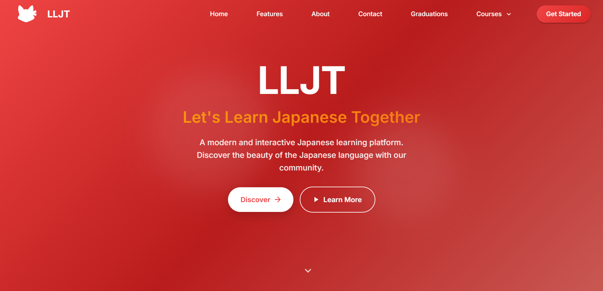
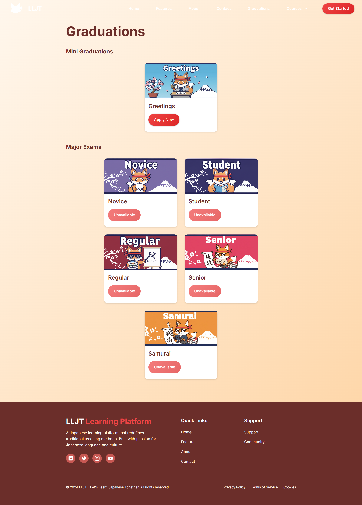
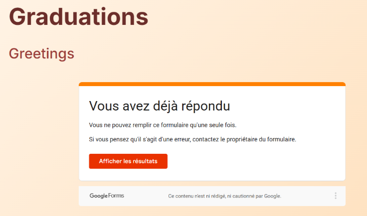
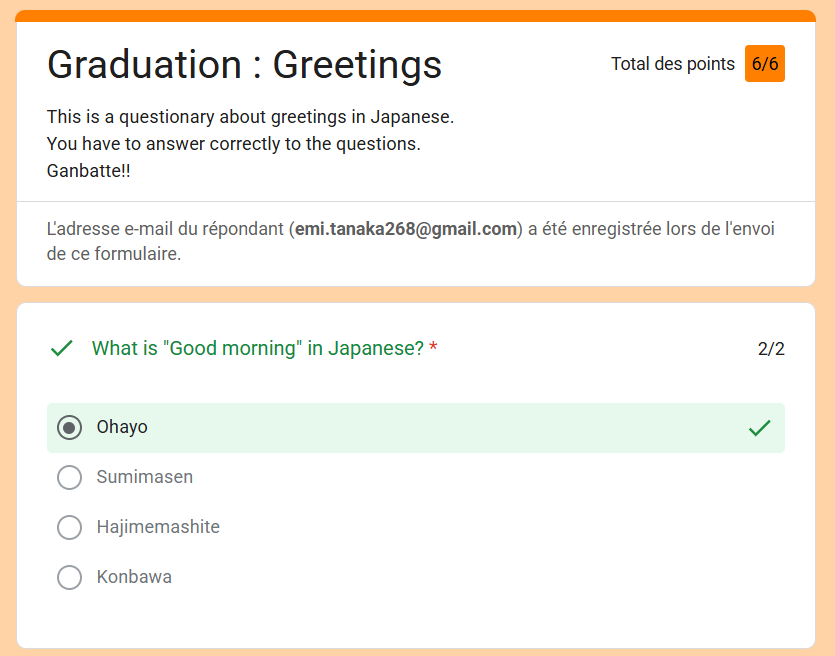

# The Project

The project I'm working on is named LLJT:

This is a website that is also a PWA, so a mobile app as well. It uses MaterialUI to feel like a real phone app.
I recently needed to manage Mui imports, and I go from 11707 modules to only 595 at the end, by importing manually every icon by line, rather than using destructured import: I learnt when you do destructured, you actually load the entire icons lib, and by importing them individually, you import only those you need too...

Nibi is the bot that is connected to this website.The graduation is based on Google Forms:

We use multiple choice tests to evaluate our students, and we also give Discord roles, and so emojis and channels, to our students as well, if they pass a major exam.

The goal of this project is to bring people to learn japanese together with us since it's a thing I want to do by myself as well.
Students will unlock as well partnerships with Crunchyroll, and some other plateforms, to reward them for their capabilities.

Nibi and the website are hosted by respectively Cloudflare Workers Hono Server Interaction URL and Github Pages with React Deployement.
The website code is not open source, but Nibi is, and you can find it on [this GitHub repository](https://github.com/let-s-Learn-Japanese-Together/nibi). The website is not open source because it contains some private info, but if you want to know how I built it, you can ask me on Discord or something, and I'll be happy to share the process with you! It actually uses a Github Action I made so I don't have to pay for Github Enterprise, and it also uses a lot of other cool tools and techniques that I can share with you if you're interested! 

Since some days I really loved finding workarounds for my projects to avoid hosting them, and to avoir paying for hosting them, that's why I made Nibi an Interaction Endpoint Bot, so it can be hosted for free on Cloudflare Workers, and I also made a Github Action to deploy the website for free on Github Pages, so I don't have to pay for hosting it. I find that finding workarounds is one of the most fun parts of coding, and it's something I really enjoy doing! You really have to think outside the box and find creative solutions to problems, and that's what I love about it. It's not just about writing code, it's about finding ways to make things work without spending money, and that's a challenge that I really enjoy!

Using Github Actions a way that is not specially made for, and using Cloudflare Workers to 'host' a bot is also a way to learn new things and to discover new technologies, like as Cloud Hosting, which is something I really enjoy as well. I really don't wan't to pay for hosting anymore.

I'm still working on it but you can join the [Discord server](https://discord.gg/frKZ9cJ4fD) if you want to follow the progress and see how it evolves, and maybe even join the project if you're interested! The server is open to everyone, and we would love to have more people join us on this journey to learn Japanese together! You can find the invite link on the website, or you can ask me for it if you want!

