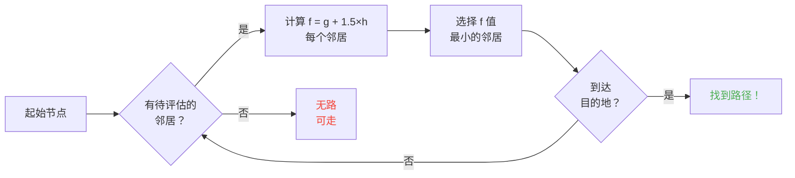

## 引言

我花了几个钟头看绵羊撞墙。

人生最值的投资 xD

你看这些 mob 越久，就越能发现它们的移动根本不是随机的。每一步都是写死的、可预测的，最重要的是----可以拿来搞破坏。我去翻了 Minecraft 的源代码，搞懂了寻路到底怎么运作，然后发现你基本可以精神控制 mob。就像，逼它们去你想让它们去的地方，而不是随机决定去哪。

这篇指南就是我挖到的所有东西。AI 系统、A* 算法、隐藏的 malice 数值、还有你在生存模式能用的骚操作。拿起你的镐子。

---

## Mob AI 是怎么工作的（剧透：挺蠢的）

### Goals

每个 mob 都有一堆 *goals*。就是它能做的事，以及它想做这些事的欲望有多强。数字越小 = 优先级越高。就像一张来自地狱的待办清单。

```java
protected void registerGoals() {
   this.goalSelector.addGoal(4, new Zombie.ZombieAttackTurtleEggGoal(this, 1.0, 3));
   this.goalSelector.addGoal(8, new LookAtPlayerGoal(this, Player.class, 8.0F));
   this.goalSelector.addGoal(8, new RandomLookAroundGoal(this));
   this.addBehaviourGoals();
}
```

见过僵尸无视海龟蛋追你吗？原因在这：`ZombieAttackTurtleEggGoal` 优先级是 4，而 `ZombieAttackGoal`（"啃你脸" 的目标）是 2。僵尸更喜欢有心跳的零食。

我们真正关心的目标是 `WaterAvoidingRandomStrollGoal`，优先级 7。就是 "我没什么好做的就随便走走" 的目标。有趣的部分从这里开始。

### 移动（或者说 "随机行走每 tick 只有 1/60 的几率"）

每个 tick（每 0.05 秒），游戏会调用 `canUse()` 检查 mob 能不能动。每 tick 只有 1/60 的几率。效率低到可怕的设计，但我超爱。

```java
public boolean canUse() {
   if (this.mob.hasControllingPassenger()) {
      return false;
   } else {
      if (!this.forceTrigger) {
         if (this.checkNoActionTime && this.mob.getNoActionTime() >= 100) {
            return false;
         }
         if (this.mob.getRandom().nextInt(reducedTickDelay(this.interval)) != 0) {
            return false;
         }
      }
      Vec3 $$0 = this.getPosition();
      if ($$0 == null) {
         return false;
      } else {
         this.wantedX = $$0.x;
         this.wantedY = $$0.y;
         this.wantedZ = $$0.z;
         this.forceTrigger = false;
         return true;
      }
   }
}
```

总结一下：如果你骑着 mob -> 不行，如果 mob 已经 5 秒没动过 -> 不行，如果 RNG 说不 -> 不行。游戏真的不想让 mob 移动。

但一旦它要动了，`getPosition()` 开始干活：

```java
protected Vec3 getPosition() {
   if (this.mob.isInWater()) {
      Vec3 $$0 = LandRandomPos.getPos(this.mob, 15, 7);
      return $$0 == null ? super.getPosition() : $$0;
   } else {
      return this.mob.getRandom().nextFloat() >= this.probability
         ? LandRandomPos.getPos(this.mob, 10, 7)
         : super.getPosition();
   }
}
```

最后那两个数字？XZ 半径和 Y 半径。在水里时，mob 搜索范围更大（15 比 10）。如果找不到陆地，就退回 `super.getPosition()`，这个接受水域。**结果：mob 想离开水。** 这就是为什么你的动物会疯了一样朝岸边游。

有趣细节：mob 有 0.1% 的概率选 `super.getPosition()` 而不是 `LandRandomPos`。千分之一。Mojang 我服了 xD

### LandRandomPos：打破一切的优化

这是我最喜欢的一步。最美丽的屎山代码，让寻路变得可以被利用。

```java
public static Vec3 getPos(PathfinderMob $$0, int $$1, int $$2, ToDoubleFunction<BlockPos> $$3) {
   boolean $$4 = GoalUtils.mobRestricted($$0, $$1);
   return RandomPos.generateRandomPos(() -> {
      BlockPos $$4xx = RandomPos.generateRandomDirection($$0.getRandom(), $$1, $$2);
      BlockPos $$5 = generateRandomPosTowardDirection($$0, $$1, $$4, $$4xx);
      return $$5 == null ? null : movePosUpOutOfSolid($$0, $$5);
   }, $$3);
}
```

`movePosUpOutOfSolid`。名字说明一切。如果选中的位置在一个实体方块里面，游戏会把它往上推直到它出现在空气中。

这是一个优化：与其浪费时间跳过地下的位置，游戏直接把它们推到地表。聪明吗？是的。但这产生了一个巨大的偏差：**mob 更喜欢高地**。

想想看。地下有很多方块，游戏生成 10 个随机位置。卡在方块里面的会被推上去。密集区域（山丘下面）会产生比空旷区域更多有效位置。结果：mob 统计上会更频繁地走向山丘。

信我，我们马上要把它玩坏了。

### 选择：最好的方块赢

10 个位置，一个赢家，分数竞赛：

```java
public static Vec3 generateRandomPos(Supplier<BlockPos> $$0, ToDoubleFunction<BlockPos> $$1) {
   double $$2 = Double.NEGATIVE_INFINITY;
   BlockPos $$3 = null;
   for(int $$4 = 0; $$4 < 10; ++$$4) {
      BlockPos $$5 = (BlockPos)$$0.get();
      if ($$5 != null) {
         double $$6 = $$1.applyAsDouble($$5);
         if ($$6 > $$2) {
            $$2 = $$6;
            $$3 = $$5;
         }
      }
   }
   return $$3 != null ? Vec3.atBottomCenterOf($$3) : null;
}
```

分数最高的位置获胜。如果你知道评分标准，你可以让你的位置赢。就像操纵选举一样。

---

## Mob 偏好（或者 "为什么你的牛过了马路"）

每个 mob 口味不同。这改变了一切。

| Mob | 喜欢 |
| --- | --- |
| **动物**（牛、羊、猪） | 草方块、光照 |
| **怪物**（僵尸、骷髅） | 黑暗（装逼犯） |
| **海龟** | 水 > 沙子 > 光照 |
| **疣猪兽** | `crimson_nylium`；讨厌 `warped_fungus` |
| **炽足兽** | 岩浆，其他什么都不行 |
| **蠹虫** | 可被 infest 的方块 |
| **守卫者** | 水 + 光照（装逼犯） |
| **哞菇** | 菌丝 + 光照 |
| **蜜蜂** | 空气。对的，它们喜欢空气。 |

```java
// 动物：向下看，如果是草 -> 最高分
public float getWalkTargetValue(BlockPos $$0, LevelReader $$1) {
   return $$1.getBlockState($$0.below()).is(Blocks.GRASS_BLOCK) ? 10.0F : $$1.getPathfindingCostFromLightLevels($$0);
}

// 怪物：完全相反
public float getWalkTargetValue(BlockPos $$0, LevelReader $$1) {
   return -$$1.getPathfindingCostFromLightLevels($$0);
}
```

怪物基本上就是 "有光？负分，我跑了。" 它们看到光照就爆炸 xD

所以你可以----真的----用草和光照引导动物，用黑暗引导怪物。又蠢又聪明。

---

## Minecraft 里的 A*（秘密公式）

Minecraft 用 A*（A-star）做寻路。但 Mojang 加了点自己的料：

```
f(n) = g(n) + 1.5 × h(n)
```

- **g(n)** = 已经走的距离（每格 1，对角线约 1.41）
- **h(n)** = 到目标的直线距离
- **1.5** = 因为 Mojang 喜欢稍微搞坏一点东西

正常的 A* 是 `f(n) = g(n) + h(n)`。MOJANG 加了个 1.5 倍系数。为什么？这样算法能更快锁定目标，剪掉更少搜索分支。结果：路径"够好"但未必是最优的。就是个喝醉了的 A*。



关键限制：**mob 只能寻路 16 格**（它的 *follow range*）。如果目标太远，它会选最近的可到达方块。这意味着你可以造一个超出范围的巨塔，mob 会走向离目标最近的可到达方块----让它的移动完全可预测。

### 两个打破游戏的漏洞

#### 1. 方块更新强制重新计算

```java
public boolean shouldRecomputePath(BlockPos $$0) {
   if (this.hasDelayedRecomputation) return false;
   if (this.path != null && !this.path.isDone() && this.path.getNodeCount() != 0) {
      Node $$1 = this.path.getEndNode();
      Vec3 $$2 = new Vec3(
         ((double)$$1.x + this.mob.getX()) / 2.0,
         ((double)$$1.y + this.mob.getY()) / 2.0,
         ((double)$$1.z + this.mob.getZ()) / 2.0
      );
      return $$0.closerToCenterThan($$2, (double)(this.path.getNodeCount() - this.path.getNextNodeIndex()));
   }
   return false;
}
```

mob 路径附近的每个方块更新都会强制 A* 重新计算，附带 1 秒冷却。在 mob 旁边放个 1 秒时钟，它会不停地重新计算。就像一个每秒重置的 GPS。

如果你对 50 个 mob 这么做？lag 城。RIP TPS。

#### 2. 寻路 Malice（方块成本惩罚）

有些方块会吓到 mob。真的。每个方块都有一个由枚举定义的关联成本：

| 方块 / 条件 | Malice |
| --- | --- |
| **蜂蜜块** | 穿过 +8 |
| **细雪** | 不可通行 |
| **关着的门** | 不可通行 |
| **火** | 穿过 +16，相邻 +8 |
| **动物 & 村民** | 火 = -1（HARD NO） |
| **仙人掌 / 甜浆果** | 不可通行；相邻 +8 |
| **水** | 穿过或相邻 +8 |
| **岩浆块** | 相邻 +8 |

动物更进一步：

```java
protected Animal(EntityType<? extends Animal> $$0, Level $$1) {
   super($$0, $$1);
   this.setPathfindingMalus(PathType.DANGER_FIRE, 16.0F);
   this.setPathfindingMalus(PathType.DAMAGE_FIRE, -1.0F);
}
```

DAMAGE_FIRE 的 -1.0F 字面意思就是"禁止"。动物宁愿跳进虚空也不愿走过火。

### 练习：伟大的寻路比赛

一个村民在多个路径中选择：

- **路径 A**：15 格但 6 格邻水（每个 +8）
- **路径 B**：18 格，2 格水（+8）+ 1 格邻水（+8）
- **路径 C**：14 格直达……但有火 -> 对村民来说不可通行
- **路径 D**：16 格，1 格邻岩浆块（+8）+ 1 格邻蜂蜜块（+8）
- **路径 E**：25 格，到处都是仙人掌（每个 +8）-> 总分 90.82 草

赢家通常是**路径 B**：绕路是值得的，因为水太贵了。

村民就是个长着腿的成本计算器 xD

### 每个 mob 选不同的路

村民："火？不了拜拜"
僵尸："火？好的大叔 *直接穿火走过*"

你真的可以造出村民走但僵尸不走的高速公路----反过来也行。

---

## 村民：终极屎山

村民是 Minecraft 里最被误解的东西。但一旦你读了代码，就会发现它们只是有固定上下班的可预测机器。

### 传感器和记忆

9 个传感器每 20 tick（1 秒）运行一次。每个扫描村民周围一定半径，把结果存到记忆里。村民看到一切，记住一切，然后做出相应的行为。

### 活动包

村民的大脑被分成不同的活动包，根据时间激活：

| 包 | 时间 | 村民在…… |
| --- | --- | --- |
| **Core** | 24/7 | 开门、游泳（80% 时间）、获取 POI |
| **Work** | 早上 8 点 - 下午 3 点 | "要上班了"----走向工作站 |
| **Meet** | 下午 3 点 - 5 点 | "欢乐时光！"----去钟那里社交 |
| **Rest** | 下午 6 点 - 早上 6 点 | "该睡了"----去床上 |
| **Idle** | 早上 6 点 - 8 点，下午 5 点 - 6 点 | "好无聊"----闲逛、繁殖、跳床 |
| **Panic** | 受伤 / 有敌对 | "快跑"----逃跑 |

**Panic** 是唯一能打断所有其他活动的包。即使村民在睡觉或工作，如果有僵尸，恐慌模式启动。

### Acquire POI：实现无线红石的机制

```java
Set<Pair<Holder<PoiType>, BlockPos>> $$12 = (Set)$$10xx.findAllClosestFirstWithType(
   $$0, $$11, $$8x.blockPosition(), 48, PoiManager.Occupancy.HAS_SPACE
)
```

`Acquire POI` 扫描 48 格半径内所有有效兴趣点。它保留最近的 5 个，检查是否有路径可达，然后获取最近可到达的。每个 POI 有有限槽位：
- **工作站**：1 个槽位
- **床**：1 个槽位
- **钟**：32 个槽位

疯狂的地方在于：**槽位在获取时就锁定了，不是到达时锁定**。一个村民可以从地图另一端锁定一个堆肥桶，根本不需要走到它面前。

你知道这意味着什么吧？

### 无线红石。对的，无线。

1. 把村民放进矿车，让它有一条通往堆肥桶的路径
2. 它获取堆肥桶（槽位被占，没人能用）
3. 村民太远点不到它----骨粉留在里面
4. 把这个村民移动到世界的任何地方，它仍然持有槽位
5. 当你想激活你的装置时，**杀掉这个村民**
6. 槽位释放，另一个村民获取堆肥桶，取走骨粉
7. 方块更新 -> 任何红石电路被激活

你就做出了无线红石，可以跨越整个世界传输，路径上不需要加载任何区块。把这个连接到末影珍珠静滞装置，你就可以通过杀一个村民从任何地方传送回来。

我最喜欢的用法？赏金猎人小游戏：多个村民各有一个堆肥桶，玩家必须杀掉**正确的村民**来激活出口。完全是 wtf 级别的机制 xD

### 寻路死锁（或者说 "永远冻结的村民"）

`Acquire POI`（能看到路径）和实际导航（拒绝走那条路）之间存在一个 bug。当工作站上面的方块不可行走时会发生这种情况。结果：

- Core 包："我要获取 POI"
- 导航："我走不到那里"
- 结果：村民永远**冻住**，一直在和自己打架。

字面意义上冻住的村民，可以当装饰或道具用。一个盔甲架坦克？可以。一个不动的守卫？可以。阴间吗？也许。有效吗？绝对 xD

---

## 结论

Minecraft 的 mob 寻路不是随机的。这是一个确定性的、基于分数的系统，可预测又可破坏。

**要记住三件事：**

1. **实体方块底下 = 高度偏差**----填充或清空底层地板来引导 mob
2. **Malice 因 mob 而异**----创建一些 mob 会走而另一些不会的路径
3. **POI 槽位可在远处锁定**----免费的无线红石、传送，全都有

Minecraft 的源代码是一座未被充分发掘的机制金矿。我花了几个小时读反编译的 Java，说实话？每一行都是一个能用的彩蛋。只不过这些在生存模式能用来做村民无线红石。史上最佳游戏确认 xD
