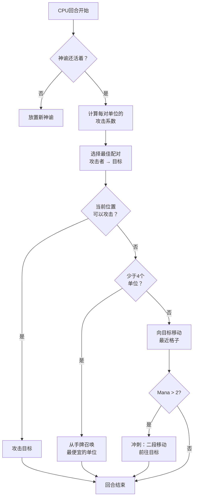

## 我给 Nausicaa 写的那个沙雕 AI

有些项目从"要不做个神话主题的象棋？"开始，最后搞出一个每 5 回合自己改超参数的人工智障。

Nausicaa 就是这样。一个回合制棋盘游戏，你组神话生物卡组、管蓝条、在 10x8 的板子上拍单位。还有个 AI 会人格分裂。

我在这 AI 上花了不少时间，结果完全管不住它 xD

## 游戏本体

聊脑子之前，先看看身体：

- 10x8 棋盘，每人 2 行部署区
- 蓝条从 1 开始，每回合 +1，上限 6。用来召唤、攻击、放技能
- 目标：干爆对面的 Oracle

12 个单位，费用和移动方式各不相同：

| 单位 | 费用 | 移动 | 血量 |
| --- | --- | --- | --- |
| Oracle | 0 | 王 (8 方向) | 1 |
| 哥布林 | 1 | 前进 3 格 | 1 |
| 鹰身女妖 | 1 | 王 (8 方向) | 1 |
| 那伊阿得 | 1 | 对角线 | 1 |
| 狮鹫 | 2 | 跳 2 格 | 2 |
| 塞壬 | 2 | 横向 | 1 |
| 半人马 | 2 | 骑士 (L 形) | 2 |
| 弓箭手 | 3 | 横向 | 1 |
| 凤凰 | 3 | 对角线 (深色格) | 1 |
| 变形者 | 4 | 交换位置 | 1 |
| 先知 | 4 | 不动 (产蓝) | 1 |
| 泰坦 | 6 | 有限 (范围攻击) | 3 |

每个单位有各自的攻击模式。塞壬打 4 条对角线，弓箭手隔 3 格远程输出，泰坦上场就炸一片。总之就是个带神话生物和组牌要素的象棋 xD

## 我怎么让 CPU 思考的

基本思路蠢得一批：**每个敌方单位有个吸引力系数**。越危险，AI 就越想搞它。

```javascript
const UNITS_ATTRACTIVENESS = {
    "oracle": 100,
    "titan": 95,
    "shapeshifter": 90,
    "phoenix": 80,
    "siren": 70,
    "archer": 70,
    "seer": 70,
    "griffin": 60,
    "centaur": 60,
    "harpy": 50,
    "naiad": 30,
    "gobelin": 20
};
```

Oracle 100 ---- 废话，赢了条件。泰坦 95，上场秒一片。哥布林 20，就是个炮灰，谁管他。

然后对每对单位（一个友方一个敌方），我算：

```
interet = attractivite × coeff_attract / (distance × coeff_dist)
```

简单说：你越危险越近，AI 就越想干你。

```javascript
calculateAttackCoefficient(x1, y1, x2, y2) {
    const distance = this.calculateEuclideanDistance(x1, y1, x2, y2);
    if (distance === 0) return Infinity;
    return (UNITS_ATTRACTIVENESS[unit.type] * COEFFICIENTS_IMPORTANCE["attractiveness"]) / distance;
}
```

### 系数会变的骚操作

好玩的地方在于，这些重要性系数**每 5 回合随机变一次**。

```javascript
if (this.turnCount % 5 === 0) {
    const distanceCoefficient = parseInt(Math.random() * 100);
    const attractivenessCoefficient = parseInt(Math.random() * 100);
    this.regulateImportanceCoefficients({
        distance: distanceCoefficient,
        attractiveness: attractivenessCoefficient
    });
}
```

上一秒 AI 还猛得一批（吸引 95，距离 5），直接穿地图干你 Oracle。下一秒它又优先考虑距离开始 reposition。

这招是从 Pac-Man 的幽灵学的 ---- Blinky 追人，Pinky 埋伏。这里 AI 每个阶段换一次"人格"。

**结果：整局游戏你根本猜不透 AI。** CPU 永远不会打出两局一样的操作。

### Oracle 是个怂包

敌方 Oracle 会跑。字面意思。

```javascript
const awayFromTarget = {
    row: Math.max(0, Math.min(7, botUnitElement.row + (botUnitElement.row - targetUnitElement.row))),
    col: Math.max(0, Math.min(9, botUnitElement.col + (botUnitElement.col - targetUnitElement.col)))
};
```

它算出威胁的反方向然后溜了。有墙的话就找那个方向上最近的空格。

你花了 3 回合摸过去，啪一下它就跑了，跟个小姑娘似的 xD

### 决策循环

AI 的决策流程：

1. 如果我没 Oracle 了（死了），放个新的
2. 算每对友方→敌方单位的系数
3. 选最优配对
4. 如果单位当前位置能打到目标 → 攻击
5. 如果我少于 4 个单位 → 从手牌召唤最便宜的
6. 否则，往目标移动（离敌人最近的移动格）
7. 如果蓝条够（> 2），冲刺（二段移动）再拉近距离
8. 如果单位是 Oracle → 跑路



```javascript
async makeAction(dash=false) {
    // 全部按顺序来
    // CPU 蓝条够就冲刺
    if(botPlayer.mana > 2) {
        this.makeAction(true);
    }
}
```

### 为什么用欧几里得距离

我用的欧几里得距离：

```javascript
calculateEuclideanDistance(x1, y1, x2, y2) {
    const deltaX = Math.pow(x1 - x2, 2);
    const deltaY = Math.pow(y1 - y2, 2);
    return Math.sqrt(deltaX + deltaY) * COEFFICIENTS_IMPORTANCE["distance"];
}
```

为啥不用 Manhattan？因为单位有各种移动模式（骑士 L 形、对角线等等）。直线距离更能体现实际威胁。

## 为啥不用 minimax

我也可以写个经典 minimax。但 12 种单位、不同移动模式、特殊技能……游戏树膨胀得飞起，根本玩不动。启发式方法不用搜一千万个状态就能做出聪明选择。

## 酷的地方

吸引力系统整出了些好玩的 dilemma：

- 先知 (70) 产蓝。放着不管对面就有更多资源。但泰坦 (95) 更危险。
- 变形者 (90) 能跟任何单位换位。他能直接偷你 Oracle。
- 鹰身女妖 (50) 有自爆攻击。不是优先目标……直到它站到你 3 个单位旁边。

AI 是根据位置评估全局危险，不只是看面板数据。

还有个 `activateSimulation()` 函数用来测试场景，不用重开一局：

```javascript
activateSimulation() {
    // 在棋盘上放特定单位
    // 用来 debug AI
    this.game.board = simulation.board;
    this.game.players = simulation.players;
}
```

## 还缺什么

如果有更多时间：

- AI 只反应当前状态，不会预测玩家下一步
- 不会规划手牌打 combo
- 变形者和半人马的能力它用得不够好
- 强化学习：让它跟自己打来调系数

但一个网页游戏够用了。我朋友都能输给它，所以还行 xD

## 试试

在 [nausicaa-game.github.io](https://nausicaa-game.github.io/) 上就能玩。点"JOUER"，开 CPU 模式，看 AI 表演。

建议：让 AI 自己打自己。你会看到它一波猛攻，然后突然全缩回去了。

代码在 [GitHub](https://github.com/nausicaa-game/nausicaa-game.github.io) 的 `js/cpu.js`。

**3 个要点：**

1. **启发式系数** ---- 不用 minimax，每个单位有吸引力值
2. **每 5 回合换系数** ---- AI 在激进和控场之间切换，学 Pac-Man
3. **Oracle 会跑** ---- 算威胁反方向然后溜

你有啥让 AI 更阴险的点子就去开 issue。我计划搞个能学习失败的版本，不过那下篇文章再说了 xD
