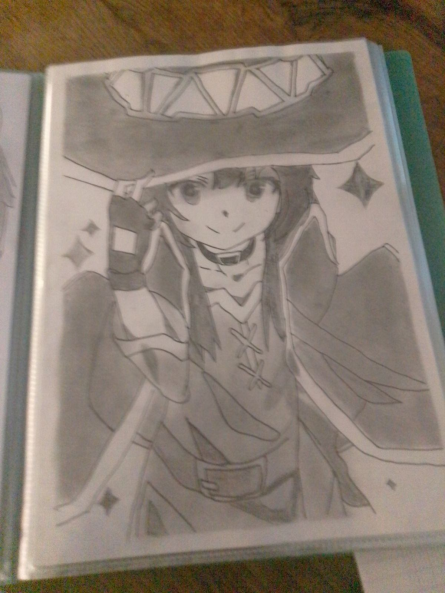

# Welcome to my blog

## About me

So my name is Fox, my pronouns are not defined actually, because I'm still finding myself, and I'm a software engineer who enjoys working with TypeScript, Node.js and React, and discover new technologies anyways. Most of my projects are open‑source and live on GitHub under the `fox3000foxy` account.

I'm someone who loooooooves the open source concept, because I love sharing things. Also I like to discover old technologies like UTAU one, I find the concept pretty fascinating. I love Vtubers as well, and I would love to be one, but unfortunately I'm shy.

I also love to find workarounds to not pay things that are paid, or that you would have to pay if you don't think out of the box. As an example [Nibi](https://github.com/Let-s-Learn-Japanese-Together/Nibi) was one of my last creation that I found free workaround for commands handling, database management, and daemons. And oh God, playing with Github Actions and workflows is one of the best feeling I've got. I also started to sign my commits with an SSH Key, and you can find the script I made on [this gist](https://gist.github.com/fox3000foxy/95500d129cd4bf5c173c323d2492569a).

## Languages & Tech

So I mainly code in Typescript and React now, but back in time I was coding launchers in pure HTML, CSS and JavaScript. Crazy? I was crazy once! They put me in a room. Nahhh I'm kinding. I also know Python, C# but i hate it, Java, but it's rare, now I use it to code Minecraft plugins for [Eminium Games](https://github.com/Eminium-Games/). I know C++ from a while but can't code in it actually. Also I'm learning C with the [bareiron project](https://github.com/p2r3/bareiron). And so on, I don't know Rust or Go at the moment, but I would enjoy to learn.

I kinda master Javascript principles since I code in Javascript since I was 8. 😄
Not to brag tho, I'm aware that some devs are better than me with a worse status than mine, and some are better paid than me while being litterals frauds.

## Hobbies

So basically I have a lot of hobbies, but my main hobby is coding while listening to music. I also do drawing like i said above, and I kinda like to walk now, I don't know why 😕.

## Passions

I wanted to write this blog long time ago but idk, holded myself to do it :/

Maybe was it because I'd like to share my life but not my private infos? Somehow that's why I guess.

My passions are various tho: so I love to code, as you noticed, but also I like to draw!
Here are some of my drawings:

<table style="width:100%;border-collapse:collapse;margin-top:1rem;">
  <tr>
    <td style="padding:0.5rem;"></td>
    <td style="padding:0.5rem;"></td>
    <td style="padding:0.5rem;"></td>
  </tr>
  <tr>
    <td style="padding:0.5rem;"></td>
    <td style="padding:0.5rem;"></td>
    <td style="padding:0.5rem;"></td>
  </tr>
  <tr>
    <td style="padding:0.5rem;"></td>
    <td style="padding:0.5rem;"></td>
    <td style="padding:0.5rem;"></td>
  </tr>
</table>

## Packages

Sometimes I write npm packages, like [fetch-tor-proxy](https://www.npmjs.com/package/fetch-tor-proxy) or even [fake-data-npm](https://www.npmjs.com/package/fake-data-npm). They both are not used by anyone, including me, nut I hope one day they will explode!

## Projects

I have soooooooooo much projects. right now I have 146 repositories in total, only 103 are public! I will probably present them in the Blog section tho.

## I work for

Basically I worked for plenty of people! I'm friend with some Discord employees, and I know some content creators, like NTTS, Squiduu, HatsuOtaku, Sciences Trash, Sushi Nihiliste, or even the french storyteller Ego. I blocked What a Fail because he blocked me for a simple "Hello". Istg, those mfs dick heads. I know Belle Delphine, and ggu.bbu2 that I salute, and more!

I don't want to know TV stars tho, as I think they are out of reach, and big headed as well. I'm sure plenty are nice, but show celebrities are most of the time selfish as hell...

## Ending note

On this page I’m going to share my progress, my thoughts, and whatever I feel like sharing. That way you’ll know how I think.
Anyway, my GitHub will mainly list all of my projects and their progress in real time.
Know that I love the age of my projects; I love seeing dates that get older and older on my own repos, so it’s not out of the question that my profile repo might have a spoofed commit date! 😁

Means now I'm writing blogs, and I ~~will add~~ added back my main porfolio links in another section.

🏗 THIS article is still in construction, please wait
